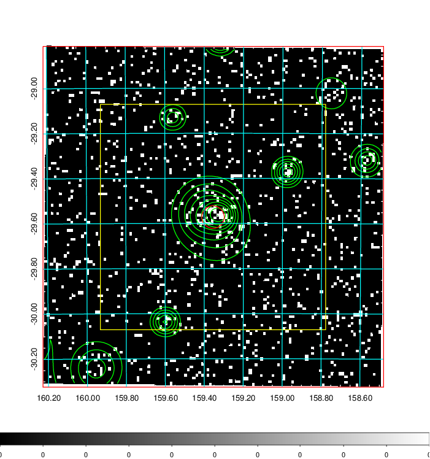
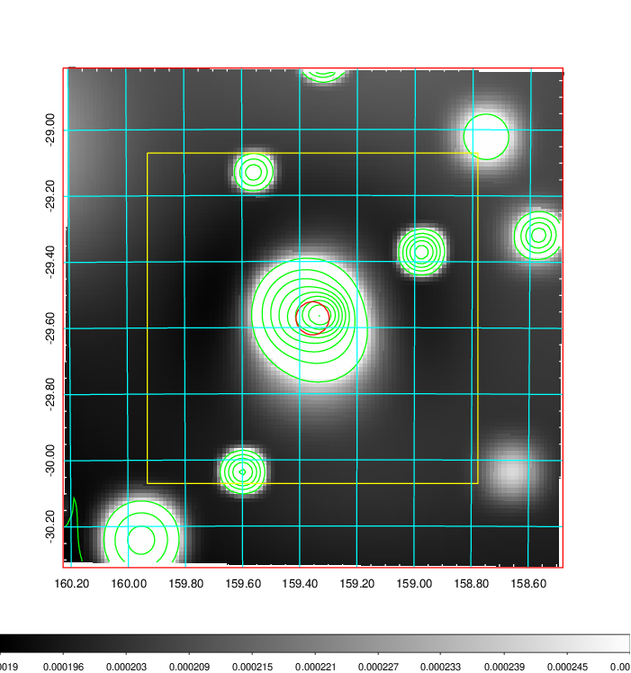
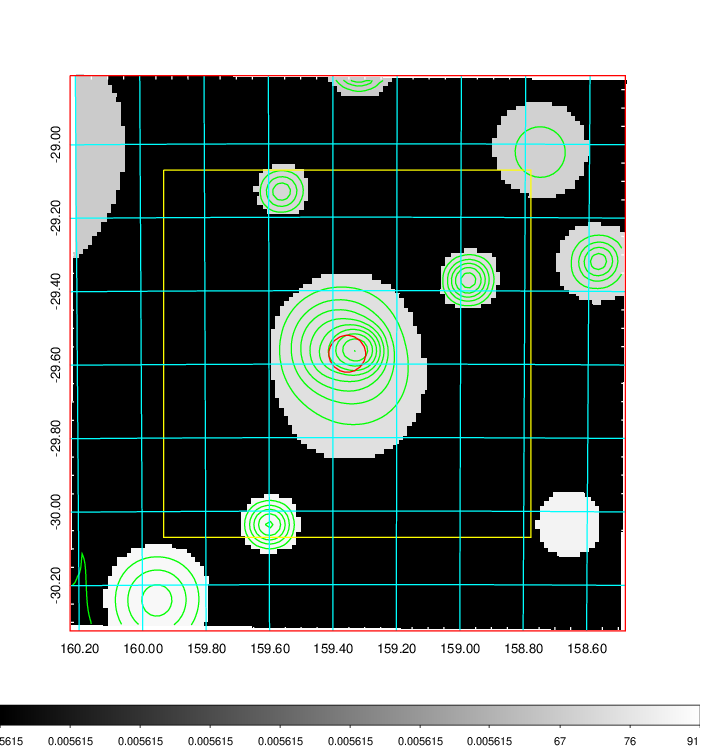
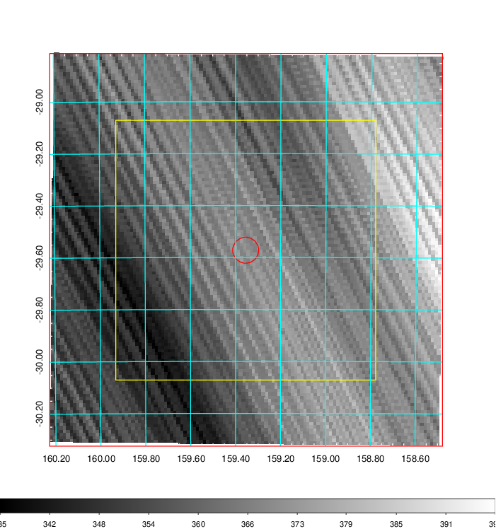
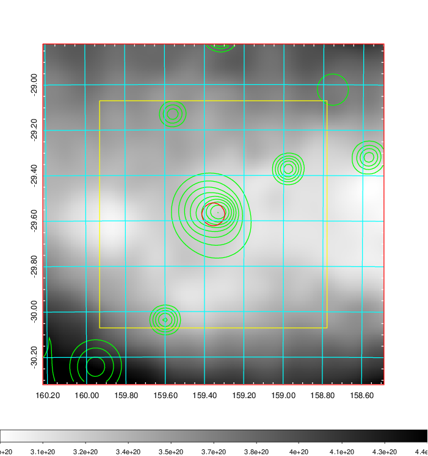
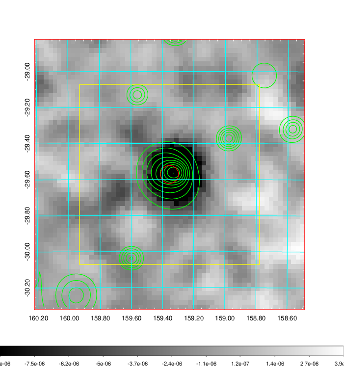
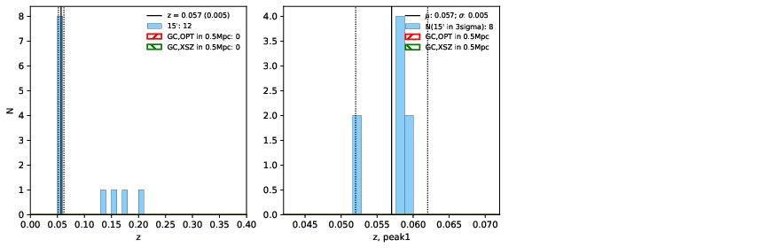
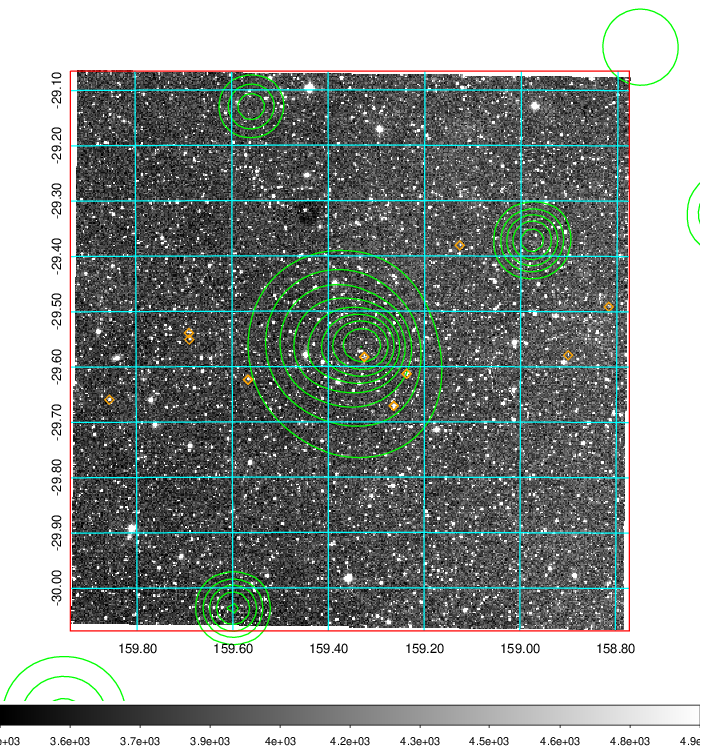
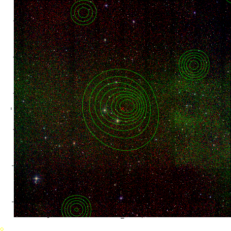
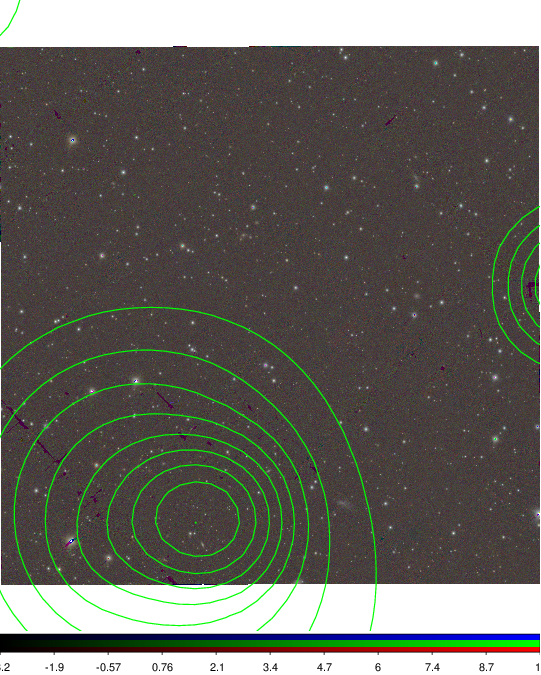

### 368

|Name|RAJ2000[deg]|DEJ2000[deg] |Ext[arcmin]| Ext,ml | z | z_src| C|GC(XSZ,Delta_z<0.01)| GC(OPT,Delta_z<0.01)|GC| R_sig[arcmin] | R500[arcmin] | R500[Mpc]| CRsig[c/s] | CR500[c/s] |L500[1E44 erg/s]|F500[1E-12 erg/s/cm^2]| M500[1E14 Msun]|Tx[keV]|Cnt_sig|Beta|Rc[arcmin]|Comment|Alias|
|---|---|---|---|---|---|------|---|--------|---------|----------|---|---|---|---|---|---|---|---|---|---|---|---|---|---|
|368| 159.355| -29.572| 3.01| 30.25| 0.0570(0.005)| z1,| G| -| -| N, W| 8.312| 10.343| 0.686| 0.154(0.038)| 0.160(0.040)| 0.219(0.028)| 2.822(0.362)| 0.97(0.06)| 2.14(0.09)| 60.7| 0.926(-0.092+0.054)| 5.897(-0.682+0.590)| -| t131|

|[RASS image](../image/368/368_img.pdf)|[filtered image](../image/368/368_fil.pdf)|[Segment image](../image/368/368_seg.pdf)|
|-------------------|--------------------|-------------------|
|   |    |   |

|[Exposure image](../image/368/368_mex.pdf)| [nH image](../image/368/368_nh.pdf)| [Planck image](../image/368/368_p.pdf)|
|-------------------|--------------------|-------------------|
|   |     |  |

|[Redshift Histogram](../image/368/368_zg.pdf) | [DSS image(z1)](../image/368/368_dss_z1.pdf)      |  [DSS image(z2)](../image/368/368_dss_z2.pdf)    |
|-------------------|--------------------|-------------------|
| |  Blue circle for optical clusters;  Magenta circle for XSZ clusters;  all with r=1Mpc;  Only GC with Delta_z<0.01 are shown. |  Blue circle for optical clusters;  Magenta circle for XSZ clusters;  all with r=1Mpc;  Only GC with Delta_z<0.01 are shown.  |

|[Previous-identified clusters](../image/368/368_gc.pdf) | [2MASS image](../image/368/368_2mass.pdf)      |
|-------------------|-------------------|
|  Green, magenta, and blue circles  for optical, X-ray and SZ clusters  respectively, with redshift of clusters  labelled. The radius of circles  are 1Mpc.|  |

|[PS1 image](../image/368/368_ps1.pdf)            |
|-------------------|
|   |
