

### 369

|Name|RAJ2000[deg]|DEJ2000[deg] |Ext[arcmin]| Ext,ml | z | z_src| C|GC(XSZ,Delta_z<0.01)| GC(OPT,Delta_z<0.01)|GC| R_sig[arcmin] | R500[arcmin] | R500[Mpc]| CRsig[c/s] | CR500[c/s] |L500[1E44 erg/s]|F500[1E-12 erg/s/cm^2]| M500[1E14 Msun]|Tx[keV]|Cnt_sig|Beta|Rc[arcmin]|Comment|Alias|
|---|---|---|---|---|---|------|---|--------|---------|----------|---|---|---|---|---|---|---|---|---|---|---|---|---|---|
|369| 159.598| -24.893| 1.38| 27.36| 0.1194(0.005)| z1, z_xsz| B| MCXC, PSZ2, Tar| N, W| MCXC, N, PSZ2, Tar, W| 7.825| 7.308| 0.944| 0.181(0.036)| 0.179(0.035)| 1.226(0.103)| 3.307(0.277)| 2.69(0.11)| 4.09(0.11)| 79.9| 0.910(-0.103+0.064)| 3.303(-0.514+0.406)| -| k094|

|[RASS image](../image/369/369_img.pdf)|[filtered image](../image/369/369_fil.pdf)|[Segment image](../image/369/369_seg.pdf)|
|-------------------|--------------------|-------------------|
| 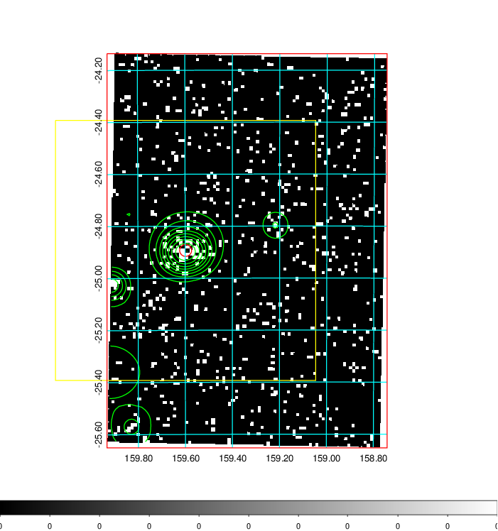  | 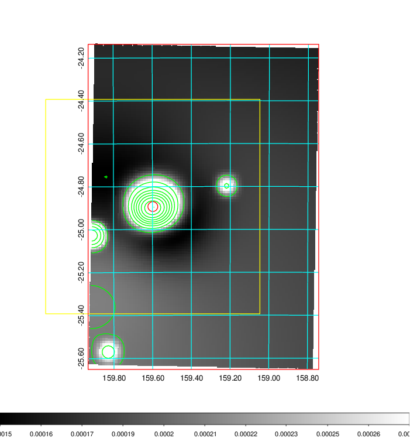   | 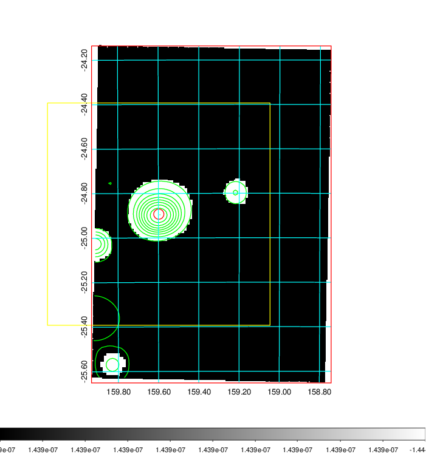  |

|[Exposure image](../image/369/369_mex.pdf)| [nH image](../image/369/369_nh.pdf)| [Planck image](../image/369/369_p.pdf)|
|-------------------|--------------------|-------------------|
|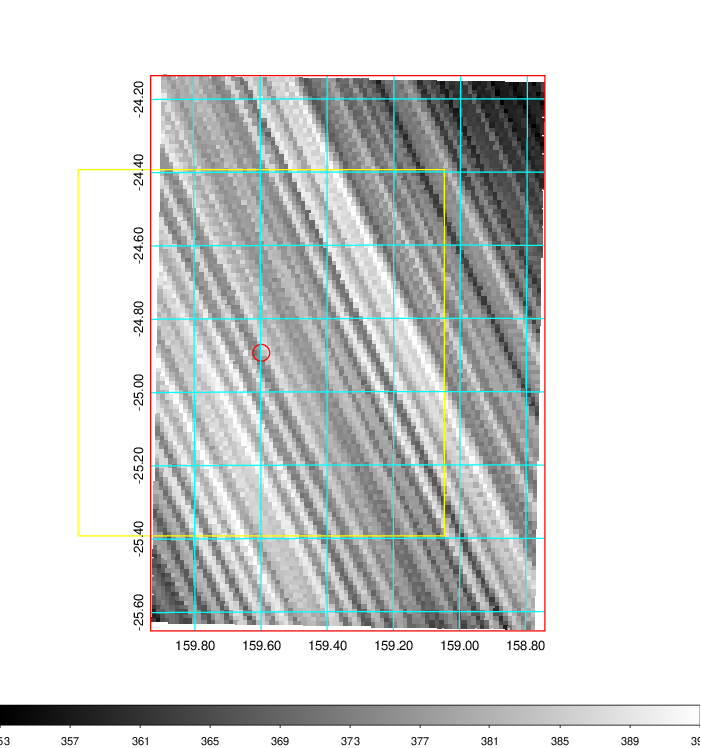   | 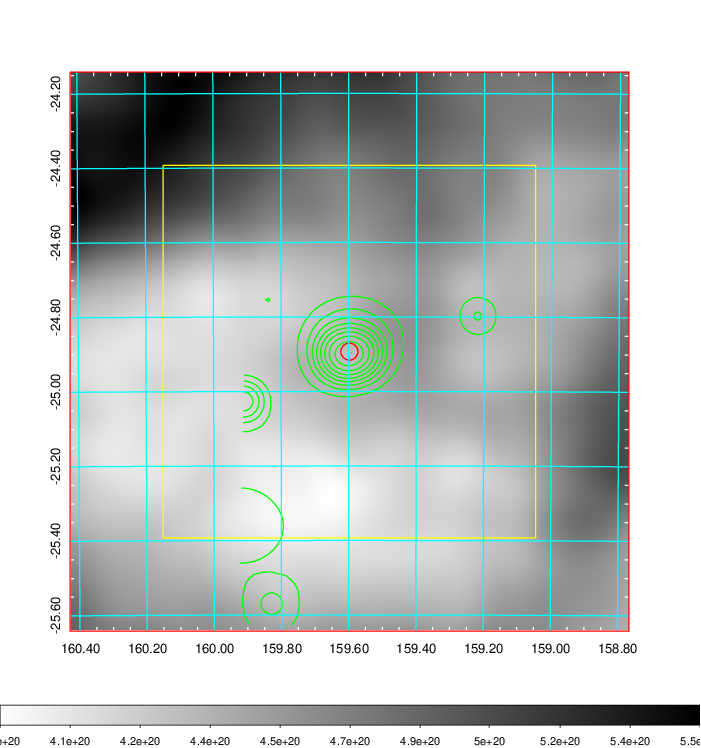    | 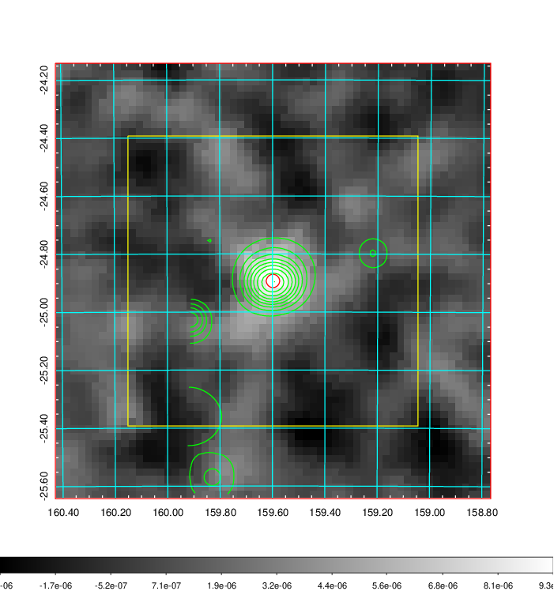 |

|[Redshift Histogram](../image/369/369_zg.pdf) | [DSS image(z1)](../image/369/369_dss_z1.pdf)      |  [DSS image(z2)](../image/369/369_dss_z2.pdf)    |
|-------------------|--------------------|-------------------|
|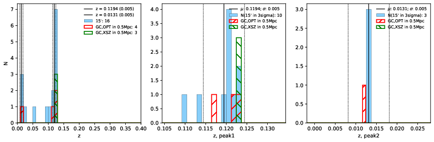 |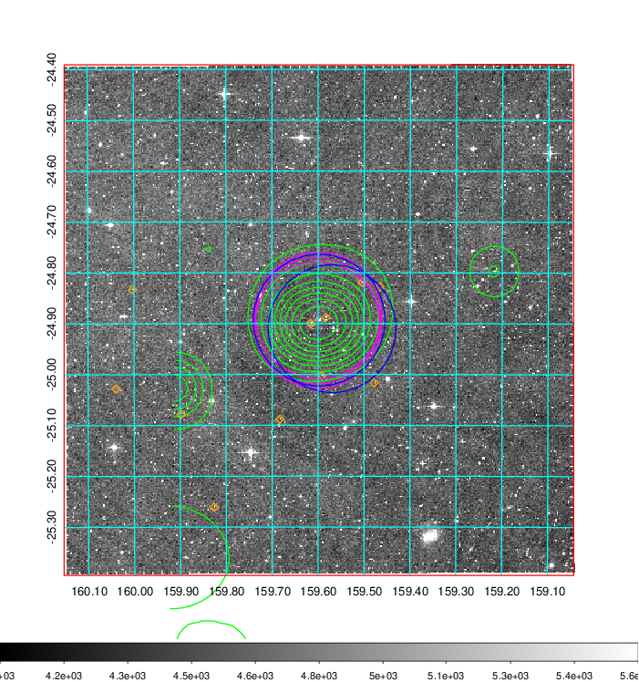  Blue circle for optical clusters;  Magenta circle for XSZ clusters;  all with r=1Mpc;  Only GC with Delta_z<0.01 are shown. | 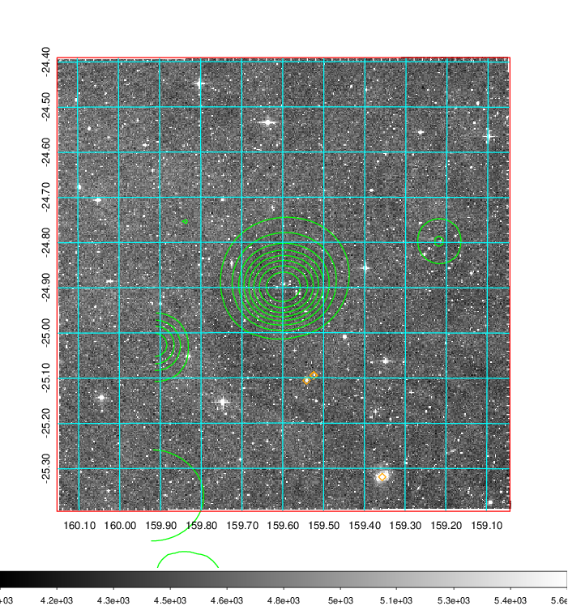 Blue circle for optical clusters;  Magenta circle for XSZ clusters;  all with r=1Mpc;  Only GC with Delta_z<0.01 are shown.  |

|[Previous-identified clusters](../image/369/369_gc.pdf) | [2MASS image](../image/369/369_2mass.pdf)      |
|-------------------|-------------------|
|  Green, magenta, and blue circles  for optical, X-ray and SZ clusters  respectively, with redshift of clusters  labelled. The radius of circles  are 1Mpc.|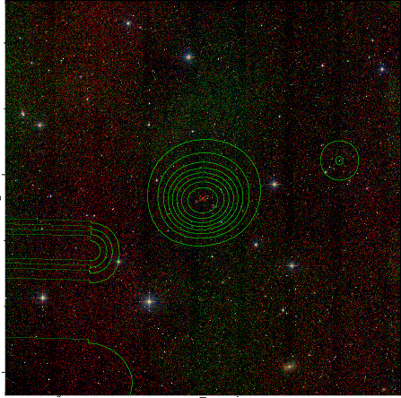  |

|[PS1 image](../image/369/369_ps1.pdf)            |
|-------------------|
| 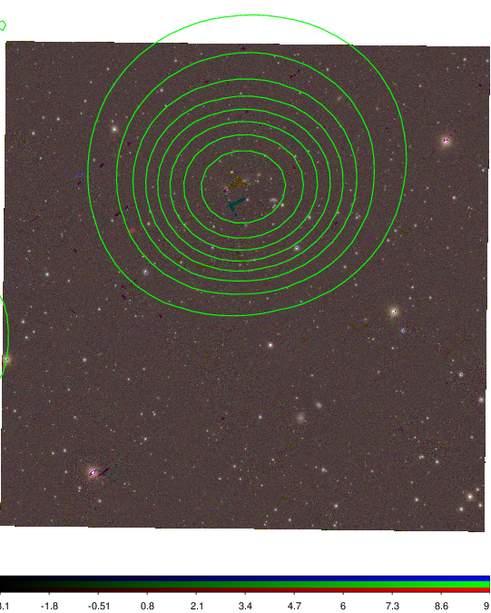  |
