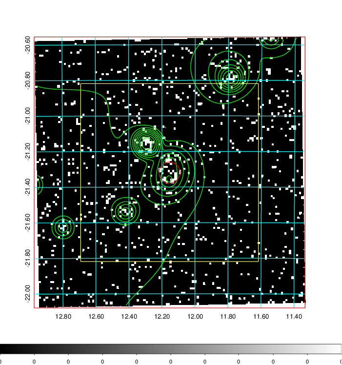
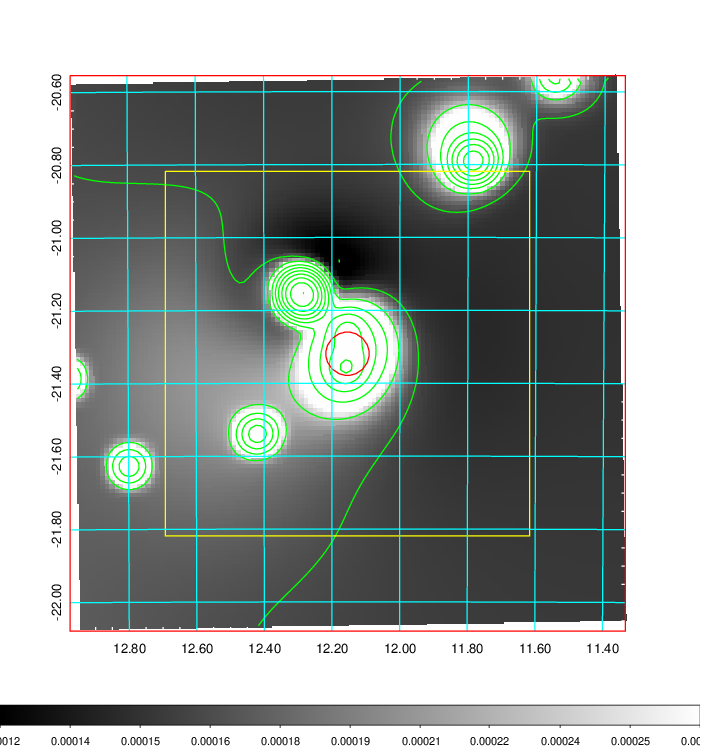
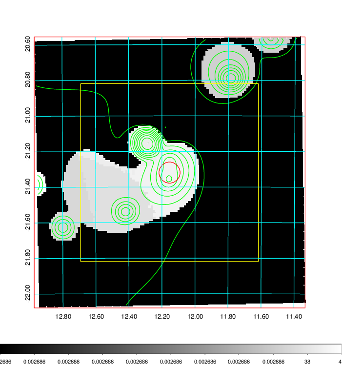
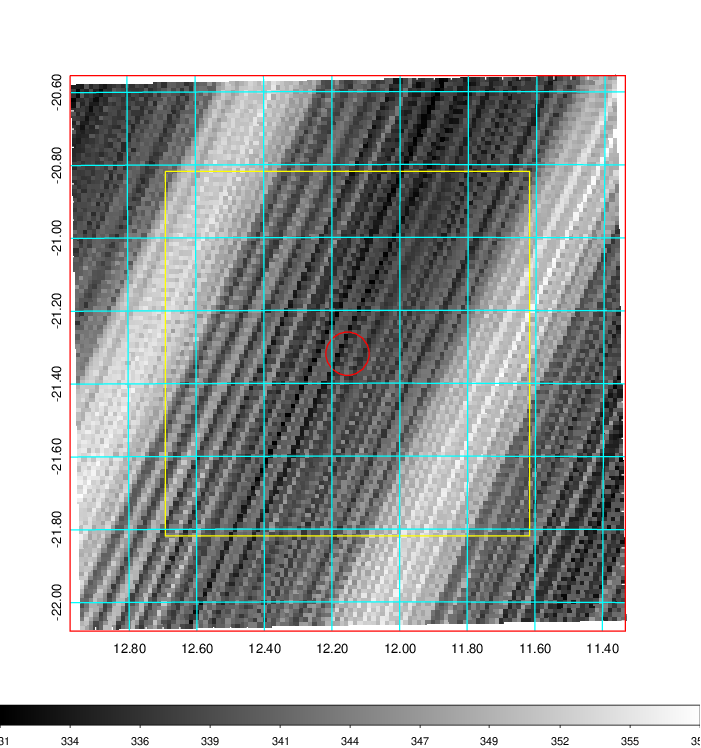
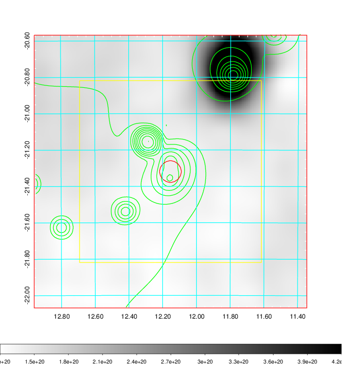
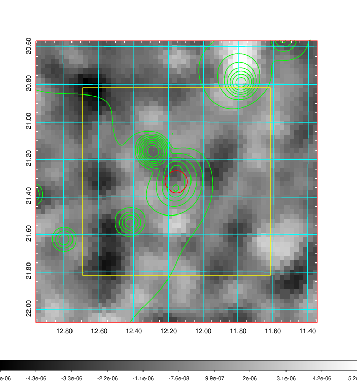
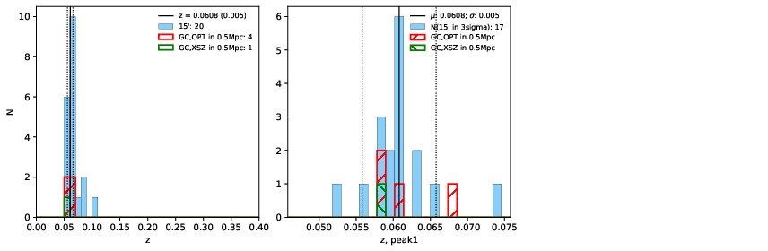
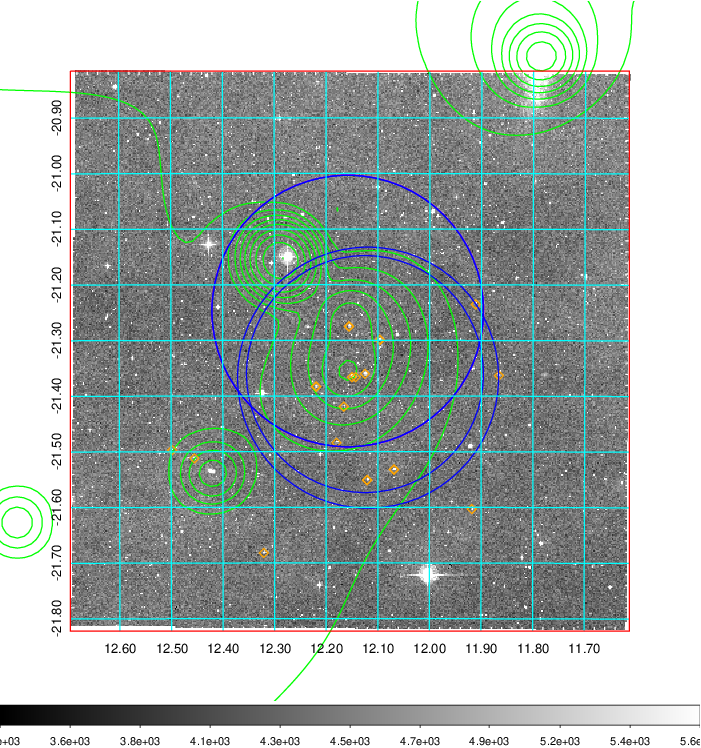
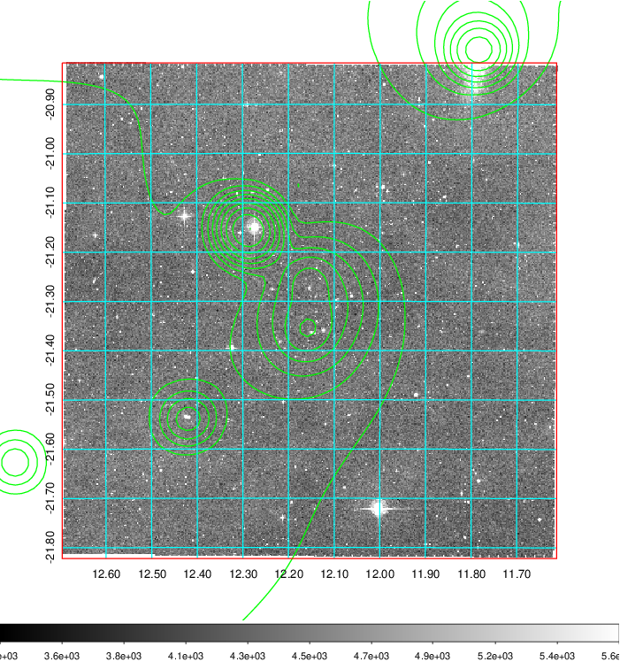
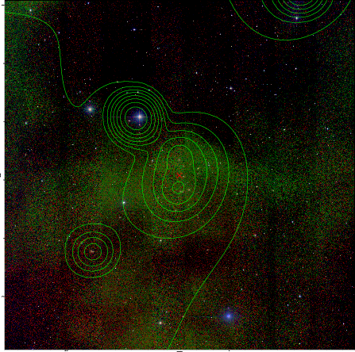

### 37

|Name|RAJ2000[deg]|DEJ2000[deg] |Ext[arcmin]| Ext,ml | z | z_src| C|GC(XSZ,Delta_z<0.01)| GC(OPT,Delta_z<0.01)|GC| R_sig[arcmin] | R500[arcmin] | R500[Mpc]| CRsig[c/s] | CR500[c/s] |L500[1E44 erg/s]|F500[1E-12 erg/s/cm^2]| M500[1E14 Msun]|Tx[keV]|Cnt_sig|Beta|Rc[arcmin]|Comment|Alias|
|---|---|---|---|---|---|------|---|--------|---------|----------|---|---|---|---|---|---|---|---|---|---|---|---|---|---|
|37| 12.154| -21.319| 3.57| 25.02| 0.0608(0.005)| z1, z_xsz| B| MCXC| A, N, W| A, MCXC, N, W| 31.119| 11.065| 0.779| 0.305(0.068)| 0.276(0.062)| 0.469(0.120)| 5.283(1.351)| 1.43(0.19)| 2.72(0.22)| 92.9| 0.537(-0.027+0.049)| 4.143(-0.593+0.897)| -| k442|

|[RASS image](../image/37/37_img.pdf)|[filtered image](../image/37/37_fil.pdf)|[Segment image](../image/37/37_seg.pdf)|
|-------------------|--------------------|-------------------|
|   |    |   |

|[Exposure image](../image/37/37_mex.pdf)| [nH image](../image/37/37_nh.pdf)| [Planck image](../image/37/37_p.pdf)|
|-------------------|--------------------|-------------------|
|   |     |  |

|[Redshift Histogram](../image/37/37_zg.pdf) | [DSS image(z1)](../image/37/37_dss_z1.pdf)      |  [DSS image(z2)](../image/37/37_dss_z2.pdf)    |
|-------------------|--------------------|-------------------|
| |  Blue circle for optical clusters;  Magenta circle for XSZ clusters;  all with r=1Mpc;  Only GC with Delta_z<0.01 are shown. |  Blue circle for optical clusters;  Magenta circle for XSZ clusters;  all with r=1Mpc;  Only GC with Delta_z<0.01 are shown.  |

|[known Abell/XSZ clusters](../image/37/37_gc.pdf) | [2MASS image](../image/37/37_2mass.pdf)      |
|-------------------|-------------------|
|  Magenta, blue and green circles  for optical, X-ray and SZ clusters  respectively, with redshift of clusters  labelled. The radius of circles  are 1Mpc.|  |

|[DES image](../image/37/37_des.pdf)   |[ATLAS image](../image/37/37_s.pdf)        |
|-------------------|-------------------|
|   |   |
