

### 370

|Name|RAJ2000[deg]|DEJ2000[deg] |Ext[arcmin]| Ext,ml | z | z_src| C|GC(XSZ,Delta_z<0.01)| GC(OPT,Delta_z<0.01)|GC| R_sig[arcmin] | R500[arcmin] | R500[Mpc]| CRsig[c/s] | CR500[c/s] |L500[1E44 erg/s]|F500[1E-12 erg/s/cm^2]| M500[1E14 Msun]|Tx[keV]|Cnt_sig|Beta|Rc[arcmin]|Comment|Alias|
|---|---|---|---|---|---|------|---|--------|---------|----------|---|---|---|---|---|---|---|---|---|---|---|---|---|---|
|370| 159.847| 5.180| 3.99| 48.18| 0.0687(0.005)| z1, z_xsz| B| F20, L03, MCXC| A, N, W| A, C, F20, L03, MCXC, N, SWXCS, W| 8.312| 10.248| 0.808| 0.241(0.061)| 0.251(0.063)| 0.545(0.063)| 4.756(0.553)| 1.60(0.09)| 2.92(0.11)| 38.1| 0.928(-0.097+0.052)| 6.397(-0.783+0.687)| -| k475|

|[RASS image](../image/370/370_img.pdf)|[filtered image](../image/370/370_fil.pdf)|[Segment image](../image/370/370_seg.pdf)|
|-------------------|--------------------|-------------------|
| 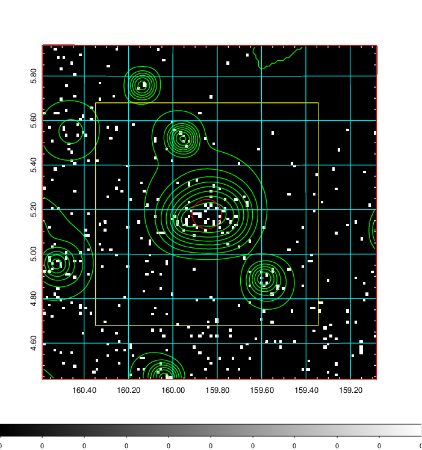  | 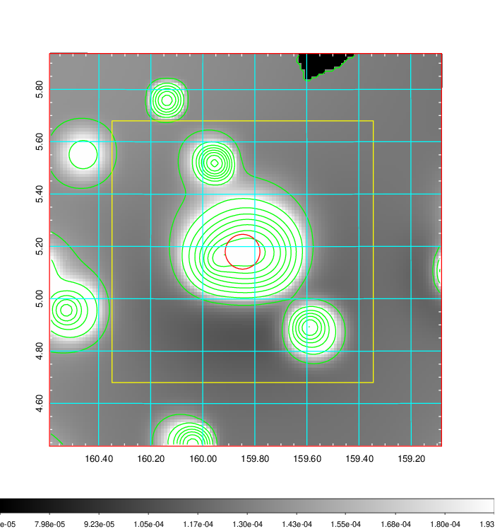   | 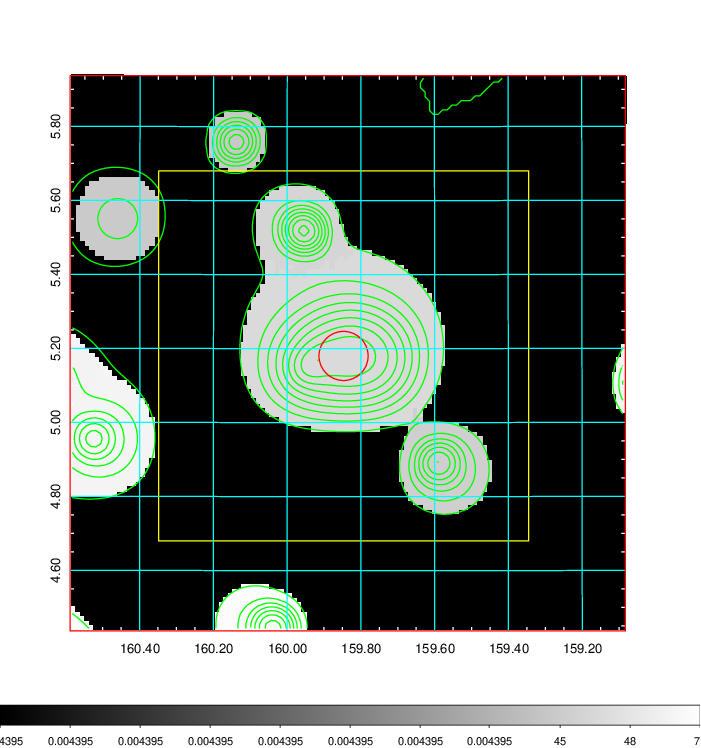  |

|[Exposure image](../image/370/370_mex.pdf)| [nH image](../image/370/370_nh.pdf)| [Planck image](../image/370/370_p.pdf)|
|-------------------|--------------------|-------------------|
|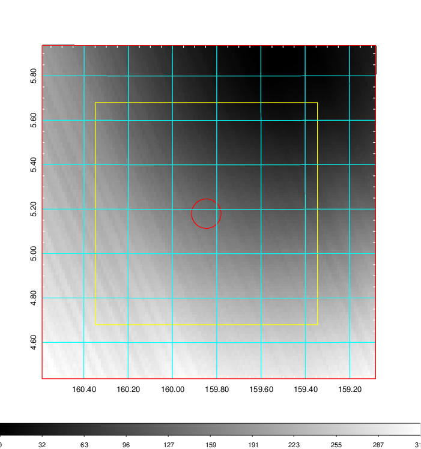   | 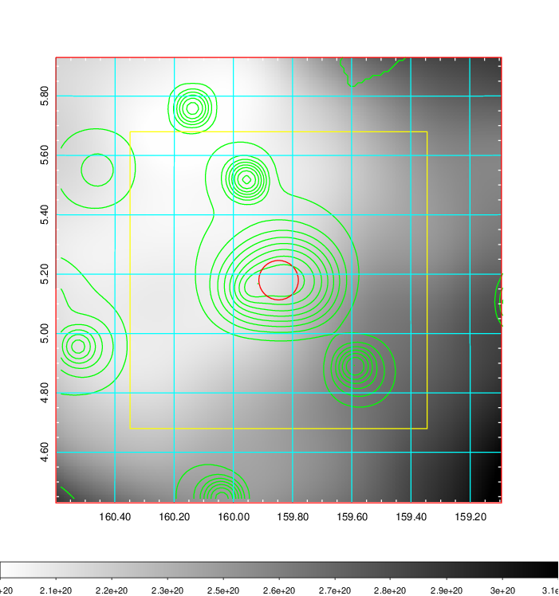    | 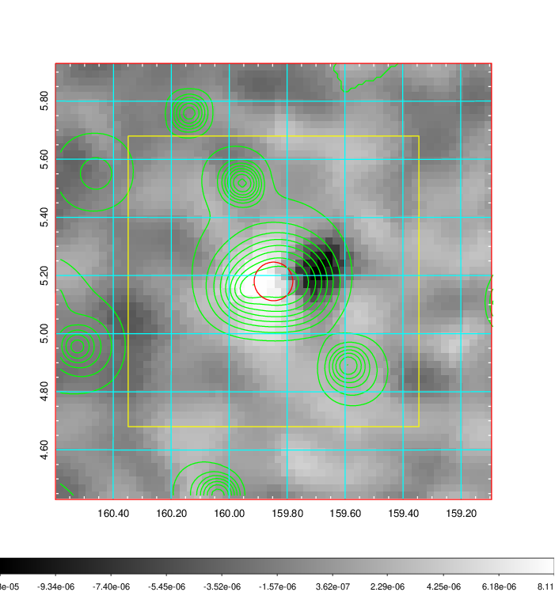 |

|[Redshift Histogram](../image/370/370_zg.pdf) | [DSS image(z1)](../image/370/370_dss_z1.pdf)      |  [DSS image(z2)](../image/370/370_dss_z2.pdf)    |
|-------------------|--------------------|-------------------|
|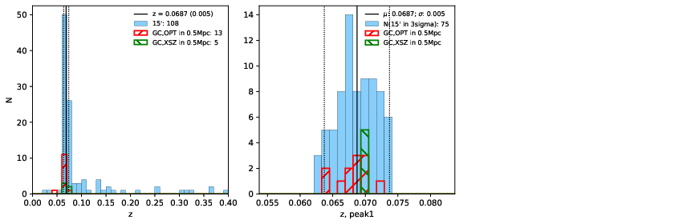 |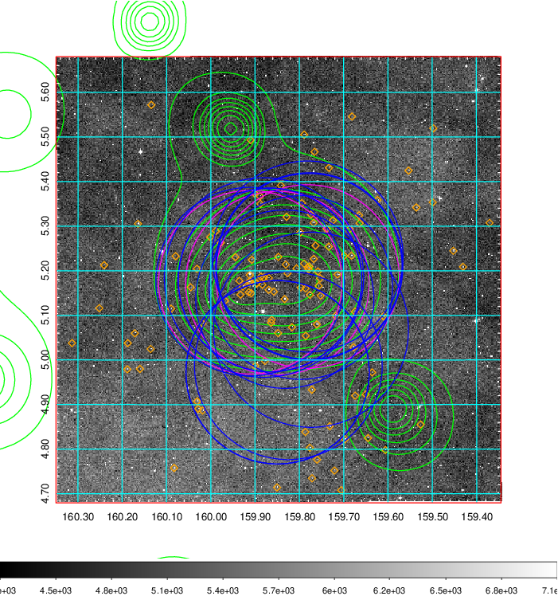  Blue circle for optical clusters;  Magenta circle for XSZ clusters;  all with r=1Mpc;  Only GC with Delta_z<0.01 are shown. | 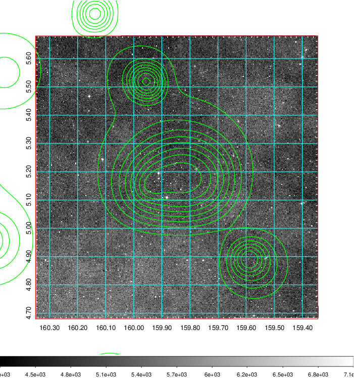 Blue circle for optical clusters;  Magenta circle for XSZ clusters;  all with r=1Mpc;  Only GC with Delta_z<0.01 are shown.  |

|[known Abell/XSZ clusters](../image/370/370_gc.pdf) | [2MASS image](../image/370/370_2mass.pdf)      |[SDSS image](../image/370/370_sdss.pdf)   |
|-------------------|-------------------|-------------------|
|  Magenta, blue and green circles  for optical, X-ray and SZ clusters  respectively, with redshift of clusters  labelled. The radius of circles  are 1Mpc.|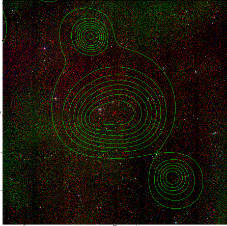  | 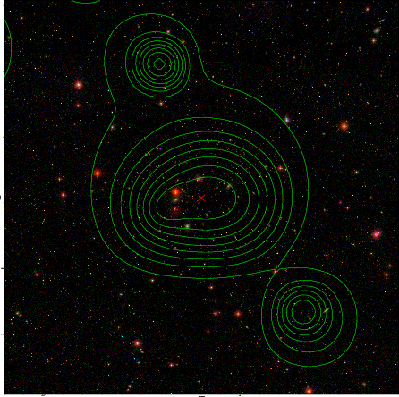  |

