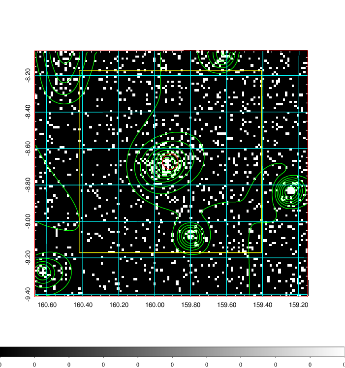
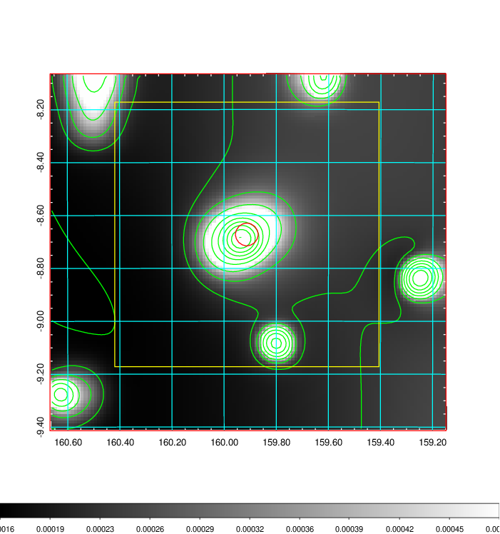
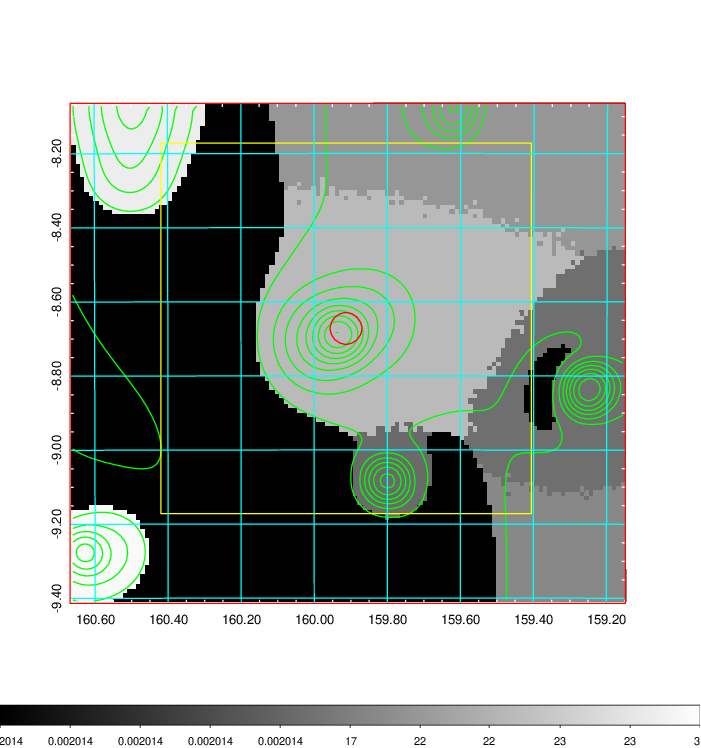
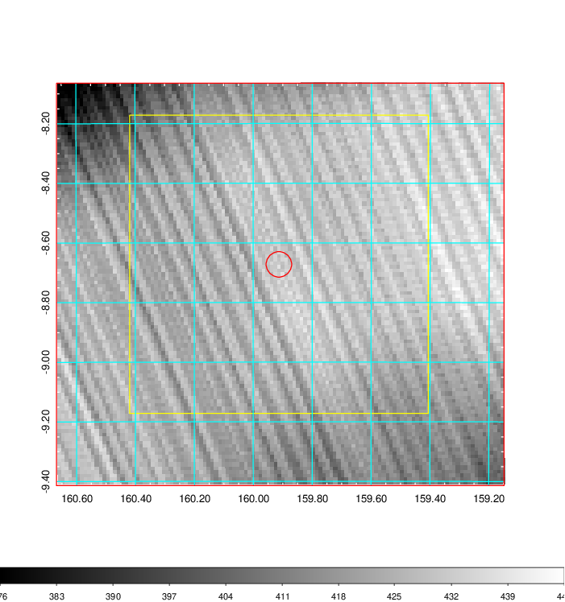
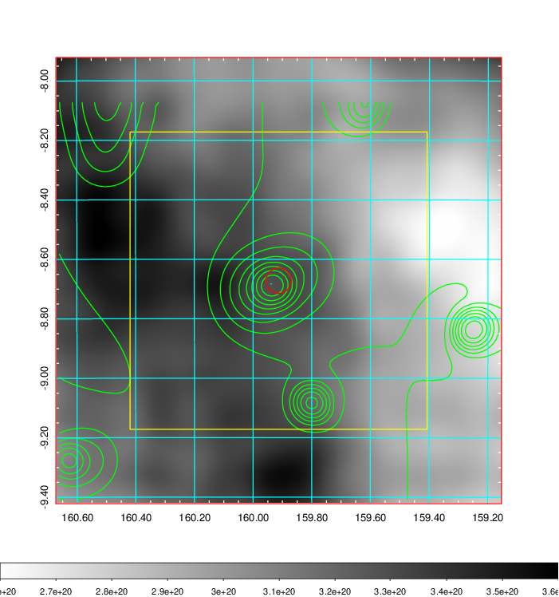
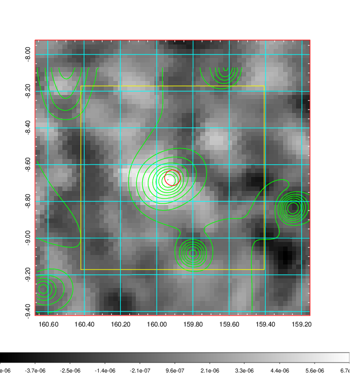
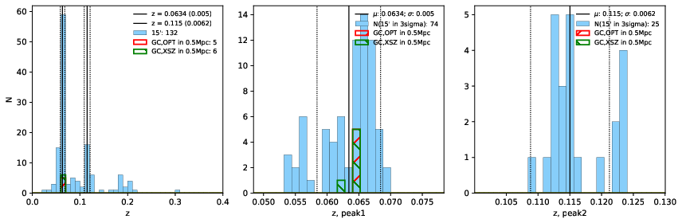
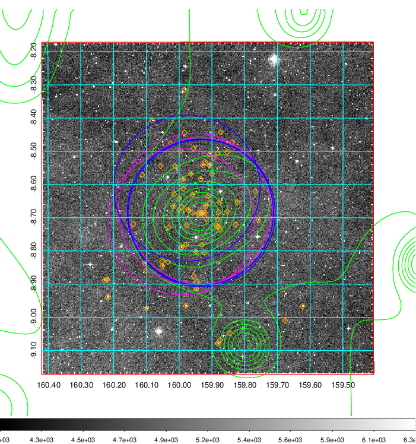
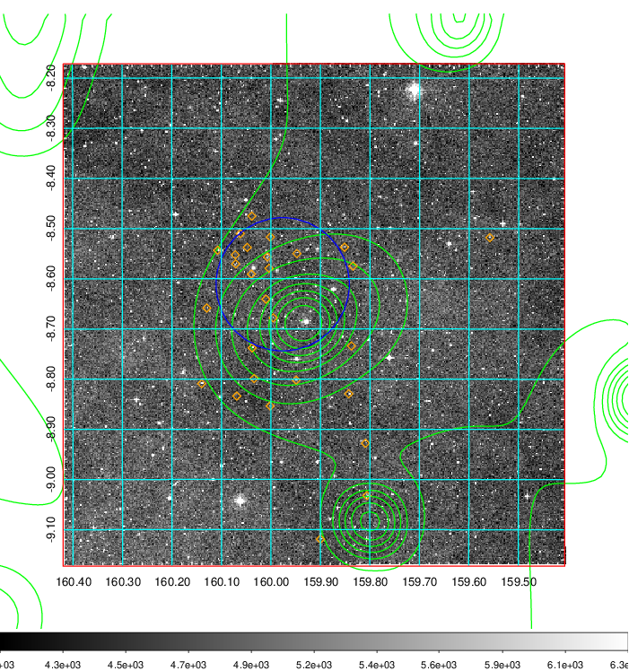
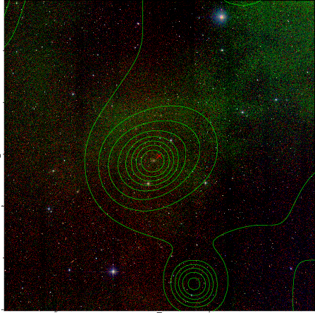

### 371

|Name|RAJ2000[deg]|DEJ2000[deg] |Ext[arcmin]| Ext,ml | z | z_src| C|GC(XSZ,Delta_z<0.01)| GC(OPT,Delta_z<0.01)|GC| R_sig[arcmin] | R500[arcmin] | R500[Mpc]| CRsig[c/s] | CR500[c/s] |L500[1E44 erg/s]|F500[1E-12 erg/s/cm^2]| M500[1E14 Msun]|Tx[keV]|Cnt_sig|Beta|Rc[arcmin]|Comment|Alias|
|---|---|---|---|---|---|------|---|--------|---------|----------|---|---|---|---|---|---|---|---|---|---|---|---|---|---|
|371| 159.913| -8.672| 2.56| 63.98| 0.0634(0.005)| z1, z_xsz| B| L03, MCXC, PSZ2, Tar, XB| A, N, W| A, L03, MCXC, N, PSZ2, Tar, W, XB| 13.675| 11.210| 0.821| 0.319(0.042)| 0.310(0.041)| 0.547(0.043)| 5.648(0.440)| 1.67(0.07)| 3.00(0.07)| 150.6| 0.685(-0.110+0.162)| 4.433(-1.198+1.485)| -| k311|

|[RASS image](../image/371/371_img.pdf)|[filtered image](../image/371/371_fil.pdf)|[Segment image](../image/371/371_seg.pdf)|
|-------------------|--------------------|-------------------|
|   |    |   |

|[Exposure image](../image/371/371_mex.pdf)| [nH image](../image/371/371_nh.pdf)| [Planck image](../image/371/371_p.pdf)|
|-------------------|--------------------|-------------------|
|   |     |  |

|[Redshift Histogram](../image/371/371_zg.pdf) | [DSS image(z1)](../image/371/371_dss_z1.pdf)      |  [DSS image(z2)](../image/371/371_dss_z2.pdf)    |
|-------------------|--------------------|-------------------|
| |  Blue circle for optical clusters;  Magenta circle for XSZ clusters;  all with r=1Mpc;  Only GC with Delta_z<0.01 are shown. |  Blue circle for optical clusters;  Magenta circle for XSZ clusters;  all with r=1Mpc;  Only GC with Delta_z<0.01 are shown.  |

|[known Abell/XSZ clusters](../image/371/371_gc.pdf) | [2MASS image](../image/371/371_2mass.pdf)      |
|-------------------|-------------------|
|  Magenta, blue and green circles  for optical, X-ray and SZ clusters  respectively, with redshift of clusters  labelled. The radius of circles  are 1Mpc.|  |

|[ATLAS image](../image/371/371_s.pdf)        |
|-------------------|
|   |
