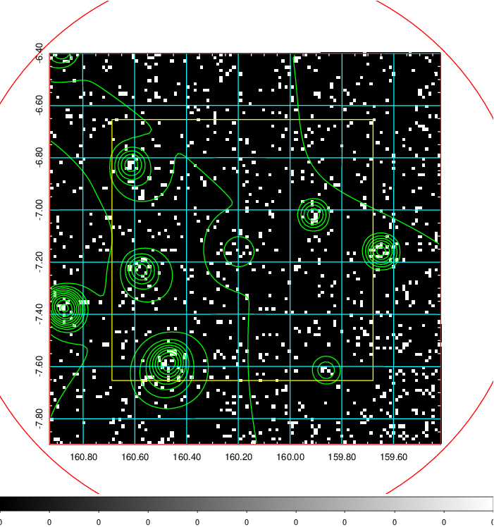
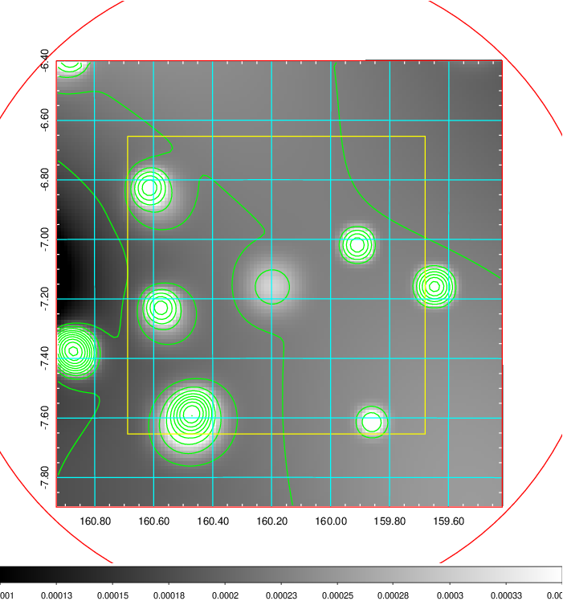
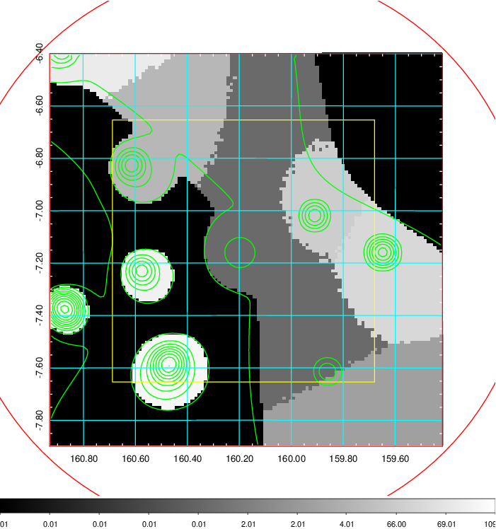
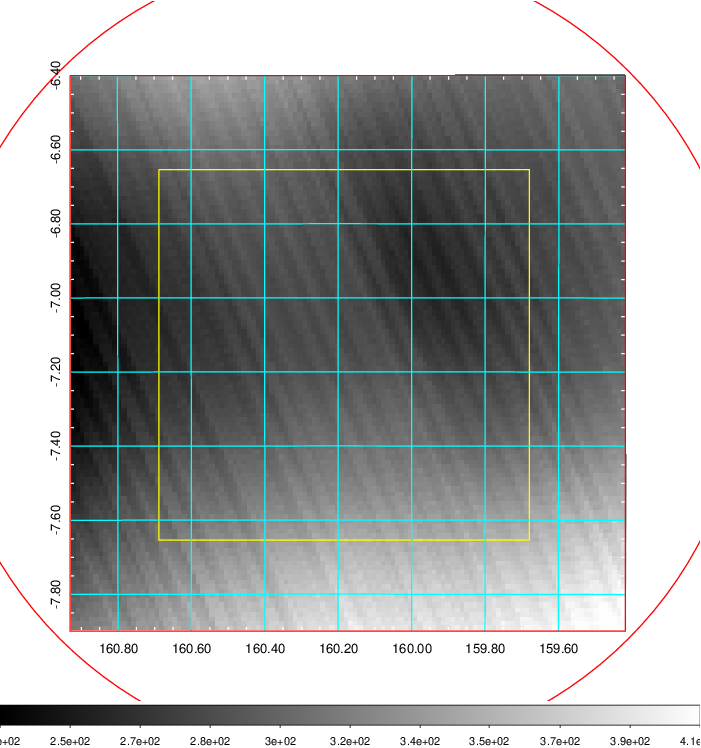
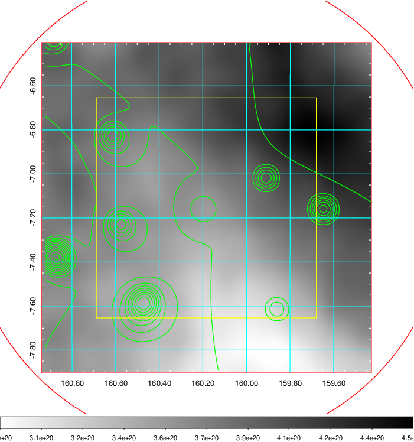
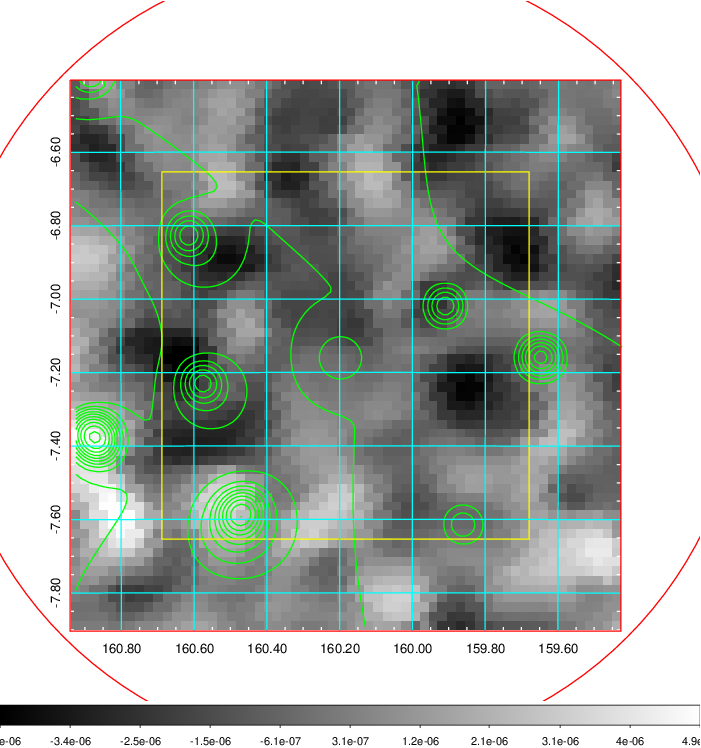
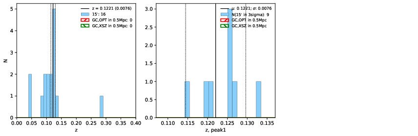
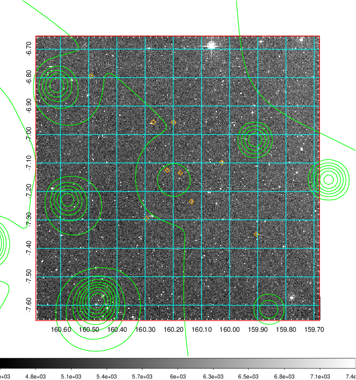
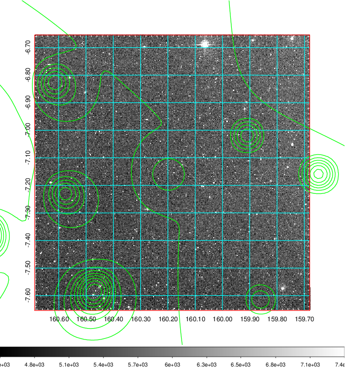
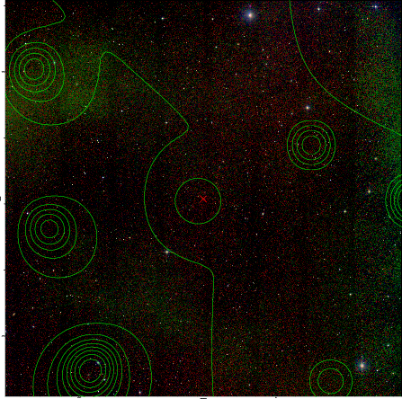

### 372

|Name|RAJ2000[deg]|DEJ2000[deg] |Ext[arcmin]| Ext,ml | z | z_src| C|GC(XSZ,Delta_z<0.01)| GC(OPT,Delta_z<0.01)|GC| R_sig[arcmin] | R500[arcmin] | R500[Mpc]| CRsig[c/s] | CR500[c/s] |L500[1E44 erg/s]|F500[1E-12 erg/s/cm^2]| M500[1E14 Msun]|Tx[keV]|Cnt_sig|Beta|Rc[arcmin]|Comment|Alias|
|---|---|---|---|---|---|------|---|--------|---------|----------|---|---|---|---|---|---|---|---|---|---|---|---|---|---|
|372| 160.184| -7.154| 65.08| 73.24| 0.1221(0.008)| z1,| G| -| -| -| 34.221| 6.612| 0.871| 0.136(0.099)| 0.120(0.087)| 0.857(1.061)| 2.201(2.725)| 2.12(1.30)| 3.53(1.38)| 161.7| 0.724(-0.144+0.183)| 0.186(-0.107+0.196)| -| t712|

|[RASS image](../image/372/372_img.pdf)|[filtered image](../image/372/372_fil.pdf)|[Segment image](../image/372/372_seg.pdf)|
|-------------------|--------------------|-------------------|
|   |    |   |

|[Exposure image](../image/372/372_mex.pdf)| [nH image](../image/372/372_nh.pdf)| [Planck image](../image/372/372_p.pdf)|
|-------------------|--------------------|-------------------|
|   |     |  |

|[Redshift Histogram](../image/372/372_zg.pdf) | [DSS image(z1)](../image/372/372_dss_z1.pdf)      |  [DSS image(z2)](../image/372/372_dss_z2.pdf)    |
|-------------------|--------------------|-------------------|
| |  Blue circle for optical clusters;  Magenta circle for XSZ clusters;  all with r=1Mpc;  Only GC with Delta_z<0.01 are shown. |  Blue circle for optical clusters;  Magenta circle for XSZ clusters;  all with r=1Mpc;  Only GC with Delta_z<0.01 are shown.  |

|[known Abell/XSZ clusters](../image/372/372_gc.pdf) | [2MASS image](../image/372/372_2mass.pdf)      |
|-------------------|-------------------|
|  Magenta, blue and green circles  for optical, X-ray and SZ clusters  respectively, with redshift of clusters  labelled. The radius of circles  are 1Mpc.|  |

|[ATLAS image](../image/372/372_s.pdf)        |
|-------------------|
|   |
