

### 373

|Name|RAJ2000[deg]|DEJ2000[deg] |Ext[arcmin]| Ext,ml | z | z_src| C|GC(XSZ,Delta_z<0.01)| GC(OPT,Delta_z<0.01)|GC| R_sig[arcmin] | R500[arcmin] | R500[Mpc]| CRsig[c/s] | CR500[c/s] |L500[1E44 erg/s]|F500[1E-12 erg/s/cm^2]| M500[1E14 Msun]|Tx[keV]|Cnt_sig|Beta|Rc[arcmin]|Comment|Alias|
|---|---|---|---|---|---|------|---|--------|---------|----------|---|---|---|---|---|---|---|---|---|---|---|---|---|---|
|373| 161.672| -2.760| 54.22| 111.37| 0.0329(0.007)| z2, z_opt| S| -| N| N, W| 25.255| 12.690| 0.500| 0.118(0.077)| 0.119(0.071)| 0.039(0.031)| 1.572(1.235)| 0.37(0.15)| 1.16(0.30)| 150.2| 0.526(-0.020+0.041)| 3.968(-0.686+0.830)| -| t701|

|[RASS image](../image/373/373_img.pdf)|[filtered image](../image/373/373_fil.pdf)|[Segment image](../image/373/373_seg.pdf)|
|-------------------|--------------------|-------------------|
| 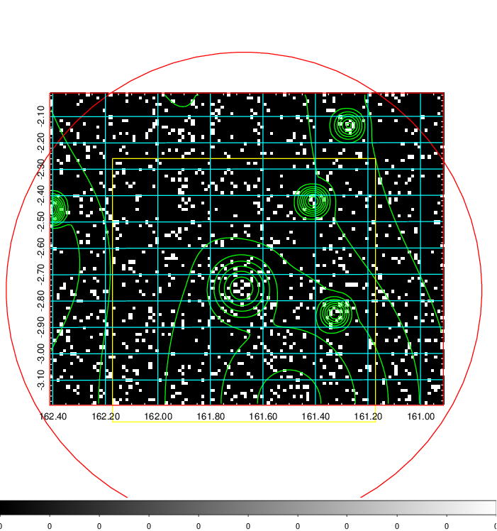  | 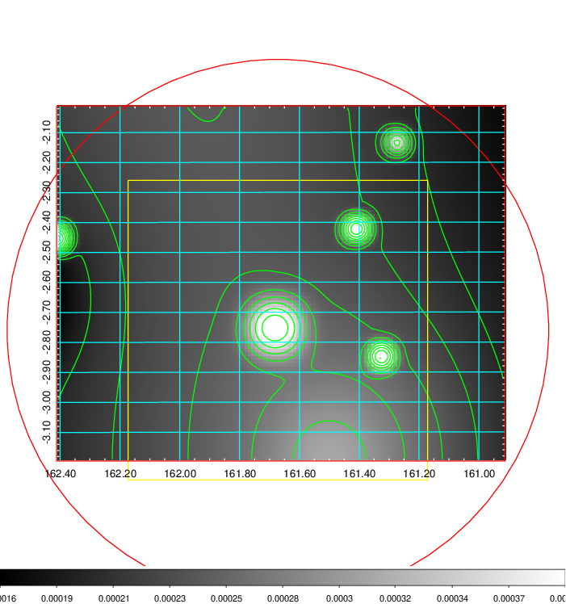   | 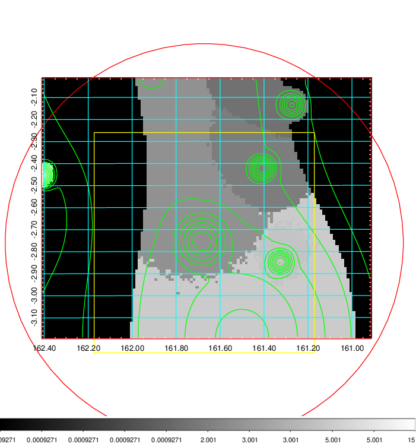  |

|[Exposure image](../image/373/373_mex.pdf)| [nH image](../image/373/373_nh.pdf)| [Planck image](../image/373/373_p.pdf)|
|-------------------|--------------------|-------------------|
|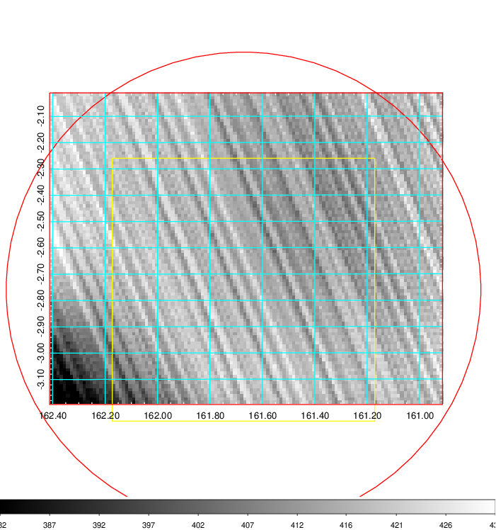   | 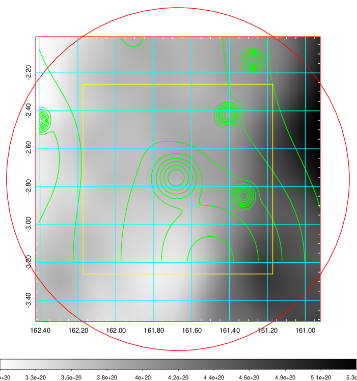    | 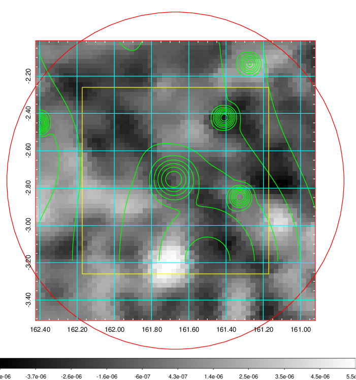 |

|[Redshift Histogram](../image/373/373_zg.pdf) | [DSS image(z1)](../image/373/373_dss_z1.pdf)      |  [DSS image(z2)](../image/373/373_dss_z2.pdf)    |
|-------------------|--------------------|-------------------|
|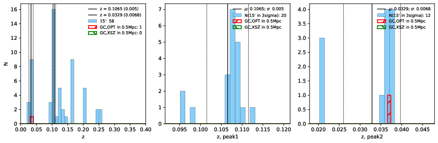 |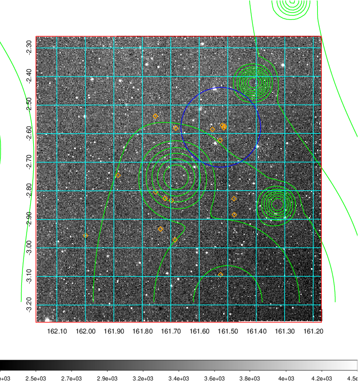  Blue circle for optical clusters;  Magenta circle for XSZ clusters;  all with r=1Mpc;  Only GC with Delta_z<0.01 are shown. | 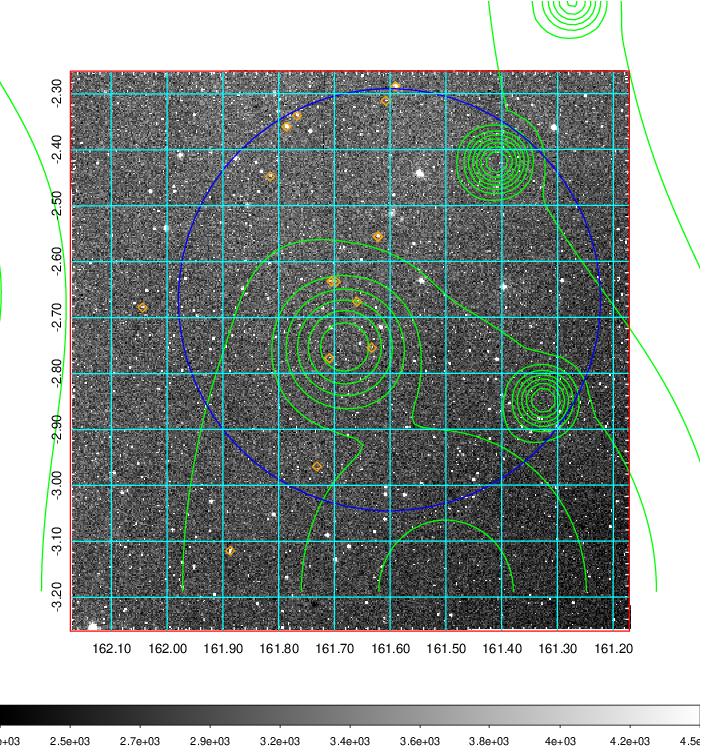 Blue circle for optical clusters;  Magenta circle for XSZ clusters;  all with r=1Mpc;  Only GC with Delta_z<0.01 are shown.  |

|[Previous-identified clusters](../image/373/373_gc.pdf) | [2MASS image](../image/373/373_2mass.pdf)      |
|-------------------|-------------------|
|  Green, magenta, and blue circles  for optical, X-ray and SZ clusters  respectively, with redshift of clusters  labelled. The radius of circles  are 1Mpc.|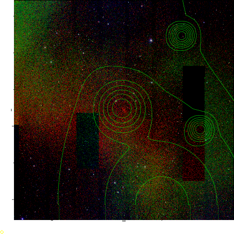  |

|[ATLAS image](../image/373/373_s.pdf)        |
|-------------------|
| 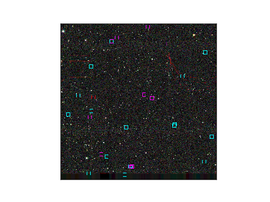  |
