

### 374

|Name|RAJ2000[deg]|DEJ2000[deg] |Ext[arcmin]| Ext,ml | z | z_src| C|GC(XSZ,Delta_z<0.01)| GC(OPT,Delta_z<0.01)|GC| R_sig[arcmin] | R500[arcmin] | R500[Mpc]| CRsig[c/s] | CR500[c/s] |L500[1E44 erg/s]|F500[1E-12 erg/s/cm^2]| M500[1E14 Msun]|Tx[keV]|Cnt_sig|Beta|Rc[arcmin]|Comment|Alias|
|---|---|---|---|---|---|------|---|--------|---------|----------|---|---|---|---|---|---|---|---|---|---|---|---|---|---|
|374| 162.181| -0.696| 9.64| 40.95| 0.0366(0.005)| z1, z_opt| S| -| N| C, N, W| 11.725| 11.393| 0.497| 0.088(0.035)| 0.087(0.035)| 0.039(0.012)| 1.247(0.396)| 0.36(0.06)| 1.16(0.12)| 52.0| 0.836(-0.173+0.117)| 9.167(-2.051+1.863)| -| t433|

|[RASS image](../image/374/374_img.pdf)|[filtered image](../image/374/374_fil.pdf)|[Segment image](../image/374/374_seg.pdf)|
|-------------------|--------------------|-------------------|
| 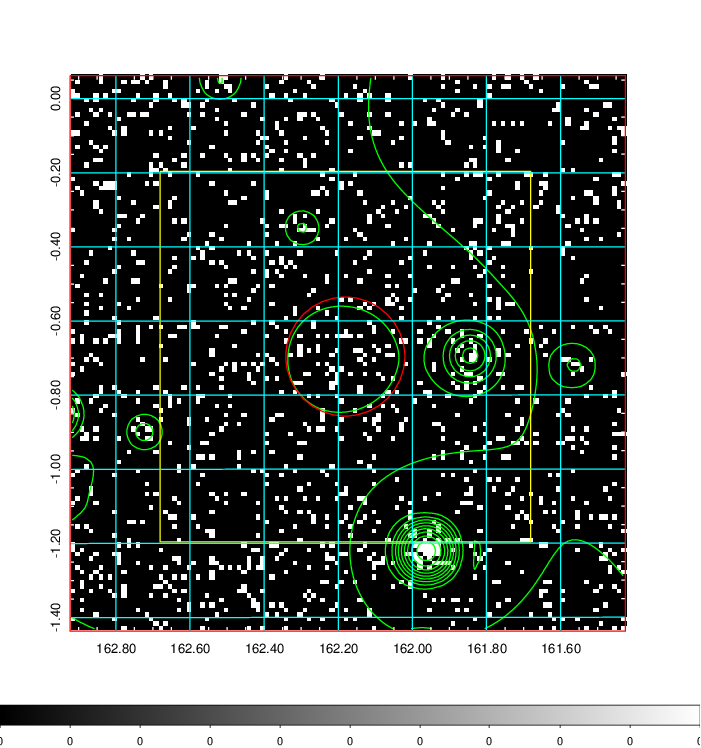  | 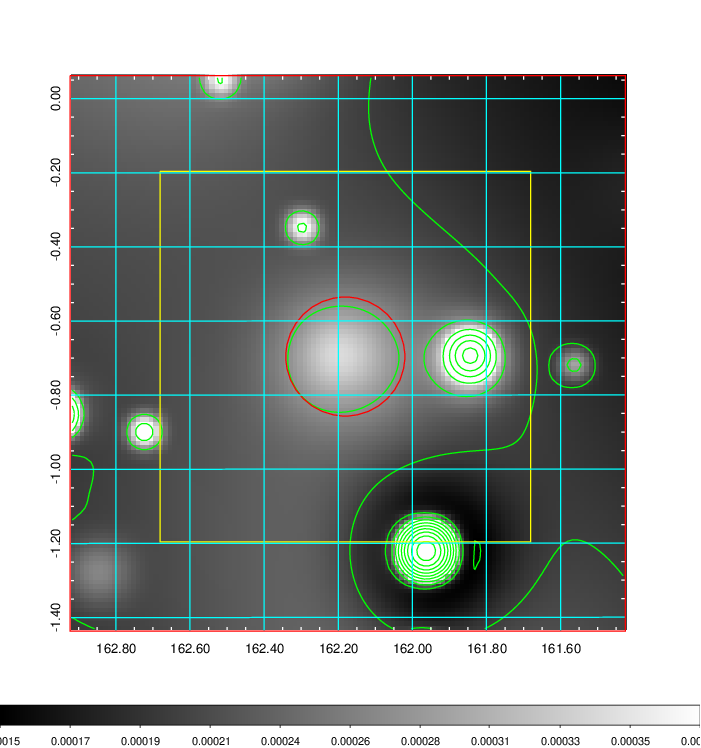   | 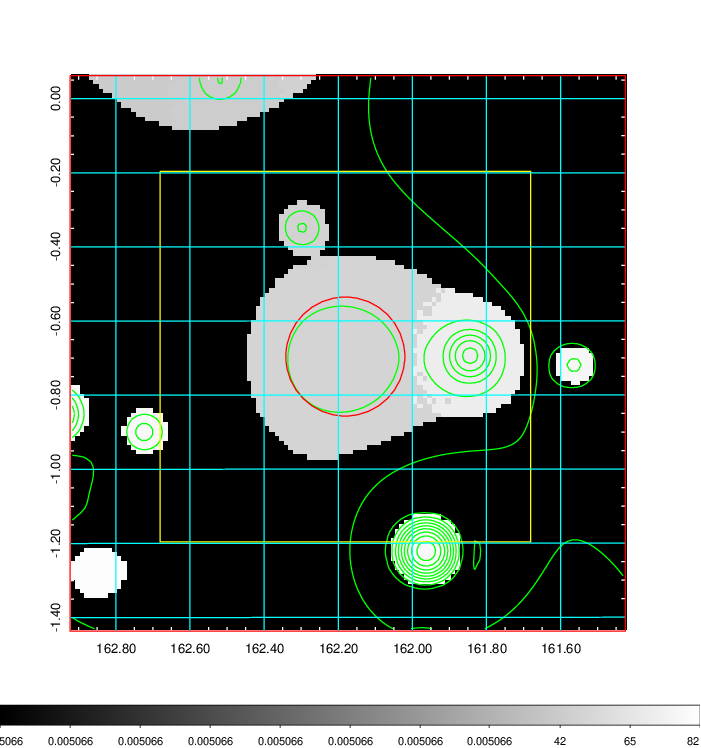  |

|[Exposure image](../image/374/374_mex.pdf)| [nH image](../image/374/374_nh.pdf)| [Planck image](../image/374/374_p.pdf)|
|-------------------|--------------------|-------------------|
|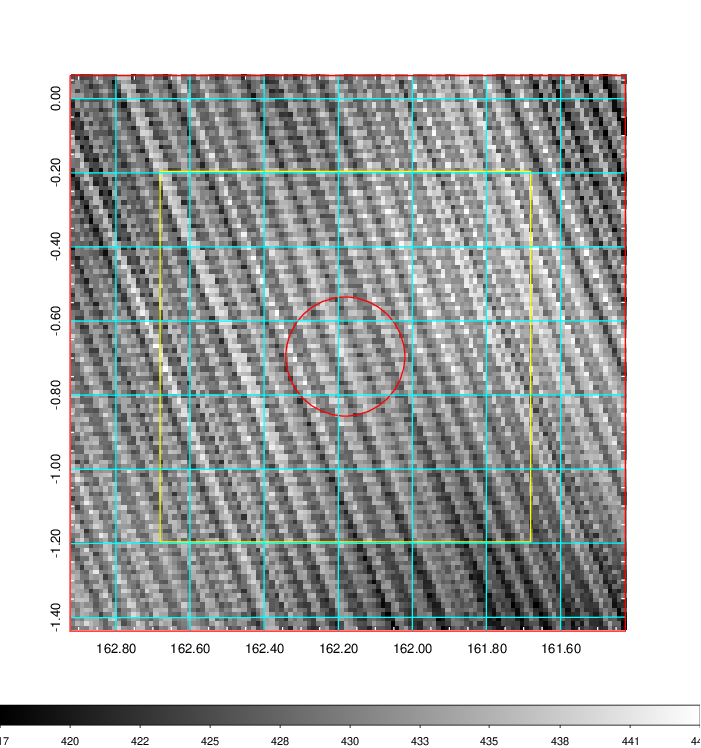   | 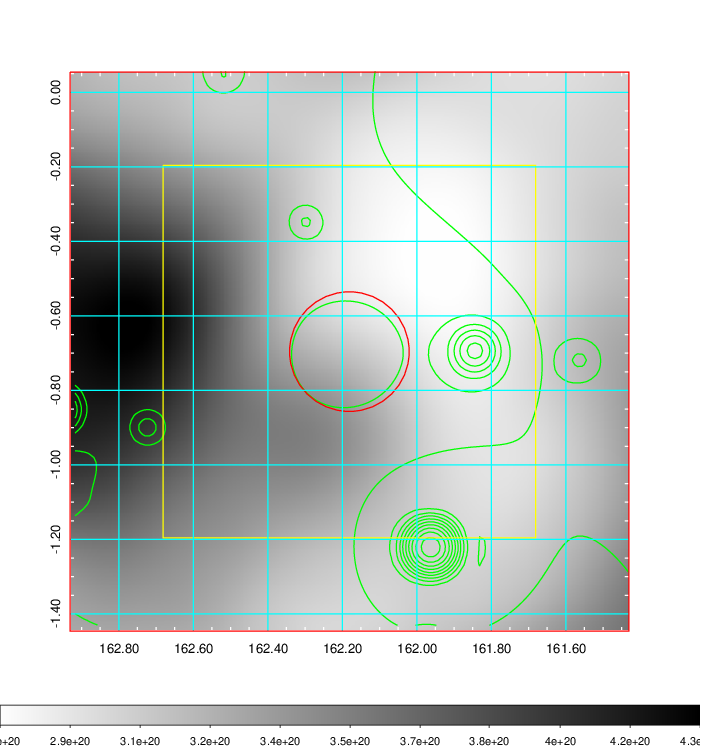    | 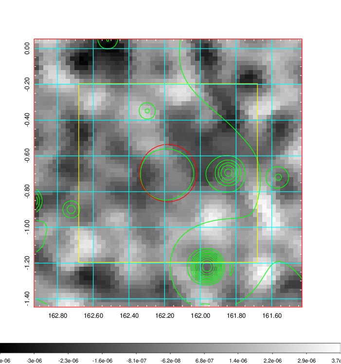 |

|[Redshift Histogram](../image/374/374_zg.pdf) | [DSS image(z1)](../image/374/374_dss_z1.pdf)      |  [DSS image(z2)](../image/374/374_dss_z2.pdf)    |
|-------------------|--------------------|-------------------|
|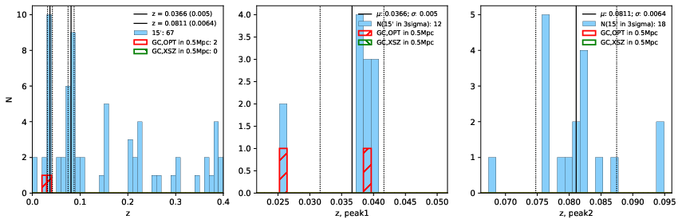 |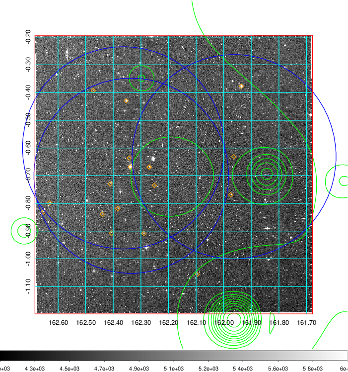  Blue circle for optical clusters;  Magenta circle for XSZ clusters;  all with r=1Mpc;  Only GC with Delta_z<0.01 are shown. | 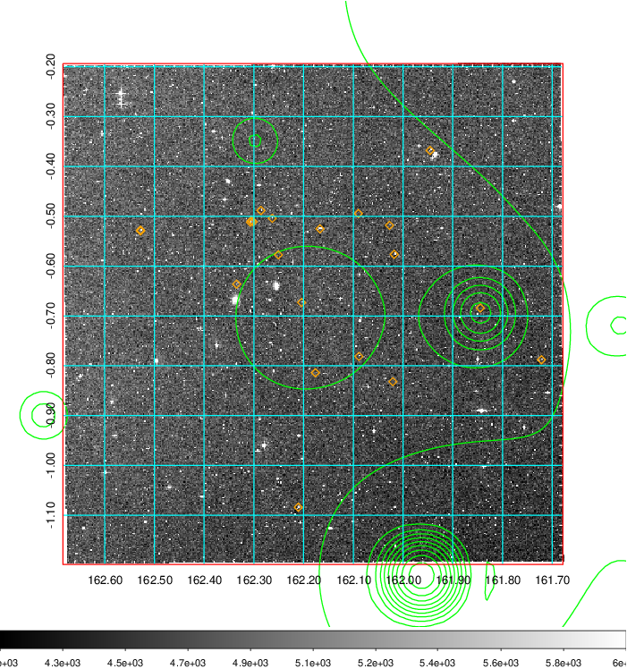 Blue circle for optical clusters;  Magenta circle for XSZ clusters;  all with r=1Mpc;  Only GC with Delta_z<0.01 are shown.  |

|[Previous-identified clusters](../image/374/374_gc.pdf) | [2MASS image](../image/374/374_2mass.pdf)      |[SDSS image](../image/374/374_sdss.pdf)   |
|-------------------|-------------------|-------------------|
|  Green, magenta, and blue circles  for optical, X-ray and SZ clusters  respectively, with redshift of clusters  labelled. The radius of circles  are 1Mpc.|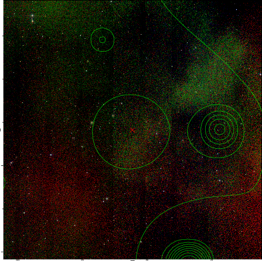  | 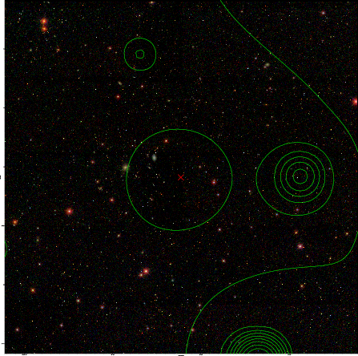  |

