

### 376

|Name|RAJ2000[deg]|DEJ2000[deg] |Ext[arcmin]| Ext,ml | z | z_src| C|GC(XSZ,Delta_z<0.01)| GC(OPT,Delta_z<0.01)|GC| R_sig[arcmin] | R500[arcmin] | R500[Mpc]| CRsig[c/s] | CR500[c/s] |L500[1E44 erg/s]|F500[1E-12 erg/s/cm^2]| M500[1E14 Msun]|Tx[keV]|Cnt_sig|Beta|Rc[arcmin]|Comment|Alias|
|---|---|---|---|---|---|------|---|--------|---------|----------|---|---|---|---|---|---|---|---|---|---|---|---|---|---|
|376| 162.357| 57.888| 1.38| 30.34| 0.0729(0.005)| z1, z_xsz| B| F20, SPI| N, W| C, F20, N, SPI, W| 13.188| 8.885| 0.740| 0.160(0.030)| 0.152(0.028)| 0.392(0.056)| 3.021(0.432)| 1.23(0.09)| 2.49(0.11)| 113.0| 0.590(-0.060+0.105)| 1.771(-0.547+0.772)| -| t021|

|[RASS image](../image/376/376_img.pdf)|[filtered image](../image/376/376_fil.pdf)|[Segment image](../image/376/376_seg.pdf)|
|-------------------|--------------------|-------------------|
| 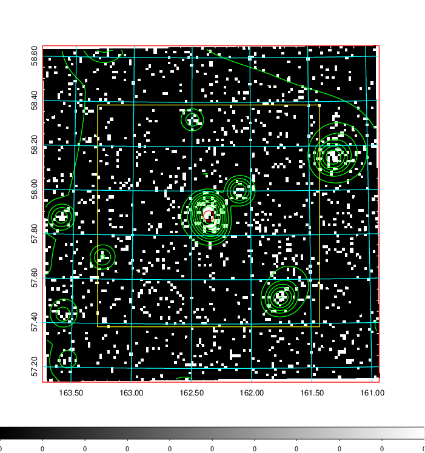  | 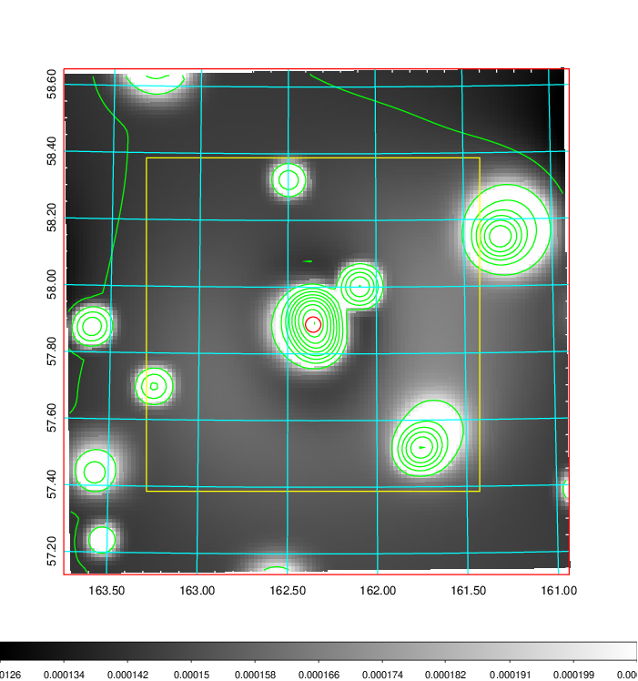   | 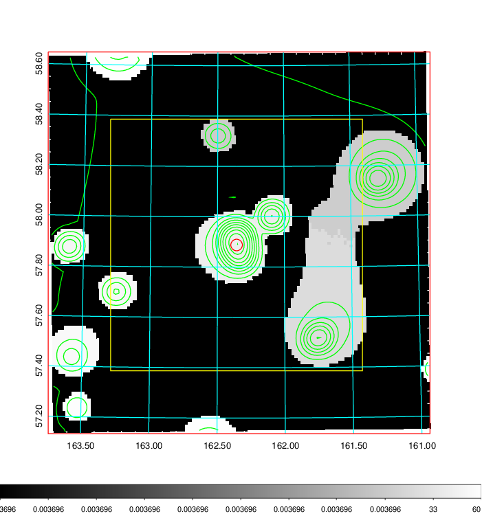  |

|[Exposure image](../image/376/376_mex.pdf)| [nH image](../image/376/376_nh.pdf)| [Planck image](../image/376/376_p.pdf)|
|-------------------|--------------------|-------------------|
|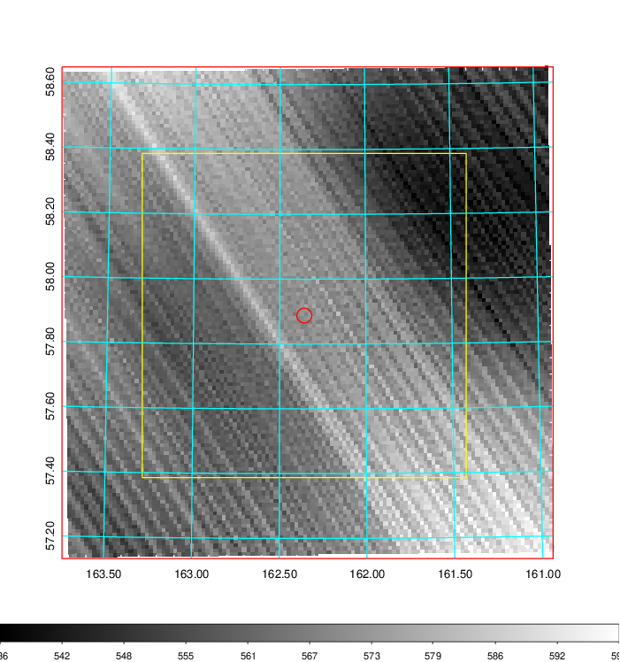   | 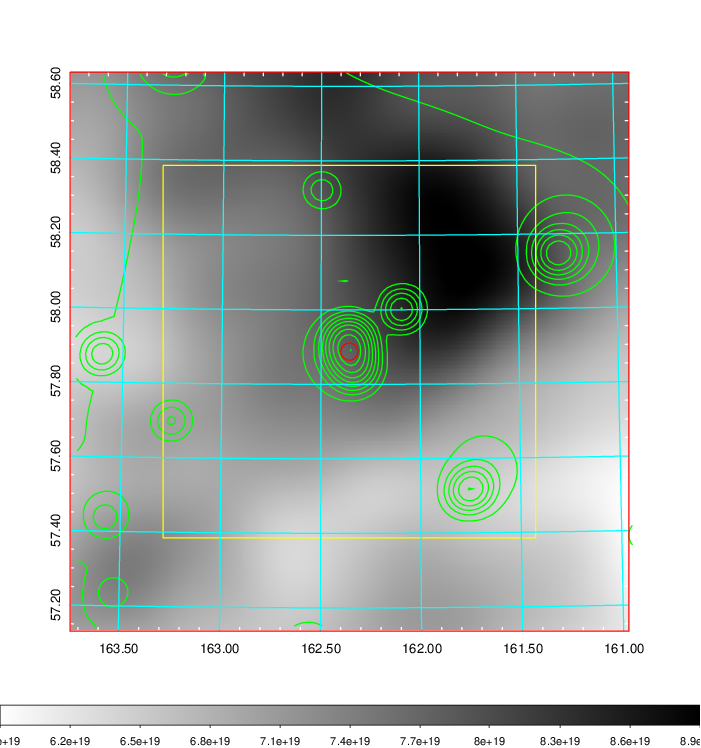    | 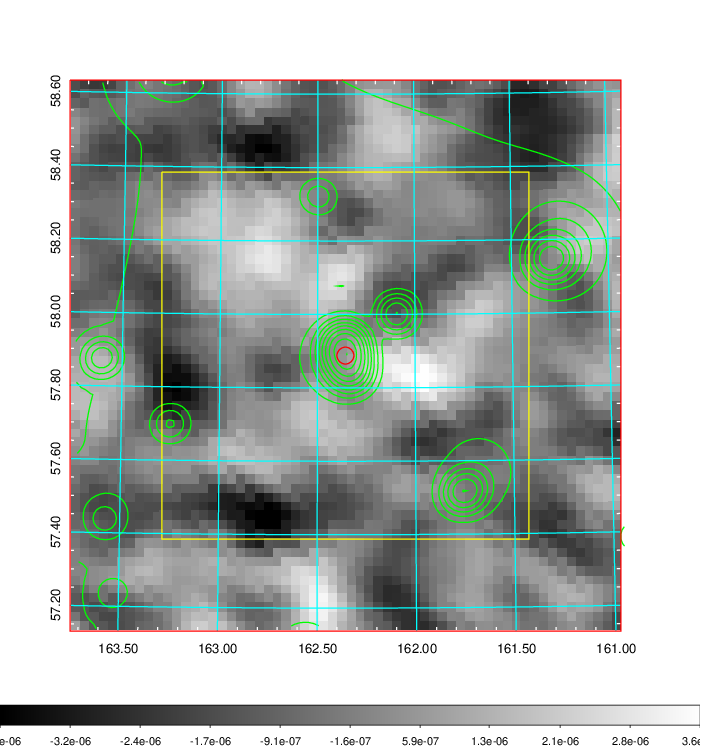 |

|[Redshift Histogram](../image/376/376_zg.pdf) | [DSS image(z1)](../image/376/376_dss_z1.pdf)      |  [DSS image(z2)](../image/376/376_dss_z2.pdf)    |
|-------------------|--------------------|-------------------|
|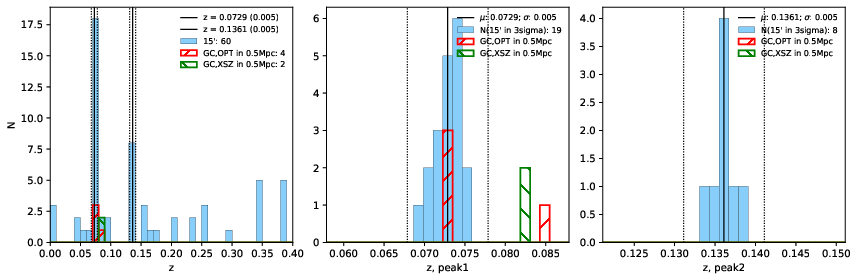 |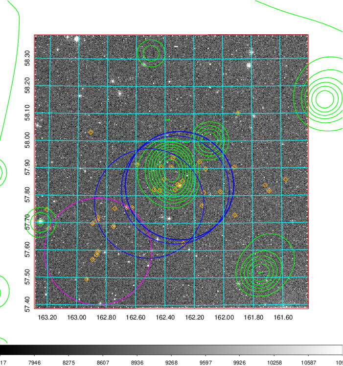  Blue circle for optical clusters;  Magenta circle for XSZ clusters;  all with r=1Mpc;  Only GC with Delta_z<0.01 are shown. | 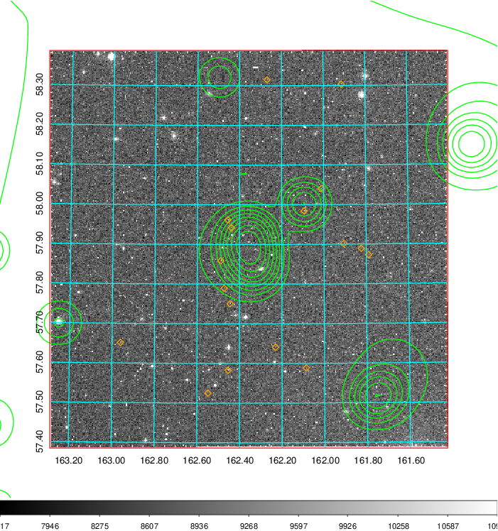 Blue circle for optical clusters;  Magenta circle for XSZ clusters;  all with r=1Mpc;  Only GC with Delta_z<0.01 are shown.  |

|[known Abell/XSZ clusters](../image/376/376_gc.pdf) | [2MASS image](../image/376/376_2mass.pdf)      |[SDSS image](../image/376/376_sdss.pdf)   |
|-------------------|-------------------|-------------------|
|  Magenta, blue and green circles  for optical, X-ray and SZ clusters  respectively, with redshift of clusters  labelled. The radius of circles  are 1Mpc.|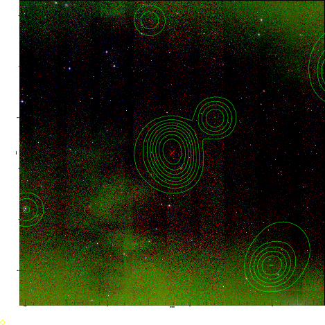  | 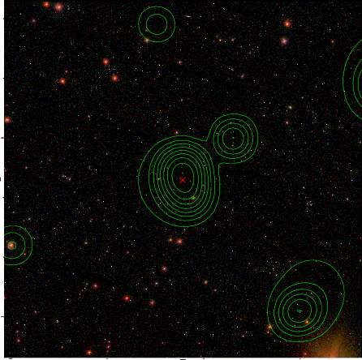  |

