

### 377

|Name|RAJ2000[deg]|DEJ2000[deg] |Ext[arcmin]| Ext,ml | z | z_src| C|GC(XSZ,Delta_z<0.01)| GC(OPT,Delta_z<0.01)|GC| R_sig[arcmin] | R500[arcmin] | R500[Mpc]| CRsig[c/s] | CR500[c/s] |L500[1E44 erg/s]|F500[1E-12 erg/s/cm^2]| M500[1E14 Msun]|Tx[keV]|Cnt_sig|Beta|Rc[arcmin]|Comment|Alias|
|---|---|---|---|---|---|------|---|--------|---------|----------|---|---|---|---|---|---|---|---|---|---|---|---|---|---|
|377| 162.590| 0.279| 7.10| 30.55| 0.0390(0.005)| z1, z_opt| S| -| N| C, N, W| 29.638| 14.042| 0.651| 0.289(0.069)| 0.265(0.064)| 0.161(0.075)| 4.543(2.110)| 0.81(0.19)| 1.91(0.29)| 212.2| 0.719(-0.159+0.185)| 20.528(-5.577+5.382)| -| t353|

|[RASS image](../image/377/377_img.pdf)|[filtered image](../image/377/377_fil.pdf)|[Segment image](../image/377/377_seg.pdf)|
|-------------------|--------------------|-------------------|
| 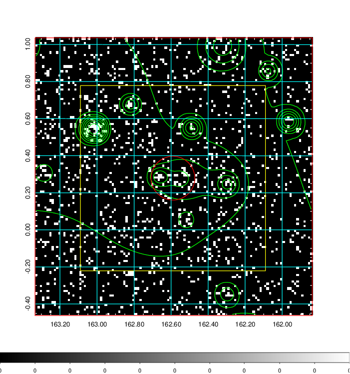  | 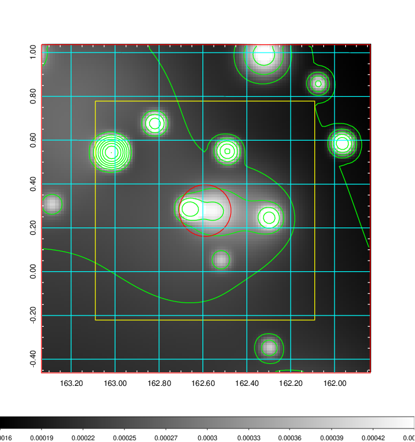   | 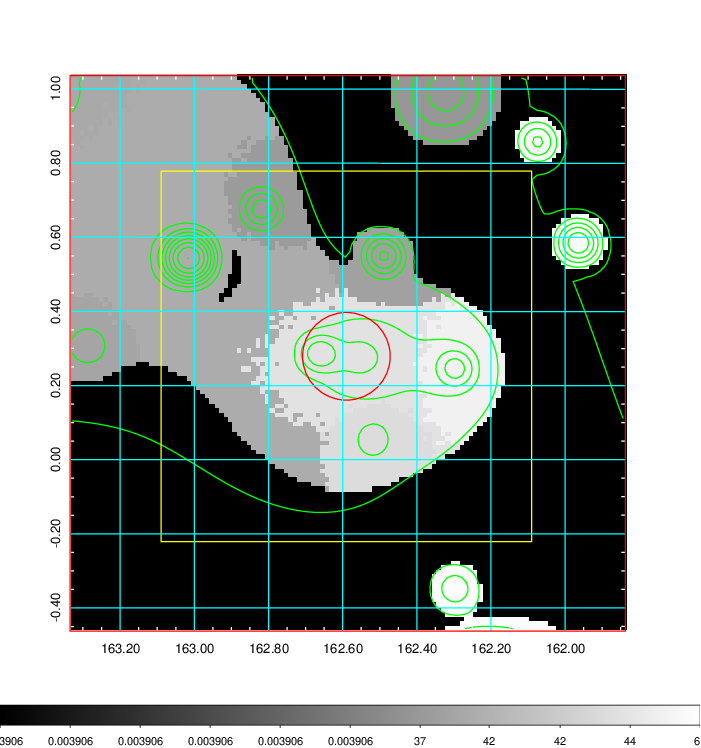  |

|[Exposure image](../image/377/377_mex.pdf)| [nH image](../image/377/377_nh.pdf)| [Planck image](../image/377/377_p.pdf)|
|-------------------|--------------------|-------------------|
|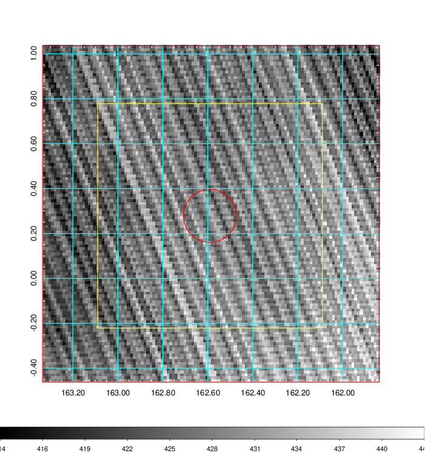   | 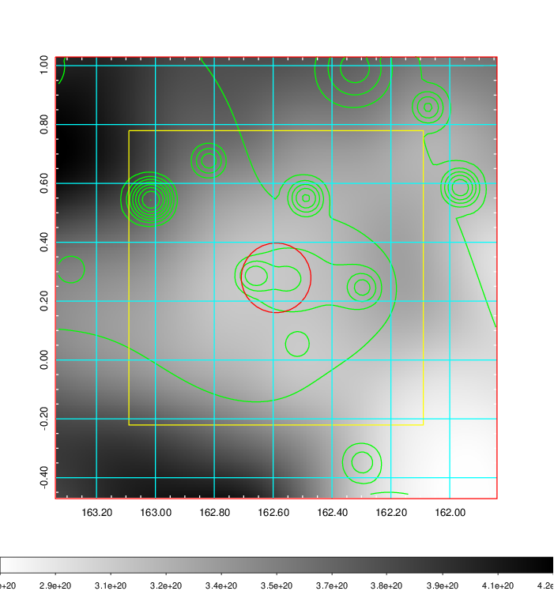    | 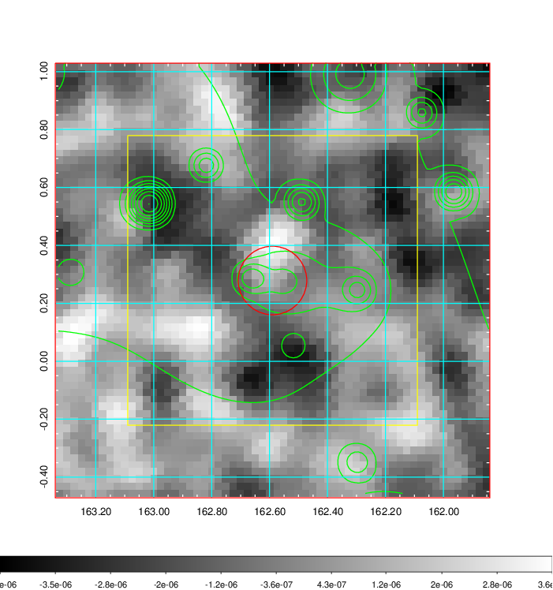 |

|[Redshift Histogram](../image/377/377_zg.pdf) | [DSS image(z1)](../image/377/377_dss_z1.pdf)      |  [DSS image(z2)](../image/377/377_dss_z2.pdf)    |
|-------------------|--------------------|-------------------|
|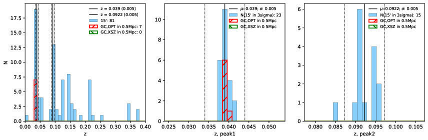 |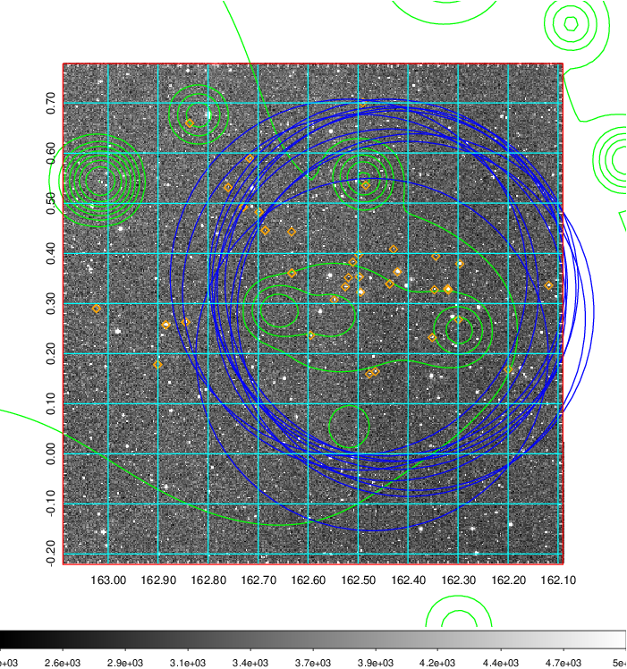  Blue circle for optical clusters;  Magenta circle for XSZ clusters;  all with r=1Mpc;  Only GC with Delta_z<0.01 are shown. | 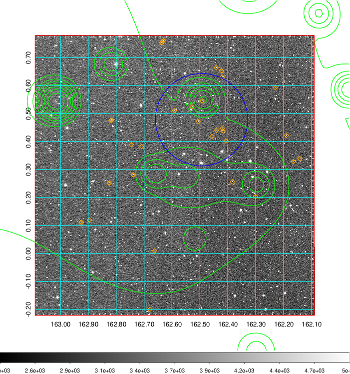 Blue circle for optical clusters;  Magenta circle for XSZ clusters;  all with r=1Mpc;  Only GC with Delta_z<0.01 are shown.  |

|[known Abell/XSZ clusters](../image/377/377_gc.pdf) | [2MASS image](../image/377/377_2mass.pdf)      |[SDSS image](../image/377/377_sdss.pdf)   |
|-------------------|-------------------|-------------------|
|  Magenta, blue and green circles  for optical, X-ray and SZ clusters  respectively, with redshift of clusters  labelled. The radius of circles  are 1Mpc.|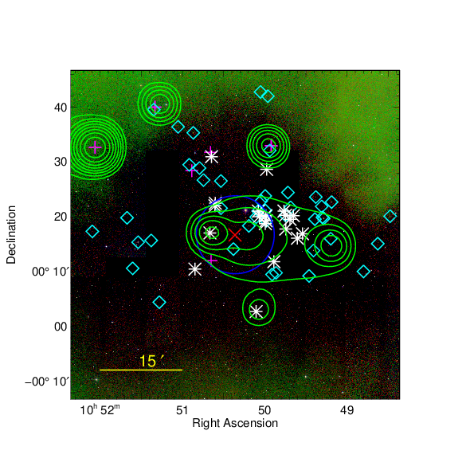  | 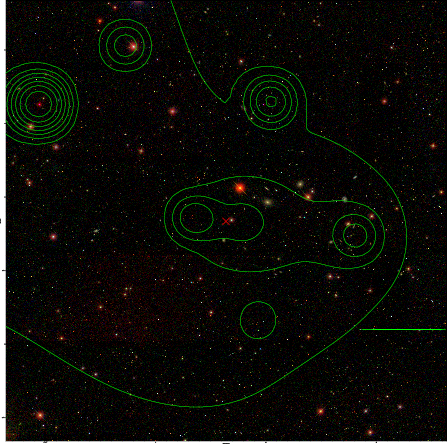  |

