

### 378

|Name|RAJ2000[deg]|DEJ2000[deg] |Ext[arcmin]| Ext,ml | z | z_src| C|GC(XSZ,Delta_z<0.01)| GC(OPT,Delta_z<0.01)|GC| R_sig[arcmin] | R500[arcmin] | R500[Mpc]| CRsig[c/s] | CR500[c/s] |L500[1E44 erg/s]|F500[1E-12 erg/s/cm^2]| M500[1E14 Msun]|Tx[keV]|Cnt_sig|Beta|Rc[arcmin]|Comment|Alias|
|---|---|---|---|---|---|------|---|--------|---------|----------|---|---|---|---|---|---|---|---|---|---|---|---|---|---|
|378| 162.608| -12.842| 0.81| 55.06| 0.0154(0.005)| z1, z_xsz| B| MCXC| N| MCXC, N| 27.662| 27.379| 0.516| 0.583(0.070)| 0.582(0.070)| 0.043(0.003)| 7.991(0.567)| 0.40(0.01)| 1.21(0.03)| 236.3| 0.955(-0.054+0.033)| 2.977(-0.252+0.188)| -| k015|

|[RASS image](../image/378/378_img.pdf)|[filtered image](../image/378/378_fil.pdf)|[Segment image](../image/378/378_seg.pdf)|
|-------------------|--------------------|-------------------|
| 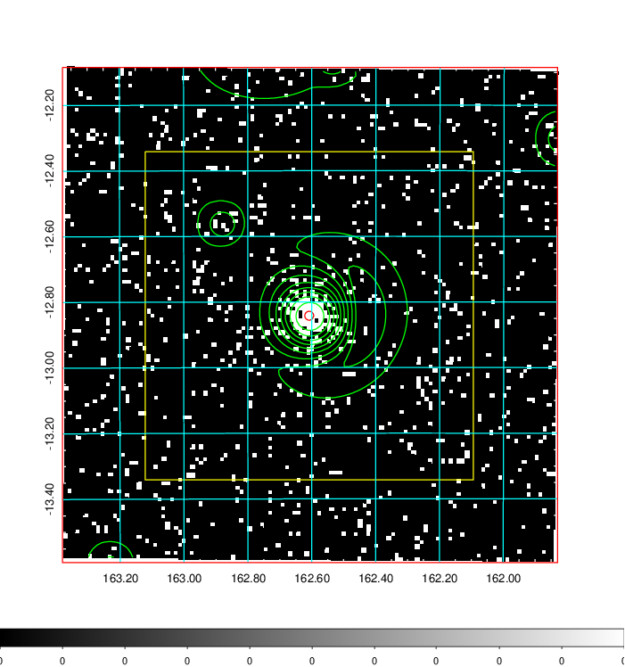  | 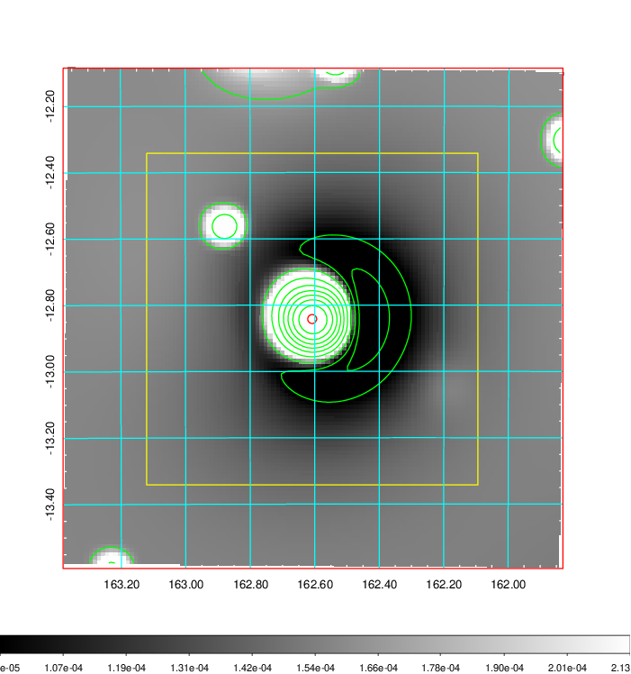   | 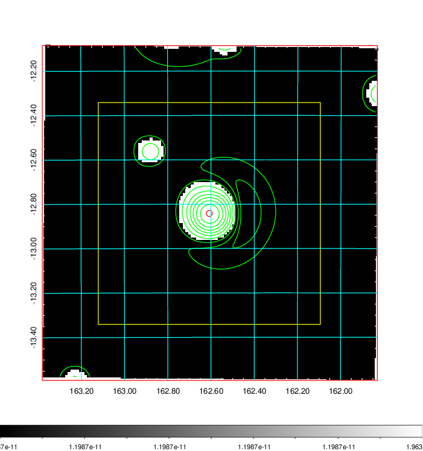  |

|[Exposure image](../image/378/378_mex.pdf)| [nH image](../image/378/378_nh.pdf)| [Planck image](../image/378/378_p.pdf)|
|-------------------|--------------------|-------------------|
|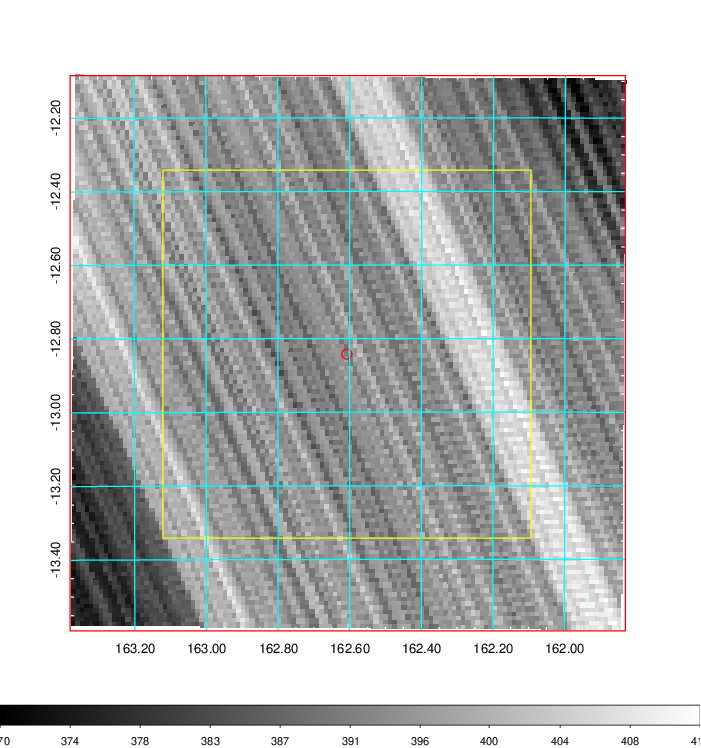   | 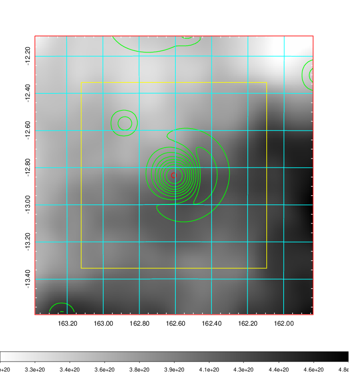    | 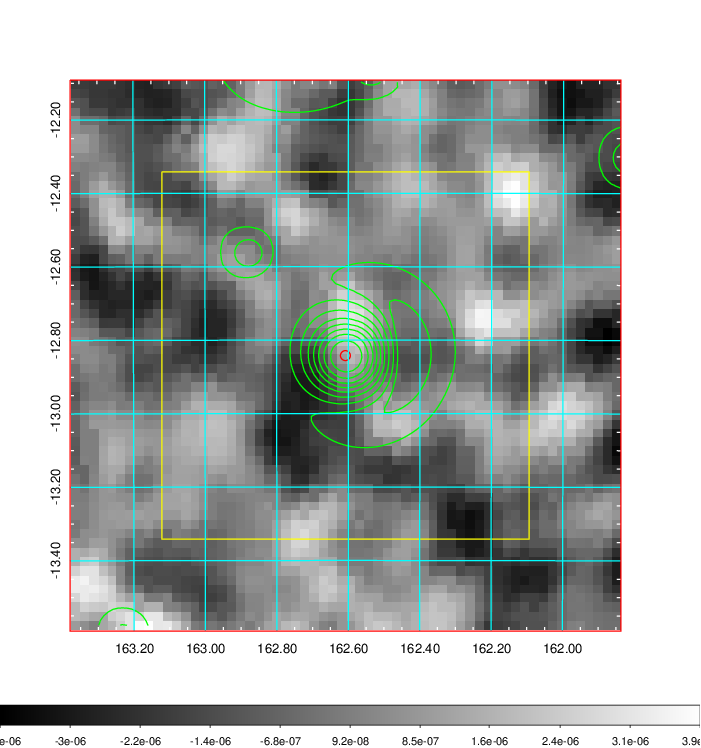 |

|[Redshift Histogram](../image/378/378_zg.pdf) | [DSS image(z1)](../image/378/378_dss_z1.pdf)      |  [DSS image(z2)](../image/378/378_dss_z2.pdf)    |
|-------------------|--------------------|-------------------|
|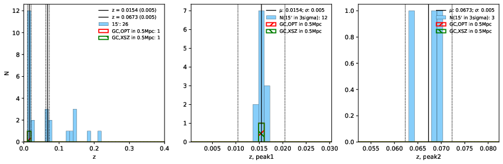 |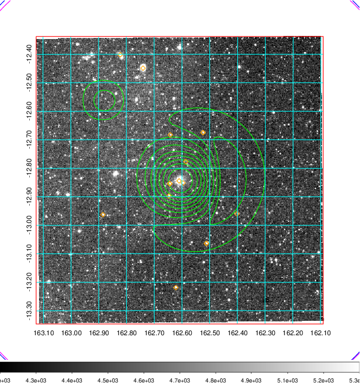  Blue circle for optical clusters;  Magenta circle for XSZ clusters;  all with r=1Mpc;  Only GC with Delta_z<0.01 are shown. | 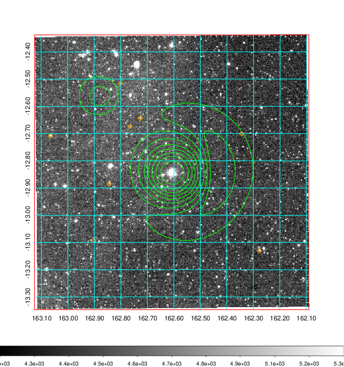 Blue circle for optical clusters;  Magenta circle for XSZ clusters;  all with r=1Mpc;  Only GC with Delta_z<0.01 are shown.  |

|[Previous-identified clusters](../image/378/378_gc.pdf) | [2MASS image](../image/378/378_2mass.pdf)      |
|-------------------|-------------------|
|  Green, magenta, and blue circles  for optical, X-ray and SZ clusters  respectively, with redshift of clusters  labelled. The radius of circles  are 1Mpc.|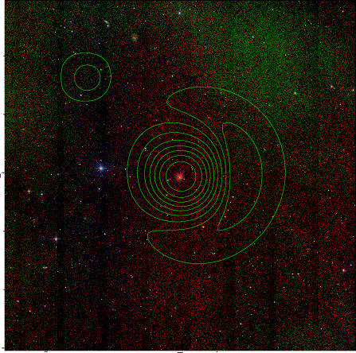  |

|[ATLAS image](../image/378/378_s.pdf)        |
|-------------------|
| 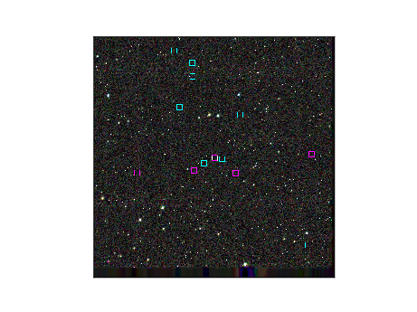  |
