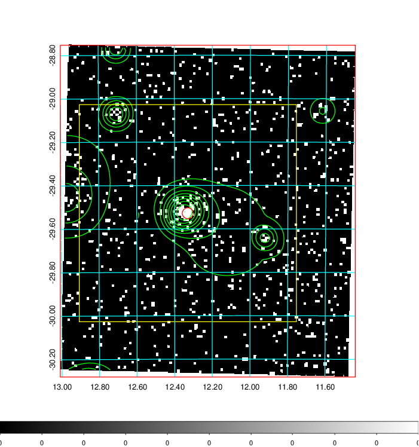
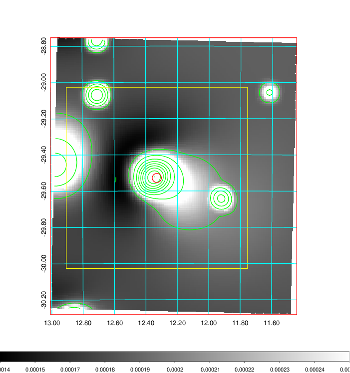
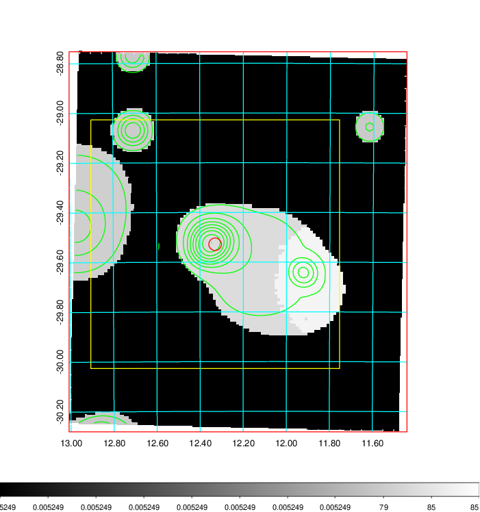
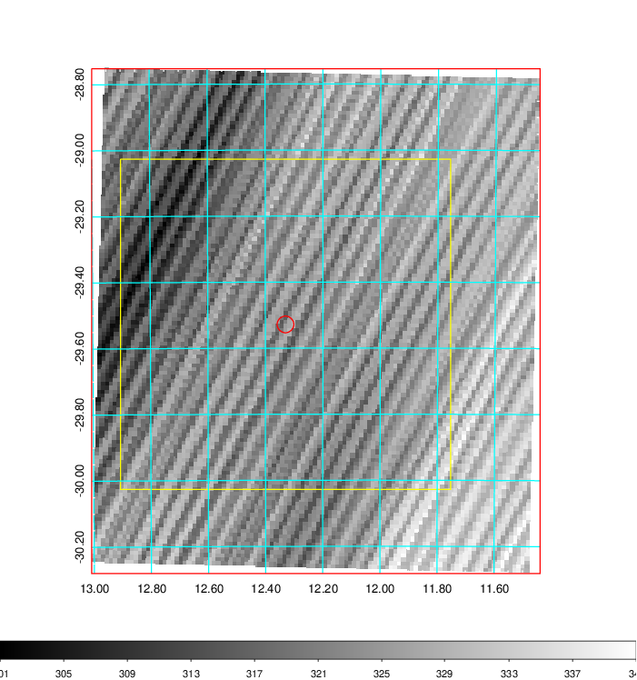
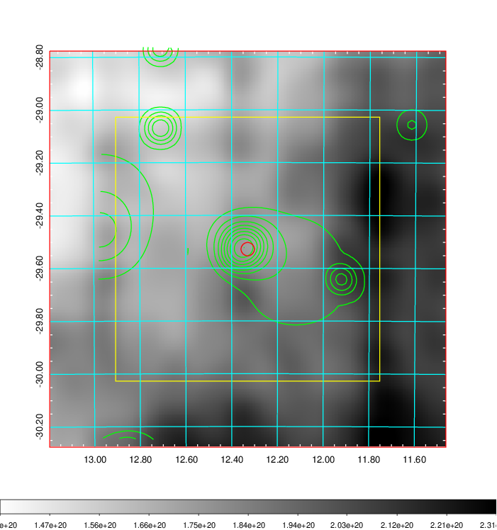
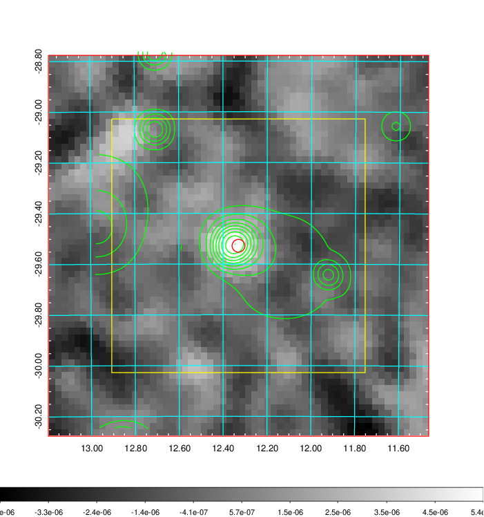
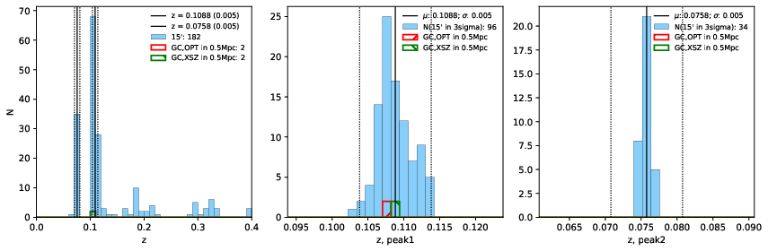
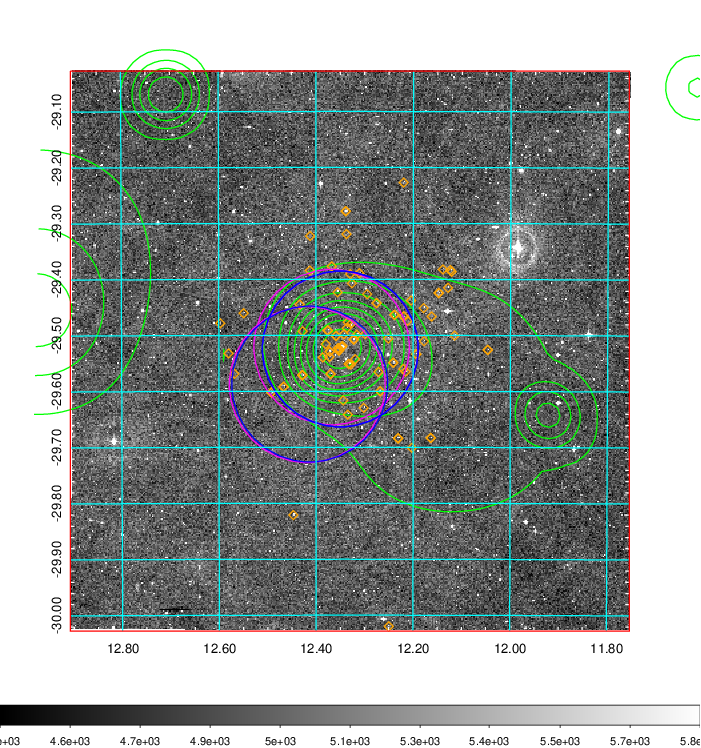
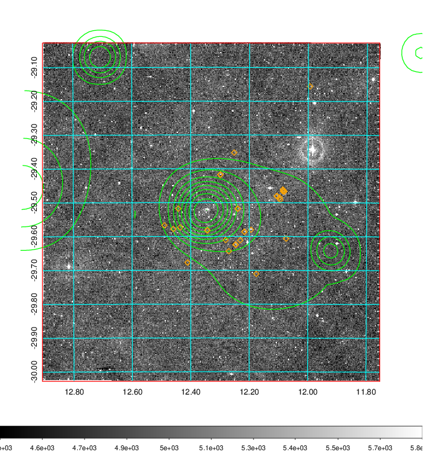
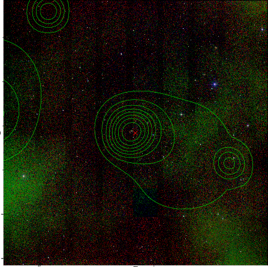

### 38

|Name|RAJ2000[deg]|DEJ2000[deg] |Ext[arcmin]| Ext,ml | z | z_src| C|GC(XSZ,Delta_z<0.01)| GC(OPT,Delta_z<0.01)|GC| R_sig[arcmin] | R500[arcmin] | R500[Mpc]| CRsig[c/s] | CR500[c/s] |L500[1E44 erg/s]|F500[1E-12 erg/s/cm^2]| M500[1E14 Msun]|Tx[keV]|Cnt_sig|Beta|Rc[arcmin]|Comment|Alias|
|---|---|---|---|---|---|------|---|--------|---------|----------|---|---|---|---|---|---|---|---|---|---|---|---|---|---|
|38| 12.330| -29.528| 1.52| 35.41| 0.1088(0.005)| z1, z_xsz| B| MCXC, Tar| A| A, MCXC, N, Tar| 8.800| 8.074| 0.962| 0.249(0.044)| 0.246(0.043)| 1.476(0.133)| 4.860(0.438)| 2.81(0.13)| 4.19(0.12)| 84.1| 0.832(-0.129+0.113)| 3.321(-0.820+0.656)| -| k118|

|[RASS image](../image/38/38_img.pdf)|[filtered image](../image/38/38_fil.pdf)|[Segment image](../image/38/38_seg.pdf)|
|-------------------|--------------------|-------------------|
|   |    |   |

|[Exposure image](../image/38/38_mex.pdf)| [nH image](../image/38/38_nh.pdf)| [Planck image](../image/38/38_p.pdf)|
|-------------------|--------------------|-------------------|
|   |     |  |

|[Redshift Histogram](../image/38/38_zg.pdf) | [DSS image(z1)](../image/38/38_dss_z1.pdf)      |  [DSS image(z2)](../image/38/38_dss_z2.pdf)    |
|-------------------|--------------------|-------------------|
| |  Blue circle for optical clusters;  Magenta circle for XSZ clusters;  all with r=1Mpc;  Only GC with Delta_z<0.01 are shown. |  Blue circle for optical clusters;  Magenta circle for XSZ clusters;  all with r=1Mpc;  Only GC with Delta_z<0.01 are shown.  |

|[known Abell/XSZ clusters](../image/38/38_gc.pdf) | [2MASS image](../image/38/38_2mass.pdf)      |
|-------------------|-------------------|
|  Magenta, blue and green circles  for optical, X-ray and SZ clusters  respectively, with redshift of clusters  labelled. The radius of circles  are 1Mpc.|  |

|[DES image](../image/38/38_des.pdf)   |[ATLAS image](../image/38/38_s.pdf)        |
|-------------------|-------------------|
|   |   |
