

### 380

|Name|RAJ2000[deg]|DEJ2000[deg] |Ext[arcmin]| Ext,ml | z | z_src| C|GC(XSZ,Delta_z<0.01)| GC(OPT,Delta_z<0.01)|GC| R_sig[arcmin] | R500[arcmin] | R500[Mpc]| CRsig[c/s] | CR500[c/s] |L500[1E44 erg/s]|F500[1E-12 erg/s/cm^2]| M500[1E14 Msun]|Tx[keV]|Cnt_sig|Beta|Rc[arcmin]|Comment|Alias|
|---|---|---|---|---|---|------|---|--------|---------|----------|---|---|---|---|---|---|---|---|---|---|---|---|---|---|
|380| 163.445| 54.860| 3.51| 123.63| 0.0720(0.005)| z1, z_xsz| B| F20, MCXC, SPI, Tar| N, W| C, F20, MCXC, N, SPI, Tar, W| 14.650| 9.895| 0.814| 0.263(0.031)| 0.249(0.030)| 0.628(0.053)| 4.966(0.420)| 1.64(0.07)| 2.98(0.08)| 144.9| 0.878(-0.117+0.085)| 6.428(-1.009+0.726)| -| k433|

|[RASS image](../image/380/380_img.pdf)|[filtered image](../image/380/380_fil.pdf)|[Segment image](../image/380/380_seg.pdf)|
|-------------------|--------------------|-------------------|
| 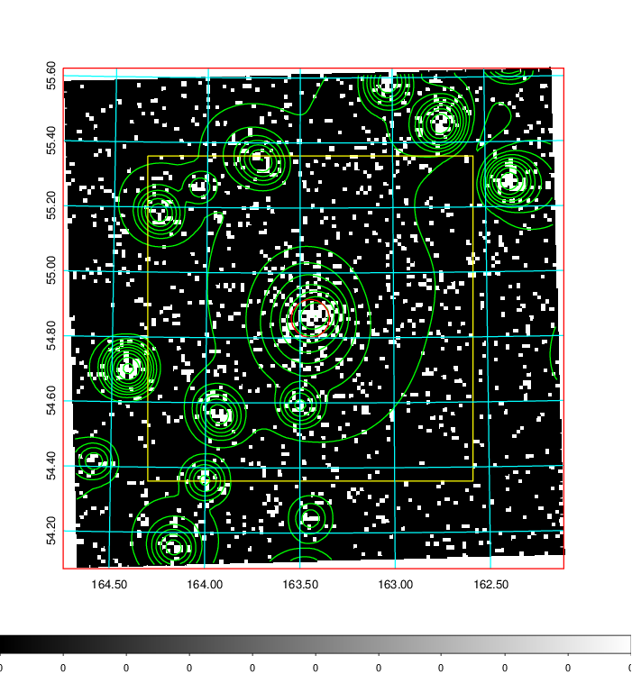  | 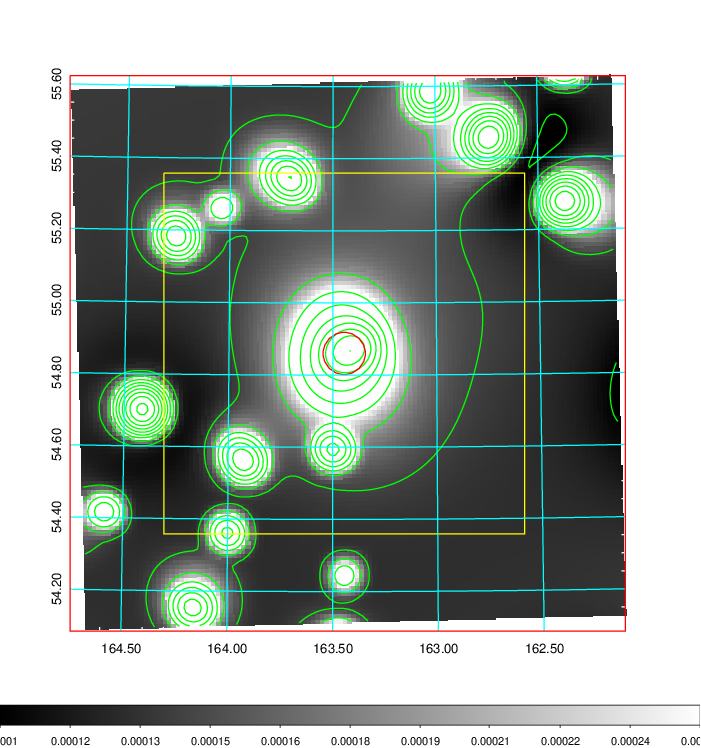   | 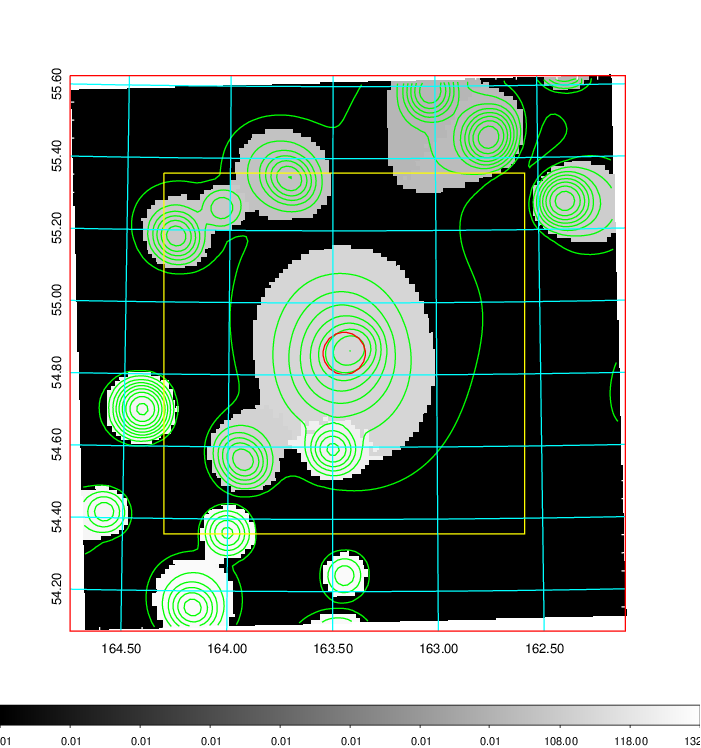  |

|[Exposure image](../image/380/380_mex.pdf)| [nH image](../image/380/380_nh.pdf)| [Planck image](../image/380/380_p.pdf)|
|-------------------|--------------------|-------------------|
|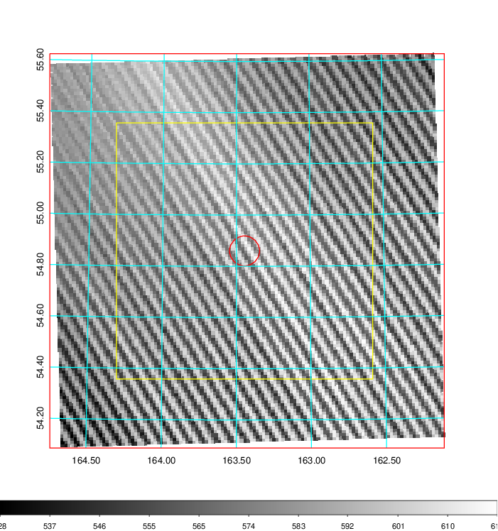   | 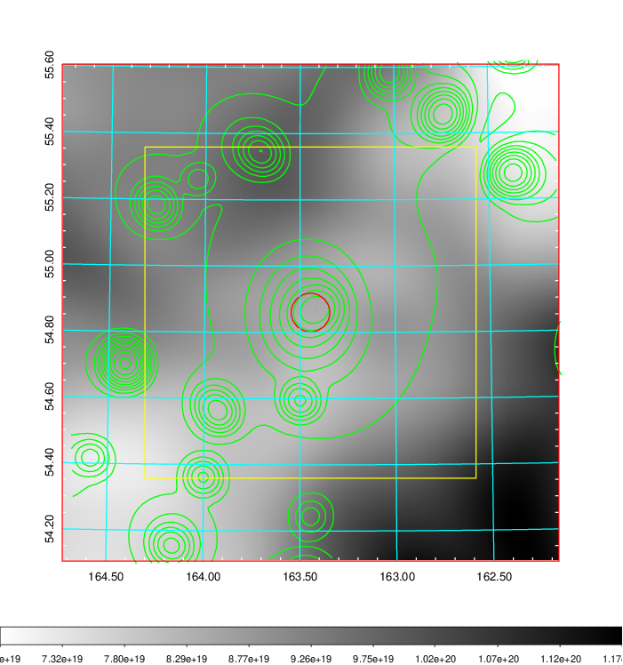    | 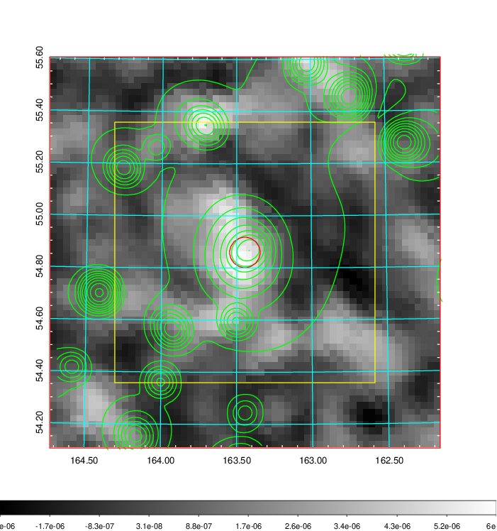 |

|[Redshift Histogram](../image/380/380_zg.pdf) | [DSS image(z1)](../image/380/380_dss_z1.pdf)      |  [DSS image(z2)](../image/380/380_dss_z2.pdf)    |
|-------------------|--------------------|-------------------|
|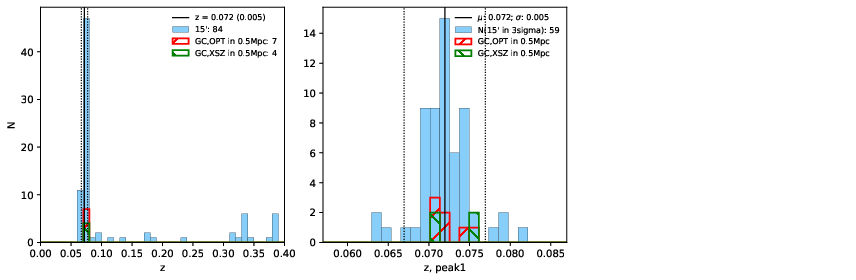 |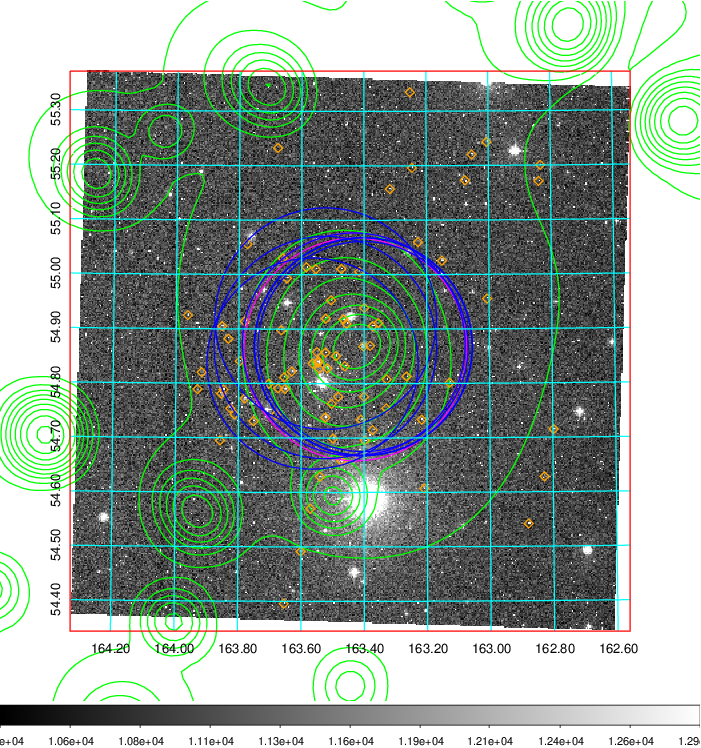  Blue circle for optical clusters;  Magenta circle for XSZ clusters;  all with r=1Mpc;  Only GC with Delta_z<0.01 are shown. | 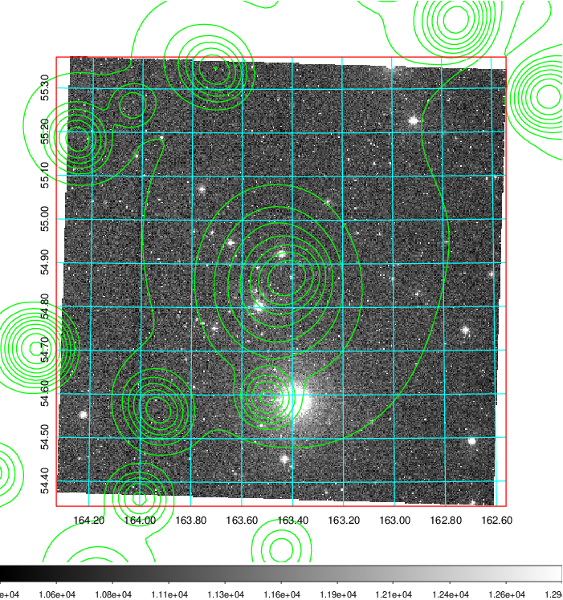 Blue circle for optical clusters;  Magenta circle for XSZ clusters;  all with r=1Mpc;  Only GC with Delta_z<0.01 are shown.  |

|[known Abell/XSZ clusters](../image/380/380_gc.pdf) | [2MASS image](../image/380/380_2mass.pdf)      |[SDSS image](../image/380/380_sdss.pdf)   |
|-------------------|-------------------|-------------------|
|  Magenta, blue and green circles  for optical, X-ray and SZ clusters  respectively, with redshift of clusters  labelled. The radius of circles  are 1Mpc.|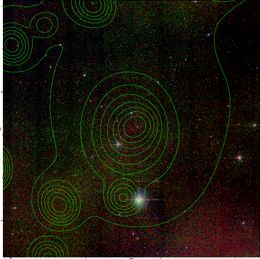  | 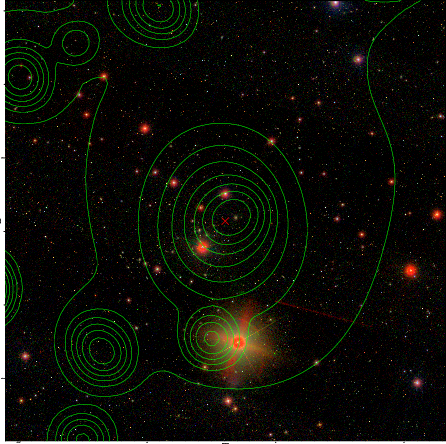  |

