

### 381

|Name|RAJ2000[deg]|DEJ2000[deg] |Ext[arcmin]| Ext,ml | z | z_src| C|GC(XSZ,Delta_z<0.01)| GC(OPT,Delta_z<0.01)|GC| R_sig[arcmin] | R500[arcmin] | R500[Mpc]| CRsig[c/s] | CR500[c/s] |L500[1E44 erg/s]|F500[1E-12 erg/s/cm^2]| M500[1E14 Msun]|Tx[keV]|Cnt_sig|Beta|Rc[arcmin]|Comment|Alias|
|---|---|---|---|---|---|------|---|--------|---------|----------|---|---|---|---|---|---|---|---|---|---|---|---|---|---|
|381| 164.267| 75.512| 5.35| 34.10| 0.1202(0.006)| z1, z_opt| S| -| A, W| A, N, W| 16.800| 7.086| 0.921| 0.171(0.046)| 0.156(0.042)| 1.080(0.261)| 2.871(0.693)| 2.50(0.30)| 3.91(0.30)| 59.9| 0.691(-0.124+0.178)| 7.500(-2.120+2.518)| -| t274|

|[RASS image](../image/381/381_img.pdf)|[filtered image](../image/381/381_fil.pdf)|[Segment image](../image/381/381_seg.pdf)|
|-------------------|--------------------|-------------------|
| 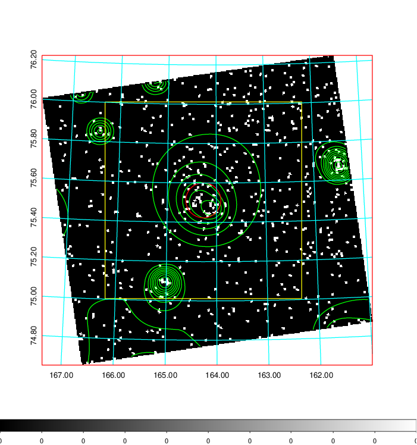  | 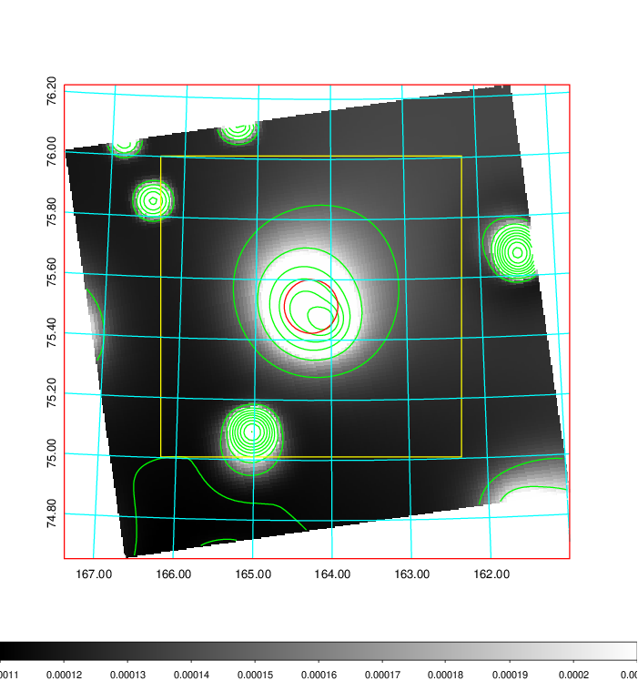   | 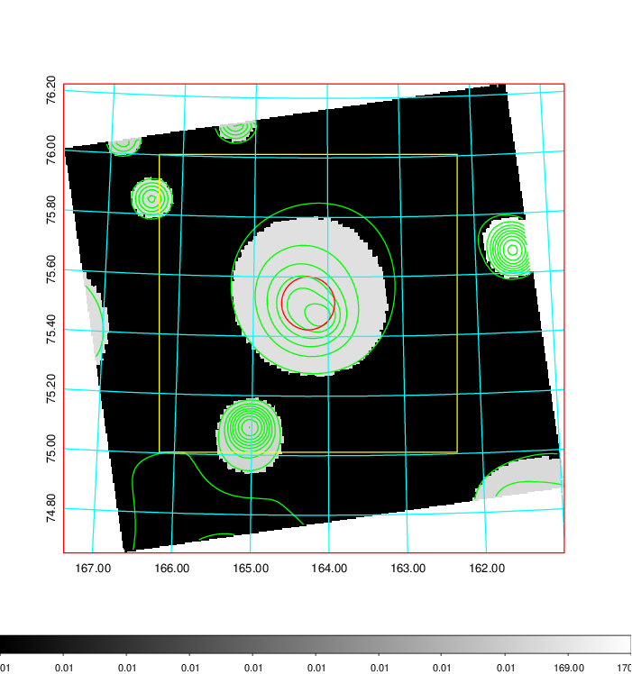  |

|[Exposure image](../image/381/381_mex.pdf)| [nH image](../image/381/381_nh.pdf)| [Planck image](../image/381/381_p.pdf)|
|-------------------|--------------------|-------------------|
|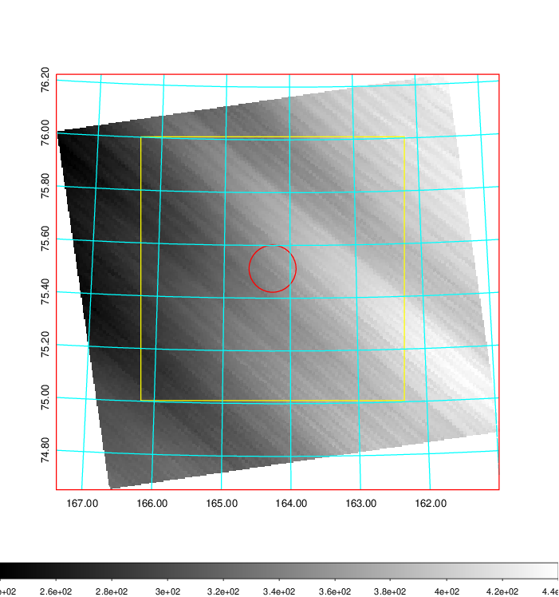   | 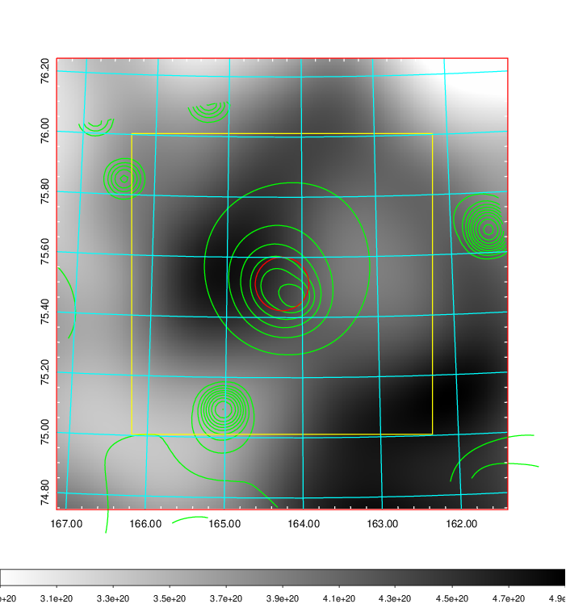    | 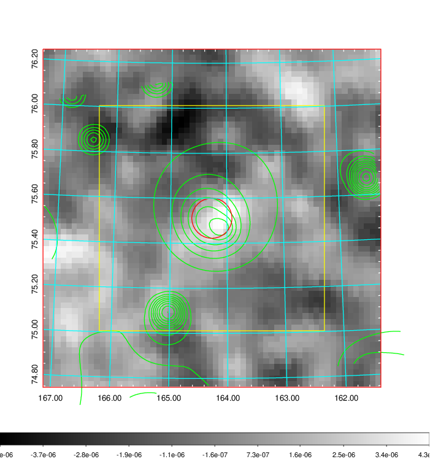 |

|[Redshift Histogram](../image/381/381_zg.pdf) | [DSS image(z1)](../image/381/381_dss_z1.pdf)      |  [DSS image(z2)](../image/381/381_dss_z2.pdf)    |
|-------------------|--------------------|-------------------|
|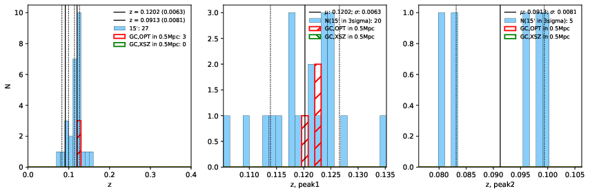 |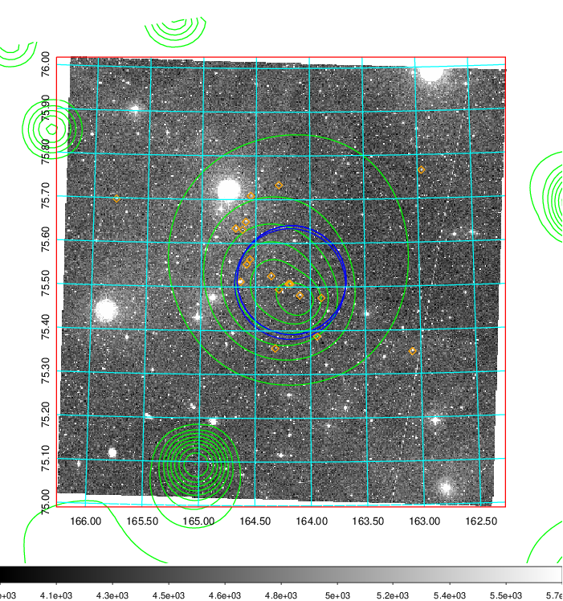  Blue circle for optical clusters;  Magenta circle for XSZ clusters;  all with r=1Mpc;  Only GC with Delta_z<0.01 are shown. | 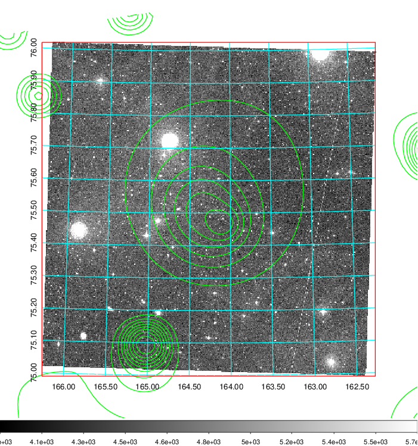 Blue circle for optical clusters;  Magenta circle for XSZ clusters;  all with r=1Mpc;  Only GC with Delta_z<0.01 are shown.  |

|[Previous-identified clusters](../image/381/381_gc.pdf) | [2MASS image](../image/381/381_2mass.pdf)      |
|-------------------|-------------------|
|  Green, magenta, and blue circles  for optical, X-ray and SZ clusters  respectively, with redshift of clusters  labelled. The radius of circles  are 1Mpc.|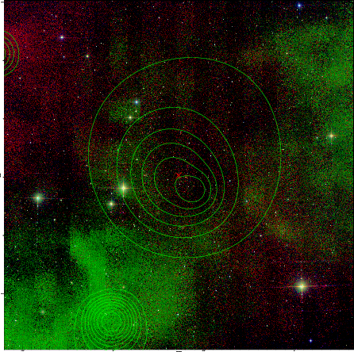  |

|[PS1 image](../image/381/381_ps1.pdf)            |
|-------------------|
| 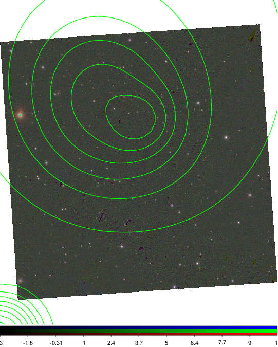  |
