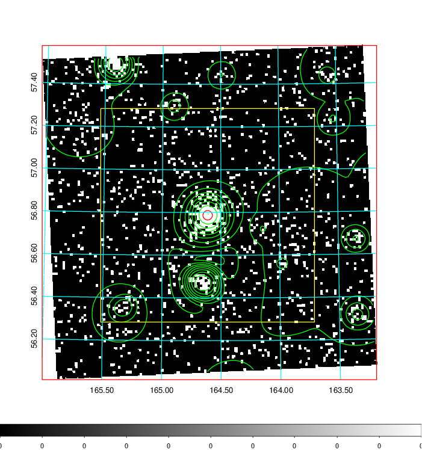
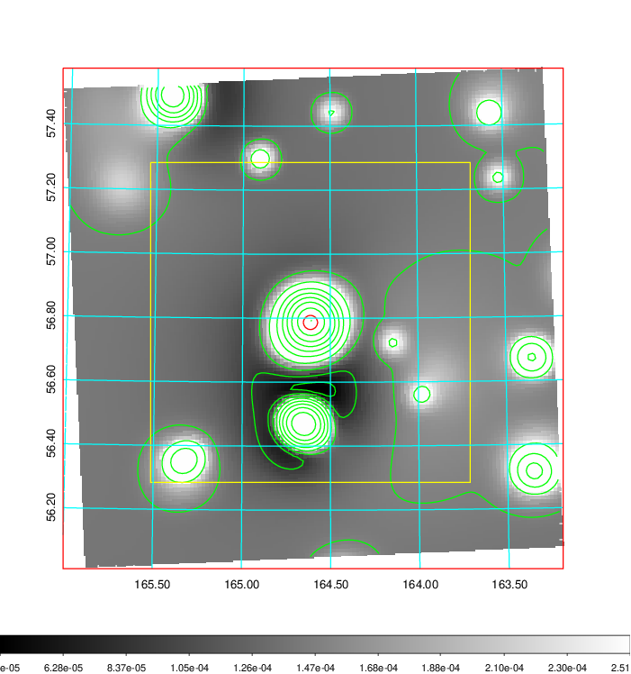
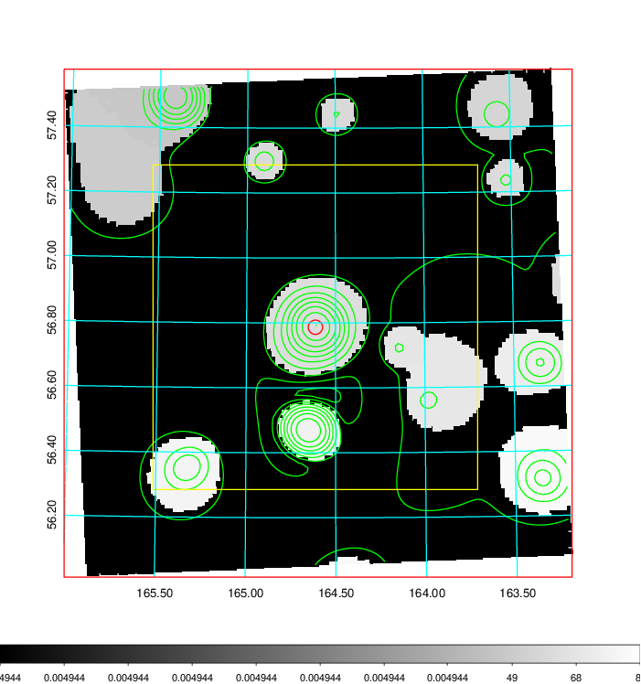
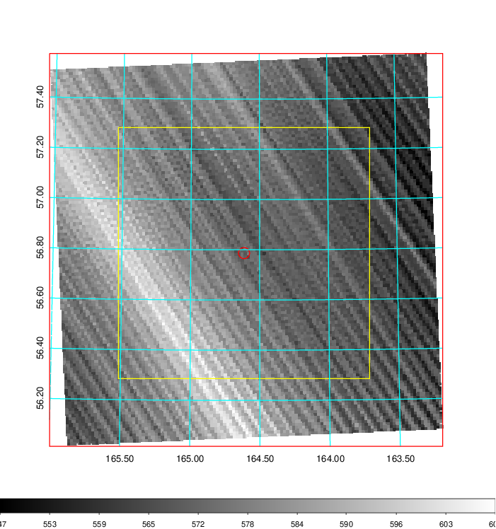
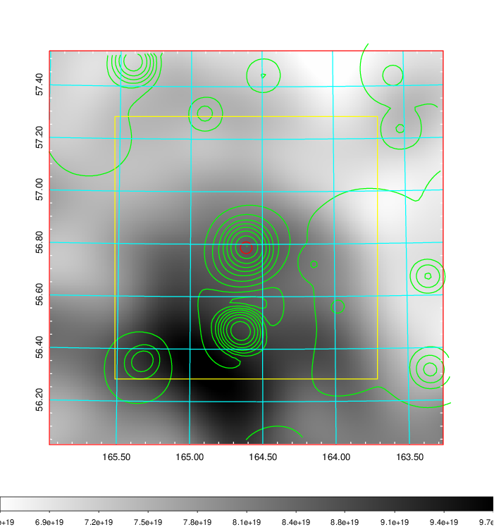
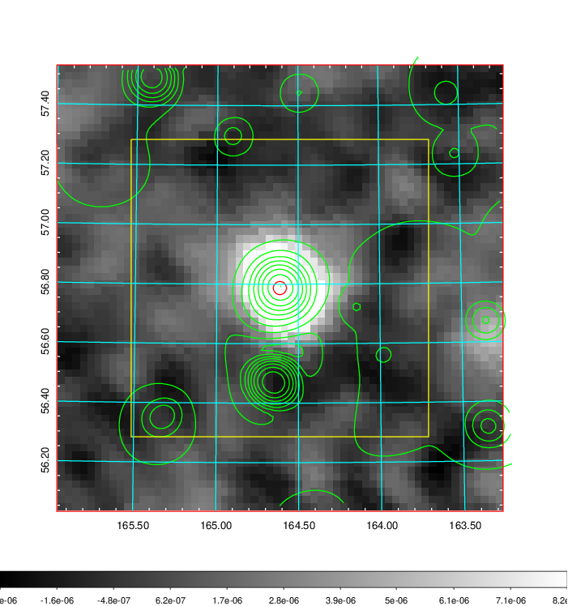
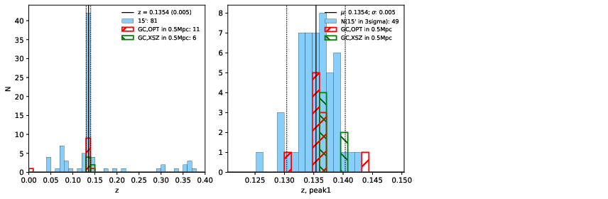
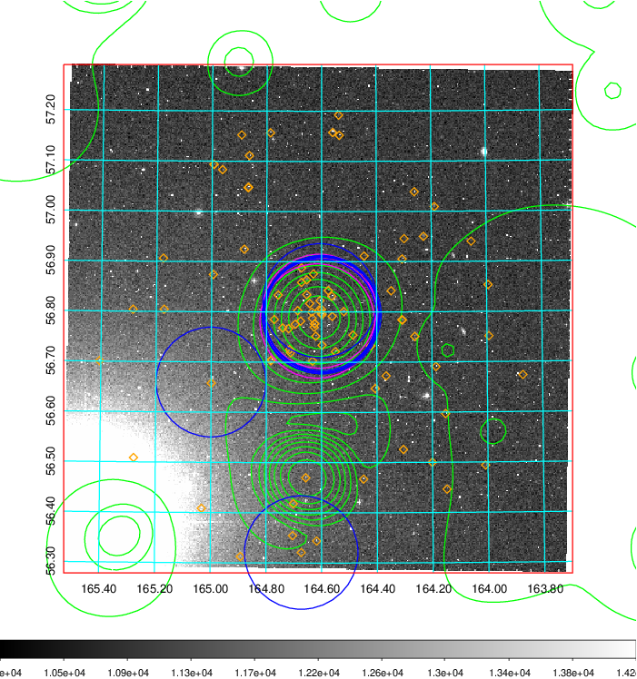
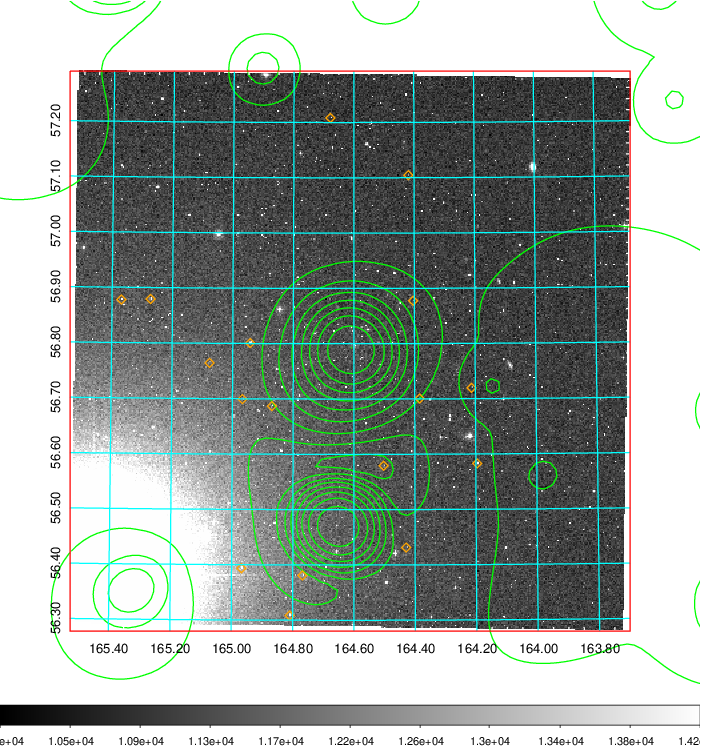
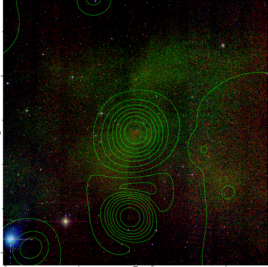

### 382

|Name|RAJ2000[deg]|DEJ2000[deg] |Ext[arcmin]| Ext,ml | z | z_src| C|GC(XSZ,Delta_z<0.01)| GC(OPT,Delta_z<0.01)|GC| R_sig[arcmin] | R500[arcmin] | R500[Mpc]| CRsig[c/s] | CR500[c/s] |L500[1E44 erg/s]|F500[1E-12 erg/s/cm^2]| M500[1E14 Msun]|Tx[keV]|Cnt_sig|Beta|Rc[arcmin]|Comment|Alias|
|---|---|---|---|---|---|------|---|--------|---------|----------|---|---|---|---|---|---|---|---|---|---|---|---|---|---|
|382| 164.613| 56.787| 1.33| 115.59| 0.1354(0.005)| z1, z_xsz| B| F20, MCXC, PSZ2, SPI, Tar, XB| A, C, N, RM, W| A, C, F20, MCXC, N, PSZ2, SPI, Tar, W, XB| 24.700| 8.385| 1.207| 0.547(0.054)| 0.493(0.049)| 5.004(0.275)| 10.279(0.565)| 5.70(0.15)| 6.54(0.11)| 373.6| 0.530(-0.020+0.020)| 1.006(-0.319+0.253)| -| k081|

|[RASS image](../image/382/382_img.pdf)|[filtered image](../image/382/382_fil.pdf)|[Segment image](../image/382/382_seg.pdf)|
|-------------------|--------------------|-------------------|
|   |    |   |

|[Exposure image](../image/382/382_mex.pdf)| [nH image](../image/382/382_nh.pdf)| [Planck image](../image/382/382_p.pdf)|
|-------------------|--------------------|-------------------|
|   |     |  |

|[Redshift Histogram](../image/382/382_zg.pdf) | [DSS image(z1)](../image/382/382_dss_z1.pdf)      |  [DSS image(z2)](../image/382/382_dss_z2.pdf)    |
|-------------------|--------------------|-------------------|
| |  Blue circle for optical clusters;  Magenta circle for XSZ clusters;  all with r=1Mpc;  Only GC with Delta_z<0.01 are shown. |  Blue circle for optical clusters;  Magenta circle for XSZ clusters;  all with r=1Mpc;  Only GC with Delta_z<0.01 are shown.  |

|[known Abell/XSZ clusters](../image/382/382_gc.pdf) | [2MASS image](../image/382/382_2mass.pdf)      |[SDSS image](../image/382/382_sdss.pdf)   |
|-------------------|-------------------|-------------------|
|  Magenta, blue and green circles  for optical, X-ray and SZ clusters  respectively, with redshift of clusters  labelled. The radius of circles  are 1Mpc.|  |   |

