

### 383

|Name|RAJ2000[deg]|DEJ2000[deg] |Ext[arcmin]| Ext,ml | z | z_src| C|GC(XSZ,Delta_z<0.01)| GC(OPT,Delta_z<0.01)|GC| R_sig[arcmin] | R500[arcmin] | R500[Mpc]| CRsig[c/s] | CR500[c/s] |L500[1E44 erg/s]|F500[1E-12 erg/s/cm^2]| M500[1E14 Msun]|Tx[keV]|Cnt_sig|Beta|Rc[arcmin]|Comment|Alias|
|---|---|---|---|---|---|------|---|--------|---------|----------|---|---|---|---|---|---|---|---|---|---|---|---|---|---|
|383| 164.622| 1.603| 4.22| 37.51| 0.0394(0.005)| z1, z_xsz| B| L03, MCXC| A, N, W| A, C, F20, L03, MCXC, N, SWXCS, W| 15.625| 13.714| 0.642| 0.248(0.039)| 0.243(0.038)| 0.151(0.017)| 4.176(0.470)| 0.78(0.05)| 1.86(0.07)| 83.0| 0.850(-0.149+0.106)| 7.736(-1.566+1.092)| -| k492|

|[RASS image](../image/383/383_img.pdf)|[filtered image](../image/383/383_fil.pdf)|[Segment image](../image/383/383_seg.pdf)|
|-------------------|--------------------|-------------------|
| 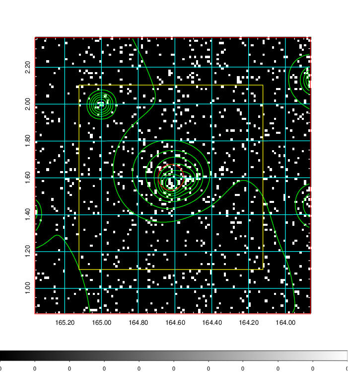  | 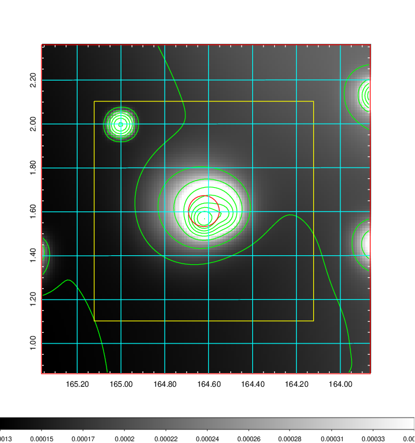   | 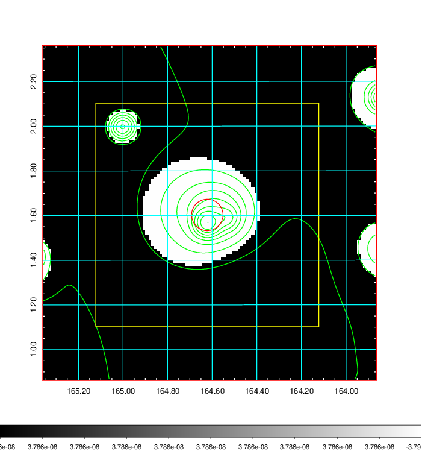  |

|[Exposure image](../image/383/383_mex.pdf)| [nH image](../image/383/383_nh.pdf)| [Planck image](../image/383/383_p.pdf)|
|-------------------|--------------------|-------------------|
|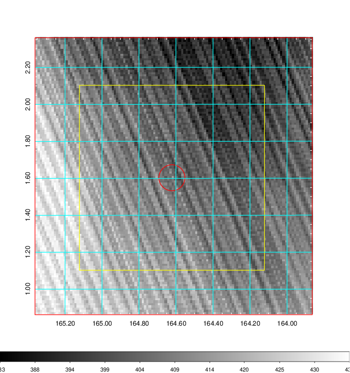   | 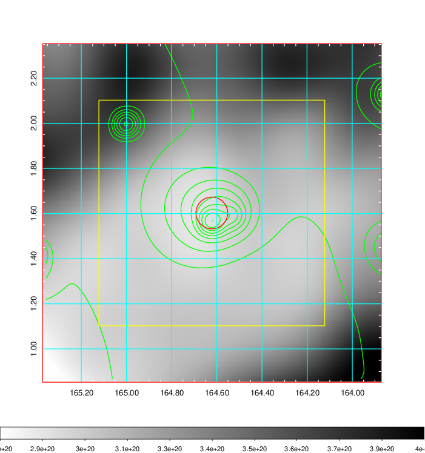    | 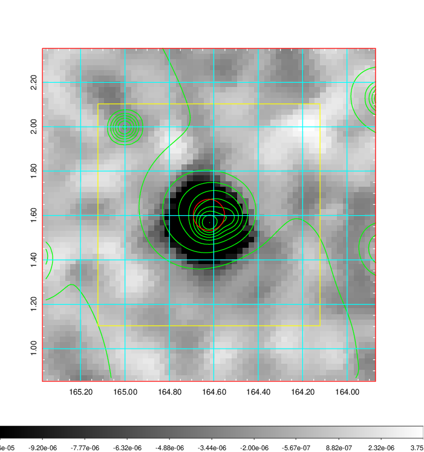 |

|[Redshift Histogram](../image/383/383_zg.pdf) | [DSS image(z1)](../image/383/383_dss_z1.pdf)      |  [DSS image(z2)](../image/383/383_dss_z2.pdf)    |
|-------------------|--------------------|-------------------|
|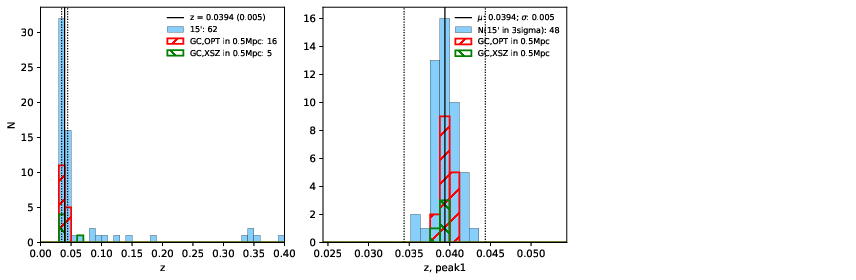 |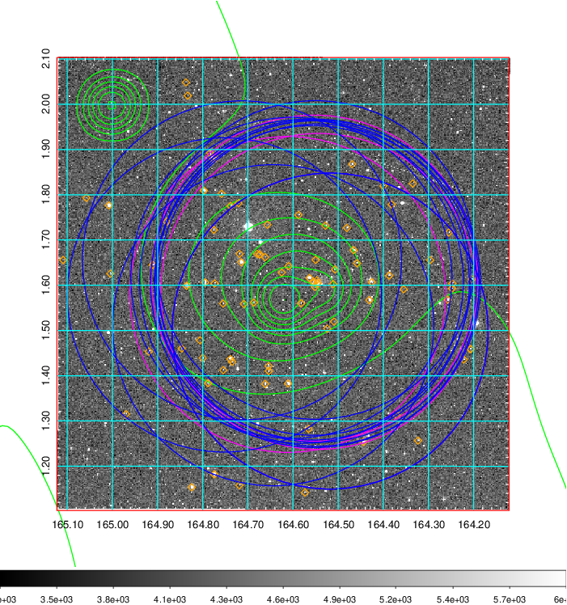  Blue circle for optical clusters;  Magenta circle for XSZ clusters;  all with r=1Mpc;  Only GC with Delta_z<0.01 are shown. | 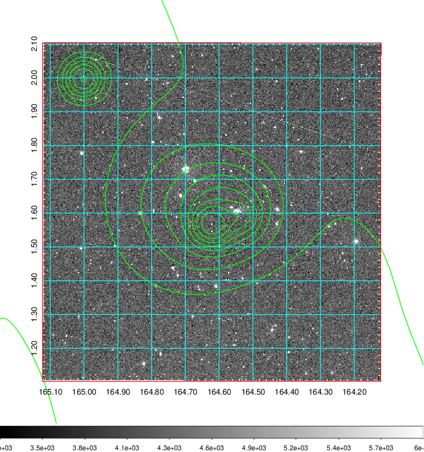 Blue circle for optical clusters;  Magenta circle for XSZ clusters;  all with r=1Mpc;  Only GC with Delta_z<0.01 are shown.  |

|[Previous-identified clusters](../image/383/383_gc.pdf) | [2MASS image](../image/383/383_2mass.pdf)      |[SDSS image](../image/383/383_sdss.pdf)   |
|-------------------|-------------------|-------------------|
|  Green, magenta, and blue circles  for optical, X-ray and SZ clusters  respectively, with redshift of clusters  labelled. The radius of circles  are 1Mpc.|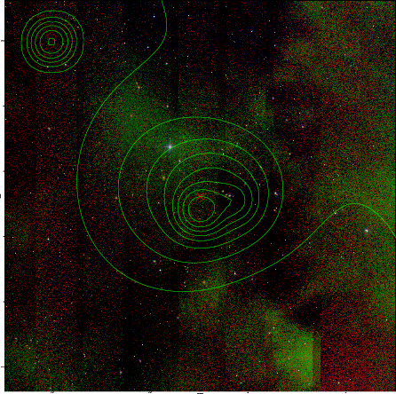  | 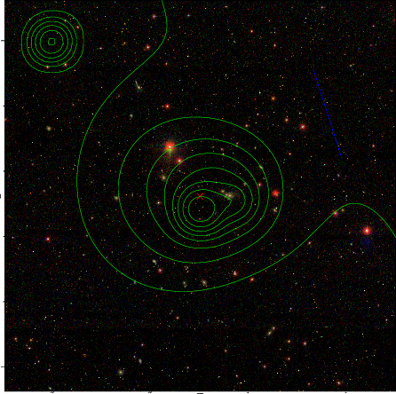  |

