

### 384

|Name|RAJ2000[deg]|DEJ2000[deg] |Ext[arcmin]| Ext,ml | z | z_src| C|GC(XSZ,Delta_z<0.01)| GC(OPT,Delta_z<0.01)|GC| R_sig[arcmin] | R500[arcmin] | R500[Mpc]| CRsig[c/s] | CR500[c/s] |L500[1E44 erg/s]|F500[1E-12 erg/s/cm^2]| M500[1E14 Msun]|Tx[keV]|Cnt_sig|Beta|Rc[arcmin]|Comment|Alias|
|---|---|---|---|---|---|------|---|--------|---------|----------|---|---|---|---|---|---|---|---|---|---|---|---|---|---|
|384| 165.300| 6.053| 24.70| 53.66| 0.2480(0.000)| -| G| -| -| N, W| 24.700| 4.865| 1.135| 0.142(0.066)| 0.125(0.058)| 4.646(2.602)| 2.490(1.395)| 5.34(1.40)| 6.53(1.10)| 150.6| 0.539(-0.029+0.065)| 3.866(-0.737+1.095)| $z$ of BCG| t610|

|[RASS image](../image/384/384_img.pdf)|[filtered image](../image/384/384_fil.pdf)|[Segment image](../image/384/384_seg.pdf)|
|-------------------|--------------------|-------------------|
| 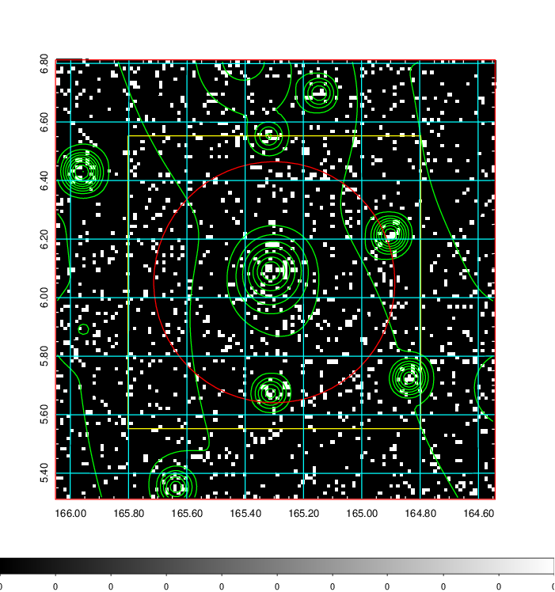  | 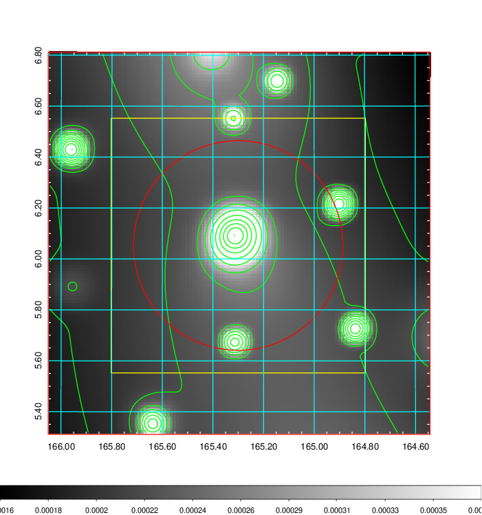   | 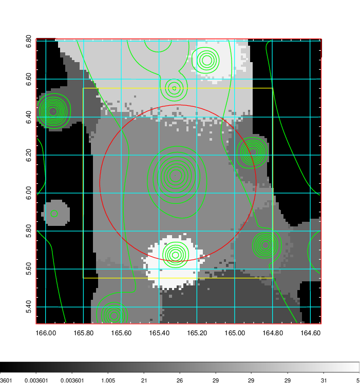  |

|[Exposure image](../image/384/384_mex.pdf)| [nH image](../image/384/384_nh.pdf)| [Planck image](../image/384/384_p.pdf)|
|-------------------|--------------------|-------------------|
|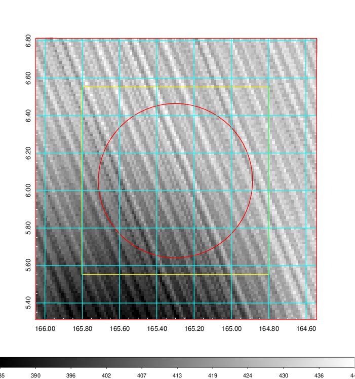   | 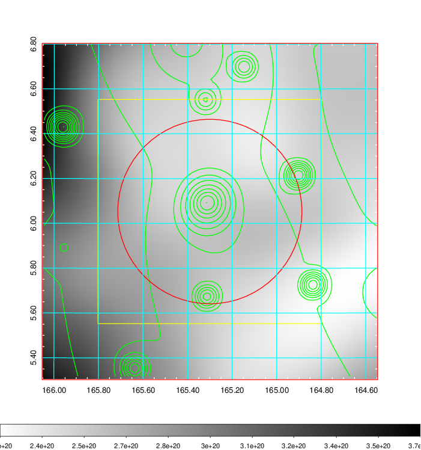    | 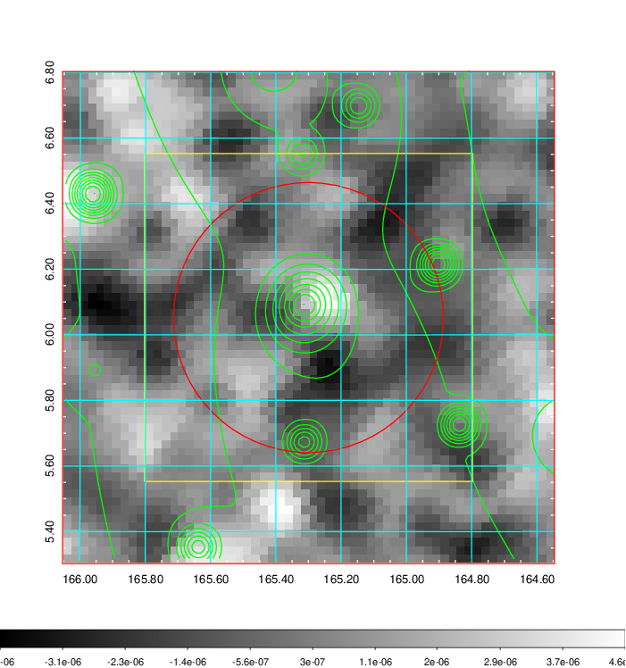 |

|[Redshift Histogram](../image/384/384_zg.pdf) | [DSS image(z1)](../image/384/384_dss_z1.pdf)      |  [DSS image(z2)](../image/384/384_dss_z2.pdf)    |
|-------------------|--------------------|-------------------|
|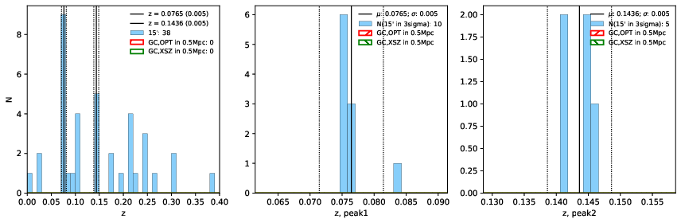 |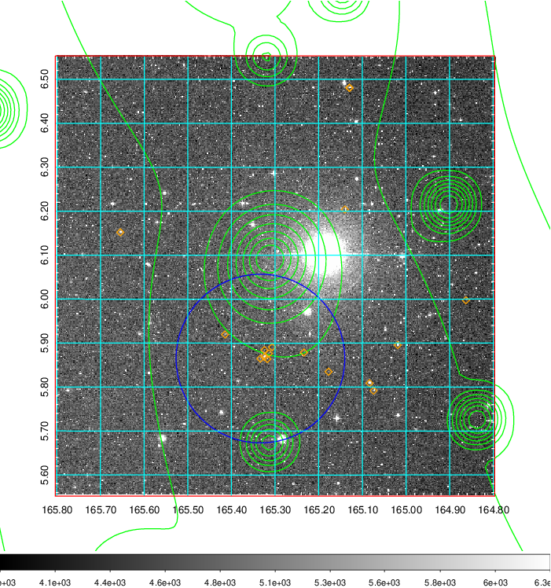  Blue circle for optical clusters;  Magenta circle for XSZ clusters;  all with r=1Mpc;  Only GC with Delta_z<0.01 are shown. | 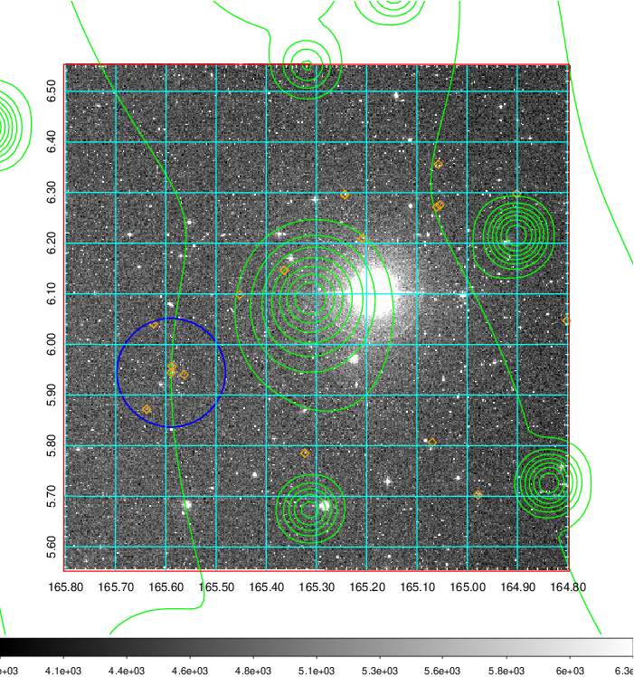 Blue circle for optical clusters;  Magenta circle for XSZ clusters;  all with r=1Mpc;  Only GC with Delta_z<0.01 are shown.  |

|[known Abell/XSZ clusters](../image/384/384_gc.pdf) | [2MASS image](../image/384/384_2mass.pdf)      |[SDSS image](../image/384/384_sdss.pdf)   |
|-------------------|-------------------|-------------------|
|  Magenta, blue and green circles  for optical, X-ray and SZ clusters  respectively, with redshift of clusters  labelled. The radius of circles  are 1Mpc.|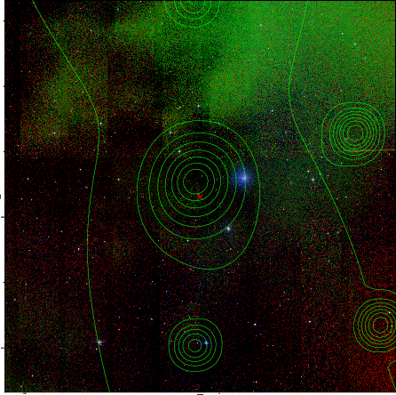  | 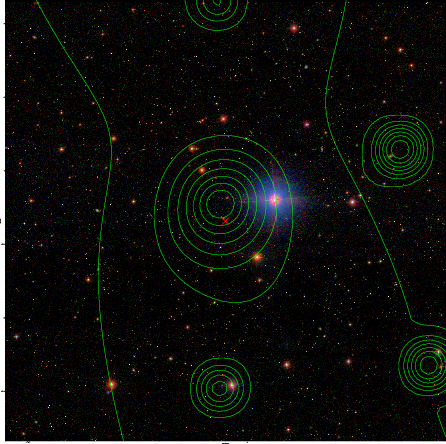  |

