

### 385

|Name|RAJ2000[deg]|DEJ2000[deg] |Ext[arcmin]| Ext,ml | z | z_src| C|GC(XSZ,Delta_z<0.01)| GC(OPT,Delta_z<0.01)|GC| R_sig[arcmin] | R500[arcmin] | R500[Mpc]| CRsig[c/s] | CR500[c/s] |L500[1E44 erg/s]|F500[1E-12 erg/s/cm^2]| M500[1E14 Msun]|Tx[keV]|Cnt_sig|Beta|Rc[arcmin]|Comment|Alias|
|---|---|---|---|---|---|------|---|--------|---------|----------|---|---|---|---|---|---|---|---|---|---|---|---|---|---|
|385| 165.680| 8.574| 19.23| 25.00| 0.0497(0.005)| z2, z_opt| S| -| N| C, N, W| 14.162| 10.284| 0.600| 0.116(0.035)| 0.111(0.033)| 0.111(0.049)| 1.903(0.832)| 0.64(0.14)| 1.66(0.23)| 52.9| 0.545(-0.034+0.090)| 4.769(-0.764+1.071)| -| t578|

|[RASS image](../image/385/385_img.pdf)|[filtered image](../image/385/385_fil.pdf)|[Segment image](../image/385/385_seg.pdf)|
|-------------------|--------------------|-------------------|
| 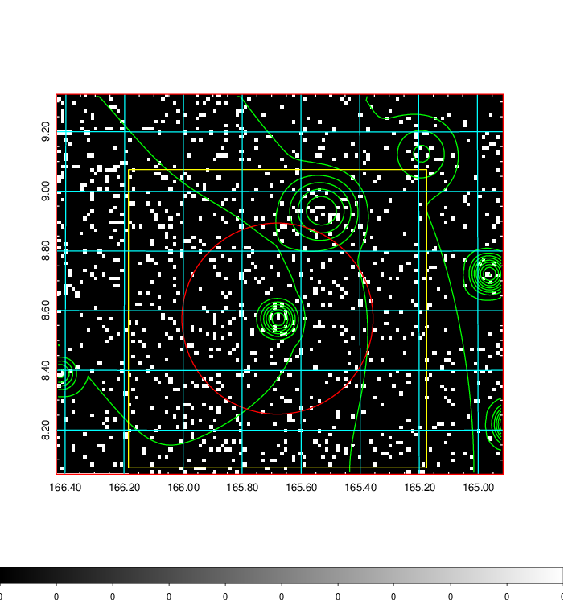  | 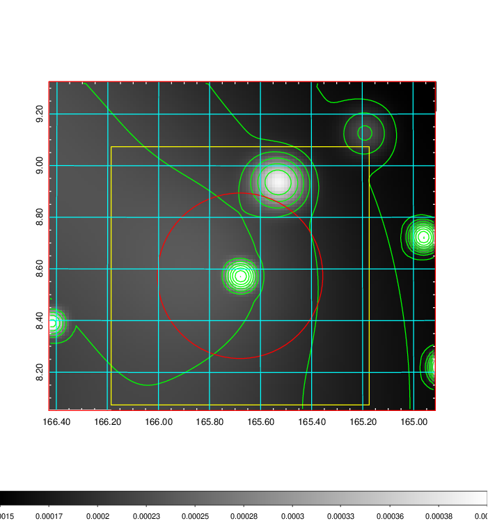   | 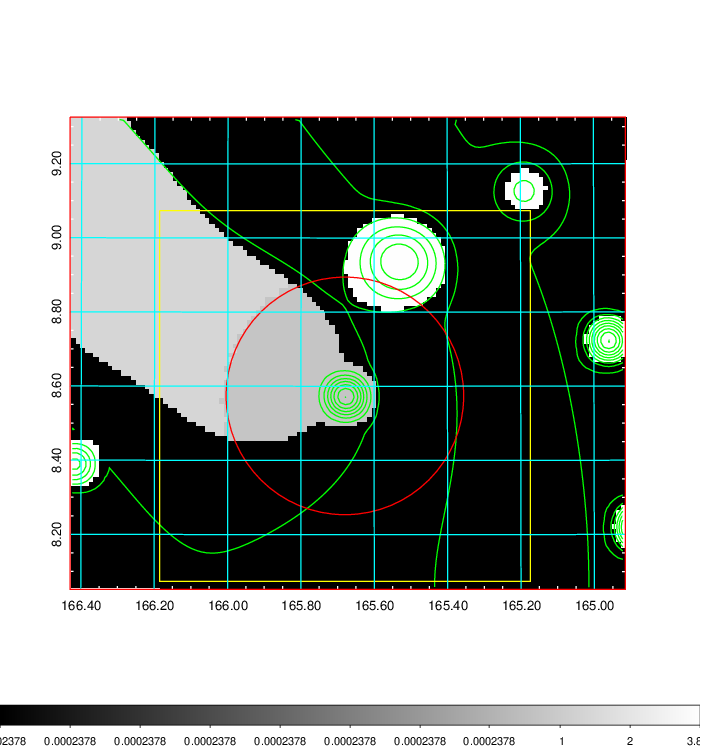  |

|[Exposure image](../image/385/385_mex.pdf)| [nH image](../image/385/385_nh.pdf)| [Planck image](../image/385/385_p.pdf)|
|-------------------|--------------------|-------------------|
|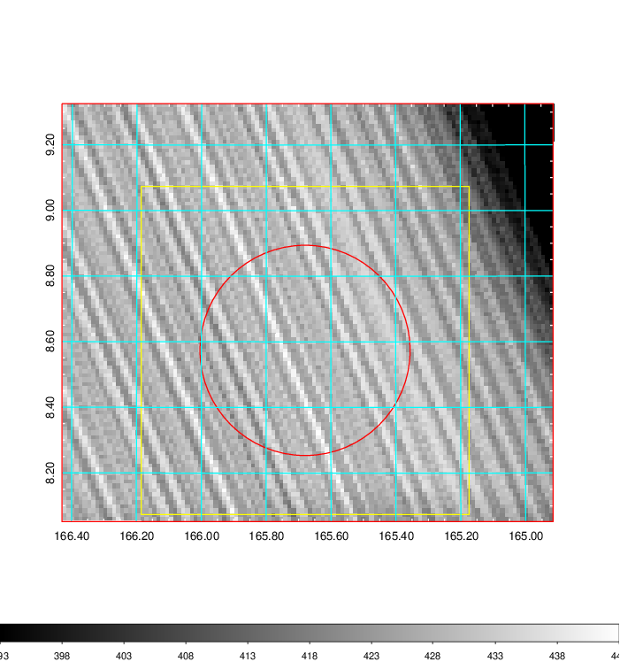   | 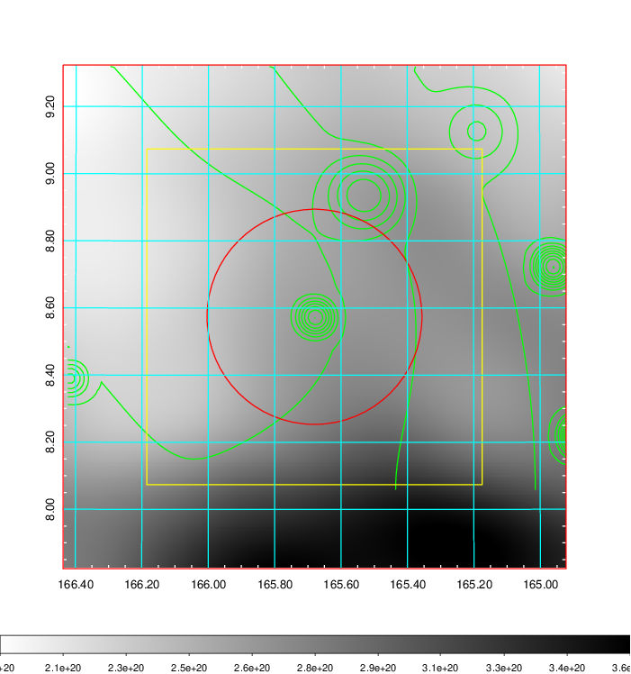    | 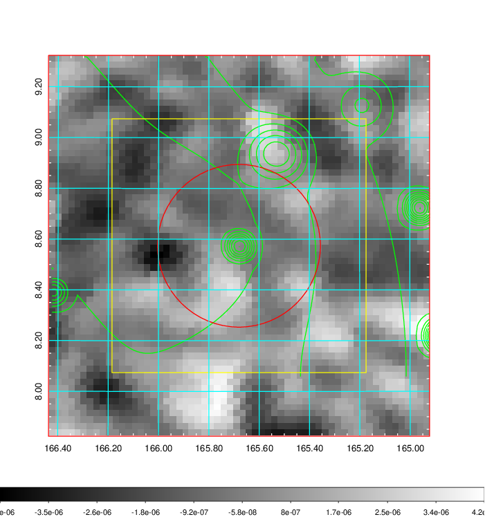 |

|[Redshift Histogram](../image/385/385_zg.pdf) | [DSS image(z1)](../image/385/385_dss_z1.pdf)      |  [DSS image(z2)](../image/385/385_dss_z2.pdf)    |
|-------------------|--------------------|-------------------|
|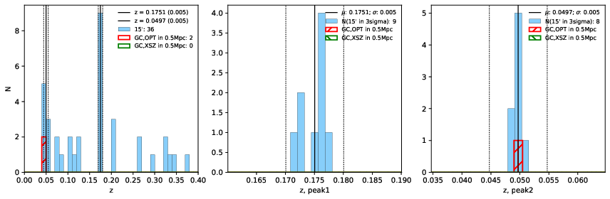 |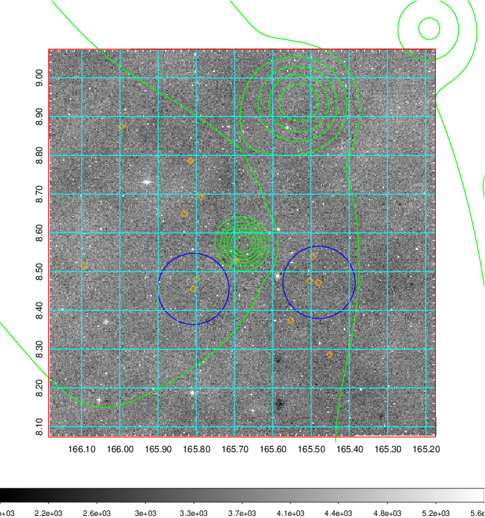  Blue circle for optical clusters;  Magenta circle for XSZ clusters;  all with r=1Mpc;  Only GC with Delta_z<0.01 are shown. | 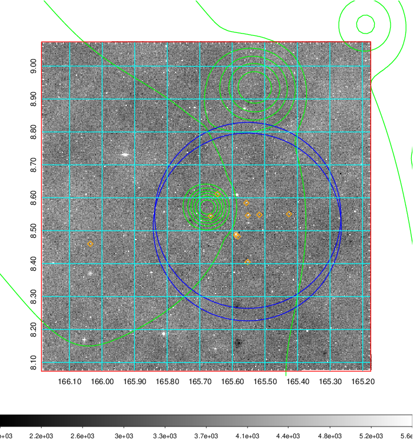 Blue circle for optical clusters;  Magenta circle for XSZ clusters;  all with r=1Mpc;  Only GC with Delta_z<0.01 are shown.  |

|[Previous-identified clusters](../image/385/385_gc.pdf) | [2MASS image](../image/385/385_2mass.pdf)      |[SDSS image](../image/385/385_sdss.pdf)   |
|-------------------|-------------------|-------------------|
|  Green, magenta, and blue circles  for optical, X-ray and SZ clusters  respectively, with redshift of clusters  labelled. The radius of circles  are 1Mpc.|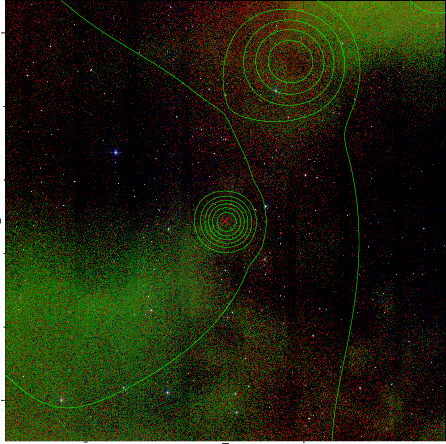  | 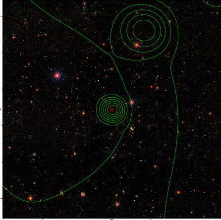  |

