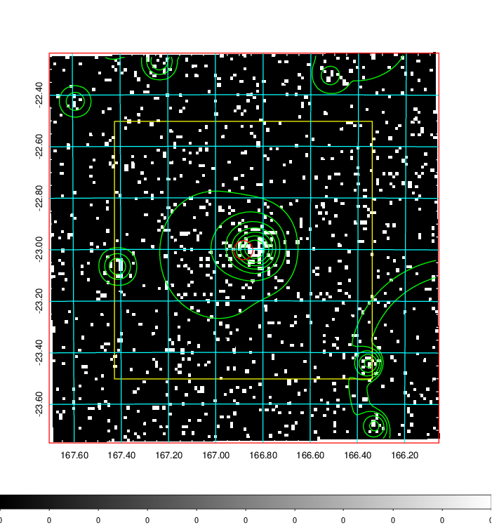
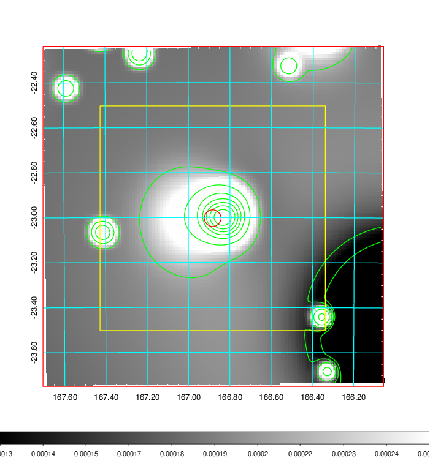
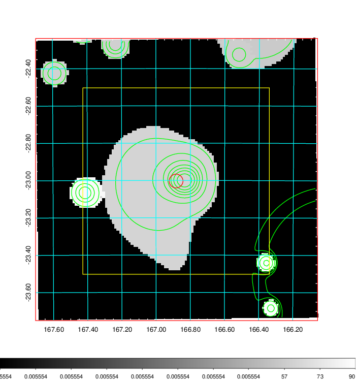
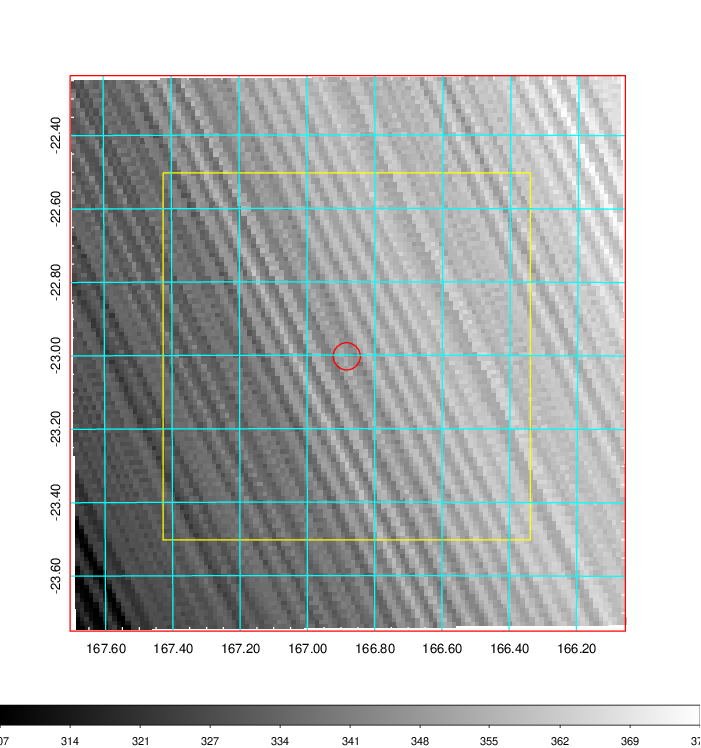
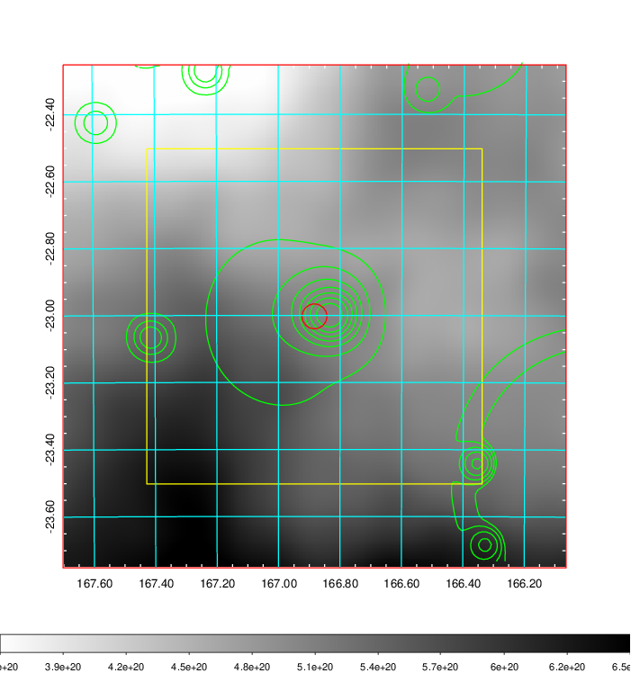
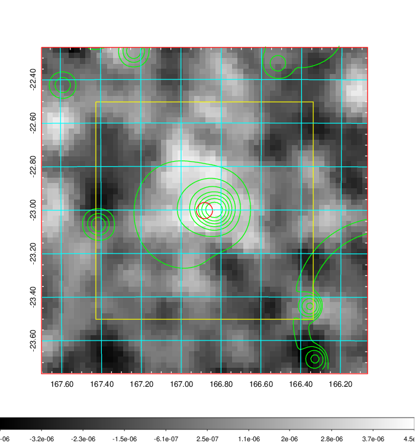
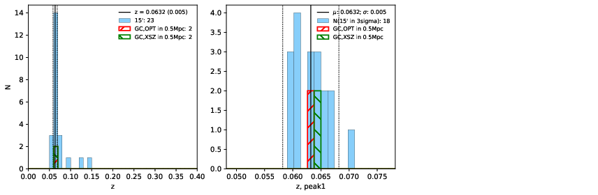
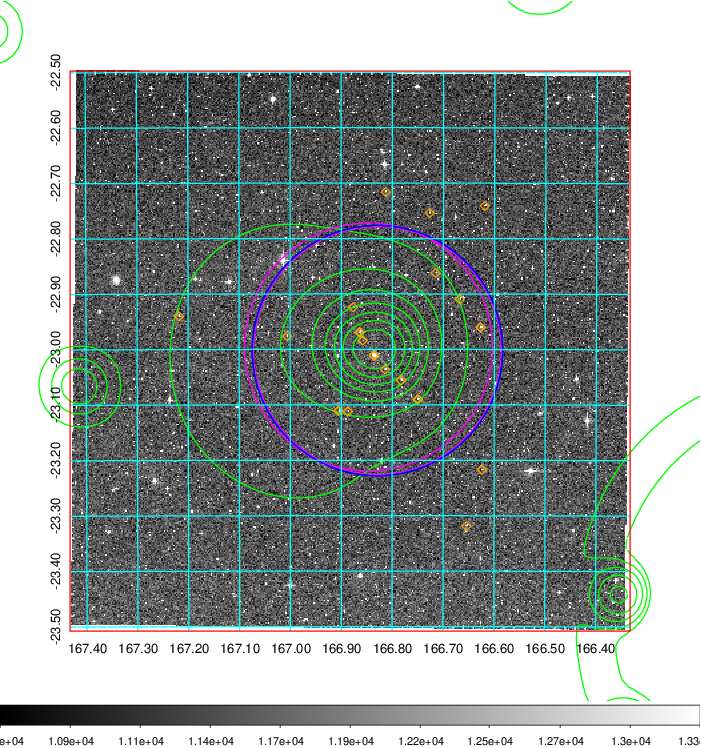
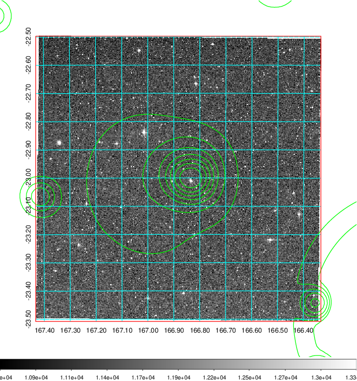
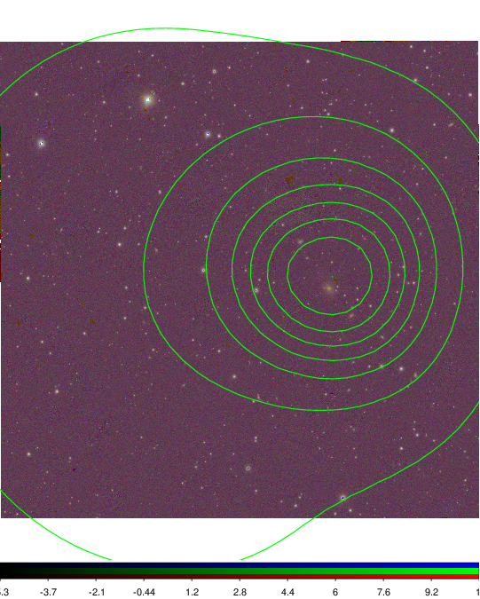

### 386

|Name|RAJ2000[deg]|DEJ2000[deg] |Ext[arcmin]| Ext,ml | z | z_src| C|GC(XSZ,Delta_z<0.01)| GC(OPT,Delta_z<0.01)|GC| R_sig[arcmin] | R500[arcmin] | R500[Mpc]| CRsig[c/s] | CR500[c/s] |L500[1E44 erg/s]|F500[1E-12 erg/s/cm^2]| M500[1E14 Msun]|Tx[keV]|Cnt_sig|Beta|Rc[arcmin]|Comment|Alias|
|---|---|---|---|---|---|------|---|--------|---------|----------|---|---|---|---|---|---|---|---|---|---|---|---|---|---|
|386| 166.883| -23.003| 2.23| 38.34| 0.0632(0.005)| z1, z_xsz| B| MCXC, Tar| A| A, MCXC, Tar| 11.725| 10.402| 0.759| 0.209(0.041)| 0.205(0.040)| 0.344(0.039)| 3.579(0.410)| 1.32(0.08)| 2.59(0.10)| 82.1| 0.733(-0.140+0.165)| 4.645(-1.372+1.401)| -| k256|

|[RASS image](../image/386/386_img.pdf)|[filtered image](../image/386/386_fil.pdf)|[Segment image](../image/386/386_seg.pdf)|
|-------------------|--------------------|-------------------|
|   |    |   |

|[Exposure image](../image/386/386_mex.pdf)| [nH image](../image/386/386_nh.pdf)| [Planck image](../image/386/386_p.pdf)|
|-------------------|--------------------|-------------------|
|   |     |  |

|[Redshift Histogram](../image/386/386_zg.pdf) | [DSS image(z1)](../image/386/386_dss_z1.pdf)      |  [DSS image(z2)](../image/386/386_dss_z2.pdf)    |
|-------------------|--------------------|-------------------|
| |  Blue circle for optical clusters;  Magenta circle for XSZ clusters;  all with r=1Mpc;  Only GC with Delta_z<0.01 are shown. |  Blue circle for optical clusters;  Magenta circle for XSZ clusters;  all with r=1Mpc;  Only GC with Delta_z<0.01 are shown.  |

|[Previous-identified clusters](../image/386/386_gc.pdf) | [2MASS image](../image/386/386_2mass.pdf)      |
|-------------------|-------------------|
|  Green, magenta, and blue circles  for optical, X-ray and SZ clusters  respectively, with redshift of clusters  labelled. The radius of circles  are 1Mpc.|  |

|[PS1 image](../image/386/386_ps1.pdf)            |
|-------------------|
|   |
