

### 388

|Name|RAJ2000[deg]|DEJ2000[deg] |Ext[arcmin]| Ext,ml | z | z_src| C|GC(XSZ,Delta_z<0.01)| GC(OPT,Delta_z<0.01)|GC| R_sig[arcmin] | R500[arcmin] | R500[Mpc]| CRsig[c/s] | CR500[c/s] |L500[1E44 erg/s]|F500[1E-12 erg/s/cm^2]| M500[1E14 Msun]|Tx[keV]|Cnt_sig|Beta|Rc[arcmin]|Comment|Alias|
|---|---|---|---|---|---|------|---|--------|---------|----------|---|---|---|---|---|---|---|---|---|---|---|---|---|---|
|388| 167.394| 21.734| 2.93| 32.76| 0.0321(0.005)| z1, z_xsz| B| MCXC| A, N| A, C, F20, MCXC, N, W| 38.125| 15.694| 0.604| 0.309(0.101)| 0.282(0.092)| 0.123(0.034)| 5.193(1.439)| 0.65(0.09)| 1.65(0.15)| 118.4| 0.632(-0.049+0.069)| 4.301(-0.764+0.941)| -| k366|

|[RASS image](../image/388/388_img.pdf)|[filtered image](../image/388/388_fil.pdf)|[Segment image](../image/388/388_seg.pdf)|
|-------------------|--------------------|-------------------|
| 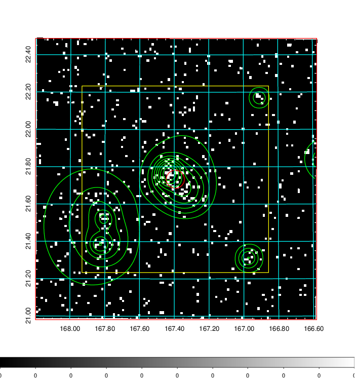  | 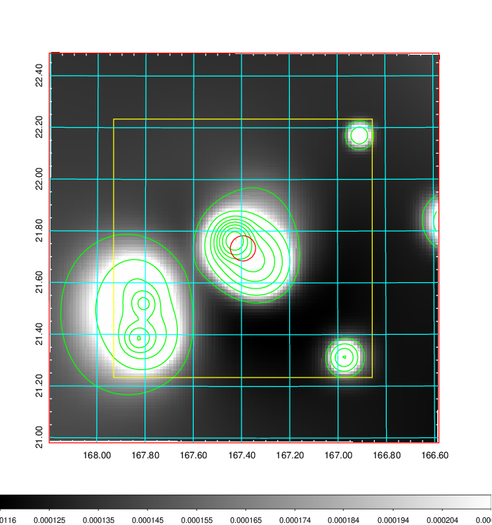   | 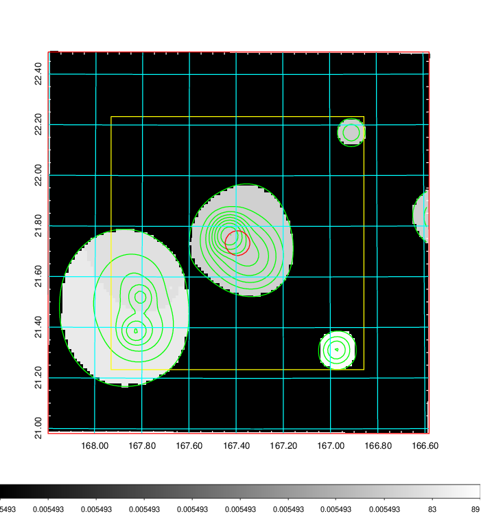  |

|[Exposure image](../image/388/388_mex.pdf)| [nH image](../image/388/388_nh.pdf)| [Planck image](../image/388/388_p.pdf)|
|-------------------|--------------------|-------------------|
|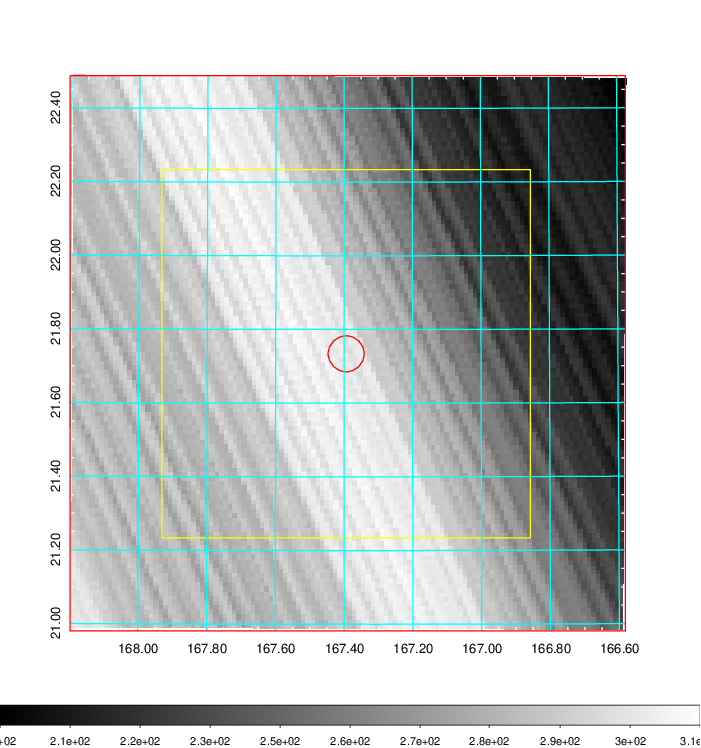   | 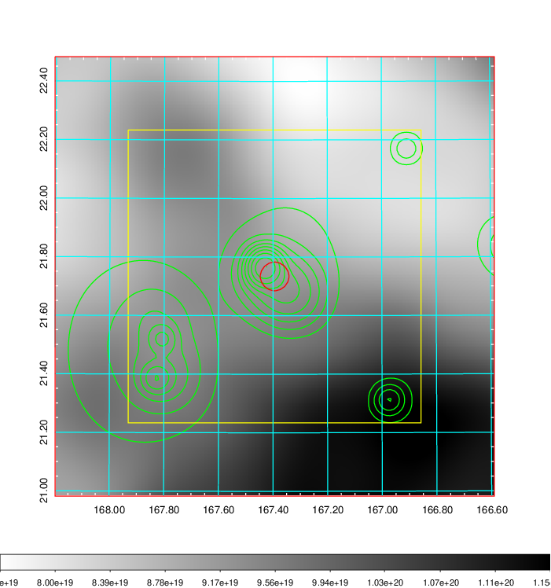    | 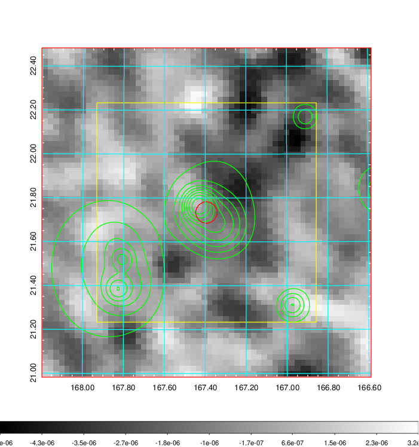 |

|[Redshift Histogram](../image/388/388_zg.pdf) | [DSS image(z1)](../image/388/388_dss_z1.pdf)      |  [DSS image(z2)](../image/388/388_dss_z2.pdf)    |
|-------------------|--------------------|-------------------|
|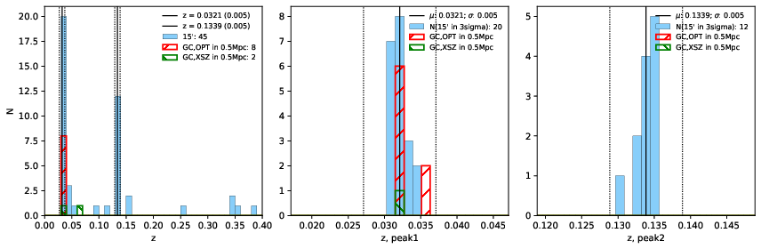 |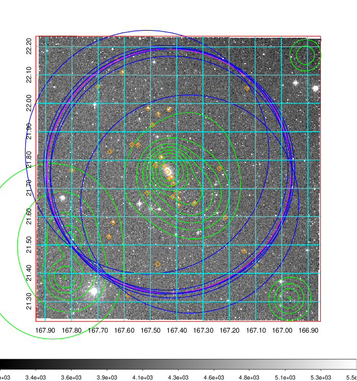  Blue circle for optical clusters;  Magenta circle for XSZ clusters;  all with r=1Mpc;  Only GC with Delta_z<0.01 are shown. | 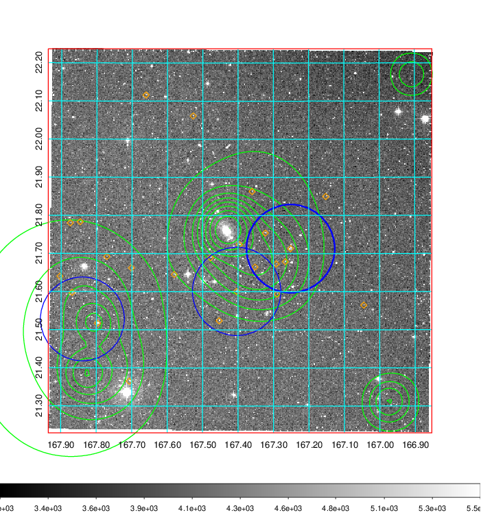 Blue circle for optical clusters;  Magenta circle for XSZ clusters;  all with r=1Mpc;  Only GC with Delta_z<0.01 are shown.  |

|[Previous-identified clusters](../image/388/388_gc.pdf) | [2MASS image](../image/388/388_2mass.pdf)      |[SDSS image](../image/388/388_sdss.pdf)   |
|-------------------|-------------------|-------------------|
|  Green, magenta, and blue circles  for optical, X-ray and SZ clusters  respectively, with redshift of clusters  labelled. The radius of circles  are 1Mpc.|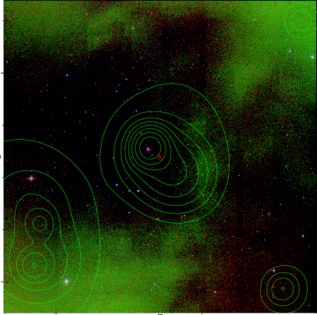  | 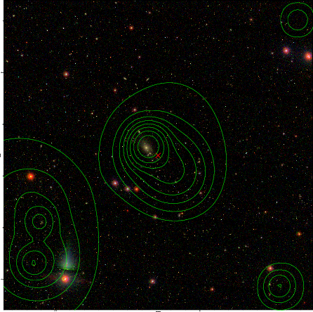  |

