

### 39

|Name|RAJ2000[deg]|DEJ2000[deg] |Ext[arcmin]| Ext,ml | z | z_src| C|GC(XSZ,Delta_z<0.01)| GC(OPT,Delta_z<0.01)|GC| R_sig[arcmin] | R500[arcmin] | R500[Mpc]| CRsig[c/s] | CR500[c/s] |L500[1E44 erg/s]|F500[1E-12 erg/s/cm^2]| M500[1E14 Msun]|Tx[keV]|Cnt_sig|Beta|Rc[arcmin]|Comment|Alias|
|---|---|---|---|---|---|------|---|--------|---------|----------|---|---|---|---|---|---|---|---|---|---|---|---|---|---|
|39| 12.835| -28.517| 1.62| 27.18| 0.1117(0.005)| z1, z_xsz| B| MCXC, PSZ2, Tar| N, W| A, MCXC, N, PSZ2, Tar, W| 4.900| 6.891| 0.840| 0.114(0.036)| 0.123(0.038)| 0.765(0.137)| 2.380(0.427)| 1.88(0.17)| 3.27(0.19)| 39.2| 0.884(-0.132+0.083)| 2.818(-0.653+0.558)| -| k143|

|[RASS image](../image/39/39_img.pdf)|[filtered image](../image/39/39_fil.pdf)|[Segment image](../image/39/39_seg.pdf)|
|-------------------|--------------------|-------------------|
| 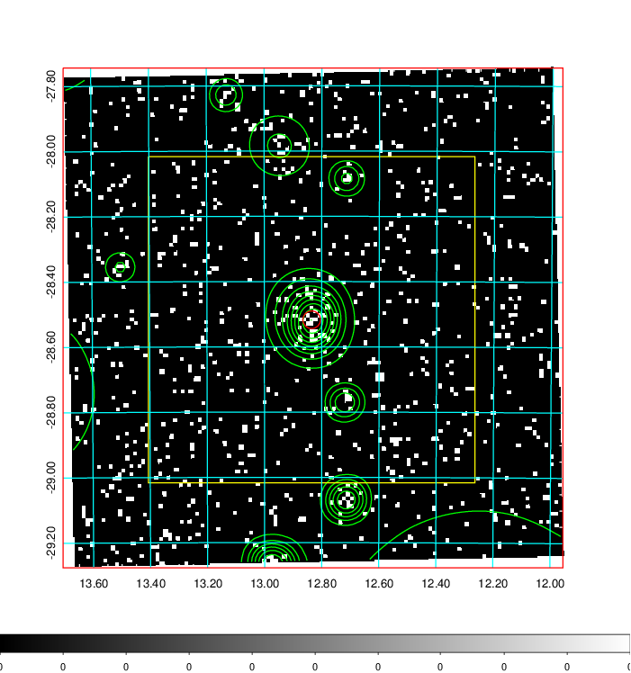  | 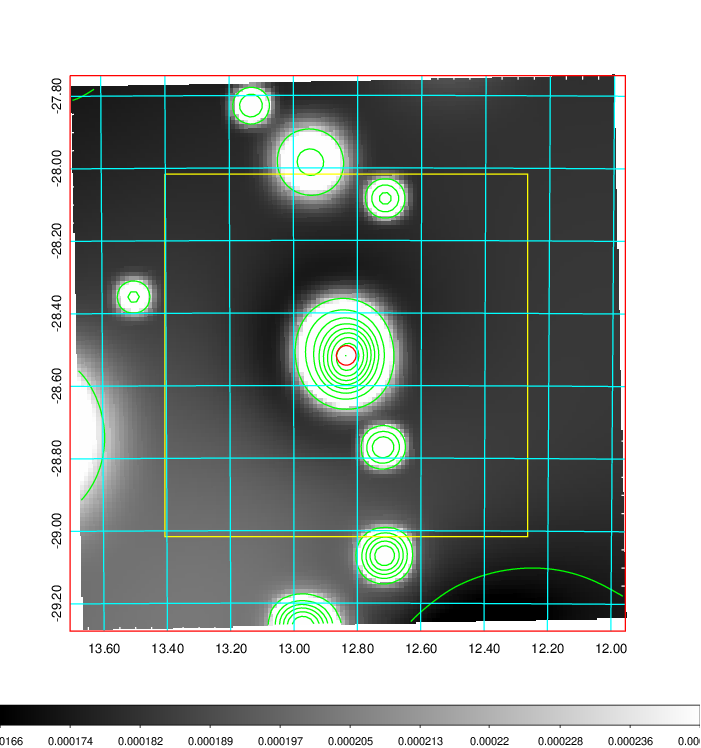   | 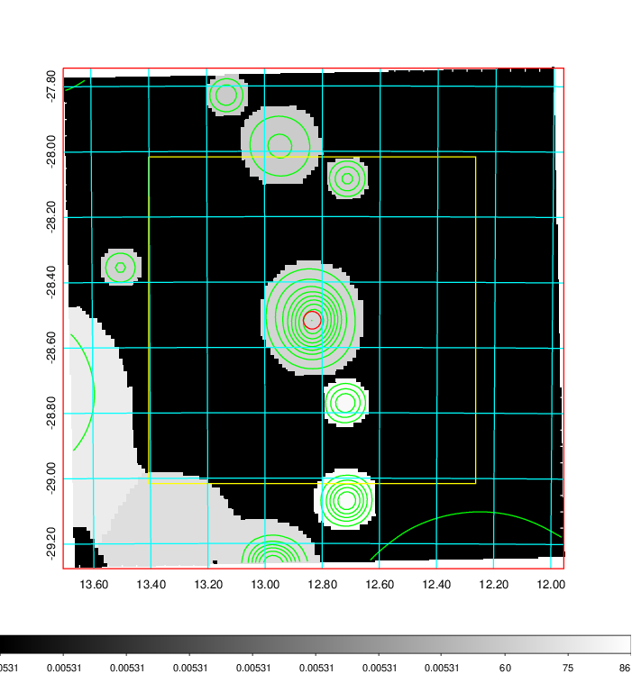  |

|[Exposure image](../image/39/39_mex.pdf)| [nH image](../image/39/39_nh.pdf)| [Planck image](../image/39/39_p.pdf)|
|-------------------|--------------------|-------------------|
|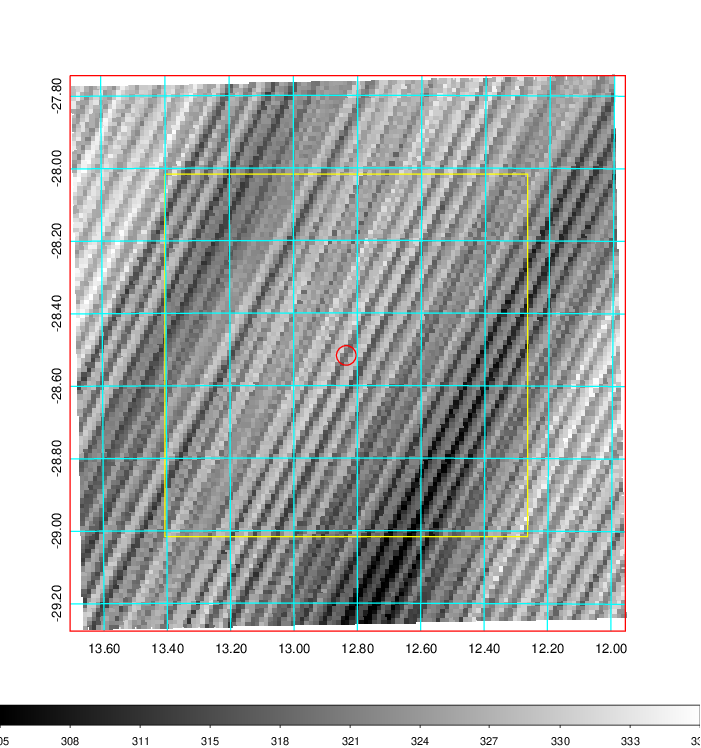   | 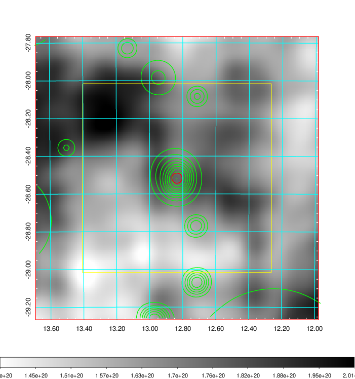    | 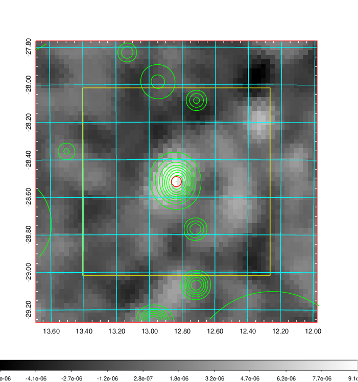 |

|[Redshift Histogram](../image/39/39_zg.pdf) | [DSS image(z1)](../image/39/39_dss_z1.pdf)      |  [DSS image(z2)](../image/39/39_dss_z2.pdf)    |
|-------------------|--------------------|-------------------|
|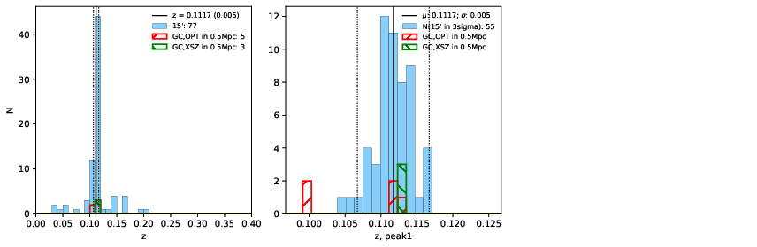 |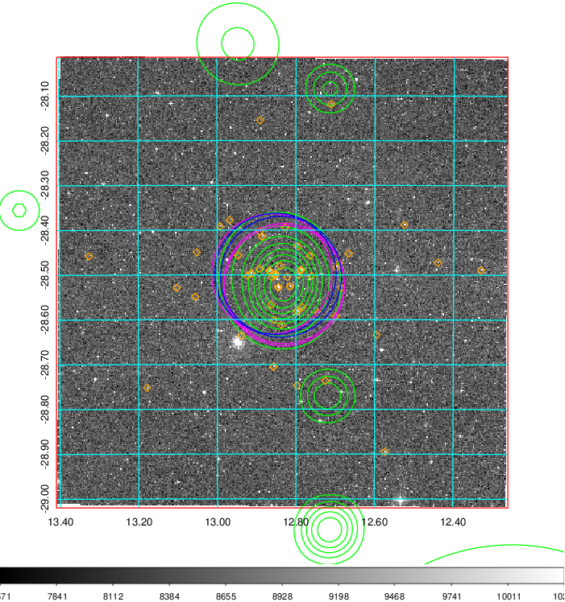  Blue circle for optical clusters;  Magenta circle for XSZ clusters;  all with r=1Mpc;  Only GC with Delta_z<0.01 are shown. | 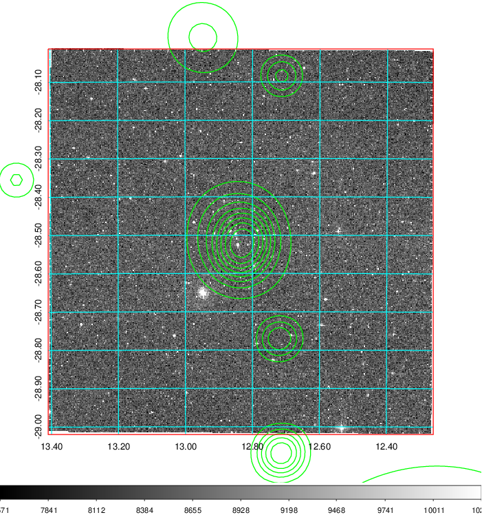 Blue circle for optical clusters;  Magenta circle for XSZ clusters;  all with r=1Mpc;  Only GC with Delta_z<0.01 are shown.  |

|[Previous-identified clusters](../image/39/39_gc.pdf) | [2MASS image](../image/39/39_2mass.pdf)      |
|-------------------|-------------------|
|  Green, magenta, and blue circles  for optical, X-ray and SZ clusters  respectively, with redshift of clusters  labelled. The radius of circles  are 1Mpc.|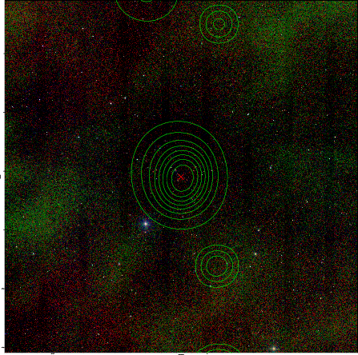  |

|[DES image](../image/39/39_des.pdf)   |[ATLAS image](../image/39/39_s.pdf)        |
|-------------------|-------------------|
| 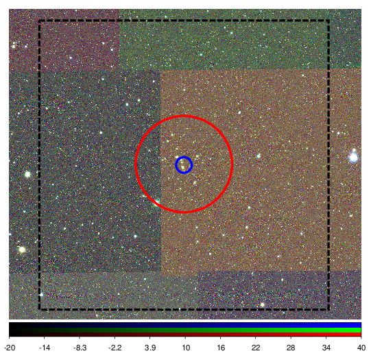  | 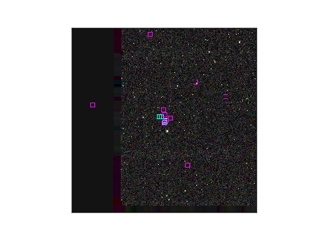  |
