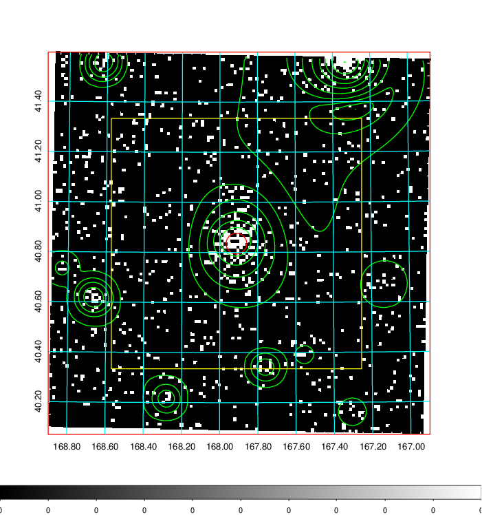
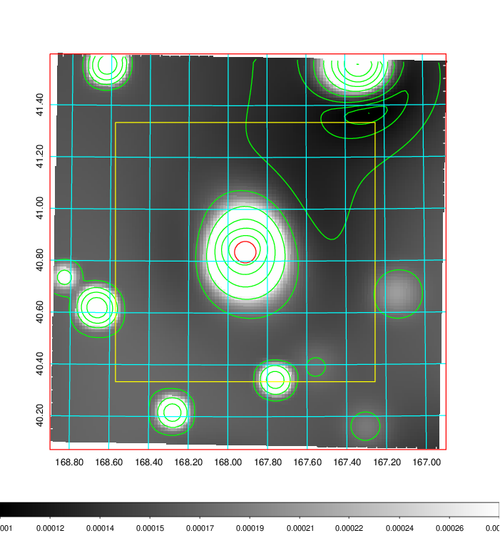
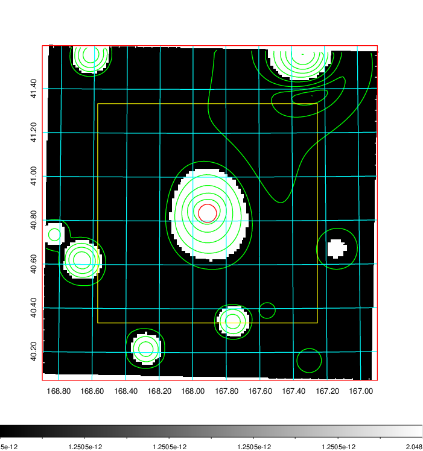
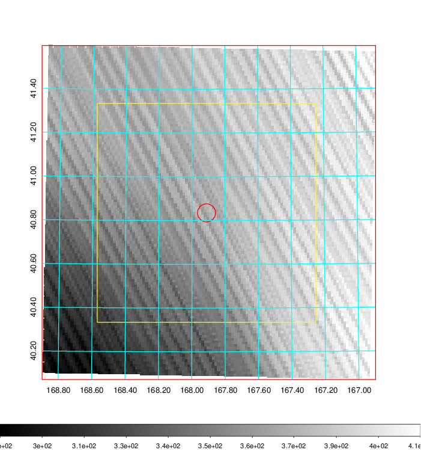
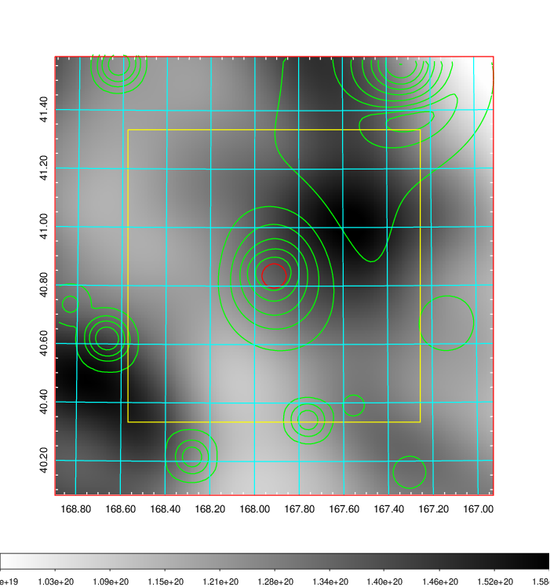
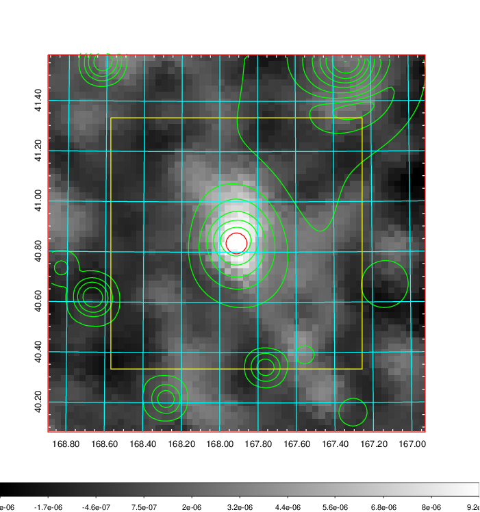
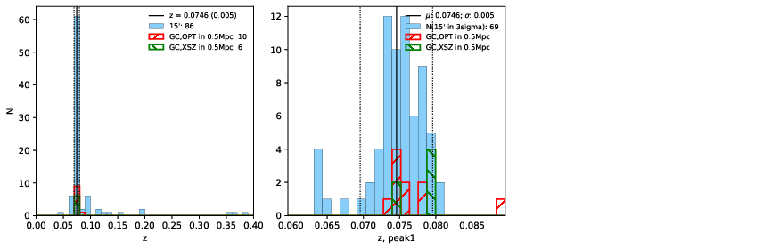
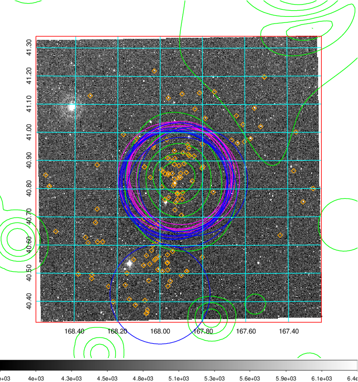
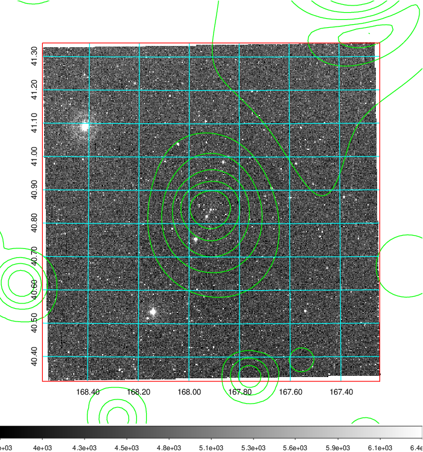
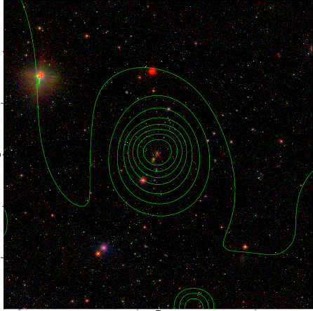

### 390

|Name|RAJ2000[deg]|DEJ2000[deg] |Ext[arcmin]| Ext,ml | z | z_src| C|GC(XSZ,Delta_z<0.01)| GC(OPT,Delta_z<0.01)|GC| R_sig[arcmin] | R500[arcmin] | R500[Mpc]| CRsig[c/s] | CR500[c/s] |L500[1E44 erg/s]|F500[1E-12 erg/s/cm^2]| M500[1E14 Msun]|Tx[keV]|Cnt_sig|Beta|Rc[arcmin]|Comment|Alias|
|---|---|---|---|---|---|------|---|--------|---------|----------|---|---|---|---|---|---|---|---|---|---|---|---|---|---|
|390| 167.912| 40.835| 2.49| 116.92| 0.0746(0.005)| z1, z_xsz| B| L03, MCXC, PSZ2, Tar, XB| A, N, RM, W| A, C, F20, L03, MCXC, N, PSZ2, SPI, Tar, W, XB| 11.238| 10.668| 0.907| 0.382(0.043)| 0.379(0.043)| 1.029(0.066)| 7.552(0.484)| 2.28(0.07)| 3.64(0.07)| 135.7| 0.930(-0.085+0.051)| 5.503(-0.577+0.414)| -| k294|

|[RASS image](../image/390/390_img.pdf)|[filtered image](../image/390/390_fil.pdf)|[Segment image](../image/390/390_seg.pdf)|
|-------------------|--------------------|-------------------|
|   |    |   |

|[Exposure image](../image/390/390_mex.pdf)| [nH image](../image/390/390_nh.pdf)| [Planck image](../image/390/390_p.pdf)|
|-------------------|--------------------|-------------------|
|   |     |  |

|[Redshift Histogram](../image/390/390_zg.pdf) | [DSS image(z1)](../image/390/390_dss_z1.pdf)      |  [DSS image(z2)](../image/390/390_dss_z2.pdf)    |
|-------------------|--------------------|-------------------|
| |  Blue circle for optical clusters;  Magenta circle for XSZ clusters;  all with r=1Mpc;  Only GC with Delta_z<0.01 are shown. |  Blue circle for optical clusters;  Magenta circle for XSZ clusters;  all with r=1Mpc;  Only GC with Delta_z<0.01 are shown.  |

|[Previous-identified clusters](../image/390/390_gc.pdf) | [2MASS image](../image/390/390_2mass.pdf)      |[SDSS image](../image/390/390_sdss.pdf)   |
|-------------------|-------------------|-------------------|
|  Green, magenta, and blue circles  for optical, X-ray and SZ clusters  respectively, with redshift of clusters  labelled. The radius of circles  are 1Mpc.|  |   |

