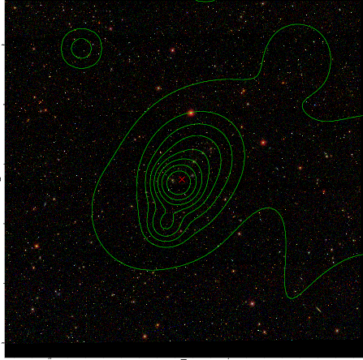

### 391

|Name|RAJ2000[deg]|DEJ2000[deg] |Ext[arcmin]| Ext,ml | z | z_src| C|GC(XSZ,Delta_z<0.01)| GC(OPT,Delta_z<0.01)|GC| R_sig[arcmin] | R500[arcmin] | R500[Mpc]| CRsig[c/s] | CR500[c/s] |L500[1E44 erg/s]|F500[1E-12 erg/s/cm^2]| M500[1E14 Msun]|Tx[keV]|Cnt_sig|Beta|Rc[arcmin]|Comment|Alias|
|---|---|---|---|---|---|------|---|--------|---------|----------|---|---|---|---|---|---|---|---|---|---|---|---|---|---|
|391| 168.125| -3.209| 2.81| 30.35| 0.0830(0.005)| z1, z_opt| S| -| A, N| A, C, F20, N, Tar, W| 10.262| 8.083| 0.757| 0.126(0.033)| 0.121(0.032)| 0.367(0.056)| 2.151(0.329)| 1.34(0.10)| 2.63(0.13)| 62.8| 0.859(-0.141+0.099)| 4.378(-0.951+0.727)| An SZ cluster with no $z$ and offset = 0.08 Mpc| t122|

|[RASS image](../image/391/391_img.pdf)|[filtered image](../image/391/391_fil.pdf)|[Segment image](../image/391/391_seg.pdf)|
|-------------------|--------------------|-------------------|
|   |    |   |

|[Exposure image](../image/391/391_mex.pdf)| [nH image](../image/391/391_nh.pdf)| [Planck image](../image/391/391_p.pdf)|
|-------------------|--------------------|-------------------|
|   |     |  |

|[Redshift Histogram](../image/391/391_zg.pdf) | [DSS image(z1)](../image/391/391_dss_z1.pdf)      |  [DSS image(z2)](../image/391/391_dss_z2.pdf)    |
|-------------------|--------------------|-------------------|
| |  Blue circle for optical clusters;  Magenta circle for XSZ clusters;  all with r=1Mpc;  Only GC with Delta_z<0.01 are shown. |  Blue circle for optical clusters;  Magenta circle for XSZ clusters;  all with r=1Mpc;  Only GC with Delta_z<0.01 are shown.  |

|[known Abell/XSZ clusters](../image/391/391_gc.pdf) | [2MASS image](../image/391/391_2mass.pdf)      |[SDSS image](../image/391/391_sdss.pdf)   |
|-------------------|-------------------|-------------------|
|  Magenta, blue and green circles  for optical, X-ray and SZ clusters  respectively, with redshift of clusters  labelled. The radius of circles  are 1Mpc.|  |   |

|[ATLAS image](../image/391/391_s.pdf)        |
|-------------------|
|   |
