

### 392

|Name|RAJ2000[deg]|DEJ2000[deg] |Ext[arcmin]| Ext,ml | z | z_src| C|GC(XSZ,Delta_z<0.01)| GC(OPT,Delta_z<0.01)|GC| R_sig[arcmin] | R500[arcmin] | R500[Mpc]| CRsig[c/s] | CR500[c/s] |L500[1E44 erg/s]|F500[1E-12 erg/s/cm^2]| M500[1E14 Msun]|Tx[keV]|Cnt_sig|Beta|Rc[arcmin]|Comment|Alias|
|---|---|---|---|---|---|------|---|--------|---------|----------|---|---|---|---|---|---|---|---|---|---|---|---|---|---|
|392| 168.338| 2.532| 3.35| 142.26| 0.0756(0.005)| z1, z_xsz| B| F20, MCXC, Tar| A, N, W| A, C, F20, MCXC, N, PSZ2, Tar, W| 10.750| 10.600| 0.912| 0.363(0.039)| 0.362(0.039)| 0.940(0.048)| 6.707(0.344)| 2.32(0.06)| 3.68(0.06)| 148.2| 0.914(-0.098+0.062)| 6.532(-0.812+0.561)| -| k411|

|[RASS image](../image/392/392_img.pdf)|[filtered image](../image/392/392_fil.pdf)|[Segment image](../image/392/392_seg.pdf)|
|-------------------|--------------------|-------------------|
| 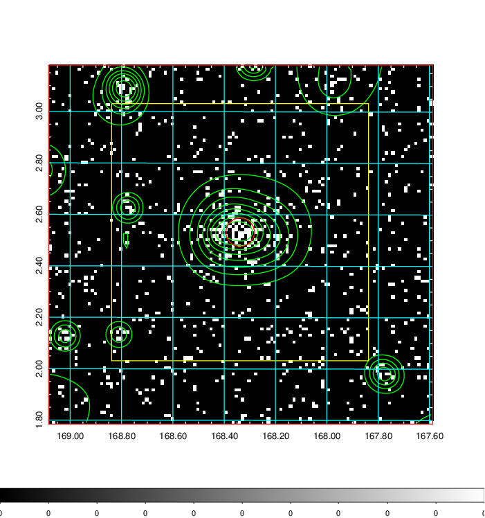  | 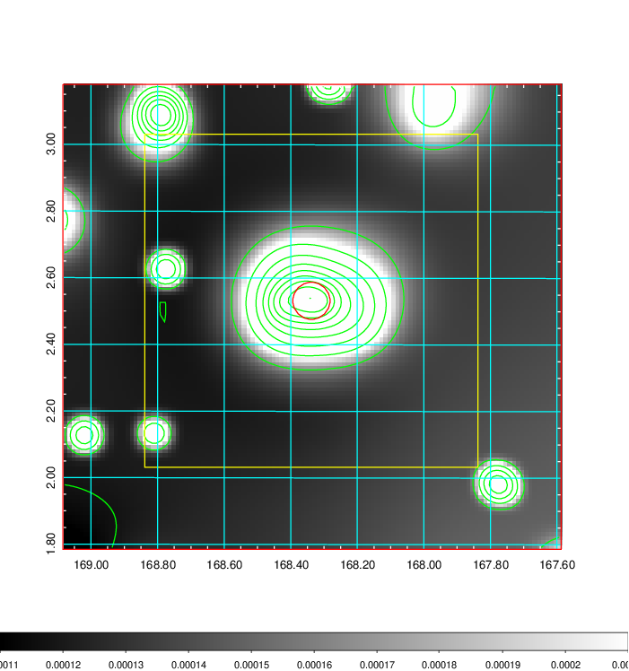   | 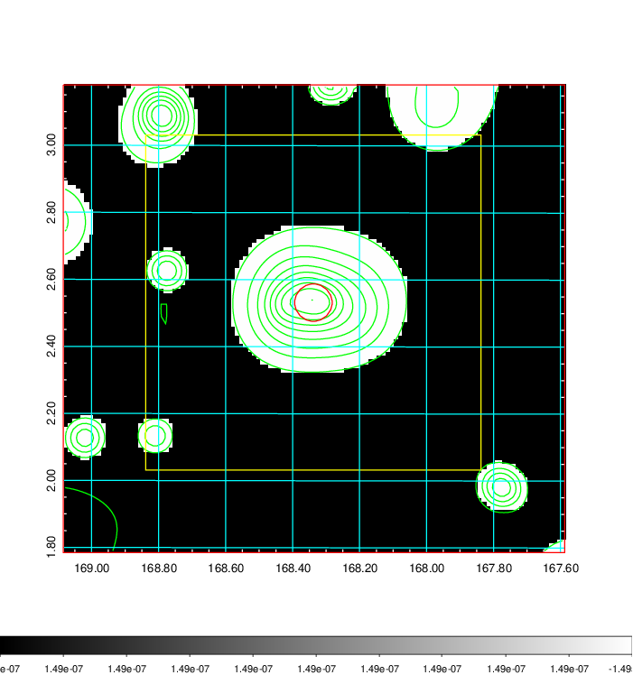  |

|[Exposure image](../image/392/392_mex.pdf)| [nH image](../image/392/392_nh.pdf)| [Planck image](../image/392/392_p.pdf)|
|-------------------|--------------------|-------------------|
|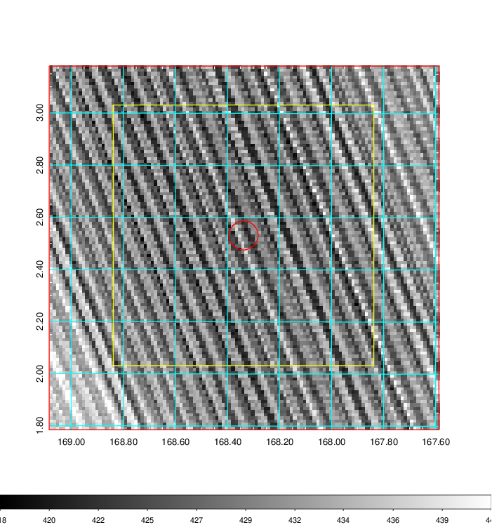   | 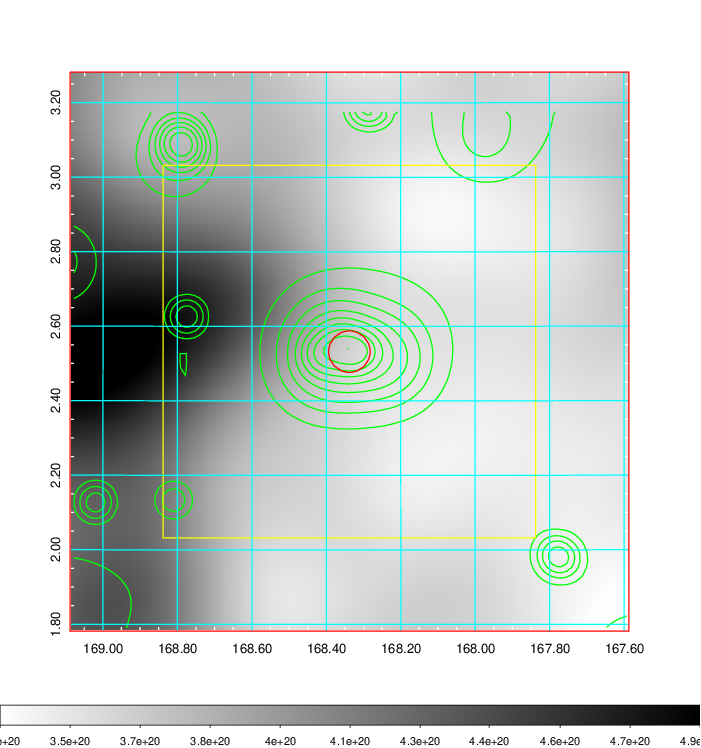    | 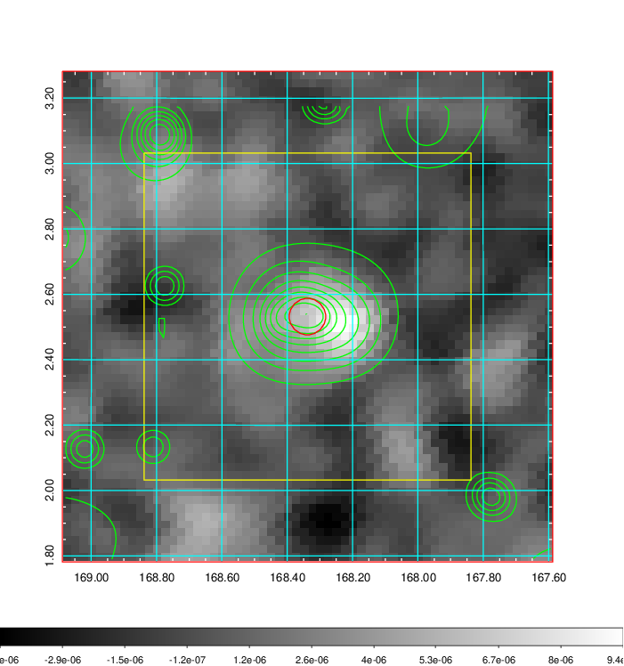 |

|[Redshift Histogram](../image/392/392_zg.pdf) | [DSS image(z1)](../image/392/392_dss_z1.pdf)      |  [DSS image(z2)](../image/392/392_dss_z2.pdf)    |
|-------------------|--------------------|-------------------|
|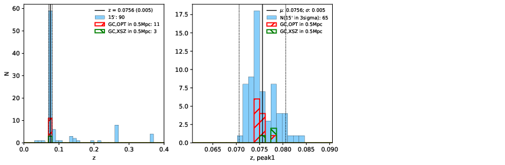 |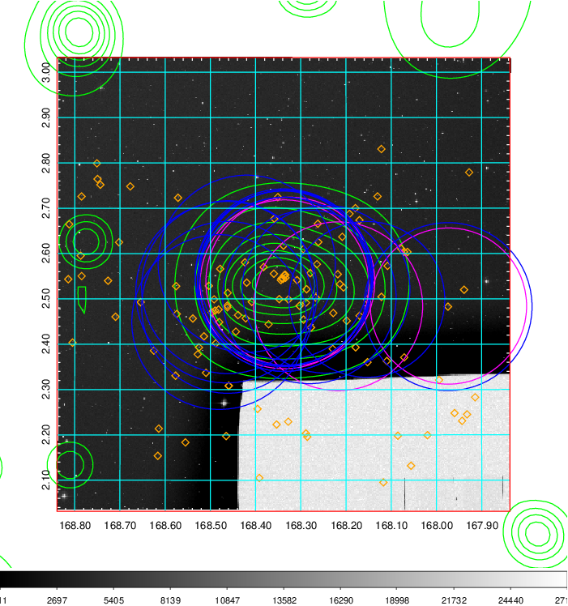  Blue circle for optical clusters;  Magenta circle for XSZ clusters;  all with r=1Mpc;  Only GC with Delta_z<0.01 are shown. | 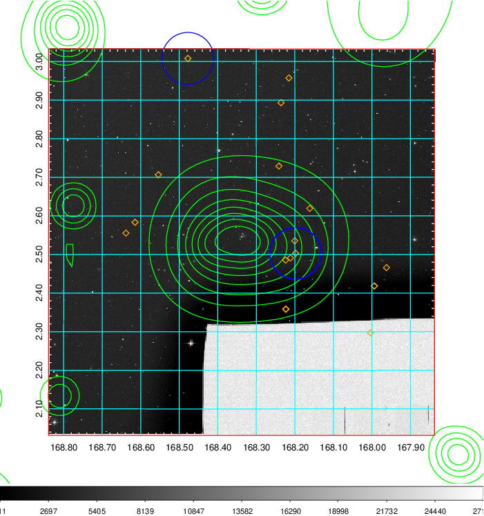 Blue circle for optical clusters;  Magenta circle for XSZ clusters;  all with r=1Mpc;  Only GC with Delta_z<0.01 are shown.  |

|[known Abell/XSZ clusters](../image/392/392_gc.pdf) | [2MASS image](../image/392/392_2mass.pdf)      |[SDSS image](../image/392/392_sdss.pdf)   |
|-------------------|-------------------|-------------------|
|  Magenta, blue and green circles  for optical, X-ray and SZ clusters  respectively, with redshift of clusters  labelled. The radius of circles  are 1Mpc.|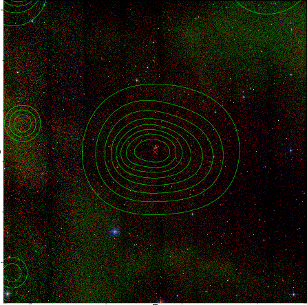  | 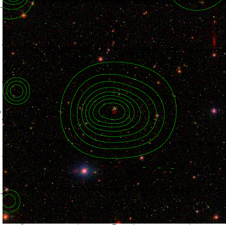  |

