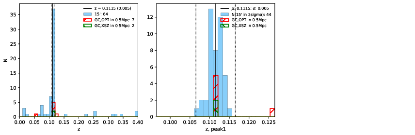

### 393

|Name|RAJ2000[deg]|DEJ2000[deg] |Ext[arcmin]| Ext,ml | z | z_src| C|GC(XSZ,Delta_z<0.01)| GC(OPT,Delta_z<0.01)|GC| R_sig[arcmin] | R500[arcmin] | R500[Mpc]| CRsig[c/s] | CR500[c/s] |L500[1E44 erg/s]|F500[1E-12 erg/s/cm^2]| M500[1E14 Msun]|Tx[keV]|Cnt_sig|Beta|Rc[arcmin]|Comment|Alias|
|---|---|---|---|---|---|------|---|--------|---------|----------|---|---|---|---|---|---|---|---|---|---|---|---|---|---|
|393| 168.343| 47.514| 4.28| 28.92| 0.1115(0.005)| z1, z_xsz| B| F20, SPI| C, RM, W| A, C, F20, N, SPI, W| 10.750| 6.250| 0.761| 0.082(0.031)| 0.077(0.029)| 0.474(0.182)| 1.482(0.569)| 1.40(0.27)| 2.72(0.33)| 43.3| 0.727(-0.153+0.177)| 5.496(-1.672+1.683)| -| t217|

|[RASS image](../image/393/393_img.pdf)|[filtered image](../image/393/393_fil.pdf)|[Segment image](../image/393/393_seg.pdf)|
|-------------------|--------------------|-------------------|
|   |    |   |

|[Exposure image](../image/393/393_mex.pdf)| [nH image](../image/393/393_nh.pdf)| [Planck image](../image/393/393_p.pdf)|
|-------------------|--------------------|-------------------|
|   |     |  |

|[Redshift Histogram](../image/393/393_zg.pdf) | [DSS image(z1)](../image/393/393_dss_z1.pdf)      |  [DSS image(z2)](../image/393/393_dss_z2.pdf)    |
|-------------------|--------------------|-------------------|
| |  Blue circle for optical clusters;  Magenta circle for XSZ clusters;  all with r=1Mpc;  Only GC with Delta_z<0.01 are shown. |  Blue circle for optical clusters;  Magenta circle for XSZ clusters;  all with r=1Mpc;  Only GC with Delta_z<0.01 are shown.  |

|[known Abell/XSZ clusters](../image/393/393_gc.pdf) | [2MASS image](../image/393/393_2mass.pdf)      |[SDSS image](../image/393/393_sdss.pdf)   |
|-------------------|-------------------|-------------------|
|  Magenta, blue and green circles  for optical, X-ray and SZ clusters  respectively, with redshift of clusters  labelled. The radius of circles  are 1Mpc.|  |   |

