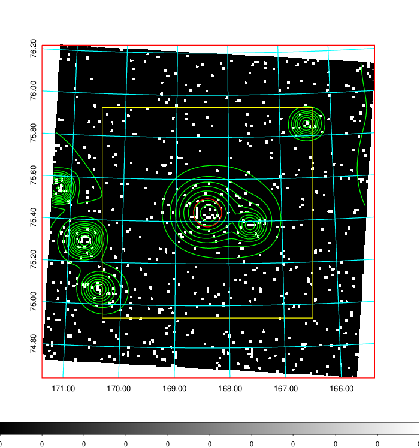
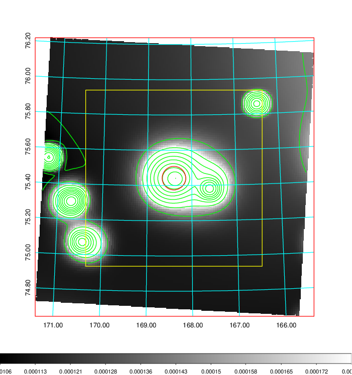
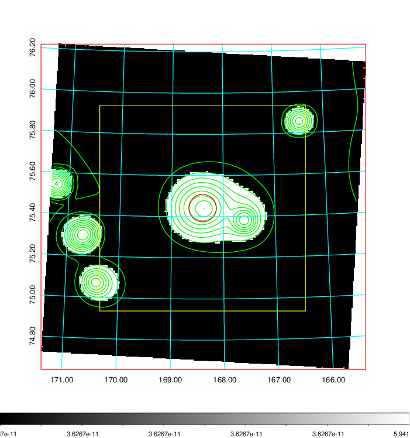
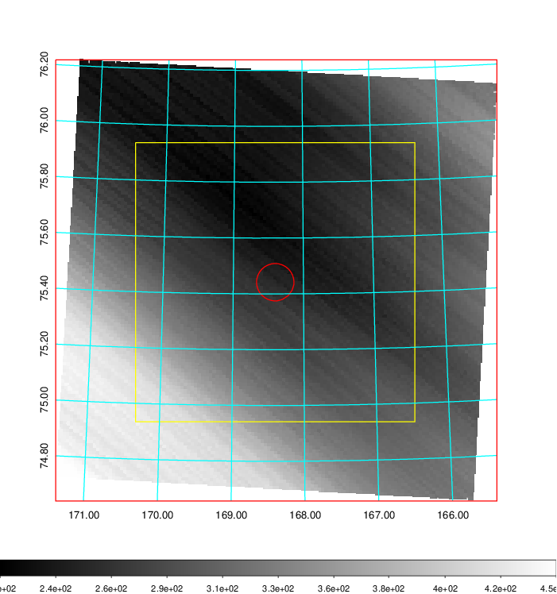
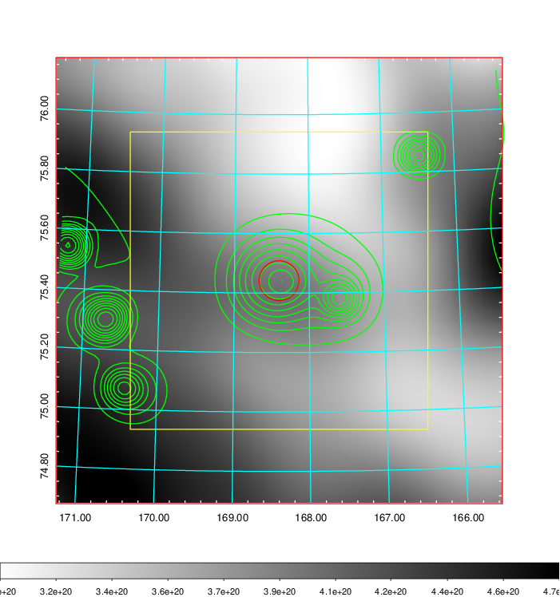
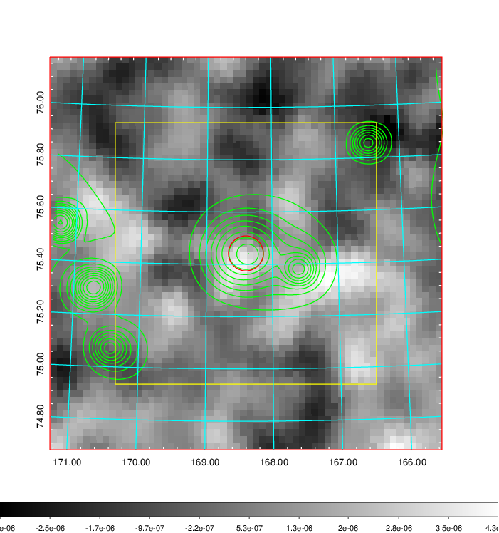
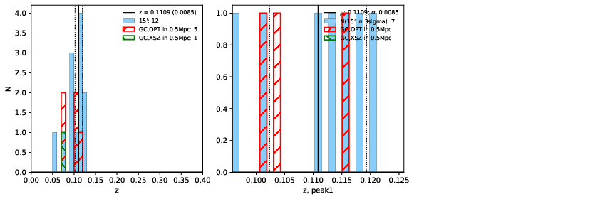
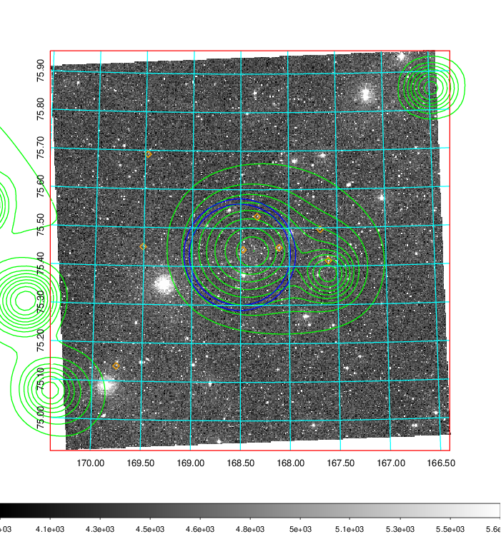
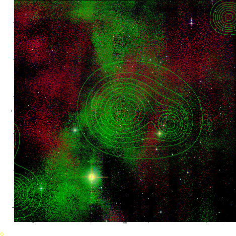
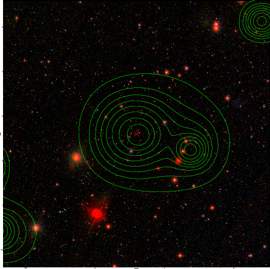

### 394

|Name|RAJ2000[deg]|DEJ2000[deg] |Ext[arcmin]| Ext,ml | z | z_src| C|GC(XSZ,Delta_z<0.01)| GC(OPT,Delta_z<0.01)|GC| R_sig[arcmin] | R500[arcmin] | R500[Mpc]| CRsig[c/s] | CR500[c/s] |L500[1E44 erg/s]|F500[1E-12 erg/s/cm^2]| M500[1E14 Msun]|Tx[keV]|Cnt_sig|Beta|Rc[arcmin]|Comment|Alias|
|---|---|---|---|---|---|------|---|--------|---------|----------|---|---|---|---|---|---|---|---|---|---|---|---|---|---|
|394| 168.402| 75.442| 4.01| 44.87| 0.1109(0.009)| z1, z_opt| S| -| N, W| A, N, Tar, W| 8.800| 6.714| 0.814| 0.105(0.037)| 0.101(0.036)| 0.581(0.105)| 1.838(0.333)| 1.71(0.16)| 3.08(0.18)| 36.4| 0.886(-0.130+0.082)| 4.810(-0.904+0.764)| An SZ cluster with $z$ = 0.0791 and offset = 0.09 Mpc| t195|

|[RASS image](../image/394/394_img.pdf)|[filtered image](../image/394/394_fil.pdf)|[Segment image](../image/394/394_seg.pdf)|
|-------------------|--------------------|-------------------|
|   |    |   |

|[Exposure image](../image/394/394_mex.pdf)| [nH image](../image/394/394_nh.pdf)| [Planck image](../image/394/394_p.pdf)|
|-------------------|--------------------|-------------------|
|   |     |  |

|[Redshift Histogram](../image/394/394_zg.pdf) | [DSS image(z1)](../image/394/394_dss_z1.pdf)      |  [DSS image(z2)](../image/394/394_dss_z2.pdf)    |
|-------------------|--------------------|-------------------|
| |  Blue circle for optical clusters;  Magenta circle for XSZ clusters;  all with r=1Mpc;  Only GC with Delta_z<0.01 are shown. |  Blue circle for optical clusters;  Magenta circle for XSZ clusters;  all with r=1Mpc;  Only GC with Delta_z<0.01 are shown.  |

|[Previous-identified clusters](../image/394/394_gc.pdf) | [2MASS image](../image/394/394_2mass.pdf)      |[SDSS image](../image/394/394_sdss.pdf)   |
|-------------------|-------------------|-------------------|
|  Green, magenta, and blue circles  for optical, X-ray and SZ clusters  respectively, with redshift of clusters  labelled. The radius of circles  are 1Mpc.|  |   |

