

### 395

|Name|RAJ2000[deg]|DEJ2000[deg] |Ext[arcmin]| Ext,ml | z | z_src| C|GC(XSZ,Delta_z<0.01)| GC(OPT,Delta_z<0.01)|GC| R_sig[arcmin] | R500[arcmin] | R500[Mpc]| CRsig[c/s] | CR500[c/s] |L500[1E44 erg/s]|F500[1E-12 erg/s/cm^2]| M500[1E14 Msun]|Tx[keV]|Cnt_sig|Beta|Rc[arcmin]|Comment|Alias|
|---|---|---|---|---|---|------|---|--------|---------|----------|---|---|---|---|---|---|---|---|---|---|---|---|---|---|
|395| 168.561| -4.006| 3.79| 30.80| 0.0997(0.005)| z1, z_opt| S| -| N| N| 7.338| 6.360| 0.702| 0.062(0.026)| 0.060(0.026)| 0.271(0.088)| 1.077(0.349)| 1.08(0.18)| 2.32(0.24)| 25.3| 0.864(-0.152+0.097)| 5.921(-1.324+1.167)| -| t184|

|[RASS image](../image/395/395_img.pdf)|[filtered image](../image/395/395_fil.pdf)|[Segment image](../image/395/395_seg.pdf)|
|-------------------|--------------------|-------------------|
| 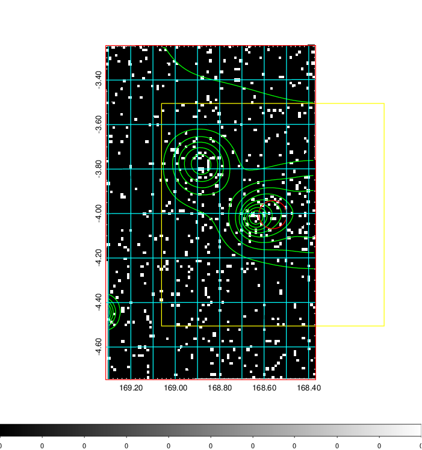  | 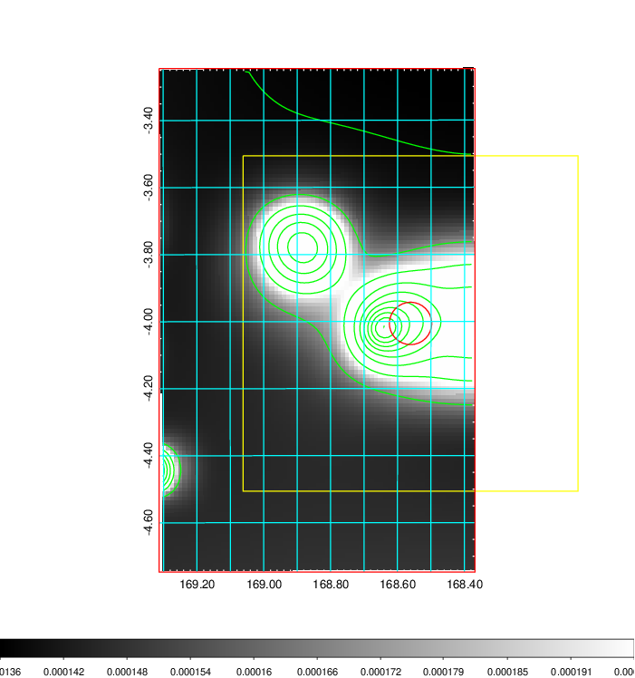   | 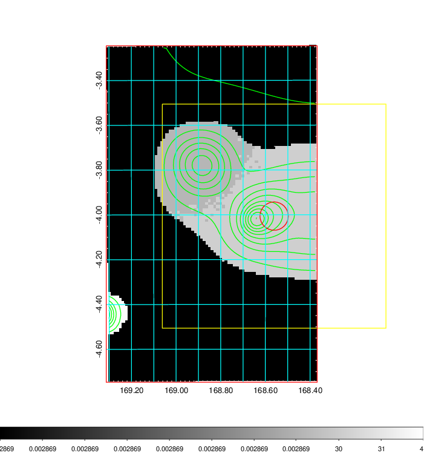  |

|[Exposure image](../image/395/395_mex.pdf)| [nH image](../image/395/395_nh.pdf)| [Planck image](../image/395/395_p.pdf)|
|-------------------|--------------------|-------------------|
|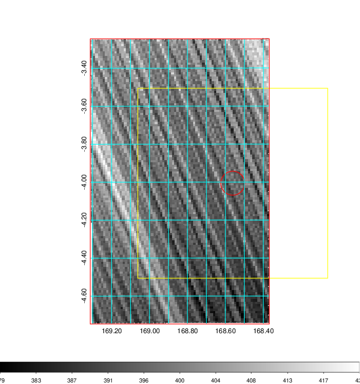   | 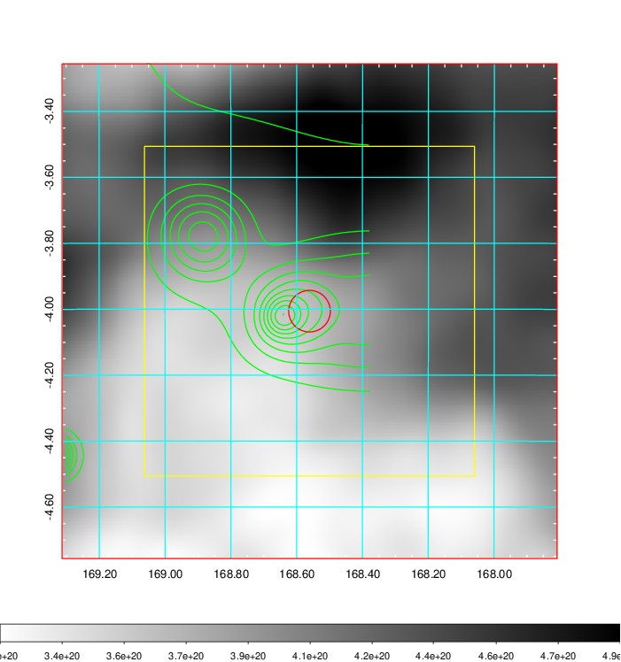    | 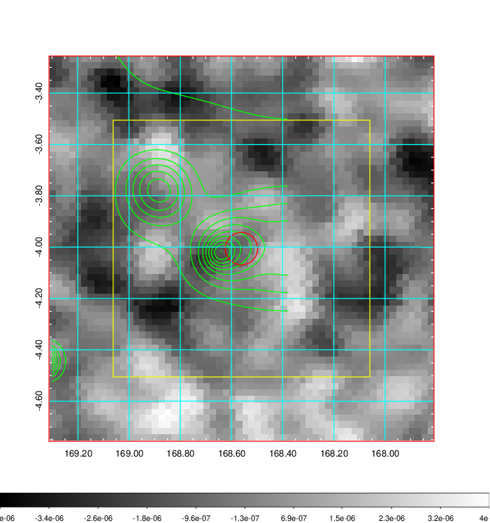 |

|[Redshift Histogram](../image/395/395_zg.pdf) | [DSS image(z1)](../image/395/395_dss_z1.pdf)      |  [DSS image(z2)](../image/395/395_dss_z2.pdf)    |
|-------------------|--------------------|-------------------|
|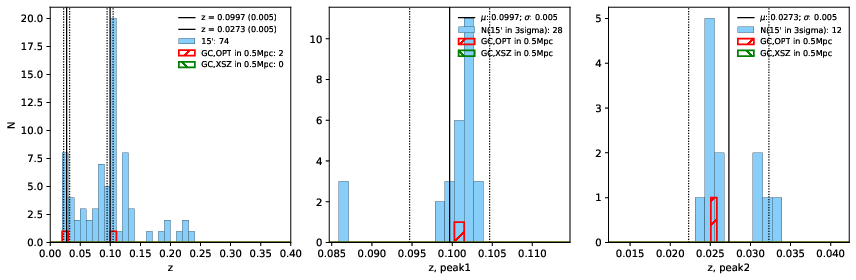 |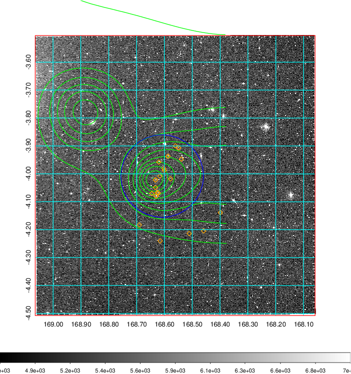  Blue circle for optical clusters;  Magenta circle for XSZ clusters;  all with r=1Mpc;  Only GC with Delta_z<0.01 are shown. | 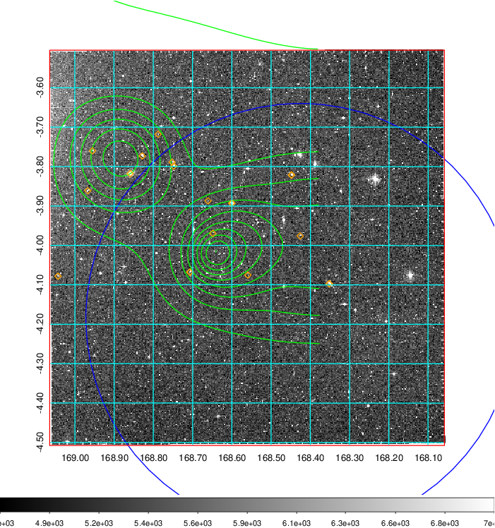 Blue circle for optical clusters;  Magenta circle for XSZ clusters;  all with r=1Mpc;  Only GC with Delta_z<0.01 are shown.  |

|[Previous-identified clusters](../image/395/395_gc.pdf) | [2MASS image](../image/395/395_2mass.pdf)      |
|-------------------|-------------------|
|  Green, magenta, and blue circles  for optical, X-ray and SZ clusters  respectively, with redshift of clusters  labelled. The radius of circles  are 1Mpc.|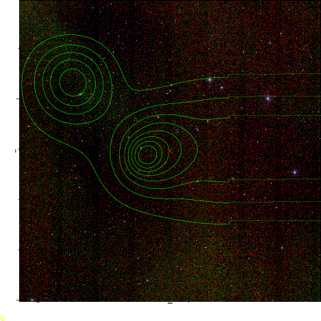  |

|[ATLAS image](../image/395/395_s.pdf)        |
|-------------------|
| 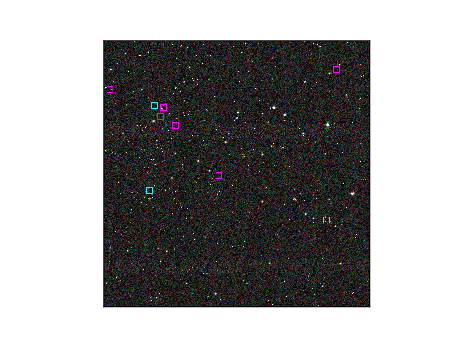  |
