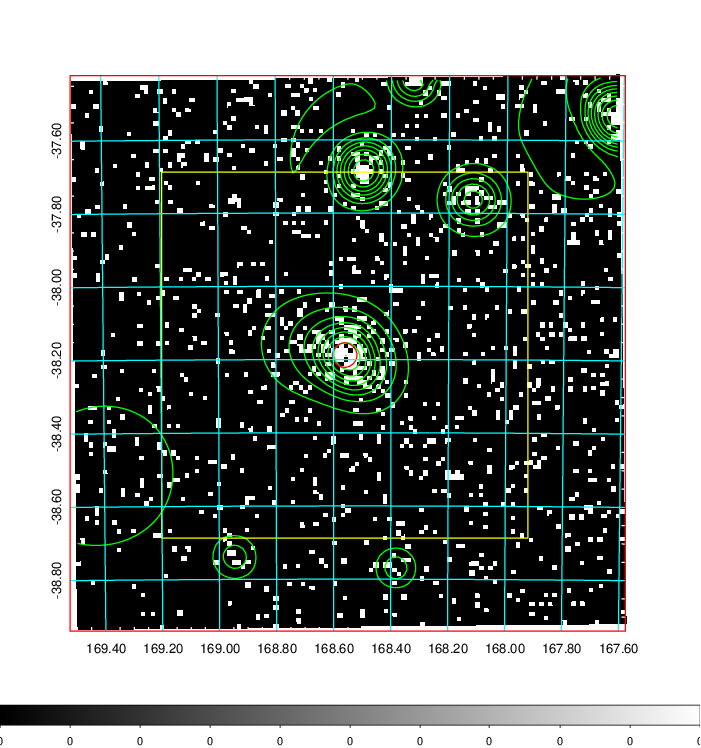
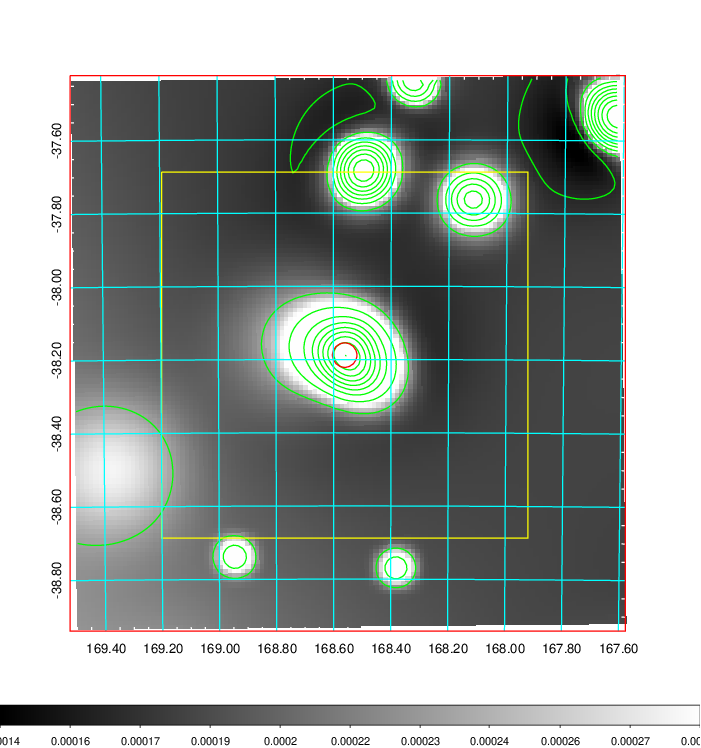
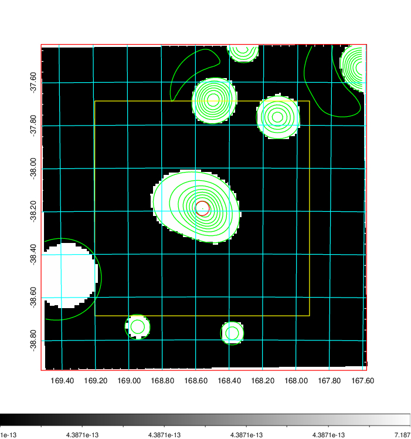
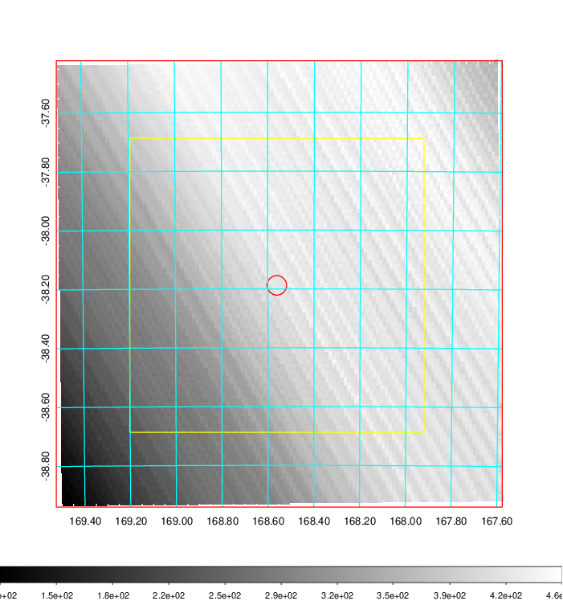
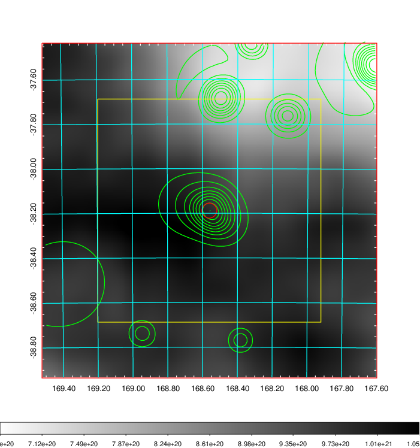
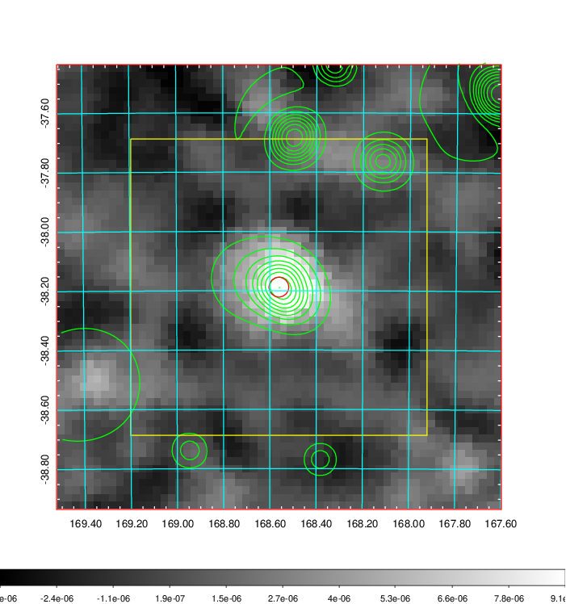
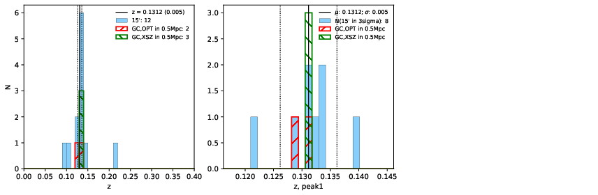
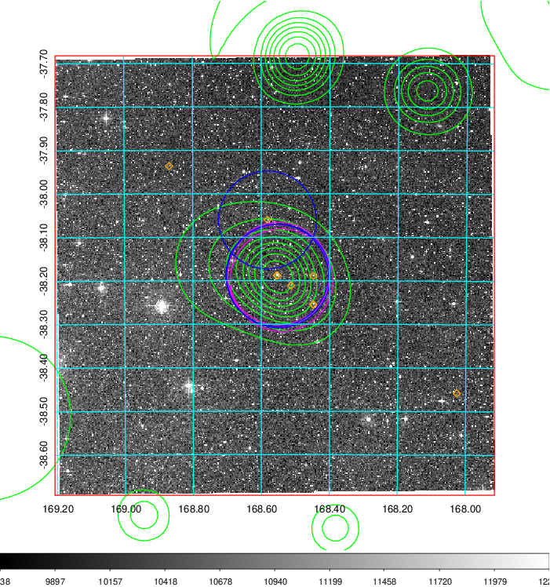
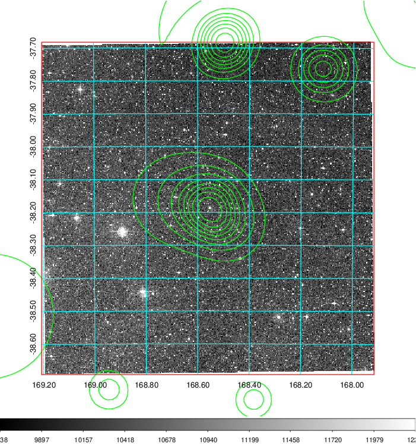
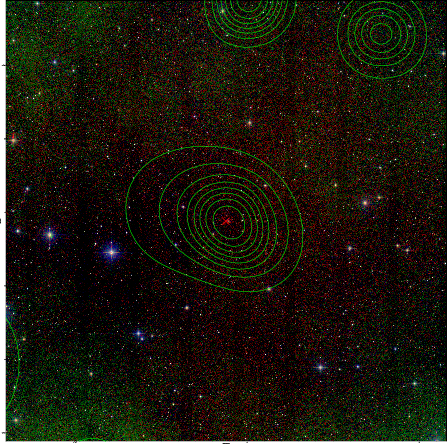

### 396

|Name|RAJ2000[deg]|DEJ2000[deg] |Ext[arcmin]| Ext,ml | z | z_src| C|GC(XSZ,Delta_z<0.01)| GC(OPT,Delta_z<0.01)|GC| R_sig[arcmin] | R500[arcmin] | R500[Mpc]| CRsig[c/s] | CR500[c/s] |L500[1E44 erg/s]|F500[1E-12 erg/s/cm^2]| M500[1E14 Msun]|Tx[keV]|Cnt_sig|Beta|Rc[arcmin]|Comment|Alias|
|---|---|---|---|---|---|------|---|--------|---------|----------|---|---|---|---|---|---|---|---|---|---|---|---|---|---|
|396| 168.561| -38.188| 2.00| 73.01| 0.1312(0.005)| z1, z_xsz| B| MCXC, PSZ2, Tar| N, W| MCXC, N, PSZ2, Tar, W| 7.825| 7.691| 1.078| 0.253(0.039)| 0.252(0.038)| 2.030(0.113)| 4.465(0.249)| 4.04(0.11)| 5.28(0.09)| 112.1| 0.868(-0.121+0.091)| 3.416(-0.690+0.512)| -| k221|

|[RASS image](../image/396/396_img.pdf)|[filtered image](../image/396/396_fil.pdf)|[Segment image](../image/396/396_seg.pdf)|
|-------------------|--------------------|-------------------|
|   |    |   |

|[Exposure image](../image/396/396_mex.pdf)| [nH image](../image/396/396_nh.pdf)| [Planck image](../image/396/396_p.pdf)|
|-------------------|--------------------|-------------------|
|   |     |  |

|[Redshift Histogram](../image/396/396_zg.pdf) | [DSS image(z1)](../image/396/396_dss_z1.pdf)      |  [DSS image(z2)](../image/396/396_dss_z2.pdf)    |
|-------------------|--------------------|-------------------|
| |  Blue circle for optical clusters;  Magenta circle for XSZ clusters;  all with r=1Mpc;  Only GC with Delta_z<0.01 are shown. |  Blue circle for optical clusters;  Magenta circle for XSZ clusters;  all with r=1Mpc;  Only GC with Delta_z<0.01 are shown.  |

|[Previous-identified clusters](../image/396/396_gc.pdf) | [2MASS image](../image/396/396_2mass.pdf)      |
|-------------------|-------------------|
|  Green, magenta, and blue circles  for optical, X-ray and SZ clusters  respectively, with redshift of clusters  labelled. The radius of circles  are 1Mpc.|  |

