

### 397

|Name|RAJ2000[deg]|DEJ2000[deg] |Ext[arcmin]| Ext,ml | z | z_src| C|GC(XSZ,Delta_z<0.01)| GC(OPT,Delta_z<0.01)|GC| R_sig[arcmin] | R500[arcmin] | R500[Mpc]| CRsig[c/s] | CR500[c/s] |L500[1E44 erg/s]|F500[1E-12 erg/s/cm^2]| M500[1E14 Msun]|Tx[keV]|Cnt_sig|Beta|Rc[arcmin]|Comment|Alias|
|---|---|---|---|---|---|------|---|--------|---------|----------|---|---|---|---|---|---|---|---|---|---|---|---|---|---|
|397| 168.858| 54.430| 3.76| 73.17| 0.0698(0.005)| z1, z_xsz| B| F20, MCXC, SPI| N, W| F20, MCXC, N, SPI, SWXCS, W| 11.238| 9.126| 0.730| 0.162(0.028)| 0.157(0.027)| 0.365(0.049)| 3.078(0.417)| 1.18(0.08)| 2.43(0.11)| 88.9| 0.856(-0.135+0.100)| 6.143(-1.198+0.885)| -| k460|

|[RASS image](../image/397/397_img.pdf)|[filtered image](../image/397/397_fil.pdf)|[Segment image](../image/397/397_seg.pdf)|
|-------------------|--------------------|-------------------|
| 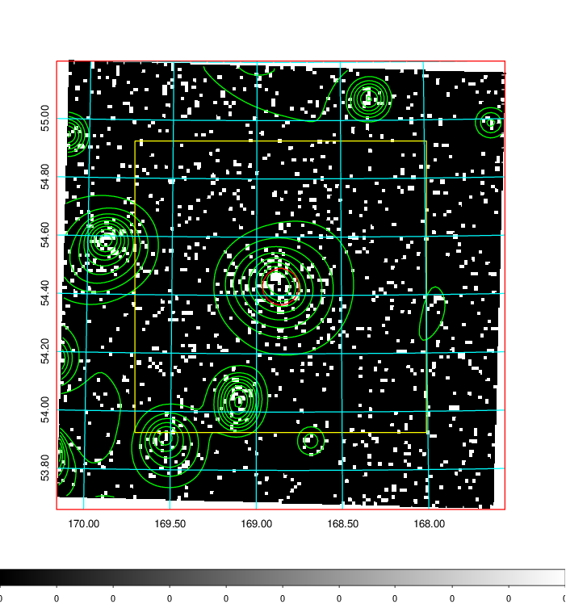  | 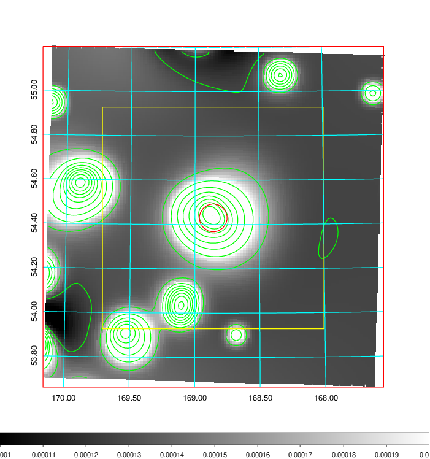   | 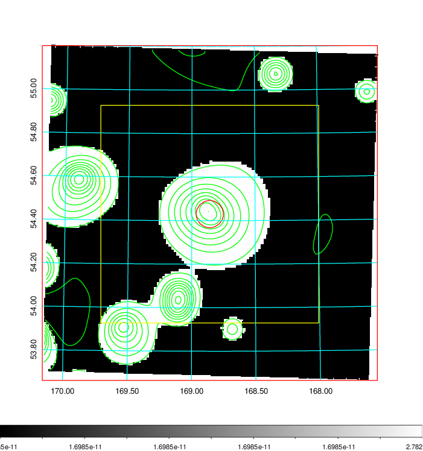  |

|[Exposure image](../image/397/397_mex.pdf)| [nH image](../image/397/397_nh.pdf)| [Planck image](../image/397/397_p.pdf)|
|-------------------|--------------------|-------------------|
|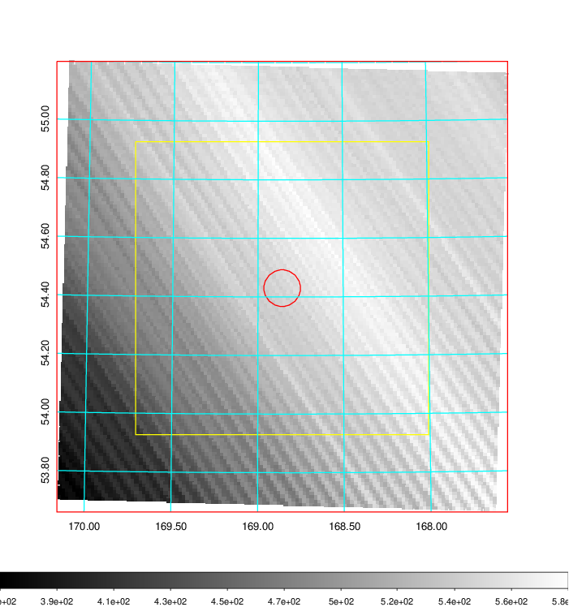   | 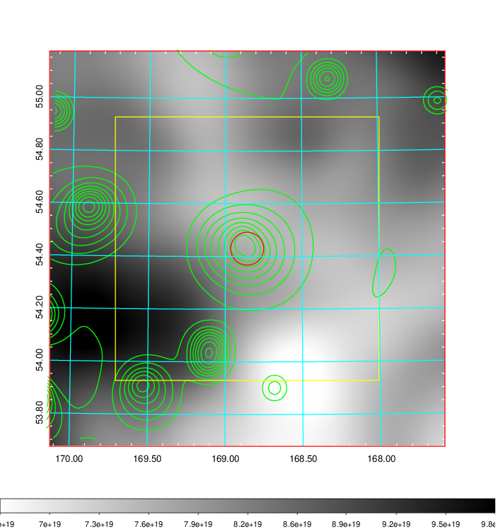    | 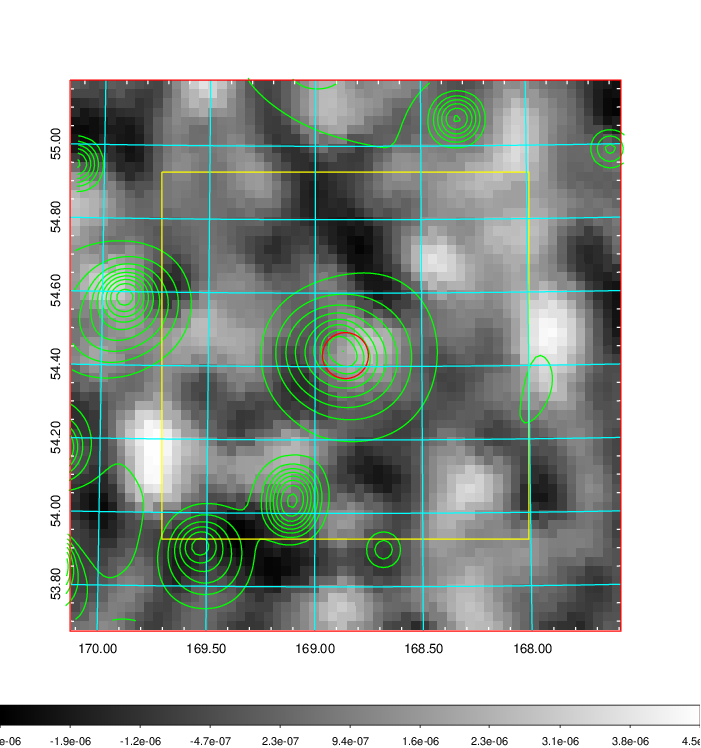 |

|[Redshift Histogram](../image/397/397_zg.pdf) | [DSS image(z1)](../image/397/397_dss_z1.pdf)      |  [DSS image(z2)](../image/397/397_dss_z2.pdf)    |
|-------------------|--------------------|-------------------|
|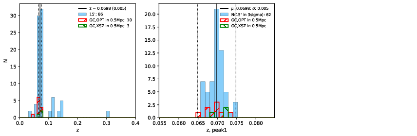 |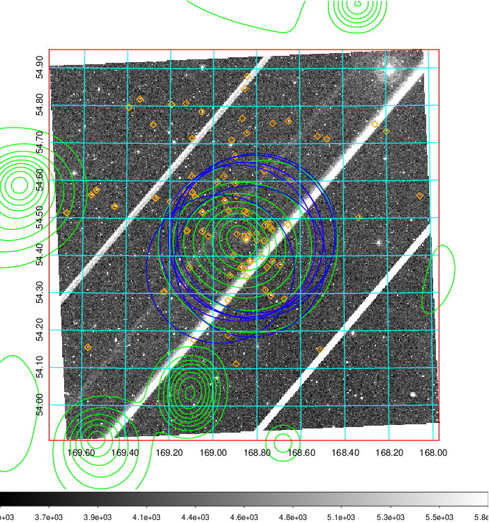  Blue circle for optical clusters;  Magenta circle for XSZ clusters;  all with r=1Mpc;  Only GC with Delta_z<0.01 are shown. | 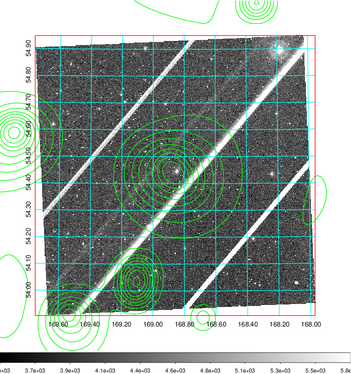 Blue circle for optical clusters;  Magenta circle for XSZ clusters;  all with r=1Mpc;  Only GC with Delta_z<0.01 are shown.  |

|[known Abell/XSZ clusters](../image/397/397_gc.pdf) | [2MASS image](../image/397/397_2mass.pdf)      |[SDSS image](../image/397/397_sdss.pdf)   |
|-------------------|-------------------|-------------------|
|  Magenta, blue and green circles  for optical, X-ray and SZ clusters  respectively, with redshift of clusters  labelled. The radius of circles  are 1Mpc.|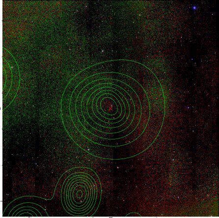  | 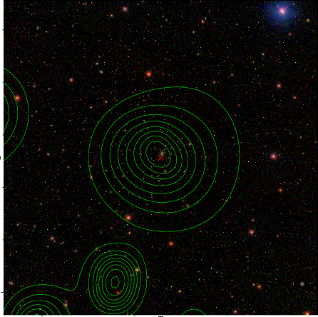  |

