

### 398

|Name|RAJ2000[deg]|DEJ2000[deg] |Ext[arcmin]| Ext,ml | z | z_src| C|GC(XSZ,Delta_z<0.01)| GC(OPT,Delta_z<0.01)|GC| R_sig[arcmin] | R500[arcmin] | R500[Mpc]| CRsig[c/s] | CR500[c/s] |L500[1E44 erg/s]|F500[1E-12 erg/s/cm^2]| M500[1E14 Msun]|Tx[keV]|Cnt_sig|Beta|Rc[arcmin]|Comment|Alias|
|---|---|---|---|---|---|------|---|--------|---------|----------|---|---|---|---|---|---|---|---|---|---|---|---|---|---|
|398| 168.985| 1.508| 1.44| 31.95| 0.3520(0.005)| z1, z_xsz| B| MCXC| N, W, Zw| C, MCXC, N, PSZ2, Tar, W| 10.750| 4.830| 1.437| 0.245(0.035)| 0.225(0.032)| 18.464(1.207)| 4.416(0.289)| 12.18(0.35)| 11.27(0.21)| 94.0| 0.823(-0.127+0.117)| 3.673(-0.874+0.716)| -| k105|

|[RASS image](../image/398/398_img.pdf)|[filtered image](../image/398/398_fil.pdf)|[Segment image](../image/398/398_seg.pdf)|
|-------------------|--------------------|-------------------|
| 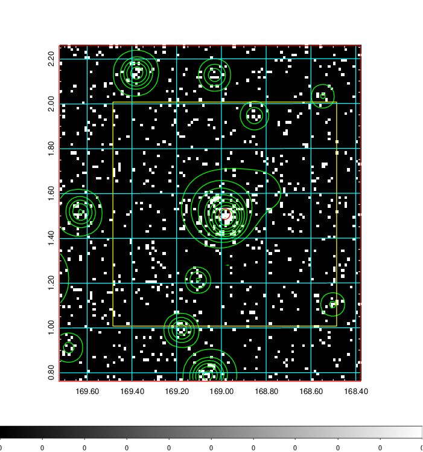  | 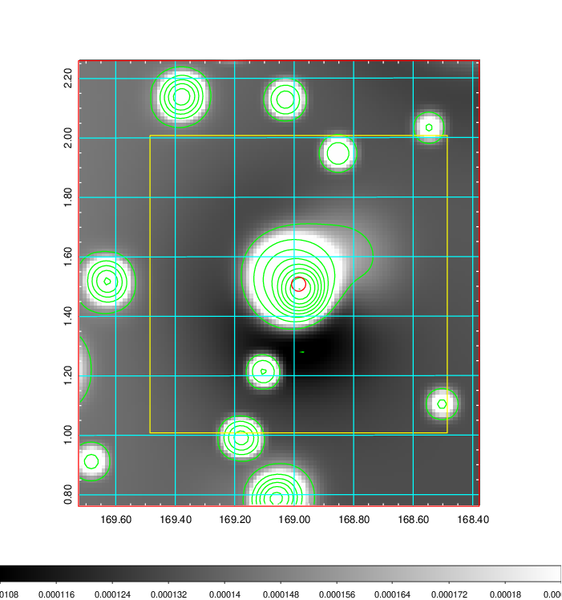   | 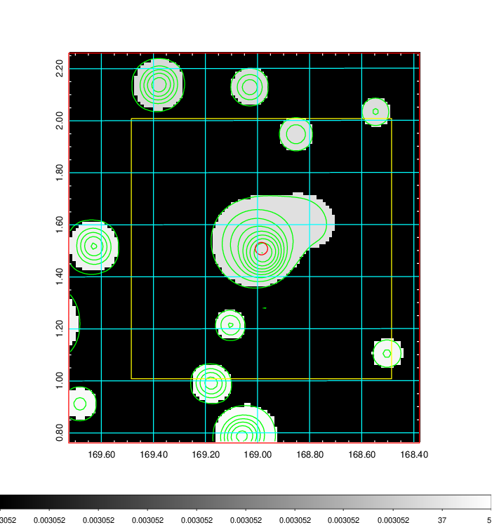  |

|[Exposure image](../image/398/398_mex.pdf)| [nH image](../image/398/398_nh.pdf)| [Planck image](../image/398/398_p.pdf)|
|-------------------|--------------------|-------------------|
|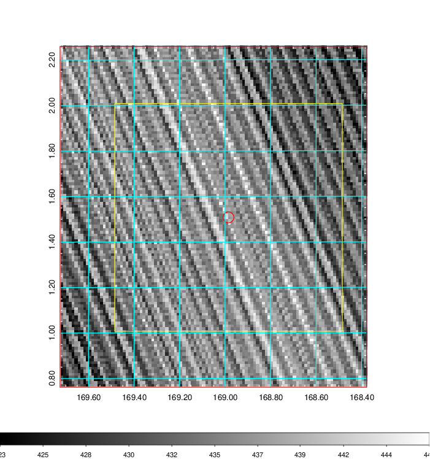   | 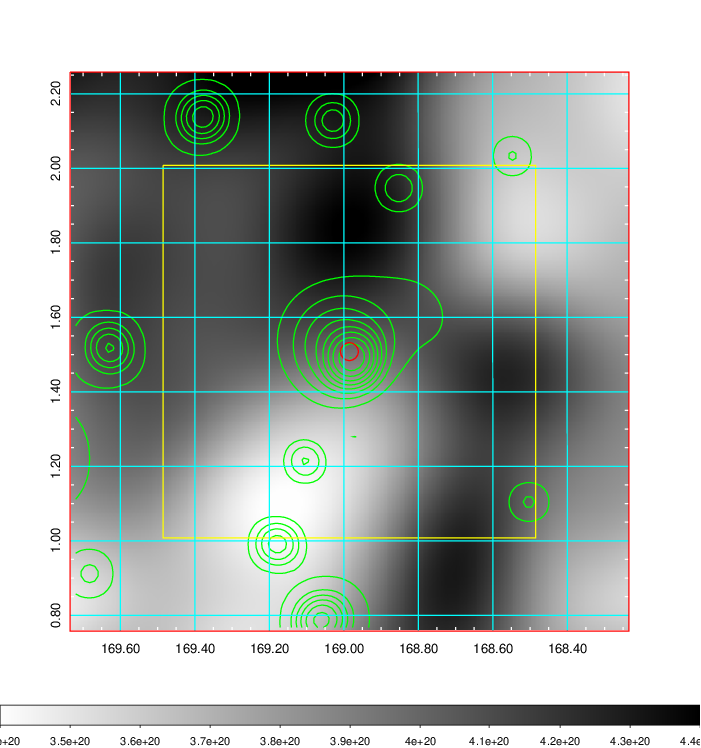    | 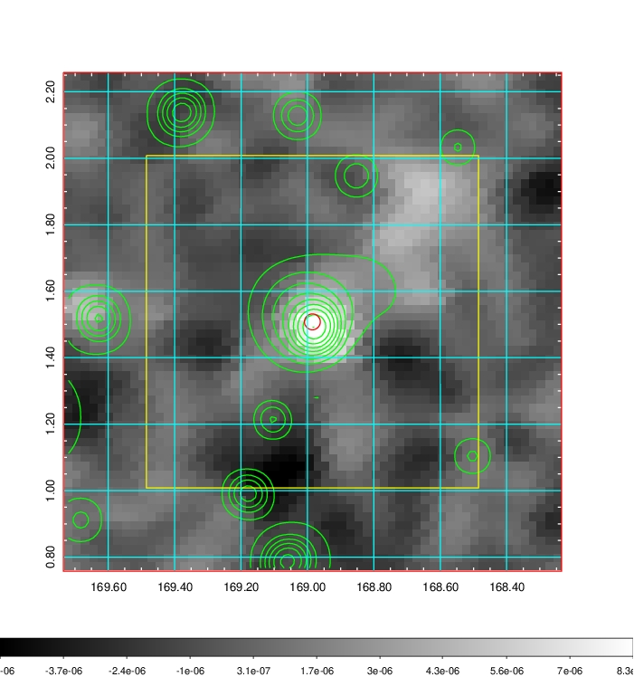 |

|[Redshift Histogram](../image/398/398_zg.pdf) | [DSS image(z1)](../image/398/398_dss_z1.pdf)      |  [DSS image(z2)](../image/398/398_dss_z2.pdf)    |
|-------------------|--------------------|-------------------|
|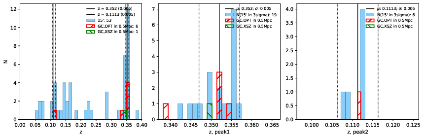 |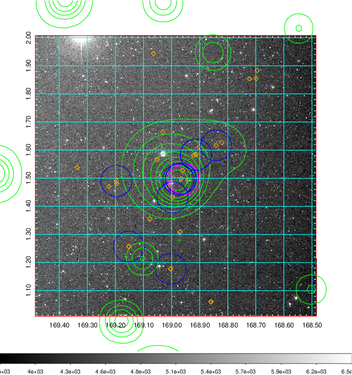  Blue circle for optical clusters;  Magenta circle for XSZ clusters;  all with r=1Mpc;  Only GC with Delta_z<0.01 are shown. | 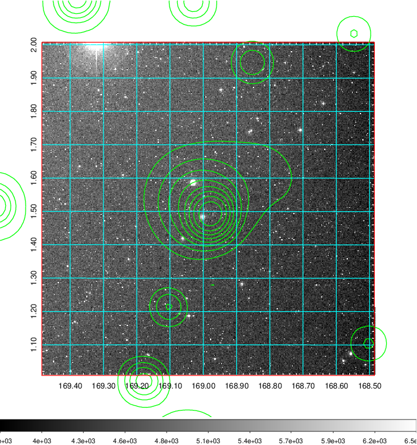 Blue circle for optical clusters;  Magenta circle for XSZ clusters;  all with r=1Mpc;  Only GC with Delta_z<0.01 are shown.  |

|[Previous-identified clusters](../image/398/398_gc.pdf) | [2MASS image](../image/398/398_2mass.pdf)      |[SDSS image](../image/398/398_sdss.pdf)   |
|-------------------|-------------------|-------------------|
|  Green, magenta, and blue circles  for optical, X-ray and SZ clusters  respectively, with redshift of clusters  labelled. The radius of circles  are 1Mpc.|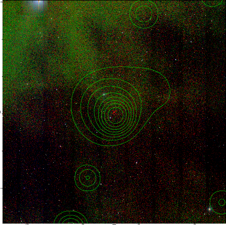  | 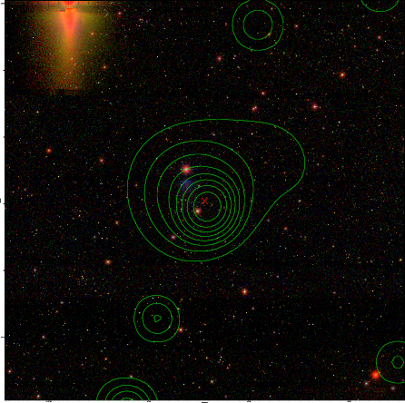  |

