

### 399

|Name|RAJ2000[deg]|DEJ2000[deg] |Ext[arcmin]| Ext,ml | z | z_src| C|GC(XSZ,Delta_z<0.01)| GC(OPT,Delta_z<0.01)|GC| R_sig[arcmin] | R500[arcmin] | R500[Mpc]| CRsig[c/s] | CR500[c/s] |L500[1E44 erg/s]|F500[1E-12 erg/s/cm^2]| M500[1E14 Msun]|Tx[keV]|Cnt_sig|Beta|Rc[arcmin]|Comment|Alias|
|---|---|---|---|---|---|------|---|--------|---------|----------|---|---|---|---|---|---|---|---|---|---|---|---|---|---|
|399| 169.088| 29.304| 7.69| 28.19| 0.0466(0.005)| z1, z_xsz| B| L03, Tak| A, N| A, C, L03, N, Tak| 17.294| 11.937| 0.655| 0.214(0.070)| 0.203(0.067)| 0.190(0.057)| 3.725(1.119)| 0.84(0.13)| 1.94(0.19)| 55.6| 0.905(-0.110+0.068)| 11.086(-1.566+1.183)| -| t384|

|[RASS image](../image/399/399_img.pdf)|[filtered image](../image/399/399_fil.pdf)|[Segment image](../image/399/399_seg.pdf)|
|-------------------|--------------------|-------------------|
| 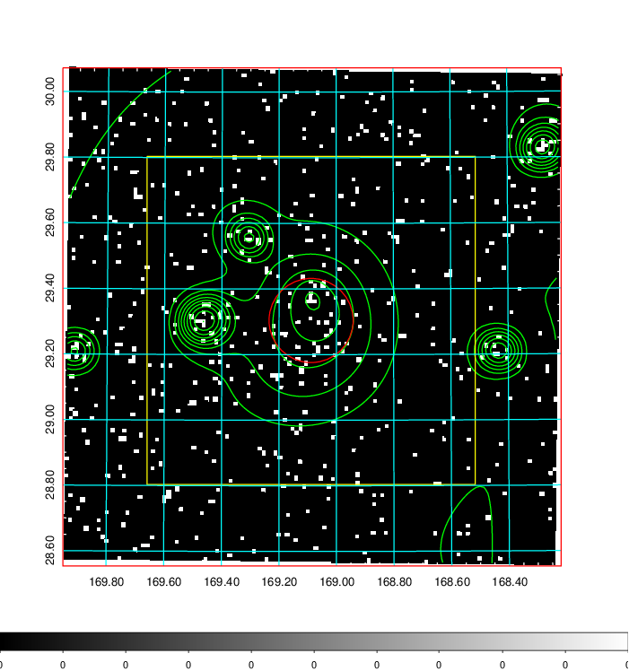  | 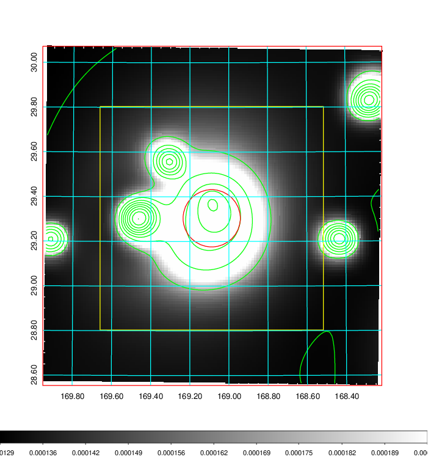   | 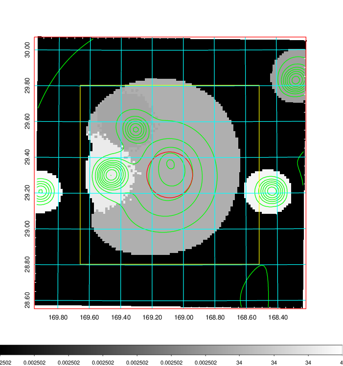  |

|[Exposure image](../image/399/399_mex.pdf)| [nH image](../image/399/399_nh.pdf)| [Planck image](../image/399/399_p.pdf)|
|-------------------|--------------------|-------------------|
|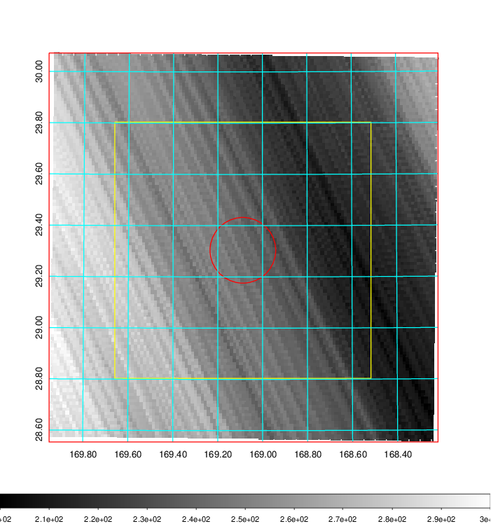   | 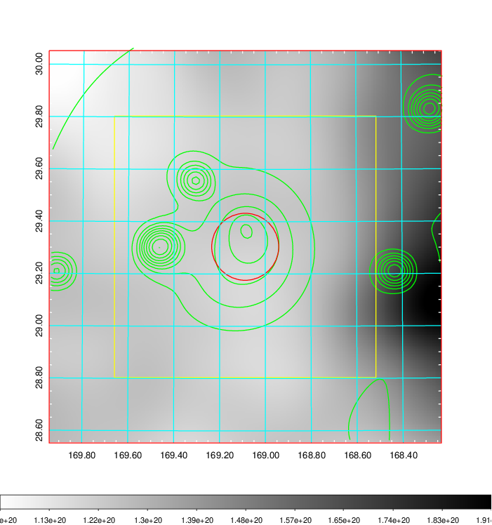    | 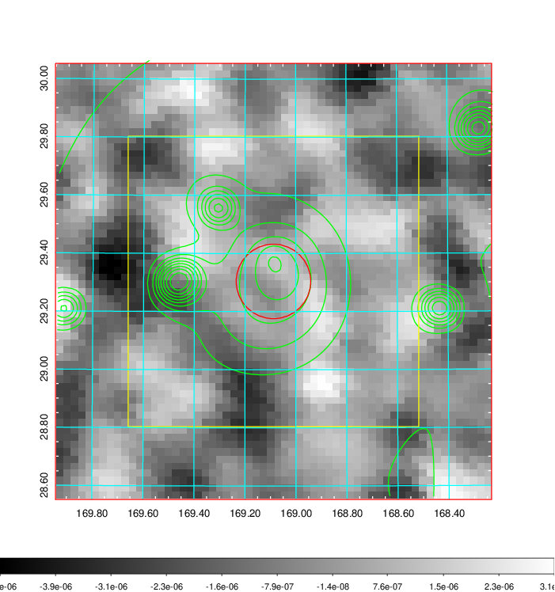 |

|[Redshift Histogram](../image/399/399_zg.pdf) | [DSS image(z1)](../image/399/399_dss_z1.pdf)      |  [DSS image(z2)](../image/399/399_dss_z2.pdf)    |
|-------------------|--------------------|-------------------|
|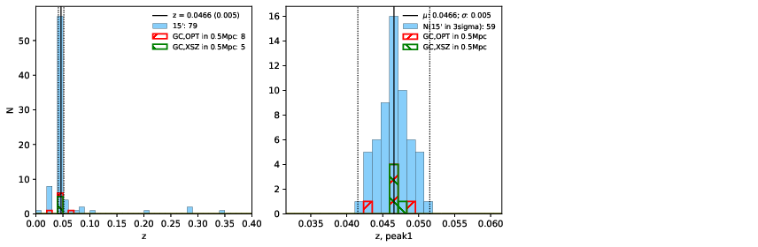 |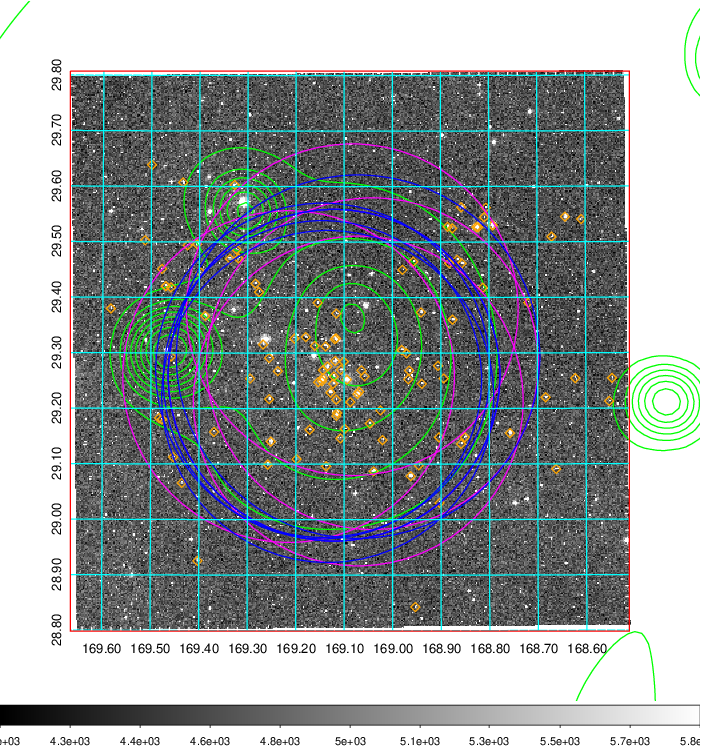  Blue circle for optical clusters;  Magenta circle for XSZ clusters;  all with r=1Mpc;  Only GC with Delta_z<0.01 are shown. | 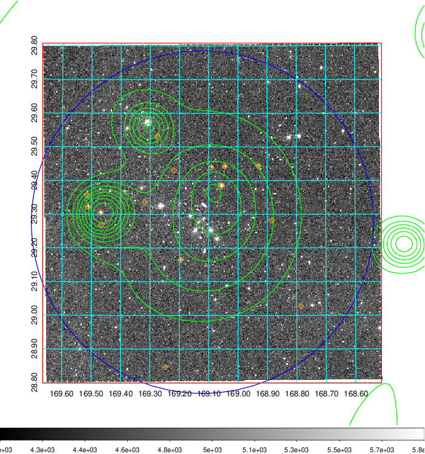 Blue circle for optical clusters;  Magenta circle for XSZ clusters;  all with r=1Mpc;  Only GC with Delta_z<0.01 are shown.  |

|[Previous-identified clusters](../image/399/399_gc.pdf) | [2MASS image](../image/399/399_2mass.pdf)      |[SDSS image](../image/399/399_sdss.pdf)   |
|-------------------|-------------------|-------------------|
|  Green, magenta, and blue circles  for optical, X-ray and SZ clusters  respectively, with redshift of clusters  labelled. The radius of circles  are 1Mpc.|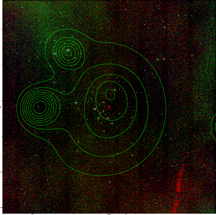  | 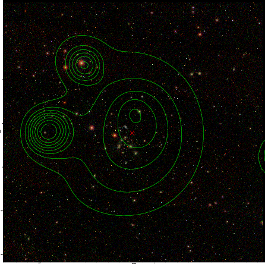  |

