

### 40

|Name|RAJ2000[deg]|DEJ2000[deg] |Ext[arcmin]| Ext,ml | z | z_src| C|GC(XSZ,Delta_z<0.01)| GC(OPT,Delta_z<0.01)|GC| R_sig[arcmin] | R500[arcmin] | R500[Mpc]| CRsig[c/s] | CR500[c/s] |L500[1E44 erg/s]|F500[1E-12 erg/s/cm^2]| M500[1E14 Msun]|Tx[keV]|Cnt_sig|Beta|Rc[arcmin]|Comment|Alias|
|---|---|---|---|---|---|------|---|--------|---------|----------|---|---|---|---|---|---|---|---|---|---|---|---|---|---|
|40| 13.148| -8.339| 9.22| 34.10| 0.0710(0.006)| z1, z_xsz| B| F20| -| F20, N, W| 28.650| 8.754| 0.711| 0.131(0.058)| 0.118(0.052)| 0.247(0.123)| 2.009(1.005)| 1.09(0.28)| 2.31(0.37)| 85.1| 0.724(-0.142+0.174)| 7.644(-2.384+2.480)| -| t420|

|[RASS image](../image/40/40_img.pdf)|[filtered image](../image/40/40_fil.pdf)|[Segment image](../image/40/40_seg.pdf)|
|-------------------|--------------------|-------------------|
| 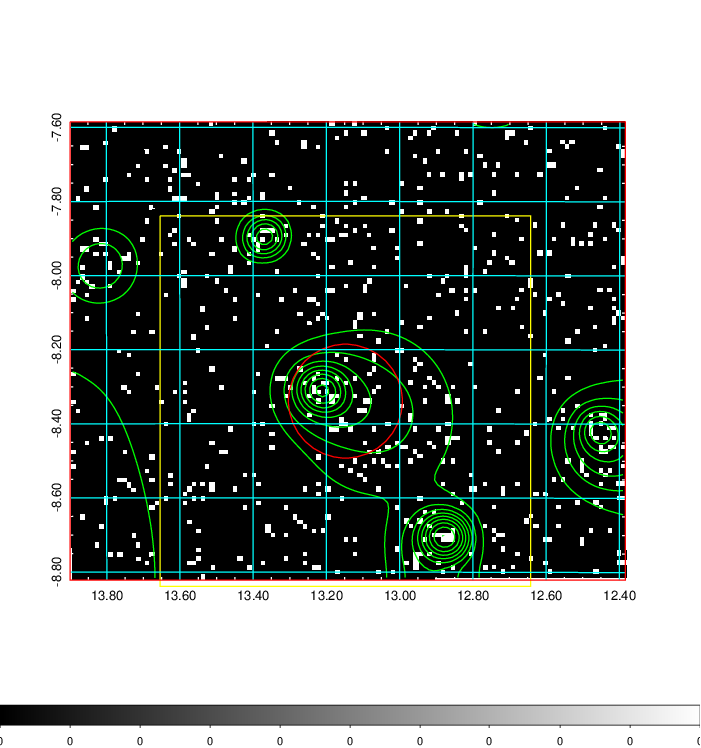  | 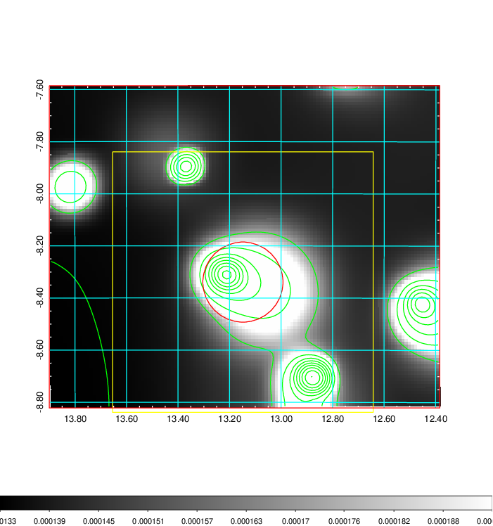   | 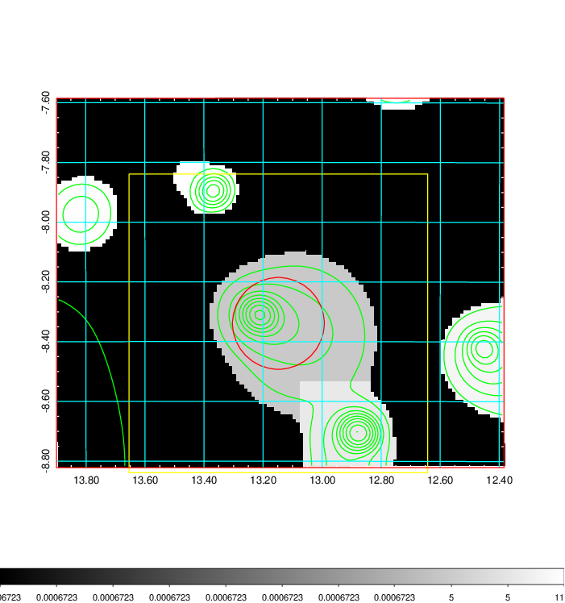  |

|[Exposure image](../image/40/40_mex.pdf)| [nH image](../image/40/40_nh.pdf)| [Planck image](../image/40/40_p.pdf)|
|-------------------|--------------------|-------------------|
|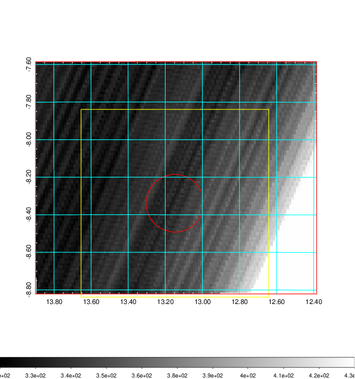   | 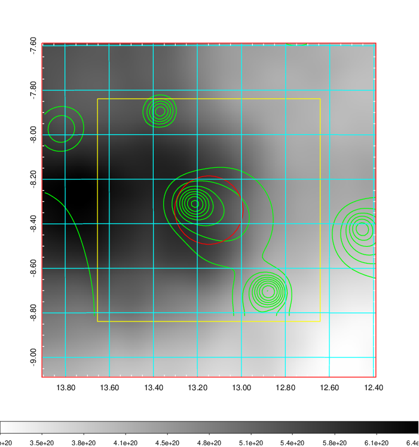    | 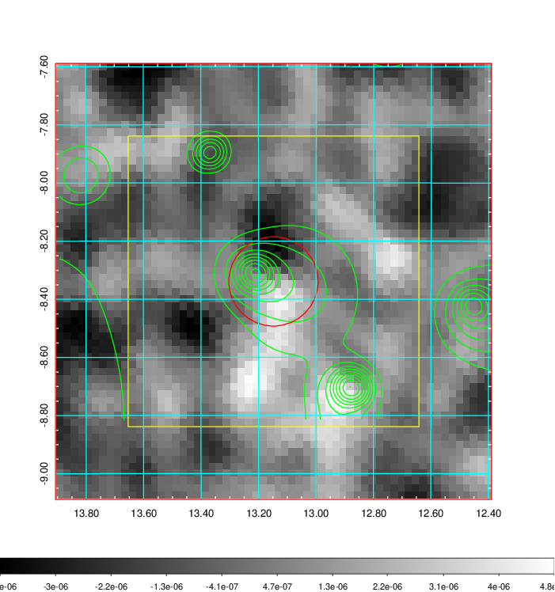 |

|[Redshift Histogram](../image/40/40_zg.pdf) | [DSS image(z1)](../image/40/40_dss_z1.pdf)      |  [DSS image(z2)](../image/40/40_dss_z2.pdf)    |
|-------------------|--------------------|-------------------|
|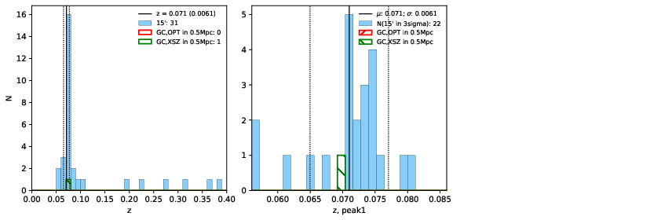 |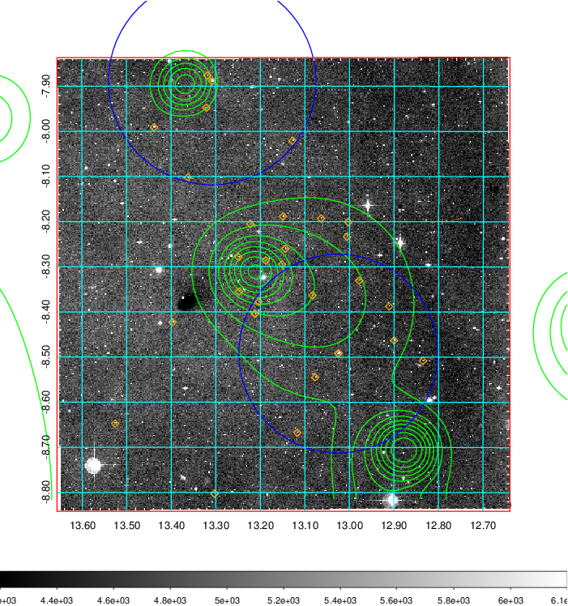  Blue circle for optical clusters;  Magenta circle for XSZ clusters;  all with r=1Mpc;  Only GC with Delta_z<0.01 are shown. | 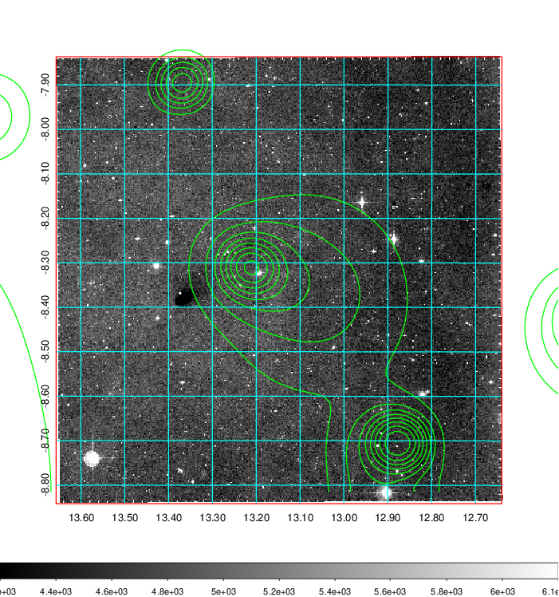 Blue circle for optical clusters;  Magenta circle for XSZ clusters;  all with r=1Mpc;  Only GC with Delta_z<0.01 are shown.  |

|[Previous-identified clusters](../image/40/40_gc.pdf) | [2MASS image](../image/40/40_2mass.pdf)      |[SDSS image](../image/40/40_sdss.pdf)   |
|-------------------|-------------------|-------------------|
|  Green, magenta, and blue circles  for optical, X-ray and SZ clusters  respectively, with redshift of clusters  labelled. The radius of circles  are 1Mpc.|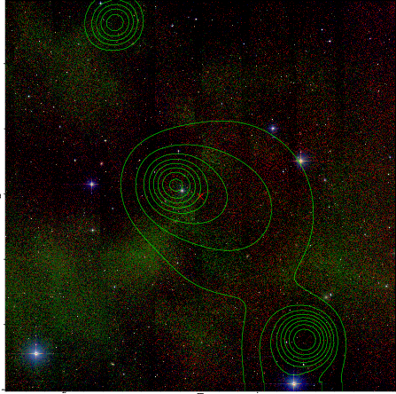  | 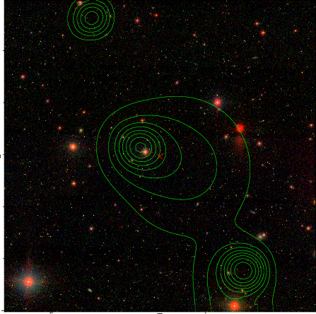  |

