

### 402

|Name|RAJ2000[deg]|DEJ2000[deg] |Ext[arcmin]| Ext,ml | z | z_src| C|GC(XSZ,Delta_z<0.01)| GC(OPT,Delta_z<0.01)|GC| R_sig[arcmin] | R500[arcmin] | R500[Mpc]| CRsig[c/s] | CR500[c/s] |L500[1E44 erg/s]|F500[1E-12 erg/s/cm^2]| M500[1E14 Msun]|Tx[keV]|Cnt_sig|Beta|Rc[arcmin]|Comment|Alias|
|---|---|---|---|---|---|------|---|--------|---------|----------|---|---|---|---|---|---|---|---|---|---|---|---|---|---|
|402| 170.355| 17.868| 22.57| 44.48| 0.0863(0.005)| z1,| G| -| -| A, N, W| 29.710| 8.796| 0.853| 0.242(0.083)| 0.216(0.075)| 0.798(0.680)| 4.306(3.669)| 1.92(0.82)| 3.29(0.89)| 169.2| 0.502(-0.002+0.005)| 5.431(-0.200+0.386)| -| t599|

|[RASS image](../image/402/402_img.pdf)|[filtered image](../image/402/402_fil.pdf)|[Segment image](../image/402/402_seg.pdf)|
|-------------------|--------------------|-------------------|
| 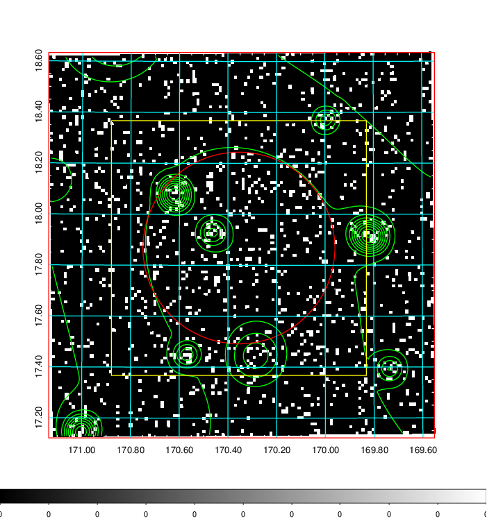  | 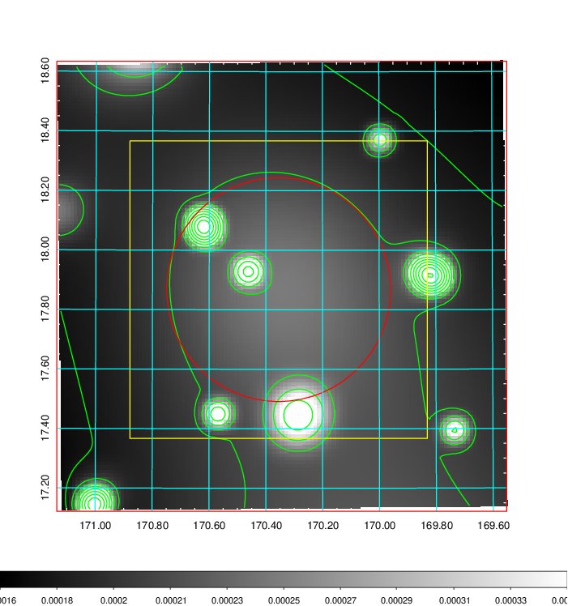   | 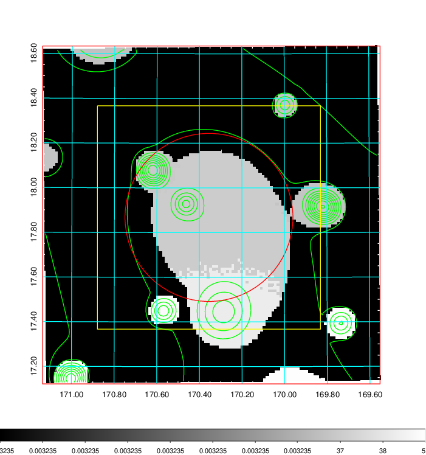  |

|[Exposure image](../image/402/402_mex.pdf)| [nH image](../image/402/402_nh.pdf)| [Planck image](../image/402/402_p.pdf)|
|-------------------|--------------------|-------------------|
|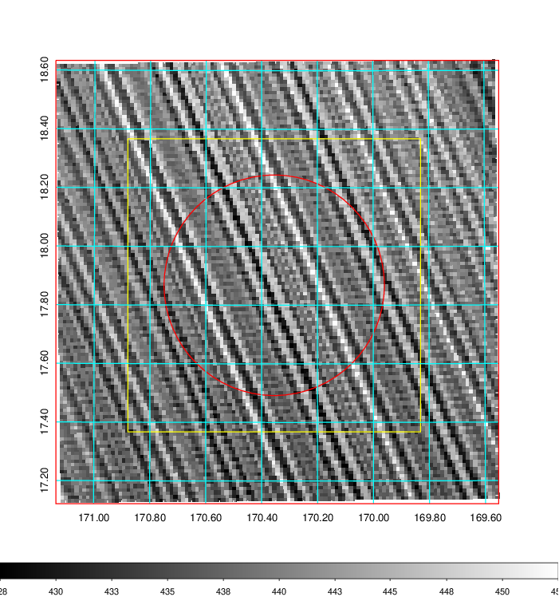   | 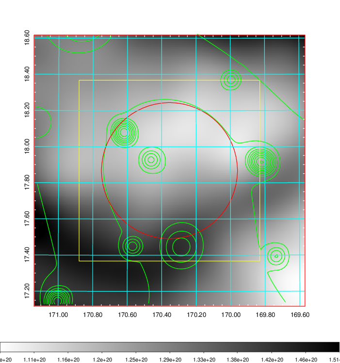    | 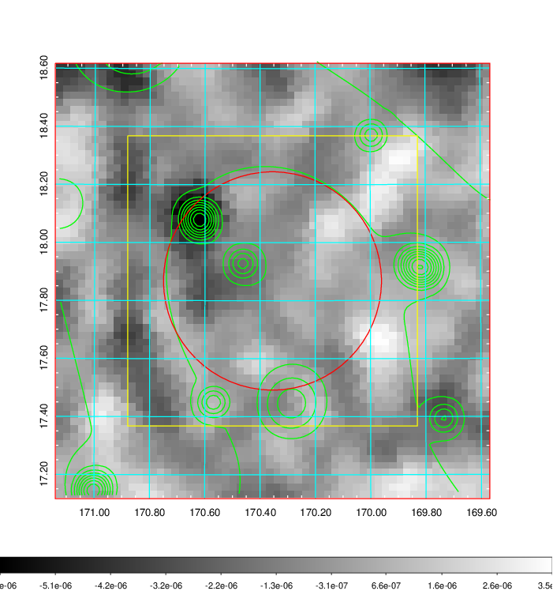 |

|[Redshift Histogram](../image/402/402_zg.pdf) | [DSS image(z1)](../image/402/402_dss_z1.pdf)      |  [DSS image(z2)](../image/402/402_dss_z2.pdf)    |
|-------------------|--------------------|-------------------|
|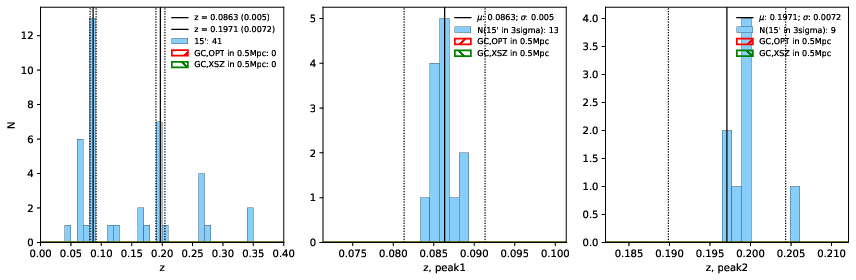 |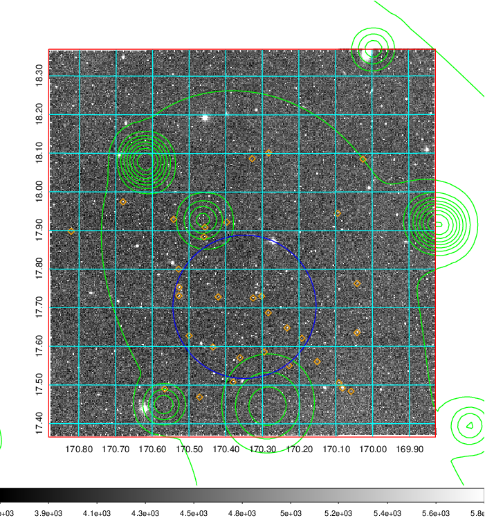  Blue circle for optical clusters;  Magenta circle for XSZ clusters;  all with r=1Mpc;  Only GC with Delta_z<0.01 are shown. | 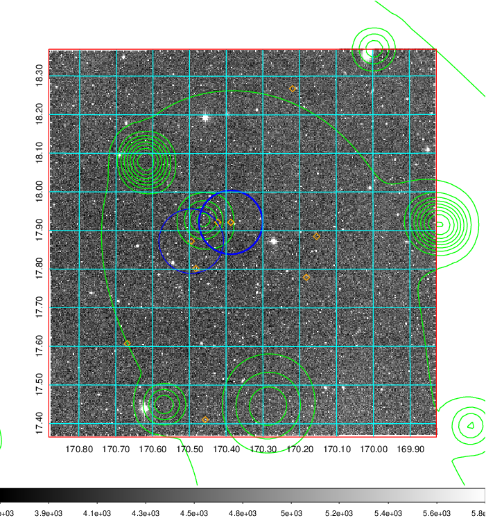 Blue circle for optical clusters;  Magenta circle for XSZ clusters;  all with r=1Mpc;  Only GC with Delta_z<0.01 are shown.  |

|[known Abell/XSZ clusters](../image/402/402_gc.pdf) | [2MASS image](../image/402/402_2mass.pdf)      |[SDSS image](../image/402/402_sdss.pdf)   |
|-------------------|-------------------|-------------------|
|  Magenta, blue and green circles  for optical, X-ray and SZ clusters  respectively, with redshift of clusters  labelled. The radius of circles  are 1Mpc.|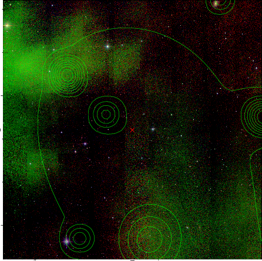  | 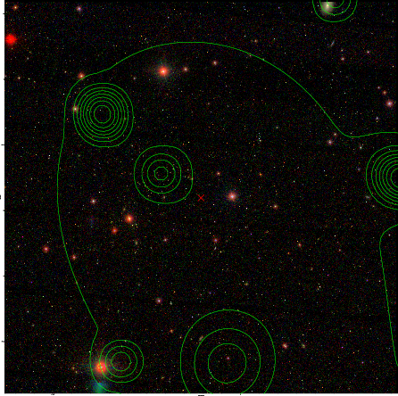  |

