

### 403

|Name|RAJ2000[deg]|DEJ2000[deg] |Ext[arcmin]| Ext,ml | z | z_src| C|GC(XSZ,Delta_z<0.01)| GC(OPT,Delta_z<0.01)|GC| R_sig[arcmin] | R500[arcmin] | R500[Mpc]| CRsig[c/s] | CR500[c/s] |L500[1E44 erg/s]|F500[1E-12 erg/s/cm^2]| M500[1E14 Msun]|Tx[keV]|Cnt_sig|Beta|Rc[arcmin]|Comment|Alias|
|---|---|---|---|---|---|------|---|--------|---------|----------|---|---|---|---|---|---|---|---|---|---|---|---|---|---|
|403| 170.386| 48.061| 2.36| 28.02| 0.1184(0.008)| z1, z_xsz| B| F20, MCXC, SPI, Tar| A, C, N, RM, W| A, C, F20, MCXC, N, SPI, Tar, W| 7.825| 7.013| 0.900| 0.157(0.034)| 0.154(0.034)| 1.133(0.159)| 3.111(0.436)| 2.32(0.16)| 3.74(0.17)| 54.6| 0.860(-0.141+0.100)| 4.449(-1.001+0.750)| -| k272|

|[RASS image](../image/403/403_img.pdf)|[filtered image](../image/403/403_fil.pdf)|[Segment image](../image/403/403_seg.pdf)|
|-------------------|--------------------|-------------------|
| 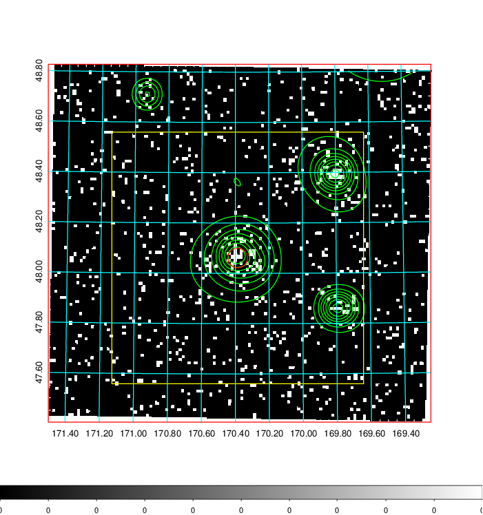  | 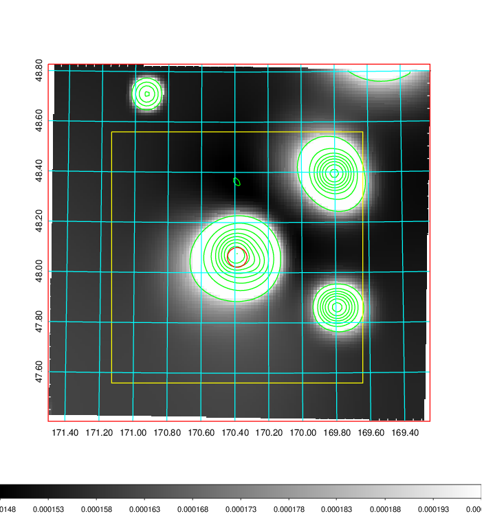   | 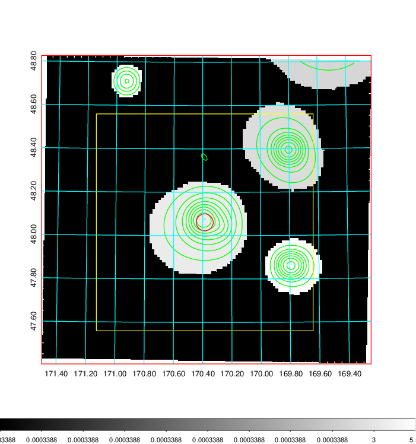  |

|[Exposure image](../image/403/403_mex.pdf)| [nH image](../image/403/403_nh.pdf)| [Planck image](../image/403/403_p.pdf)|
|-------------------|--------------------|-------------------|
|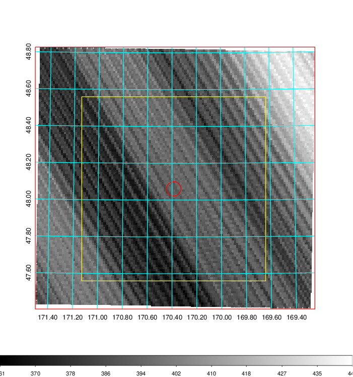   | 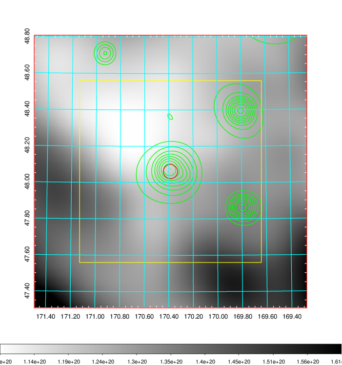    | 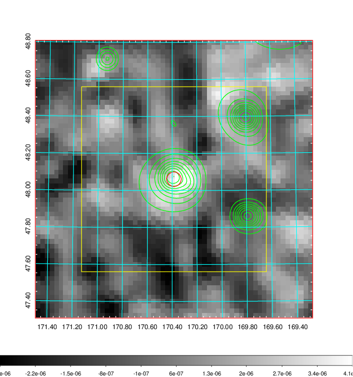 |

|[Redshift Histogram](../image/403/403_zg.pdf) | [DSS image(z1)](../image/403/403_dss_z1.pdf)      |  [DSS image(z2)](../image/403/403_dss_z2.pdf)    |
|-------------------|--------------------|-------------------|
|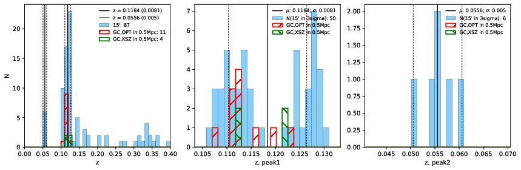 |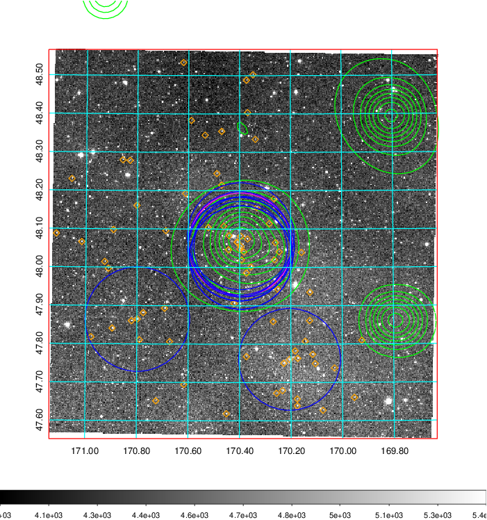  Blue circle for optical clusters;  Magenta circle for XSZ clusters;  all with r=1Mpc;  Only GC with Delta_z<0.01 are shown. | 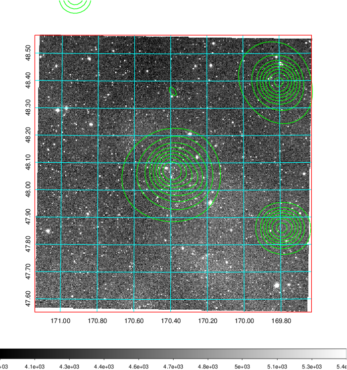 Blue circle for optical clusters;  Magenta circle for XSZ clusters;  all with r=1Mpc;  Only GC with Delta_z<0.01 are shown.  |

|[known Abell/XSZ clusters](../image/403/403_gc.pdf) | [2MASS image](../image/403/403_2mass.pdf)      |[SDSS image](../image/403/403_sdss.pdf)   |
|-------------------|-------------------|-------------------|
|  Magenta, blue and green circles  for optical, X-ray and SZ clusters  respectively, with redshift of clusters  labelled. The radius of circles  are 1Mpc.|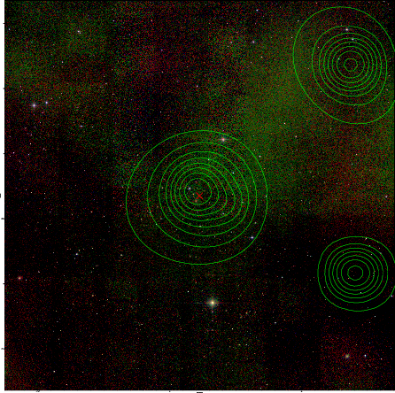  | 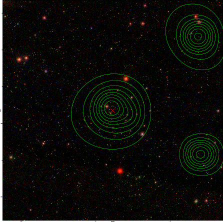  |

