

### 404

|Name|RAJ2000[deg]|DEJ2000[deg] |Ext[arcmin]| Ext,ml | z | z_src| C|GC(XSZ,Delta_z<0.01)| GC(OPT,Delta_z<0.01)|GC| R_sig[arcmin] | R500[arcmin] | R500[Mpc]| CRsig[c/s] | CR500[c/s] |L500[1E44 erg/s]|F500[1E-12 erg/s/cm^2]| M500[1E14 Msun]|Tx[keV]|Cnt_sig|Beta|Rc[arcmin]|Comment|Alias|
|---|---|---|---|---|---|------|---|--------|---------|----------|---|---|---|---|---|---|---|---|---|---|---|---|---|---|
|404| 170.389| 2.841| 4.86| 169.24| 0.0493(0.005)| z1, z_xsz| B| MCXC, PSZ2, Tar| N, W| C, F20, MCXC, N, PSZ2, Tar, W| 10.262| 12.530| 0.725| 0.262(0.036)| 0.272(0.038)| 0.276(0.021)| 4.809(0.374)| 1.14(0.05)| 2.35(0.06)| 120.0| 0.942(-0.079+0.043)| 9.353(-0.794+0.647)| -| k517|

|[RASS image](../image/404/404_img.pdf)|[filtered image](../image/404/404_fil.pdf)|[Segment image](../image/404/404_seg.pdf)|
|-------------------|--------------------|-------------------|
| 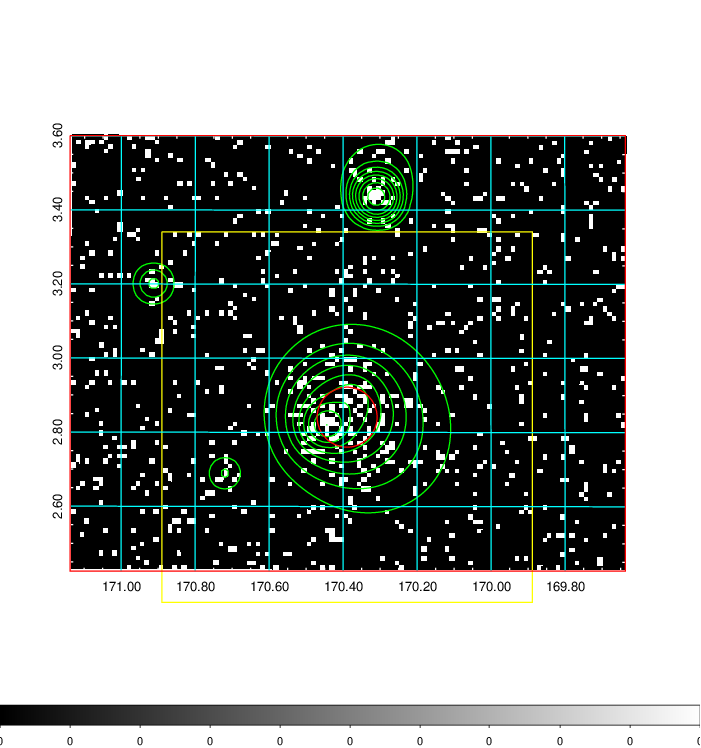  | 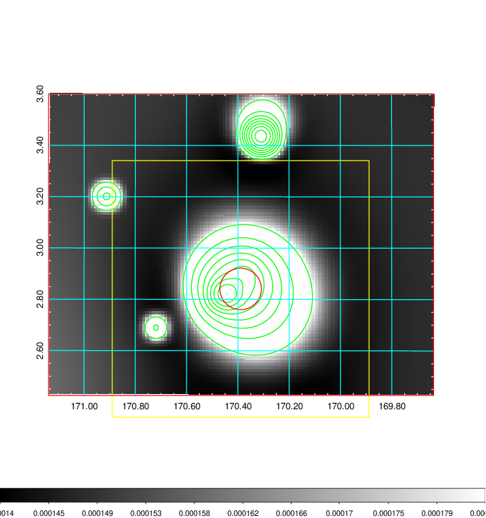   | 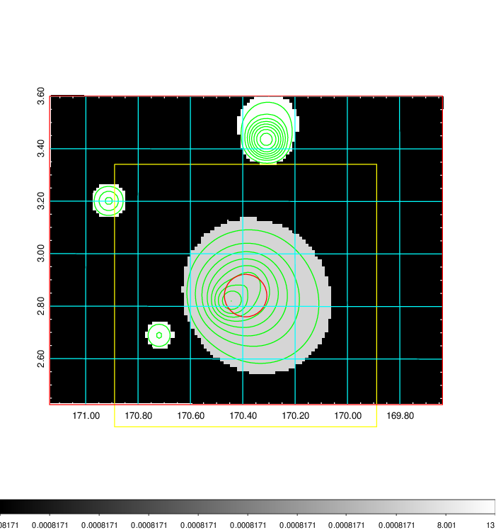  |

|[Exposure image](../image/404/404_mex.pdf)| [nH image](../image/404/404_nh.pdf)| [Planck image](../image/404/404_p.pdf)|
|-------------------|--------------------|-------------------|
|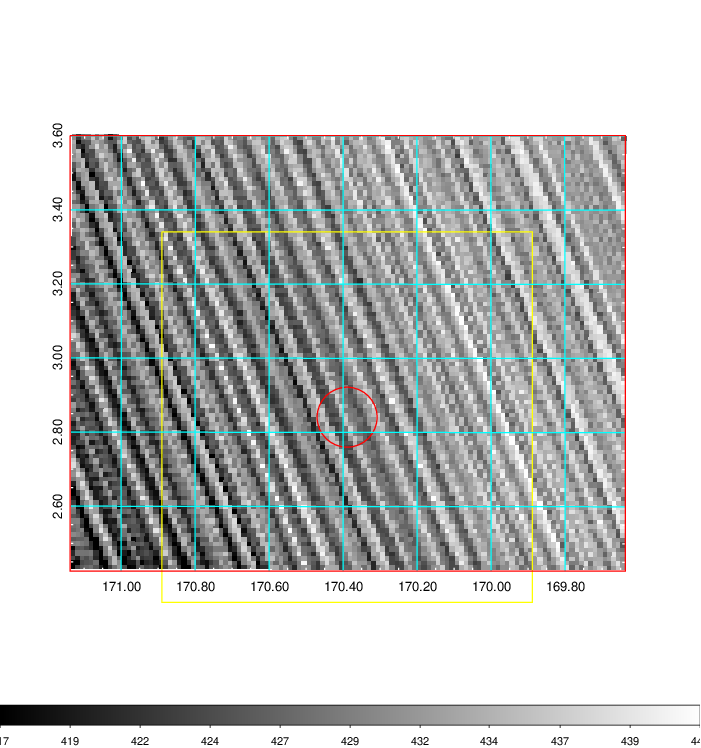   | 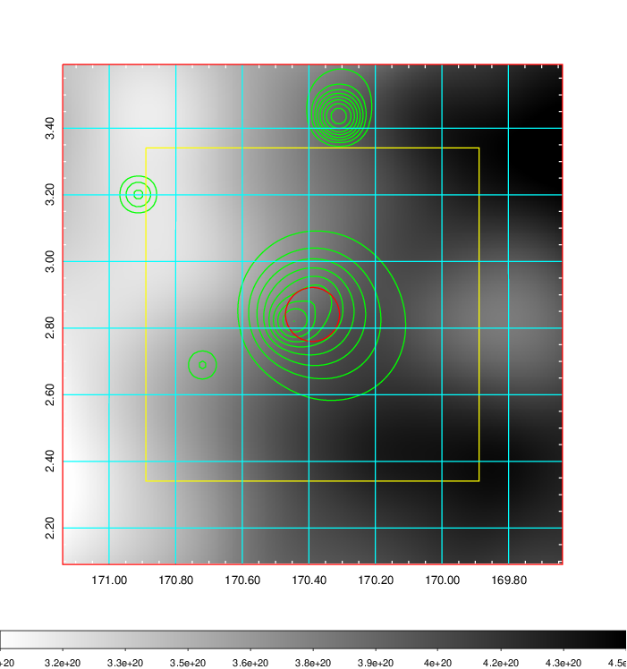    | 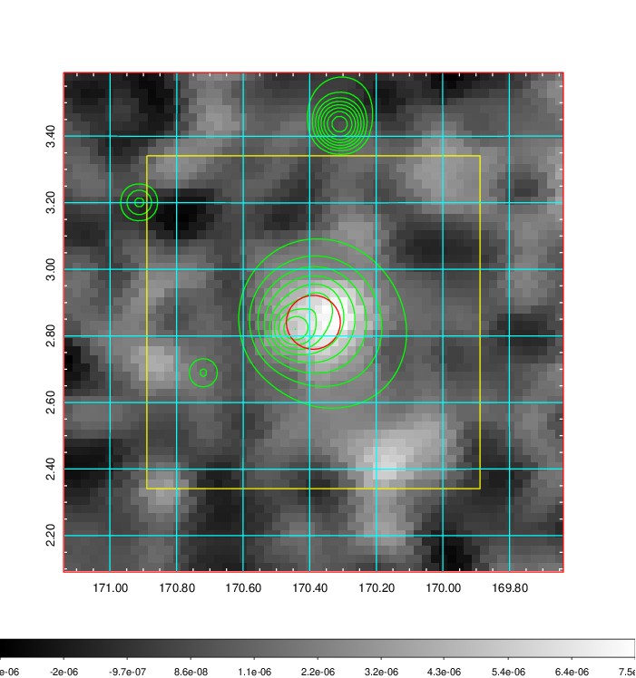 |

|[Redshift Histogram](../image/404/404_zg.pdf) | [DSS image(z1)](../image/404/404_dss_z1.pdf)      |  [DSS image(z2)](../image/404/404_dss_z2.pdf)    |
|-------------------|--------------------|-------------------|
|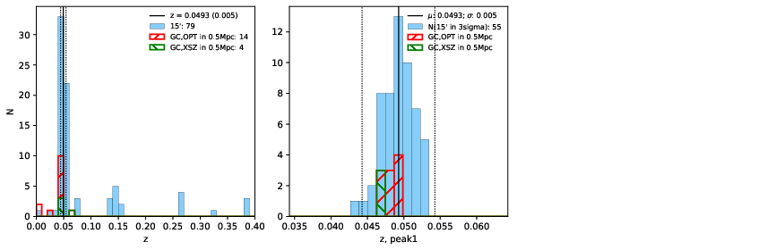 |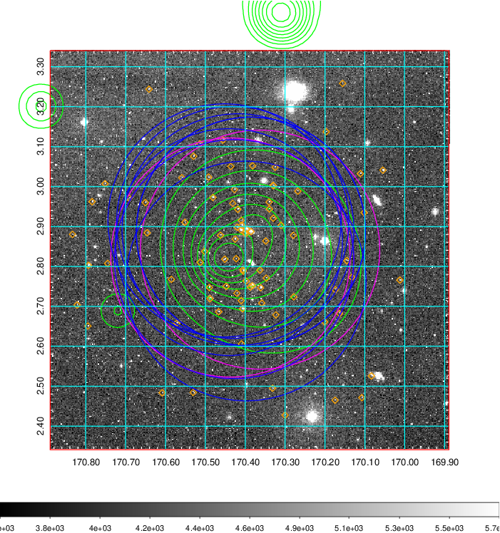  Blue circle for optical clusters;  Magenta circle for XSZ clusters;  all with r=1Mpc;  Only GC with Delta_z<0.01 are shown. | 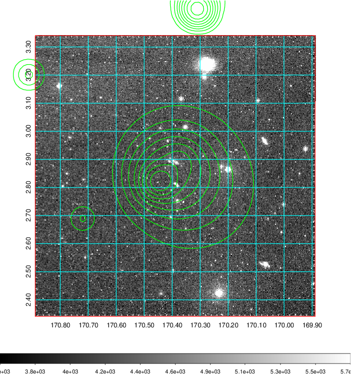 Blue circle for optical clusters;  Magenta circle for XSZ clusters;  all with r=1Mpc;  Only GC with Delta_z<0.01 are shown.  |

|[Previous-identified clusters](../image/404/404_gc.pdf) | [2MASS image](../image/404/404_2mass.pdf)      |[SDSS image](../image/404/404_sdss.pdf)   |
|-------------------|-------------------|-------------------|
|  Green, magenta, and blue circles  for optical, X-ray and SZ clusters  respectively, with redshift of clusters  labelled. The radius of circles  are 1Mpc.|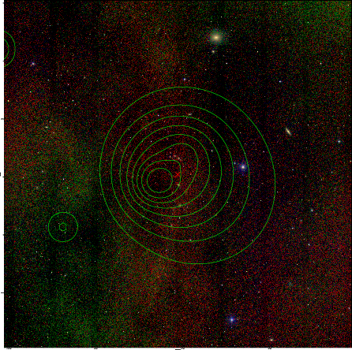  | 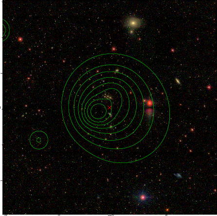  |

