

### 405

|Name|RAJ2000[deg]|DEJ2000[deg] |Ext[arcmin]| Ext,ml | z | z_src| C|GC(XSZ,Delta_z<0.01)| GC(OPT,Delta_z<0.01)|GC| R_sig[arcmin] | R500[arcmin] | R500[Mpc]| CRsig[c/s] | CR500[c/s] |L500[1E44 erg/s]|F500[1E-12 erg/s/cm^2]| M500[1E14 Msun]|Tx[keV]|Cnt_sig|Beta|Rc[arcmin]|Comment|Alias|
|---|---|---|---|---|---|------|---|--------|---------|----------|---|---|---|---|---|---|---|---|---|---|---|---|---|---|
|405| 170.470| 12.518| 5.87| 25.15| 0.0829(0.005)| z1, z_xsz| B| F20| -| C, F20, N, W| 45.055| 9.856| 0.922| 0.373(0.082)| 0.330(0.072)| 1.090(0.630)| 6.403(3.703)| 2.41(0.70)| 3.78(0.69)| 191.4| 0.529(-0.022+0.068)| 20.966(-2.719+4.692)| -| t302|

|[RASS image](../image/405/405_img.pdf)|[filtered image](../image/405/405_fil.pdf)|[Segment image](../image/405/405_seg.pdf)|
|-------------------|--------------------|-------------------|
| 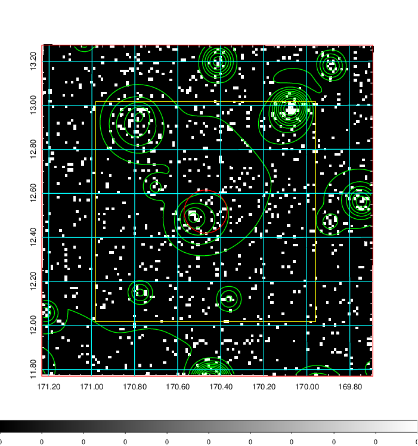  | 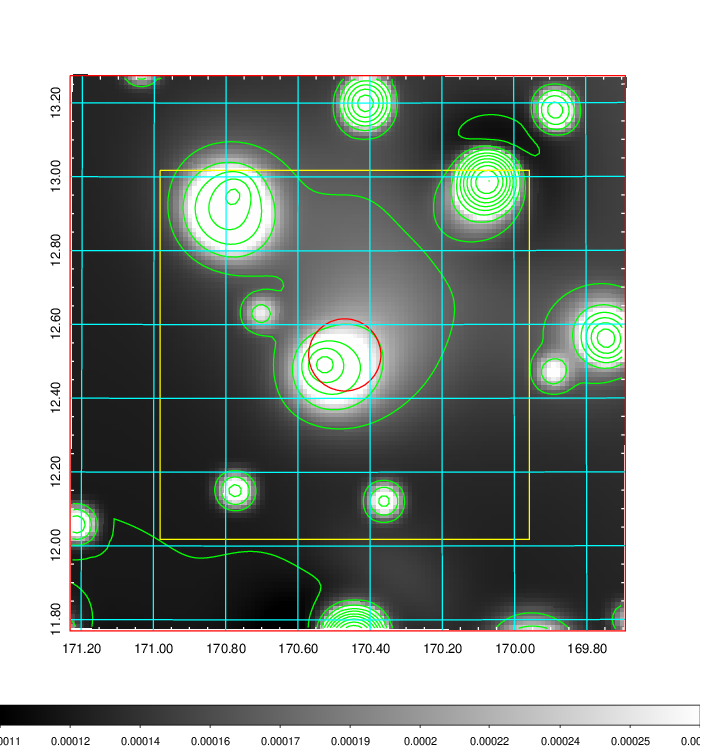   | 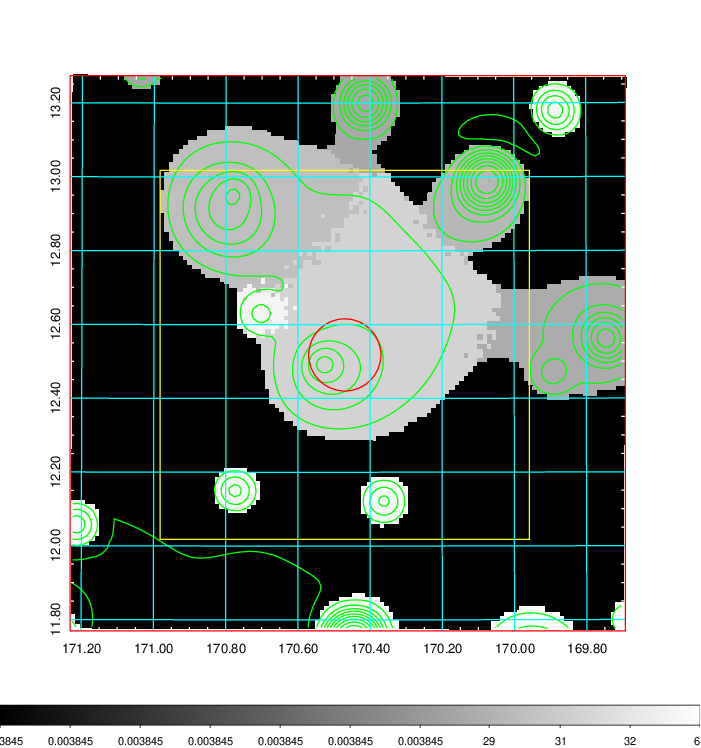  |

|[Exposure image](../image/405/405_mex.pdf)| [nH image](../image/405/405_nh.pdf)| [Planck image](../image/405/405_p.pdf)|
|-------------------|--------------------|-------------------|
|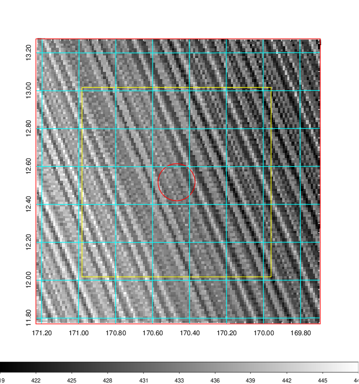   | 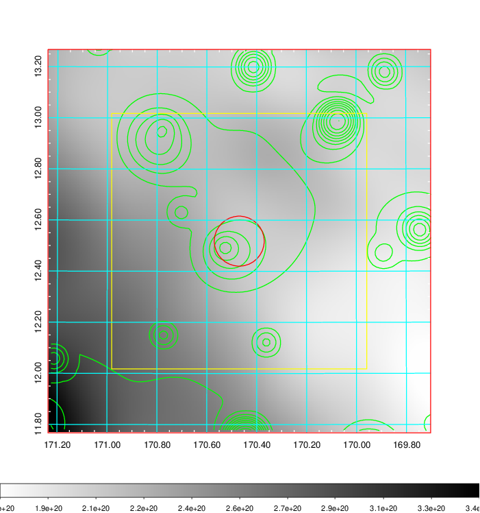    | 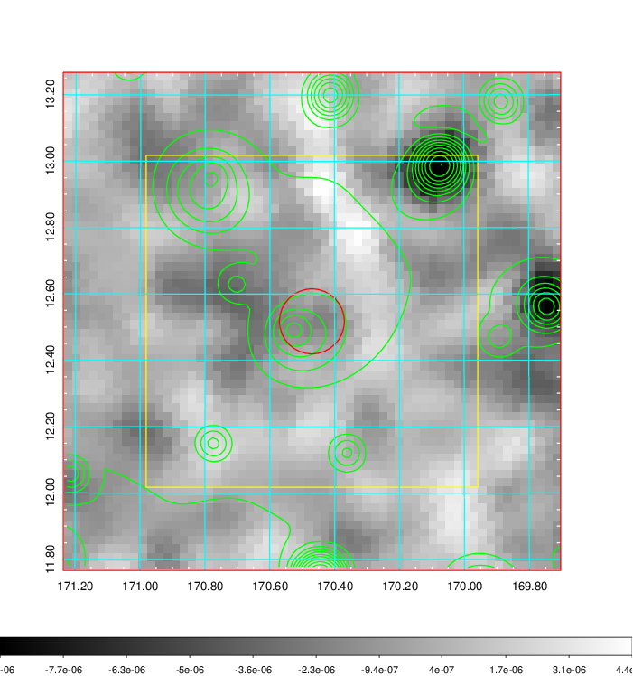 |

|[Redshift Histogram](../image/405/405_zg.pdf) | [DSS image(z1)](../image/405/405_dss_z1.pdf)      |  [DSS image(z2)](../image/405/405_dss_z2.pdf)    |
|-------------------|--------------------|-------------------|
|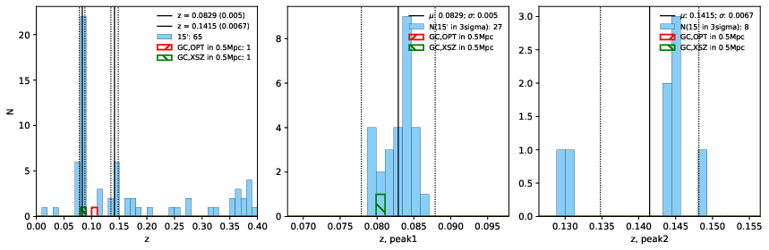 |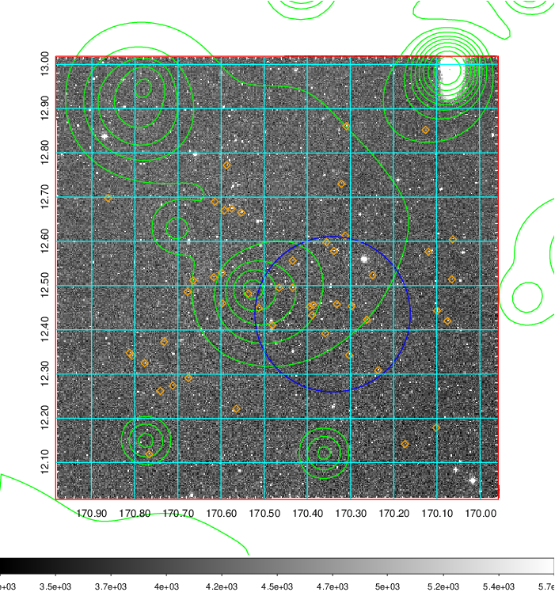  Blue circle for optical clusters;  Magenta circle for XSZ clusters;  all with r=1Mpc;  Only GC with Delta_z<0.01 are shown. | 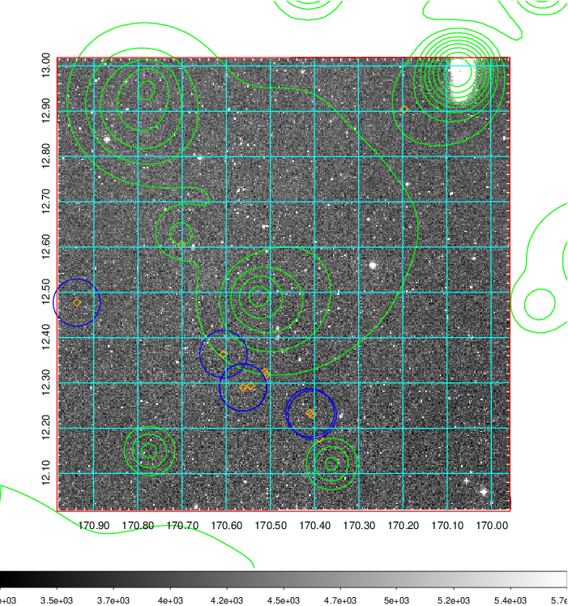 Blue circle for optical clusters;  Magenta circle for XSZ clusters;  all with r=1Mpc;  Only GC with Delta_z<0.01 are shown.  |

|[known Abell/XSZ clusters](../image/405/405_gc.pdf) | [2MASS image](../image/405/405_2mass.pdf)      |[SDSS image](../image/405/405_sdss.pdf)   |
|-------------------|-------------------|-------------------|
|  Magenta, blue and green circles  for optical, X-ray and SZ clusters  respectively, with redshift of clusters  labelled. The radius of circles  are 1Mpc.|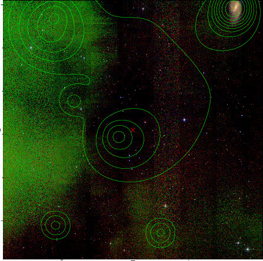  | 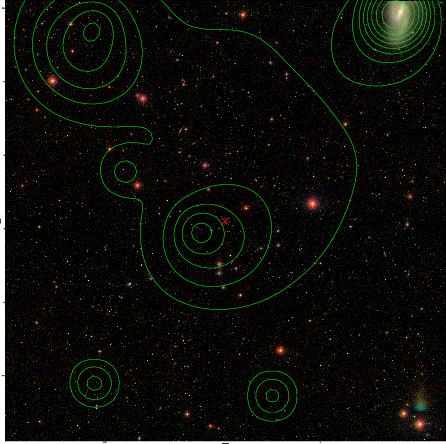  |

