

### 406

|Name|RAJ2000[deg]|DEJ2000[deg] |Ext[arcmin]| Ext,ml | z | z_src| C|GC(XSZ,Delta_z<0.01)| GC(OPT,Delta_z<0.01)|GC| R_sig[arcmin] | R500[arcmin] | R500[Mpc]| CRsig[c/s] | CR500[c/s] |L500[1E44 erg/s]|F500[1E-12 erg/s/cm^2]| M500[1E14 Msun]|Tx[keV]|Cnt_sig|Beta|Rc[arcmin]|Comment|Alias|
|---|---|---|---|---|---|------|---|--------|---------|----------|---|---|---|---|---|---|---|---|---|---|---|---|---|---|
|406| 170.603| 24.323| 3.75| 41.10| 0.0255(0.005)| z1, z_xsz| B| MCXC| N| C, F20, MCXC, N, W| 8.312| 15.814| 0.493| 0.156(0.039)| 0.184(0.045)| 0.041(0.009)| 2.682(0.612)| 0.35(0.04)| 1.13(0.08)| 41.3| 0.886(-0.131+0.082)| 6.235(-1.097+0.856)| -| k459|

|[RASS image](../image/406/406_img.pdf)|[filtered image](../image/406/406_fil.pdf)|[Segment image](../image/406/406_seg.pdf)|
|-------------------|--------------------|-------------------|
| 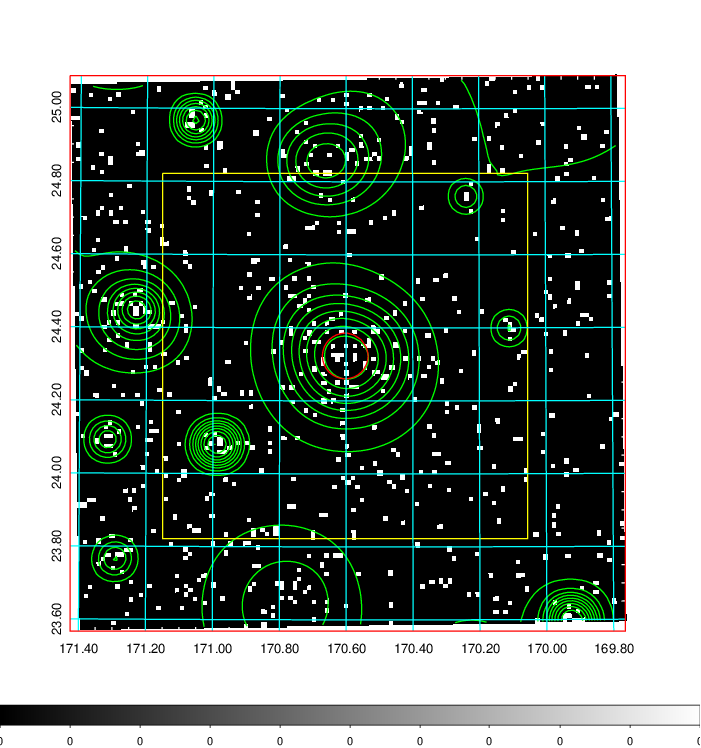  | 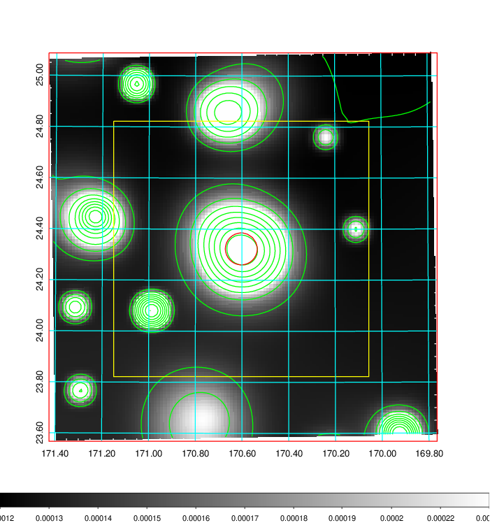   | 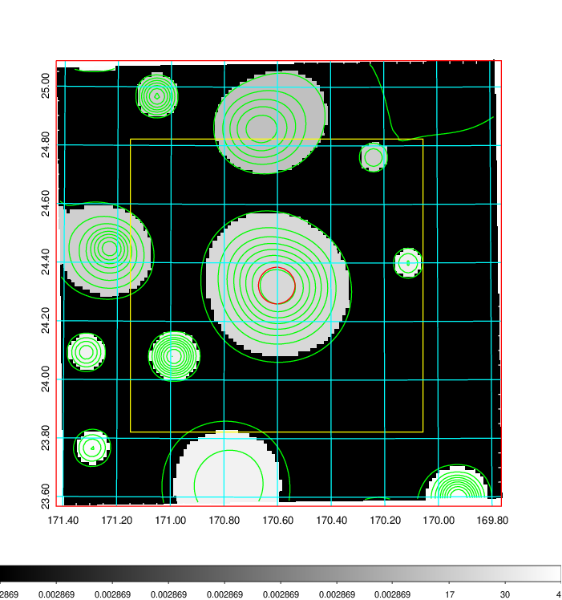  |

|[Exposure image](../image/406/406_mex.pdf)| [nH image](../image/406/406_nh.pdf)| [Planck image](../image/406/406_p.pdf)|
|-------------------|--------------------|-------------------|
|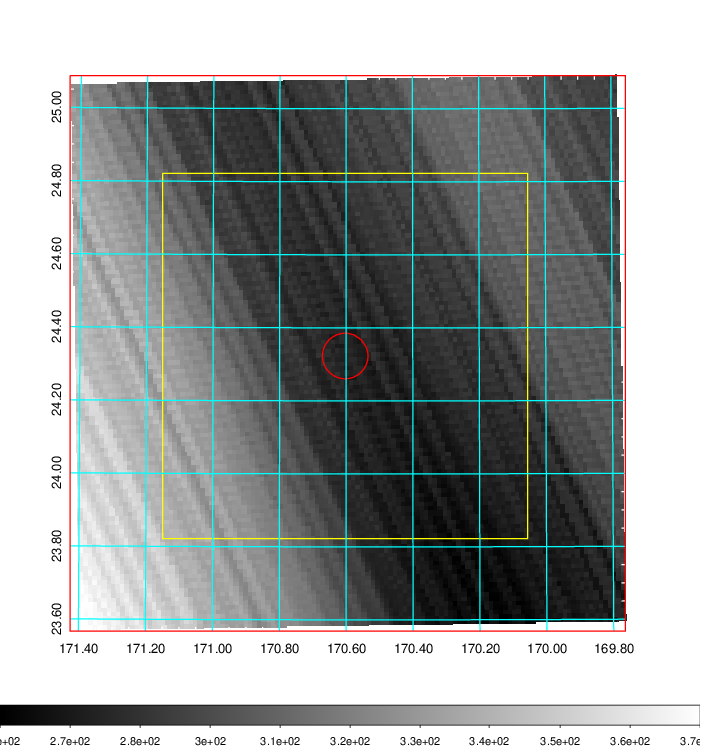   | 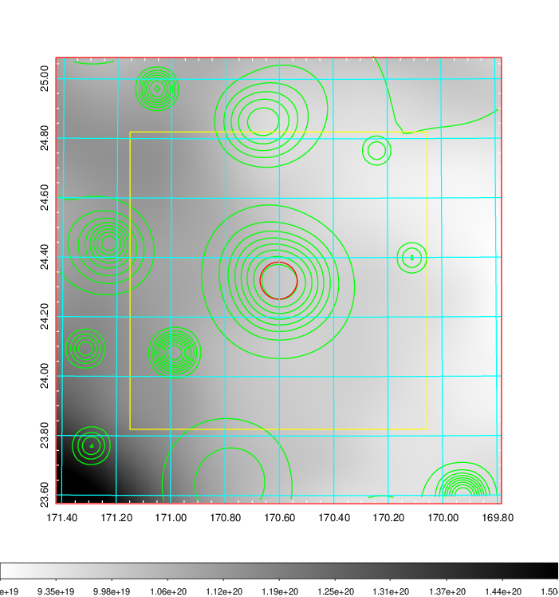    | 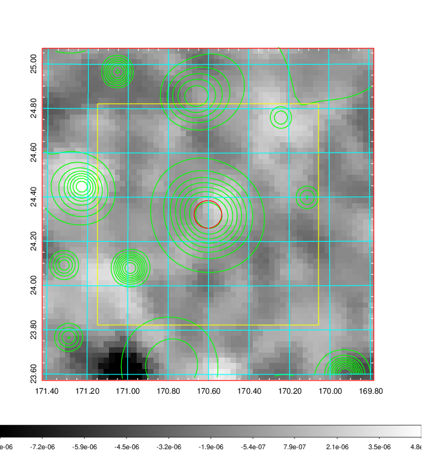 |

|[Redshift Histogram](../image/406/406_zg.pdf) | [DSS image(z1)](../image/406/406_dss_z1.pdf)      |  [DSS image(z2)](../image/406/406_dss_z2.pdf)    |
|-------------------|--------------------|-------------------|
|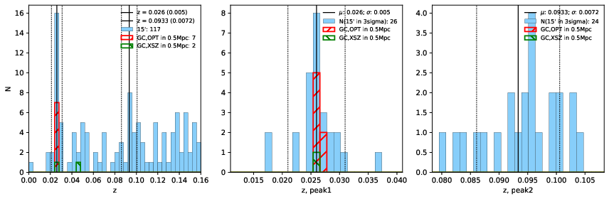 |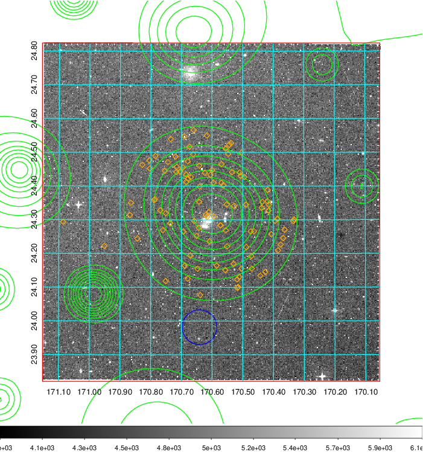  Blue circle for optical clusters;  Magenta circle for XSZ clusters;  all with r=1Mpc;  Only GC with Delta_z<0.01 are shown. | 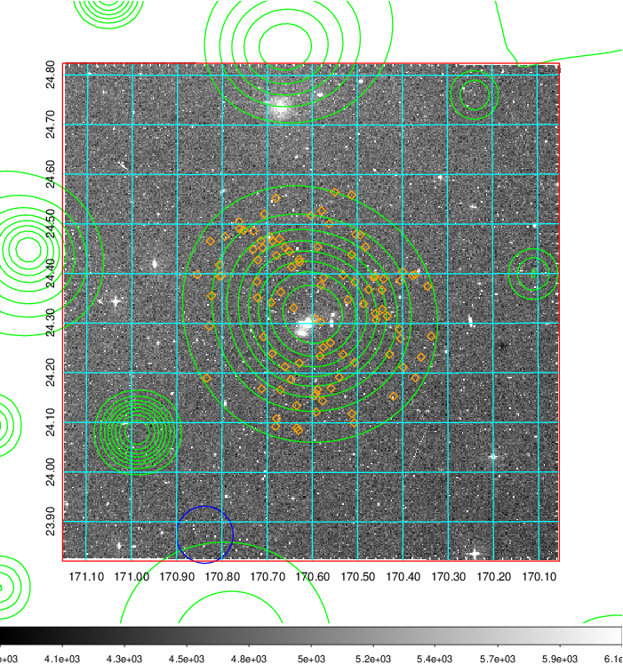 Blue circle for optical clusters;  Magenta circle for XSZ clusters;  all with r=1Mpc;  Only GC with Delta_z<0.01 are shown.  |

|[Previous-identified clusters](../image/406/406_gc.pdf) | [2MASS image](../image/406/406_2mass.pdf)      |[SDSS image](../image/406/406_sdss.pdf)   |
|-------------------|-------------------|-------------------|
|  Green, magenta, and blue circles  for optical, X-ray and SZ clusters  respectively, with redshift of clusters  labelled. The radius of circles  are 1Mpc.|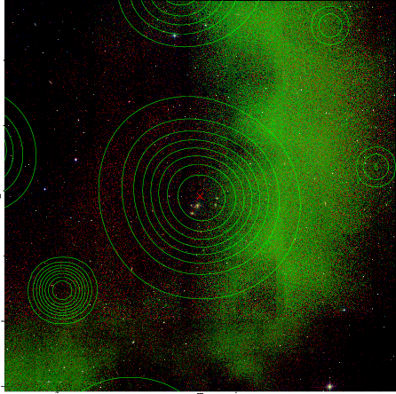  | 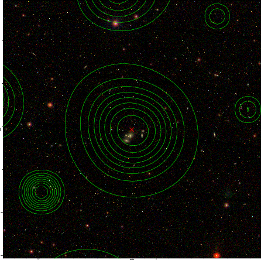  |

