

### 407

|Name|RAJ2000[deg]|DEJ2000[deg] |Ext[arcmin]| Ext,ml | z | z_src| C|GC(XSZ,Delta_z<0.01)| GC(OPT,Delta_z<0.01)|GC| R_sig[arcmin] | R500[arcmin] | R500[Mpc]| CRsig[c/s] | CR500[c/s] |L500[1E44 erg/s]|F500[1E-12 erg/s/cm^2]| M500[1E14 Msun]|Tx[keV]|Cnt_sig|Beta|Rc[arcmin]|Comment|Alias|
|---|---|---|---|---|---|------|---|--------|---------|----------|---|---|---|---|---|---|---|---|---|---|---|---|---|---|
|407| 170.800| 19.605| 1.84| 43.69| 0.1013(0.005)| z1, z_xsz| B| F20, MCXC, PSZ2, Tar, XB| A, C, N, RM, W| A, C, F20, MCXC, N, PSZ2, Tar, W, XB| 42.085| 9.736| 1.090| 0.576(0.069)| 0.511(0.061)| 2.671(0.353)| 10.251(1.355)| 4.06(0.26)| 5.24(0.22)| 313.9| 0.501(-0.001+0.002)| 3.166(-0.226+0.242)| -| k180|

|[RASS image](../image/407/407_img.pdf)|[filtered image](../image/407/407_fil.pdf)|[Segment image](../image/407/407_seg.pdf)|
|-------------------|--------------------|-------------------|
| 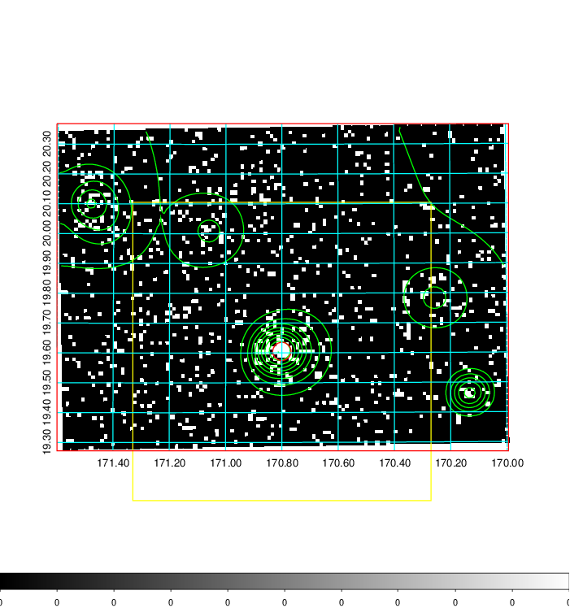  | 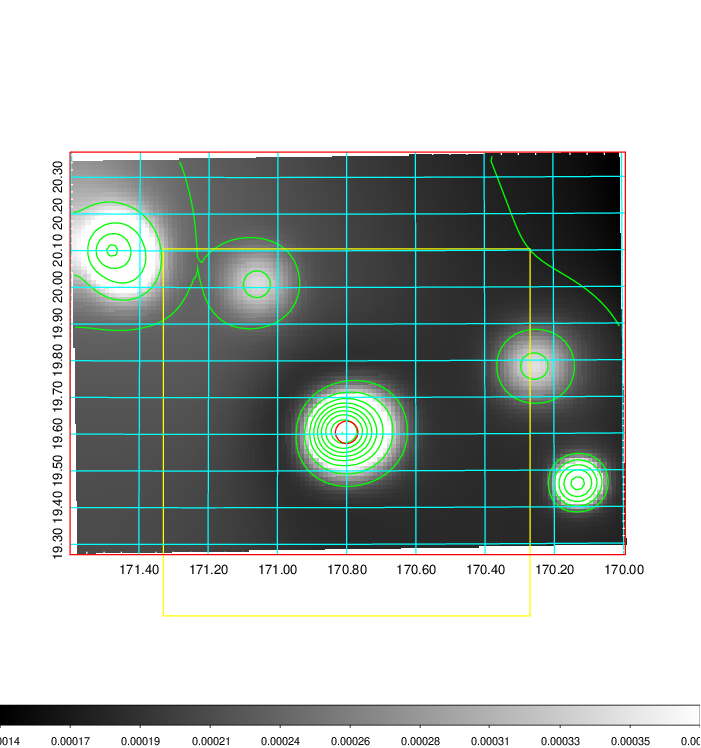   | 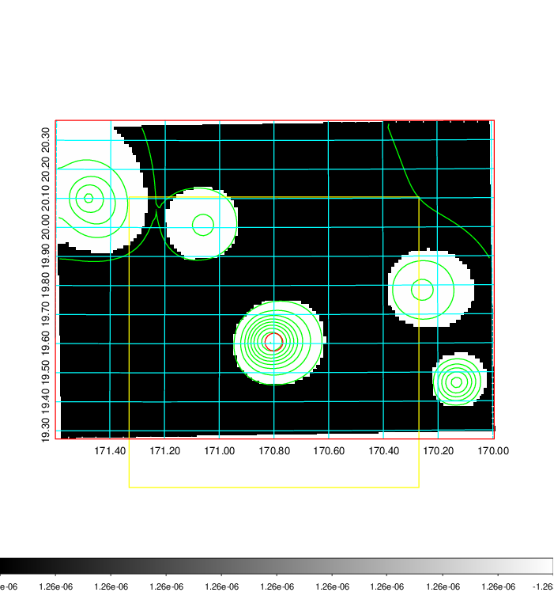  |

|[Exposure image](../image/407/407_mex.pdf)| [nH image](../image/407/407_nh.pdf)| [Planck image](../image/407/407_p.pdf)|
|-------------------|--------------------|-------------------|
|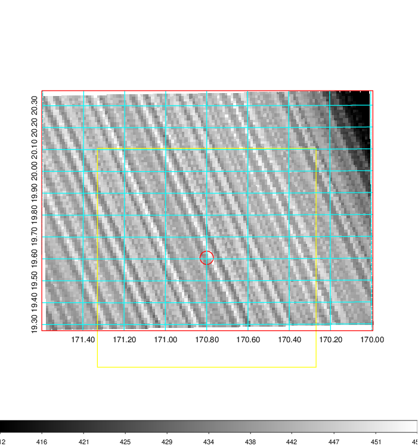   | 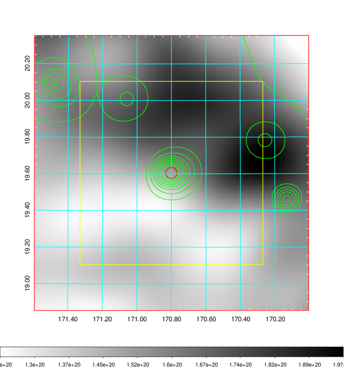    | 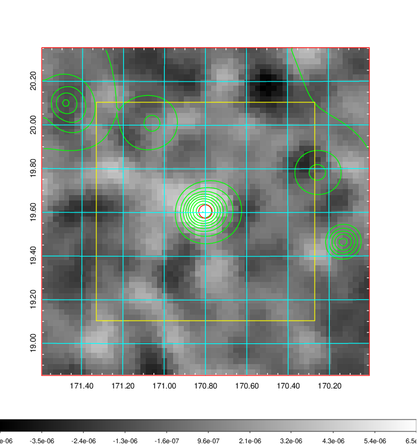 |

|[Redshift Histogram](../image/407/407_zg.pdf) | [DSS image(z1)](../image/407/407_dss_z1.pdf)      |  [DSS image(z2)](../image/407/407_dss_z2.pdf)    |
|-------------------|--------------------|-------------------|
|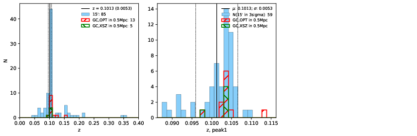 |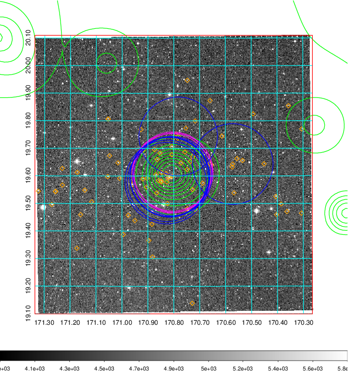  Blue circle for optical clusters;  Magenta circle for XSZ clusters;  all with r=1Mpc;  Only GC with Delta_z<0.01 are shown. | 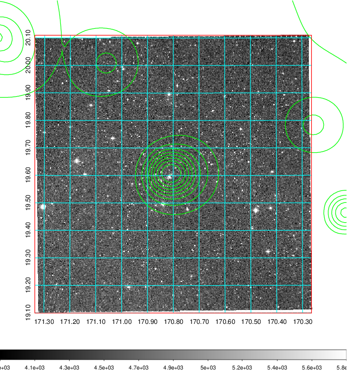 Blue circle for optical clusters;  Magenta circle for XSZ clusters;  all with r=1Mpc;  Only GC with Delta_z<0.01 are shown.  |

|[Previous-identified clusters](../image/407/407_gc.pdf) | [2MASS image](../image/407/407_2mass.pdf)      |[SDSS image](../image/407/407_sdss.pdf)   |
|-------------------|-------------------|-------------------|
|  Green, magenta, and blue circles  for optical, X-ray and SZ clusters  respectively, with redshift of clusters  labelled. The radius of circles  are 1Mpc.|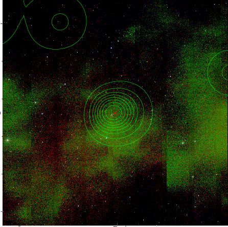  | 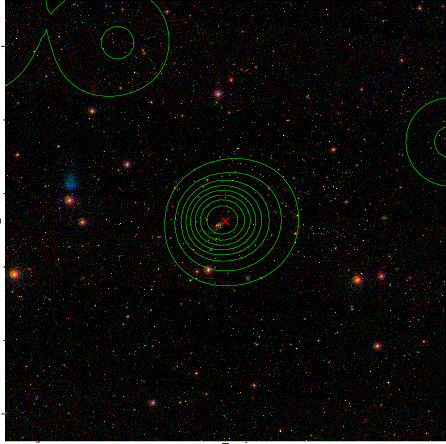  |

