

### 409

|Name|RAJ2000[deg]|DEJ2000[deg] |Ext[arcmin]| Ext,ml | z | z_src| C|GC(XSZ,Delta_z<0.01)| GC(OPT,Delta_z<0.01)|GC| R_sig[arcmin] | R500[arcmin] | R500[Mpc]| CRsig[c/s] | CR500[c/s] |L500[1E44 erg/s]|F500[1E-12 erg/s/cm^2]| M500[1E14 Msun]|Tx[keV]|Cnt_sig|Beta|Rc[arcmin]|Comment|Alias|
|---|---|---|---|---|---|------|---|--------|---------|----------|---|---|---|---|---|---|---|---|---|---|---|---|---|---|
|409| 171.761| 17.121| 1.92| 44.11| 0.1291(0.005)| z1, z_xsz| B| F20, MCXC| A, C, N, RM, W| A, C, F20, MCXC, N, W| 11.725| 6.827| 0.944| 0.175(0.032)| 0.163(0.030)| 1.432(0.143)| 3.262(0.326)| 2.71(0.13)| 4.12(0.13)| 83.5| 0.843(-0.131+0.107)| 3.684(-0.828+0.639)| -| k202|

|[RASS image](../image/409/409_img.pdf)|[filtered image](../image/409/409_fil.pdf)|[Segment image](../image/409/409_seg.pdf)|
|-------------------|--------------------|-------------------|
| 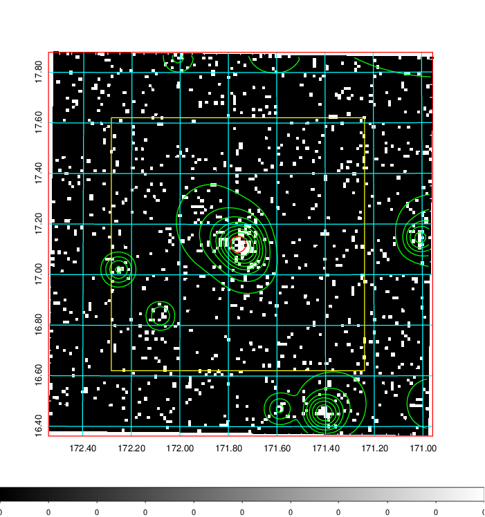  | 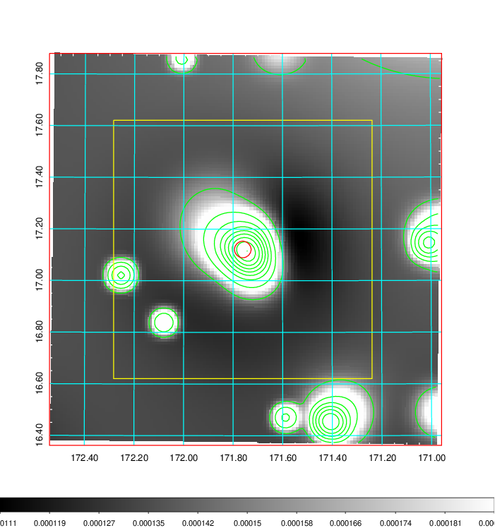   | 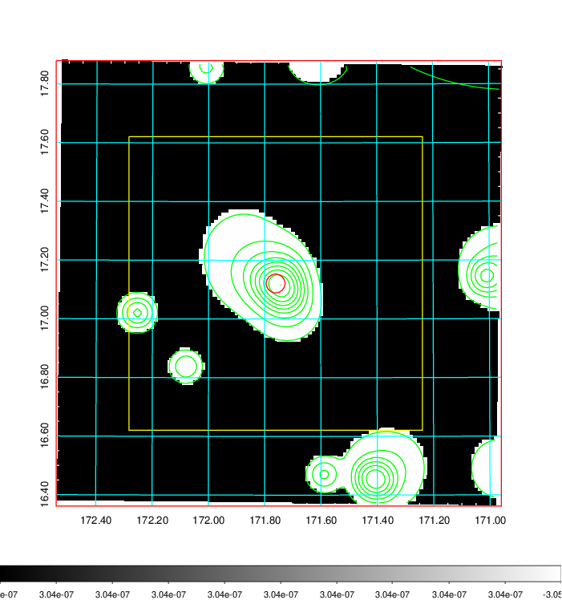  |

|[Exposure image](../image/409/409_mex.pdf)| [nH image](../image/409/409_nh.pdf)| [Planck image](../image/409/409_p.pdf)|
|-------------------|--------------------|-------------------|
|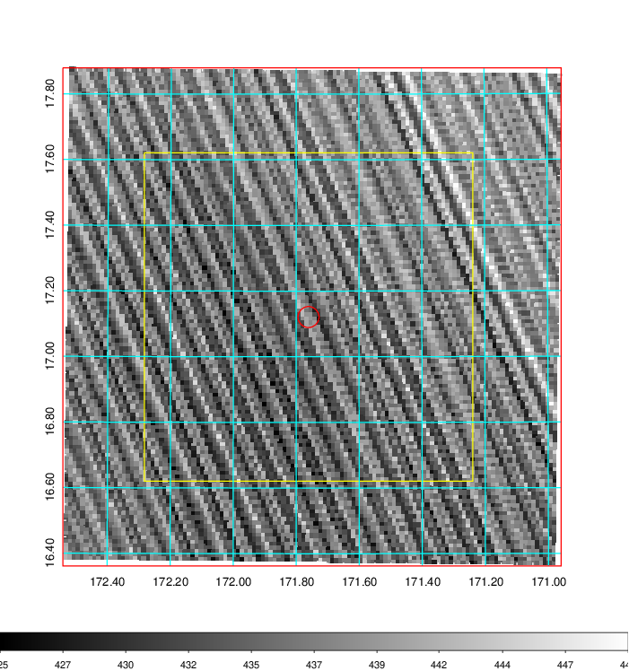   | 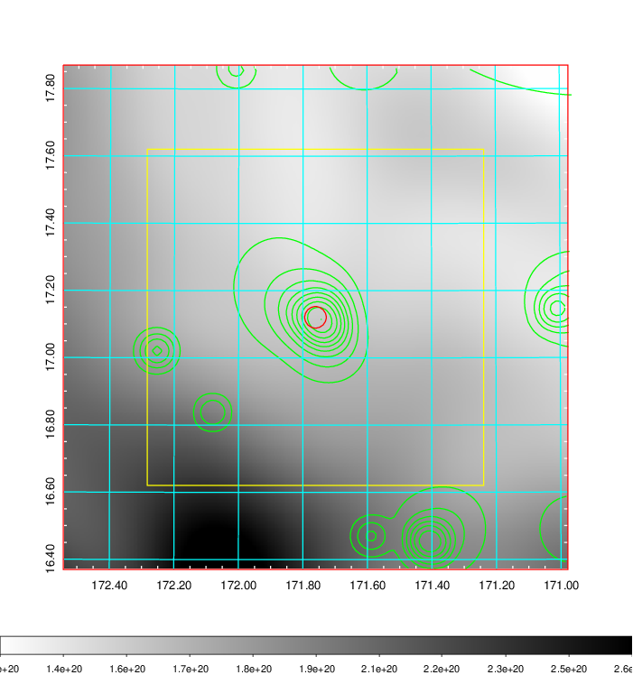    | 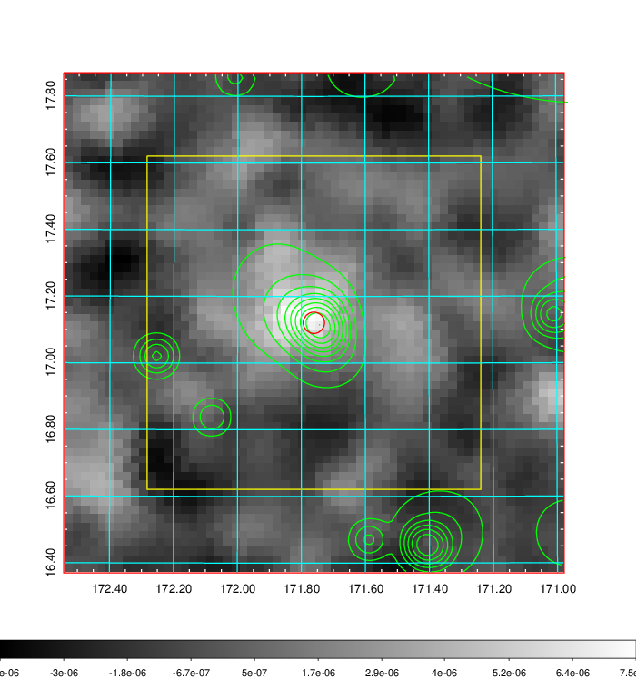 |

|[Redshift Histogram](../image/409/409_zg.pdf) | [DSS image(z1)](../image/409/409_dss_z1.pdf)      |  [DSS image(z2)](../image/409/409_dss_z2.pdf)    |
|-------------------|--------------------|-------------------|
|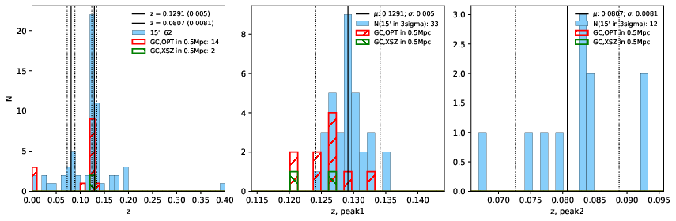 |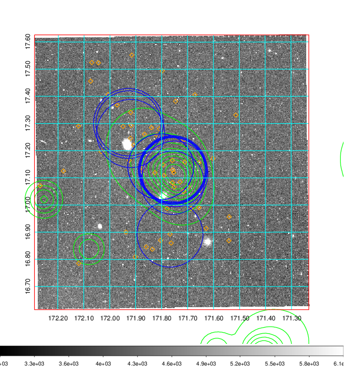  Blue circle for optical clusters;  Magenta circle for XSZ clusters;  all with r=1Mpc;  Only GC with Delta_z<0.01 are shown. | 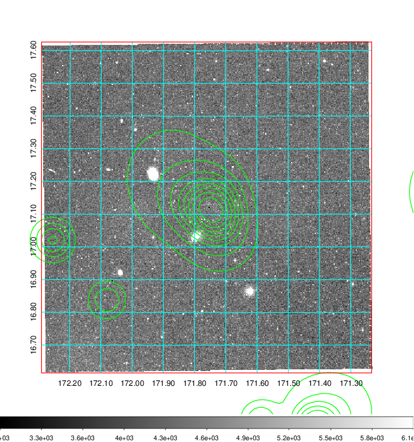 Blue circle for optical clusters;  Magenta circle for XSZ clusters;  all with r=1Mpc;  Only GC with Delta_z<0.01 are shown.  |

|[Previous-identified clusters](../image/409/409_gc.pdf) | [2MASS image](../image/409/409_2mass.pdf)      |[SDSS image](../image/409/409_sdss.pdf)   |
|-------------------|-------------------|-------------------|
|  Green, magenta, and blue circles  for optical, X-ray and SZ clusters  respectively, with redshift of clusters  labelled. The radius of circles  are 1Mpc.|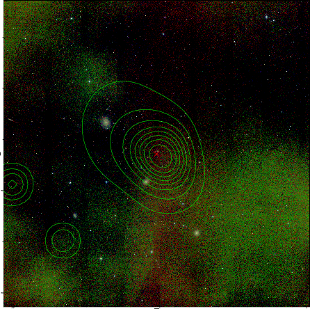  | 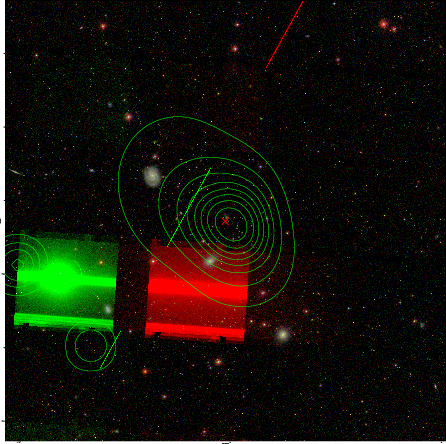  |

