

### 41

|Name|RAJ2000[deg]|DEJ2000[deg] |Ext[arcmin]| Ext,ml | z | z_src| C|GC(XSZ,Delta_z<0.01)| GC(OPT,Delta_z<0.01)|GC| R_sig[arcmin] | R500[arcmin] | R500[Mpc]| CRsig[c/s] | CR500[c/s] |L500[1E44 erg/s]|F500[1E-12 erg/s/cm^2]| M500[1E14 Msun]|Tx[keV]|Cnt_sig|Beta|Rc[arcmin]|Comment|Alias|
|---|---|---|---|---|---|------|---|--------|---------|----------|---|---|---|---|---|---|---|---|---|---|---|---|---|---|
|41| 13.461| 29.483| 6.49| 33.23| 0.3599(0.005)| z1,| G| -| -| C, N, W| 44.560| 4.737| 1.429| 0.238(0.085)| 0.208(0.074)| 17.624(9.412)| 4.002(2.137)| 12.09(2.83)| 11.26(1.70)| 178.0| 0.514(-0.010+0.022)| 4.676(-0.522+0.605)| -| t326|

|[RASS image](../image/41/41_img.pdf)|[filtered image](../image/41/41_fil.pdf)|[Segment image](../image/41/41_seg.pdf)|
|-------------------|--------------------|-------------------|
| 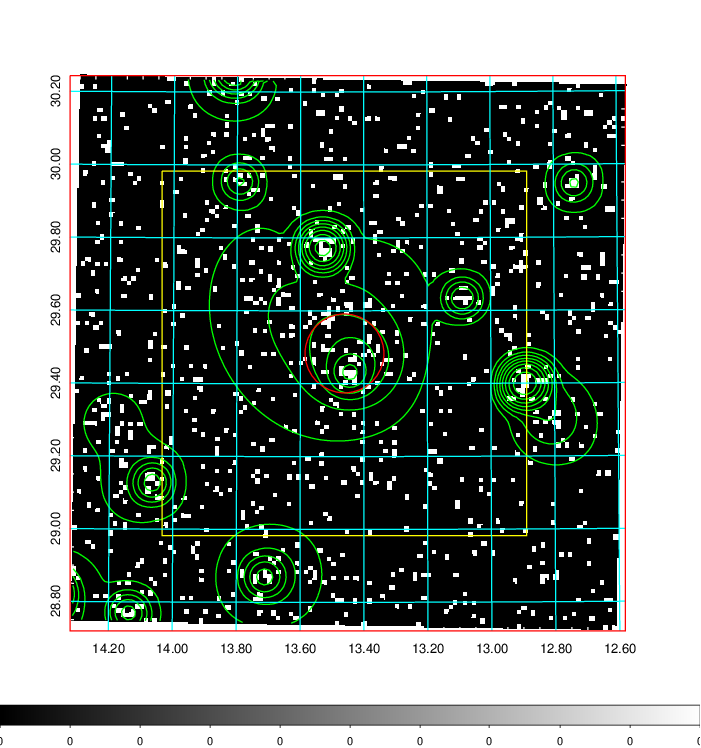  | 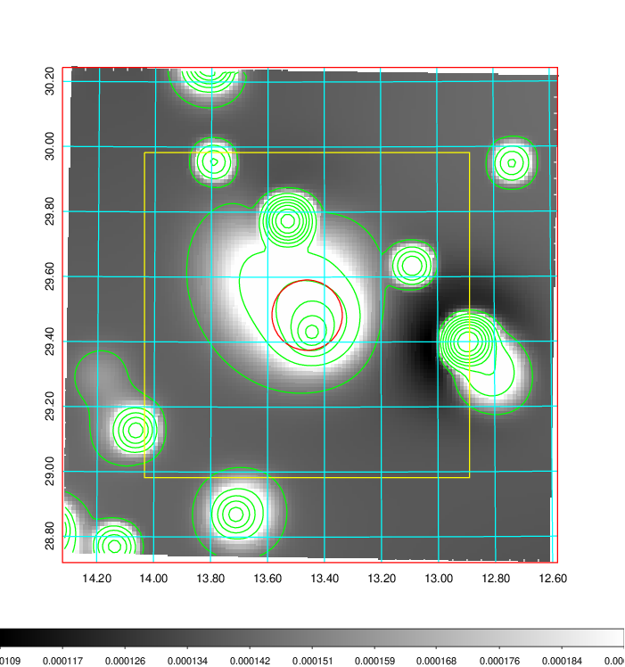   | 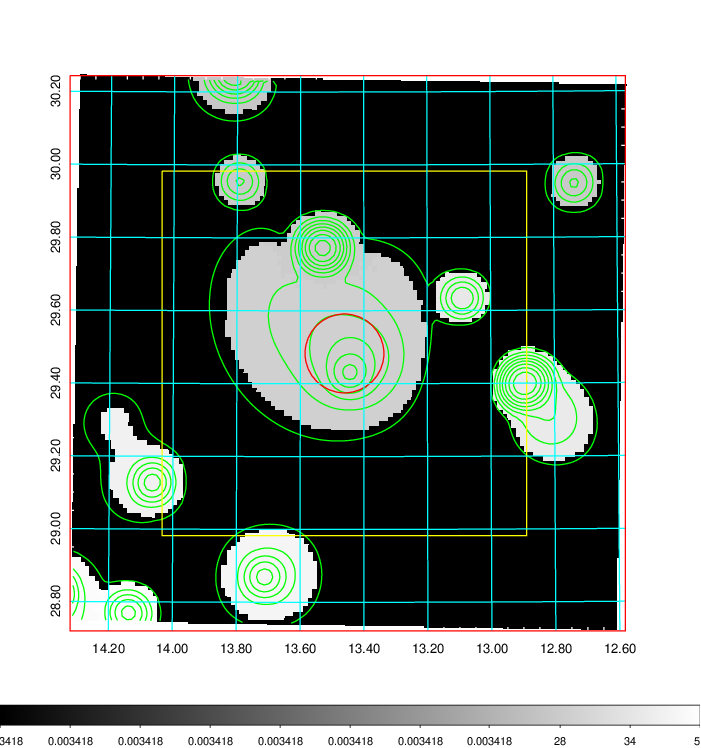  |

|[Exposure image](../image/41/41_mex.pdf)| [nH image](../image/41/41_nh.pdf)| [Planck image](../image/41/41_p.pdf)|
|-------------------|--------------------|-------------------|
|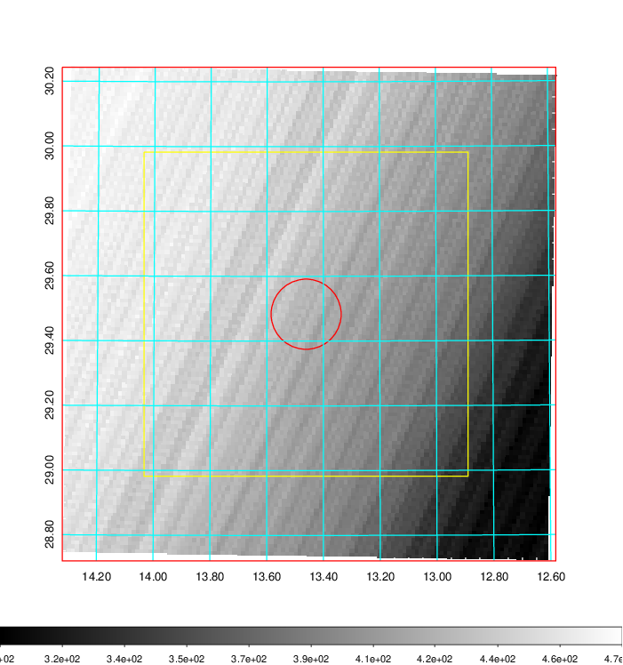   | 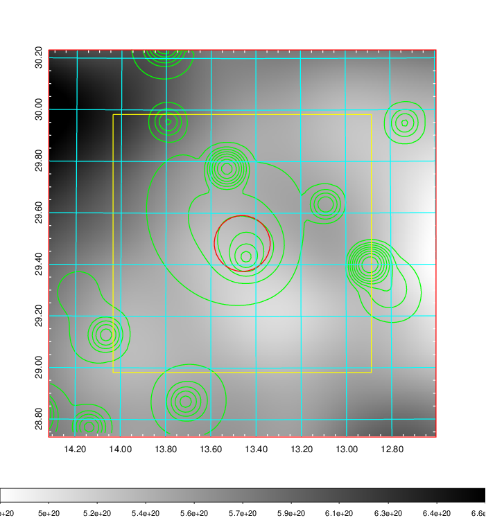    | 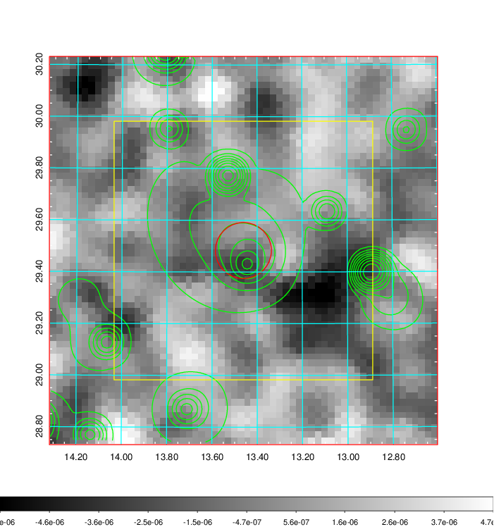 |

|[Redshift Histogram](../image/41/41_zg.pdf) | [DSS image(z1)](../image/41/41_dss_z1.pdf)      |  [DSS image(z2)](../image/41/41_dss_z2.pdf)    |
|-------------------|--------------------|-------------------|
|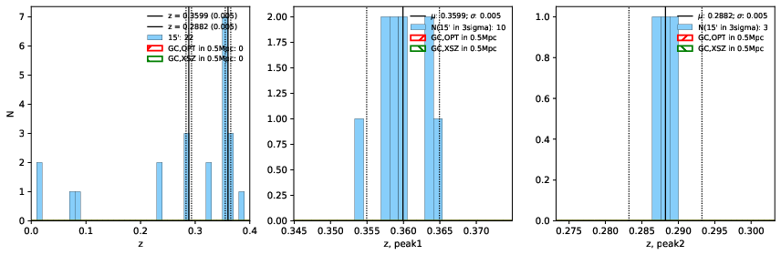 |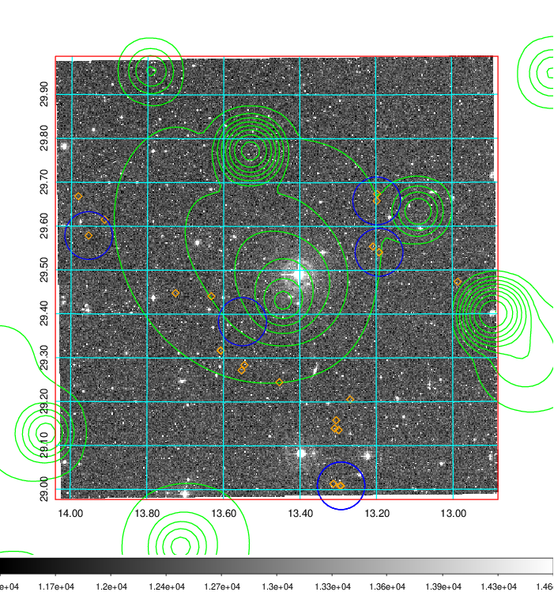  Blue circle for optical clusters;  Magenta circle for XSZ clusters;  all with r=1Mpc;  Only GC with Delta_z<0.01 are shown. | 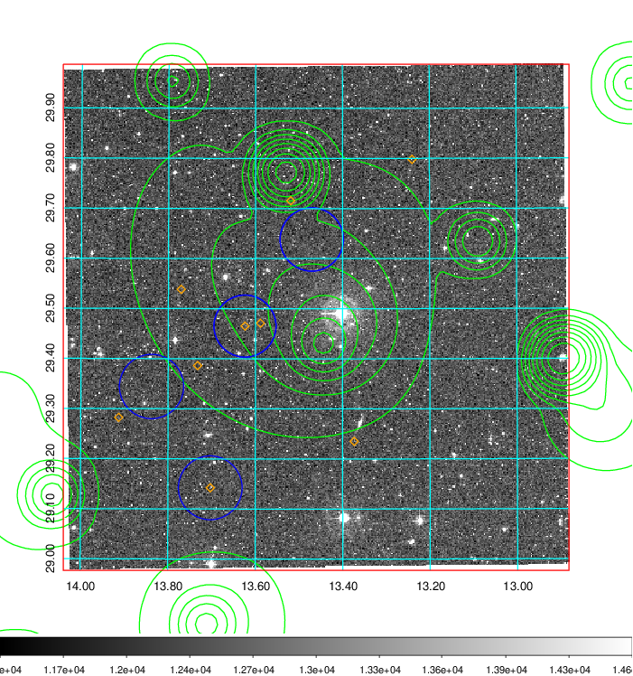 Blue circle for optical clusters;  Magenta circle for XSZ clusters;  all with r=1Mpc;  Only GC with Delta_z<0.01 are shown.  |

|[Previous-identified clusters](../image/41/41_gc.pdf) | [2MASS image](../image/41/41_2mass.pdf)      |[SDSS image](../image/41/41_sdss.pdf)   |
|-------------------|-------------------|-------------------|
|  Green, magenta, and blue circles  for optical, X-ray and SZ clusters  respectively, with redshift of clusters  labelled. The radius of circles  are 1Mpc.|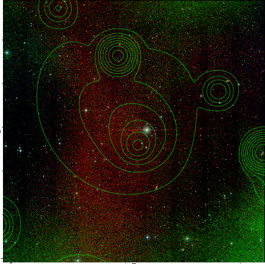  | 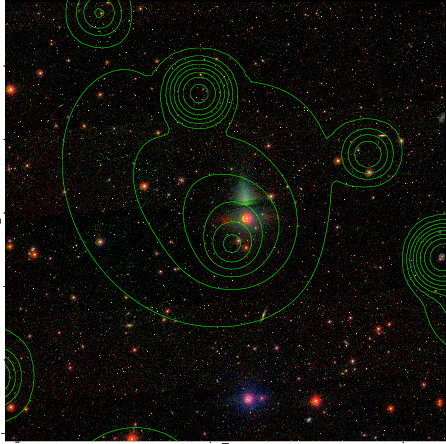  |

