

### 410

|Name|RAJ2000[deg]|DEJ2000[deg] |Ext[arcmin]| Ext,ml | z | z_src| C|GC(XSZ,Delta_z<0.01)| GC(OPT,Delta_z<0.01)|GC| R_sig[arcmin] | R500[arcmin] | R500[Mpc]| CRsig[c/s] | CR500[c/s] |L500[1E44 erg/s]|F500[1E-12 erg/s/cm^2]| M500[1E14 Msun]|Tx[keV]|Cnt_sig|Beta|Rc[arcmin]|Comment|Alias|
|---|---|---|---|---|---|------|---|--------|---------|----------|---|---|---|---|---|---|---|---|---|---|---|---|---|---|
|410| 172.470| 23.798| 3.86| 48.40| 0.1371(0.005)| z1, z_xsz| B| F20, MCXC, PSZ2, Tar| C, N, RM, W, Zw| A, C, F20, MCXC, N, PSZ2, Tar, W| 11.238| 6.575| 0.956| 0.169(0.035)| 0.158(0.033)| 1.612(0.210)| 3.223(0.419)| 2.84(0.18)| 4.26(0.17)| 89.2| 0.842(-0.146+0.110)| 5.272(-1.247+0.907)| -| k465|

|[RASS image](../image/410/410_img.pdf)|[filtered image](../image/410/410_fil.pdf)|[Segment image](../image/410/410_seg.pdf)|
|-------------------|--------------------|-------------------|
| 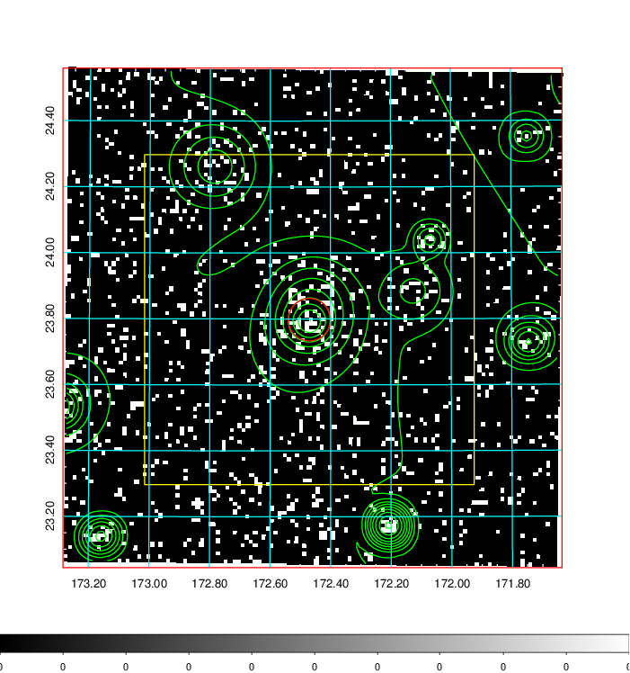  | 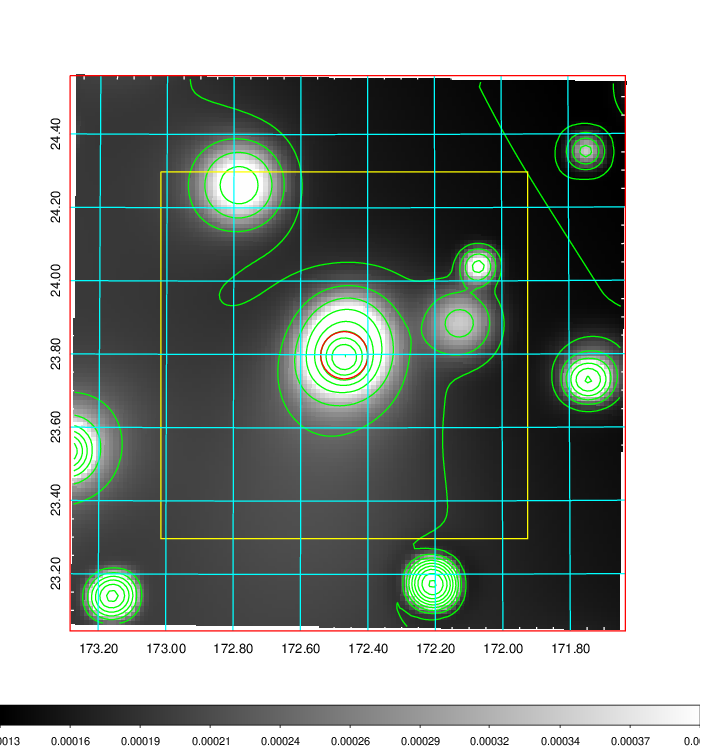   | 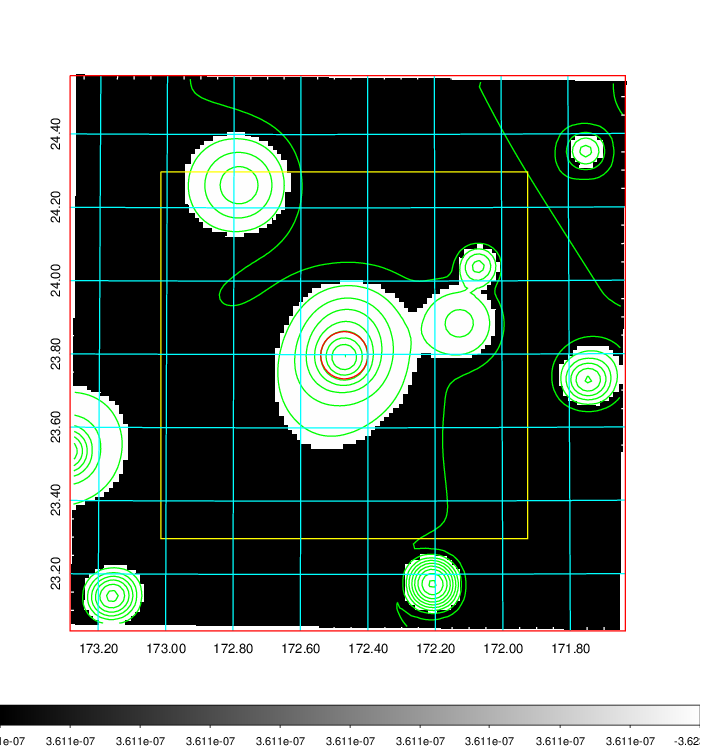  |

|[Exposure image](../image/410/410_mex.pdf)| [nH image](../image/410/410_nh.pdf)| [Planck image](../image/410/410_p.pdf)|
|-------------------|--------------------|-------------------|
|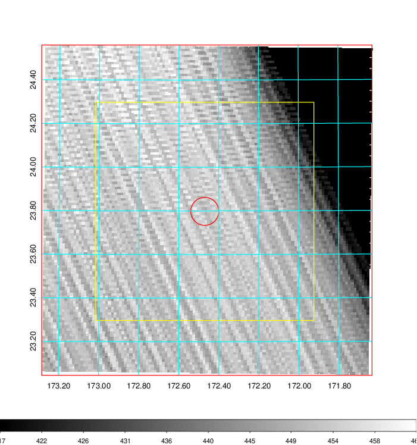   | 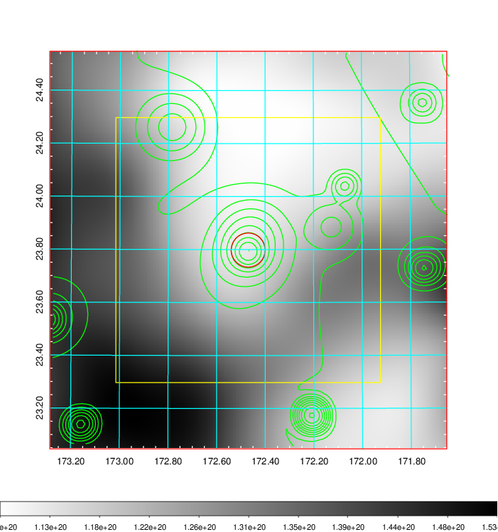    | 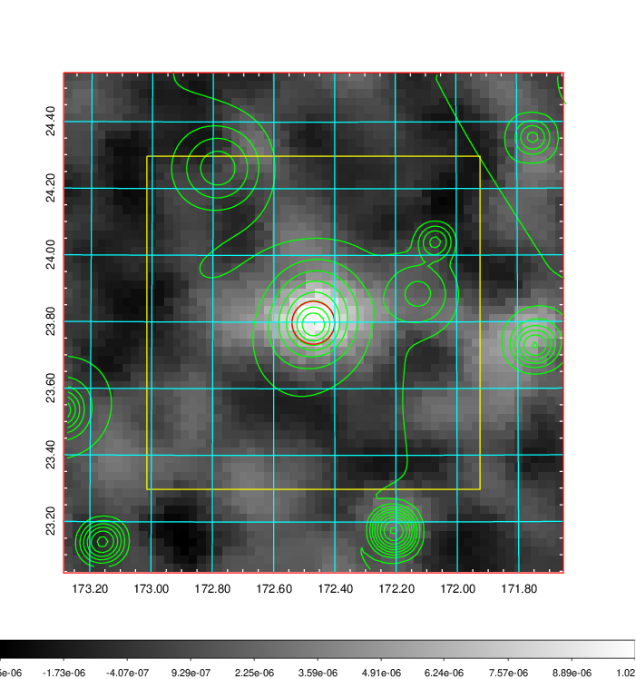 |

|[Redshift Histogram](../image/410/410_zg.pdf) | [DSS image(z1)](../image/410/410_dss_z1.pdf)      |  [DSS image(z2)](../image/410/410_dss_z2.pdf)    |
|-------------------|--------------------|-------------------|
|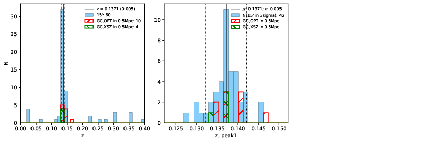 |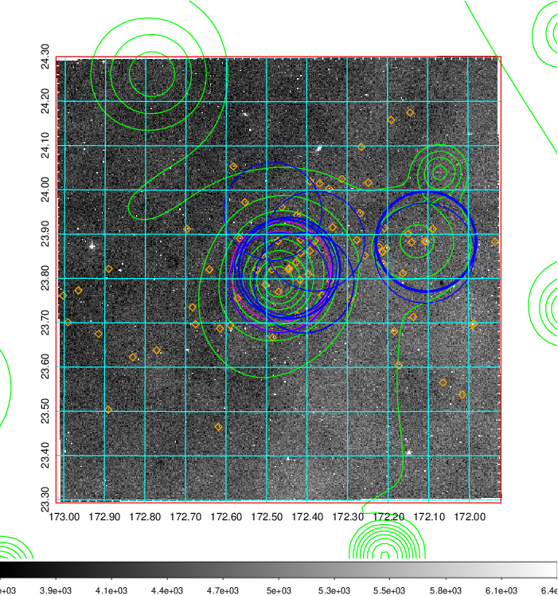  Blue circle for optical clusters;  Magenta circle for XSZ clusters;  all with r=1Mpc;  Only GC with Delta_z<0.01 are shown. | 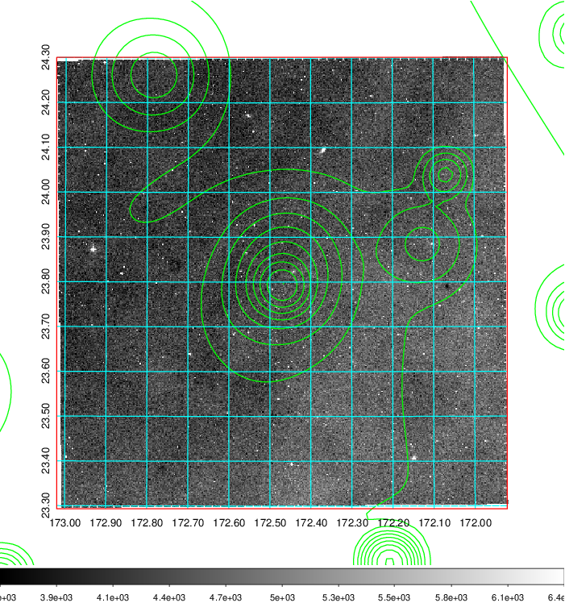 Blue circle for optical clusters;  Magenta circle for XSZ clusters;  all with r=1Mpc;  Only GC with Delta_z<0.01 are shown.  |

|[Previous-identified clusters](../image/410/410_gc.pdf) | [2MASS image](../image/410/410_2mass.pdf)      |[SDSS image](../image/410/410_sdss.pdf)   |
|-------------------|-------------------|-------------------|
|  Green, magenta, and blue circles  for optical, X-ray and SZ clusters  respectively, with redshift of clusters  labelled. The radius of circles  are 1Mpc.|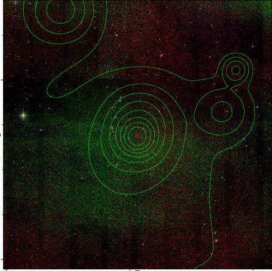  | 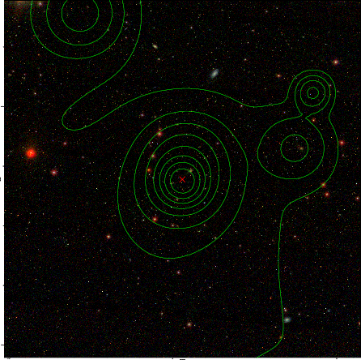  |

