

### 412

|Name|RAJ2000[deg]|DEJ2000[deg] |Ext[arcmin]| Ext,ml | z | z_src| C|GC(XSZ,Delta_z<0.01)| GC(OPT,Delta_z<0.01)|GC| R_sig[arcmin] | R500[arcmin] | R500[Mpc]| CRsig[c/s] | CR500[c/s] |L500[1E44 erg/s]|F500[1E-12 erg/s/cm^2]| M500[1E14 Msun]|Tx[keV]|Cnt_sig|Beta|Rc[arcmin]|Comment|Alias|
|---|---|---|---|---|---|------|---|--------|---------|----------|---|---|---|---|---|---|---|---|---|---|---|---|---|---|
|412| 172.811| 22.413| 14.04| 40.83| 0.1773(0.005)| z1,| G| -| -| A, C, N, W| 12.212| 4.960| 0.892| 0.079(0.033)| 0.072(0.030)| 1.262(1.203)| 1.435(1.368)| 2.41(1.13)| 3.90(1.16)| 47.8| 0.581(-0.062+0.159)| 5.210(-0.789+1.608)| An Abell cluster with no $z$ and offset = 1.22 Mpc(6.72 arcmin)| t520|

|[RASS image](../image/412/412_img.pdf)|[filtered image](../image/412/412_fil.pdf)|[Segment image](../image/412/412_seg.pdf)|
|-------------------|--------------------|-------------------|
| 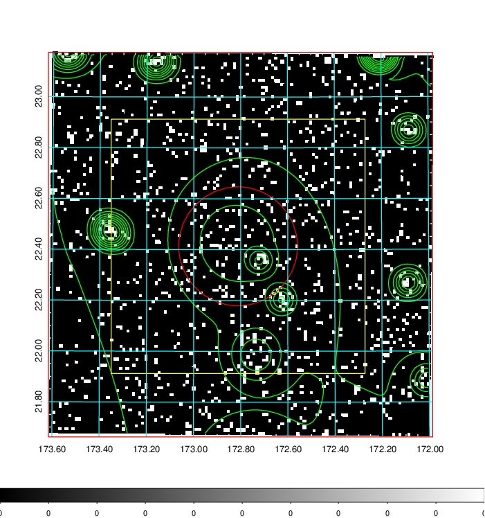  | 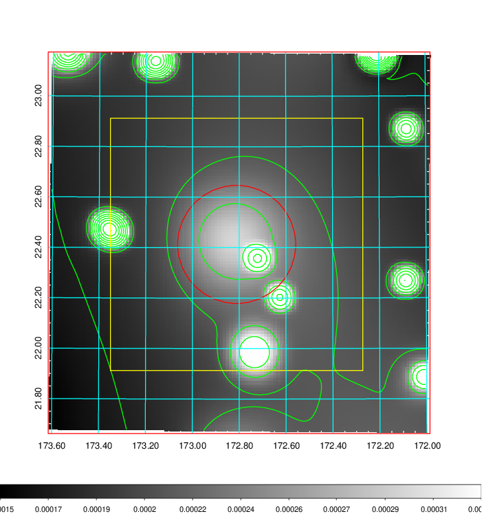   | 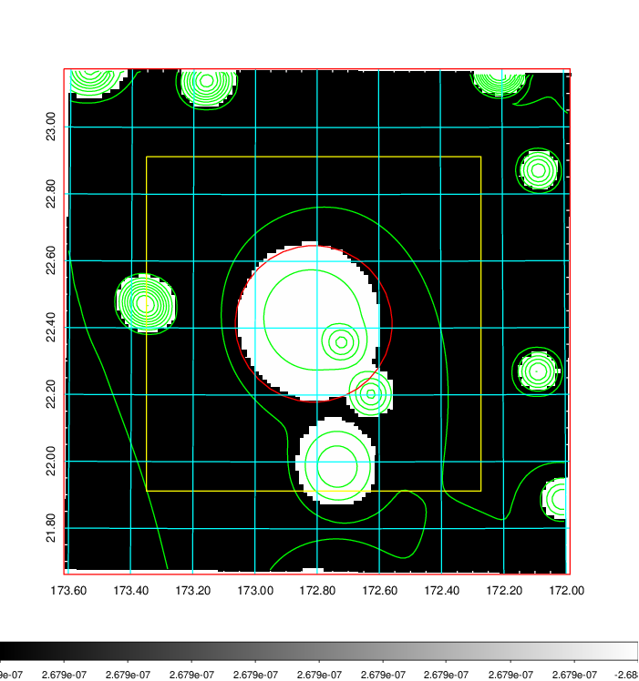  |

|[Exposure image](../image/412/412_mex.pdf)| [nH image](../image/412/412_nh.pdf)| [Planck image](../image/412/412_p.pdf)|
|-------------------|--------------------|-------------------|
|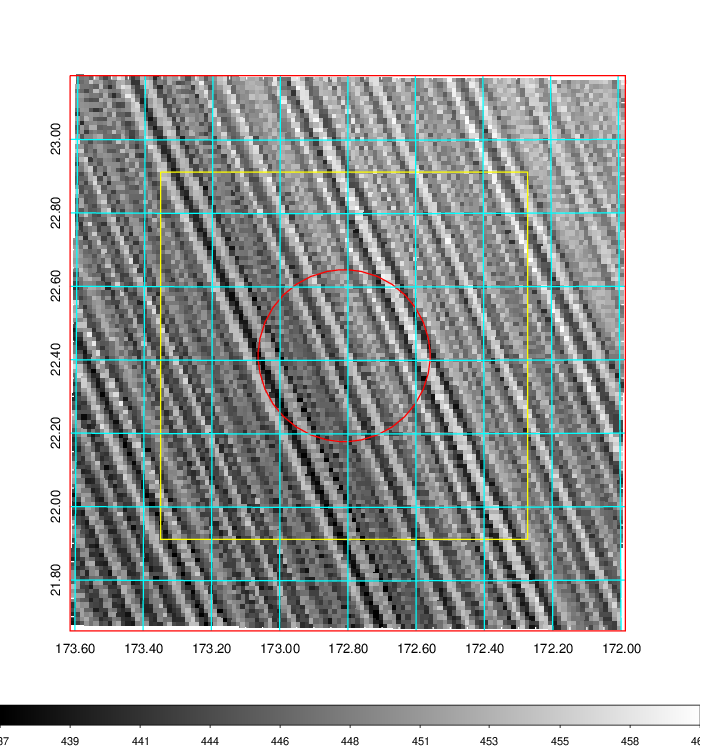   | 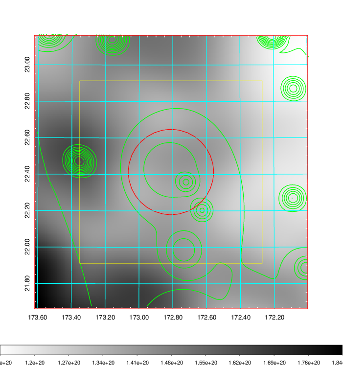    | 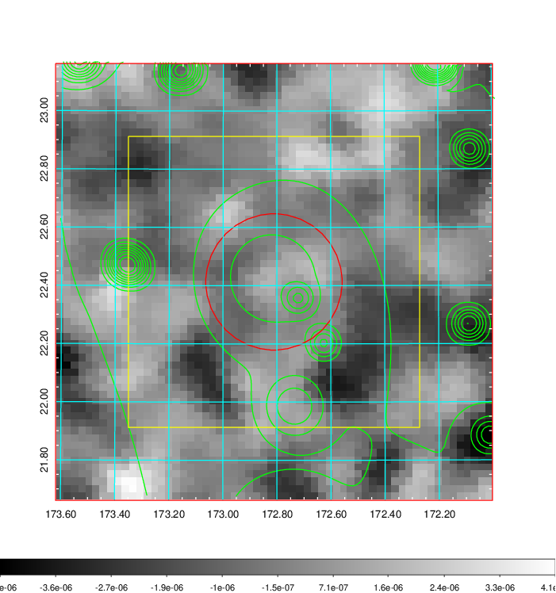 |

|[Redshift Histogram](../image/412/412_zg.pdf) | [DSS image(z1)](../image/412/412_dss_z1.pdf)      |  [DSS image(z2)](../image/412/412_dss_z2.pdf)    |
|-------------------|--------------------|-------------------|
|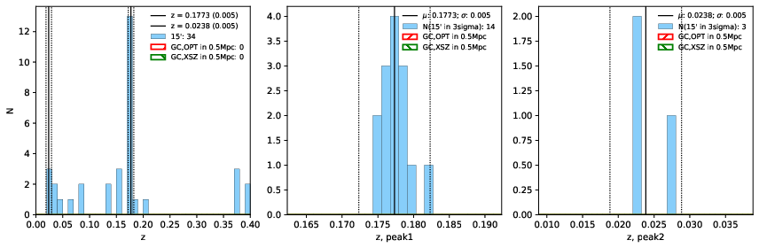 |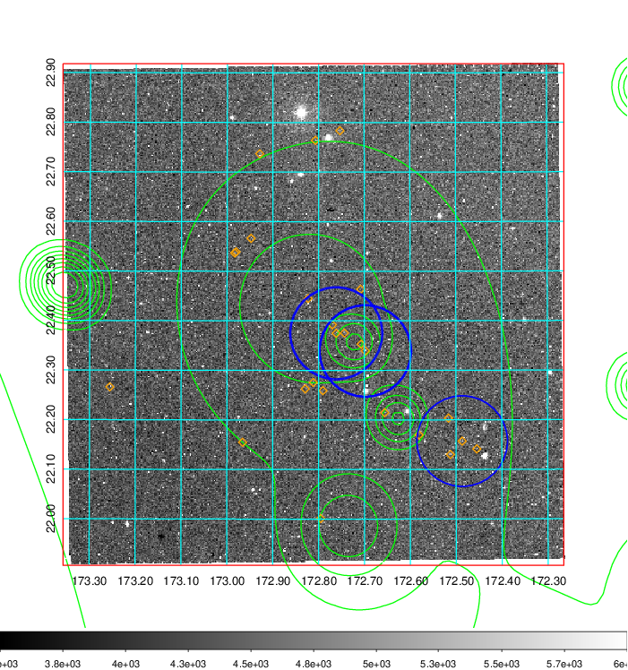  Blue circle for optical clusters;  Magenta circle for XSZ clusters;  all with r=1Mpc;  Only GC with Delta_z<0.01 are shown. | 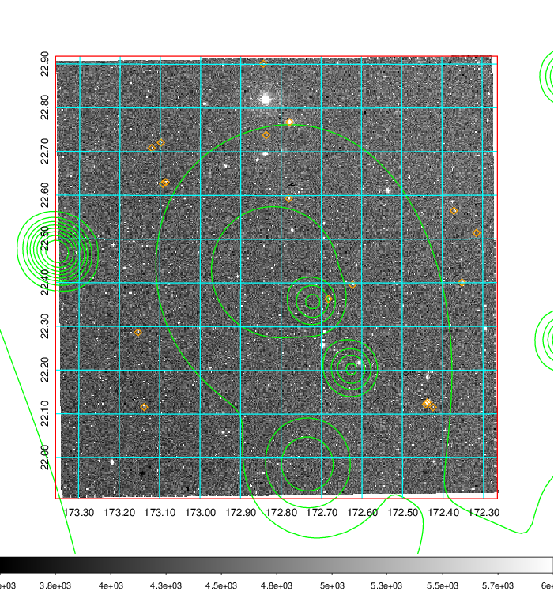 Blue circle for optical clusters;  Magenta circle for XSZ clusters;  all with r=1Mpc;  Only GC with Delta_z<0.01 are shown.  |

|[known Abell/XSZ clusters](../image/412/412_gc.pdf) | [2MASS image](../image/412/412_2mass.pdf)      |[SDSS image](../image/412/412_sdss.pdf)   |
|-------------------|-------------------|-------------------|
|  Magenta, blue and green circles  for optical, X-ray and SZ clusters  respectively, with redshift of clusters  labelled. The radius of circles  are 1Mpc.|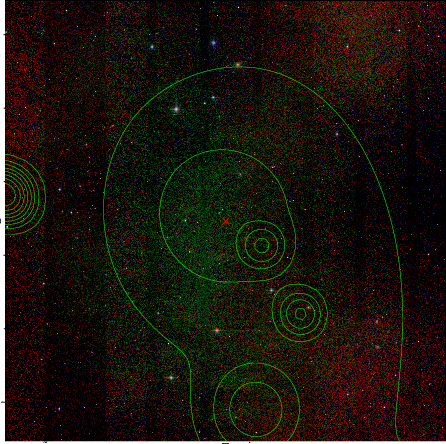  | 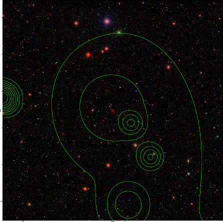  |

