

### 414

|Name|RAJ2000[deg]|DEJ2000[deg] |Ext[arcmin]| Ext,ml | z | z_src| C|GC(XSZ,Delta_z<0.01)| GC(OPT,Delta_z<0.01)|GC| R_sig[arcmin] | R500[arcmin] | R500[Mpc]| CRsig[c/s] | CR500[c/s] |L500[1E44 erg/s]|F500[1E-12 erg/s/cm^2]| M500[1E14 Msun]|Tx[keV]|Cnt_sig|Beta|Rc[arcmin]|Comment|Alias|
|---|---|---|---|---|---|------|---|--------|---------|----------|---|---|---|---|---|---|---|---|---|---|---|---|---|---|
|414| 173.210| 14.498| 2.40| 262.13| 0.0811(0.005)| z1, z_xsz| B| F20, L03, MCXC, PSZ2, Tar| A, N, RM, W| A, C, F20, L03, MCXC, N, PSZ2, Tar, W| 11.725| 11.345| 1.041| 0.607(0.045)| 0.604(0.045)| 1.860(0.063)| 11.444(0.388)| 3.46(0.06)| 4.73(0.05)| 279.7| 0.938(-0.072+0.044)| 5.428(-0.488+0.336)| -| k282|

|[RASS image](../image/414/414_img.pdf)|[filtered image](../image/414/414_fil.pdf)|[Segment image](../image/414/414_seg.pdf)|
|-------------------|--------------------|-------------------|
| 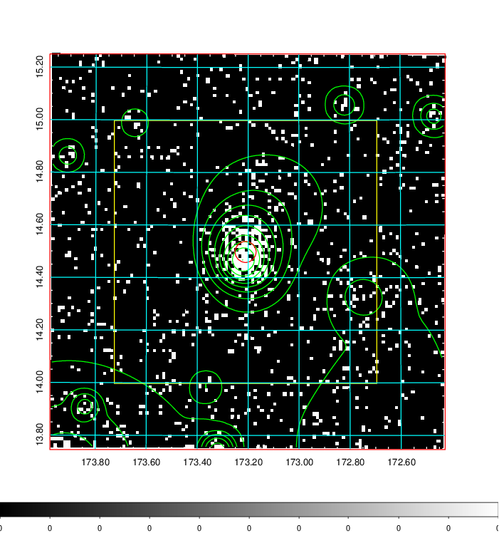  | 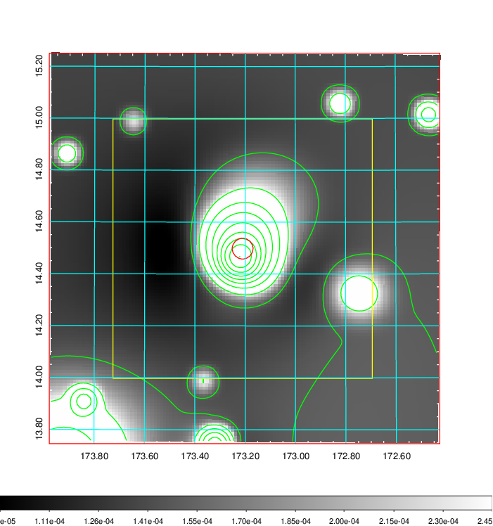   | 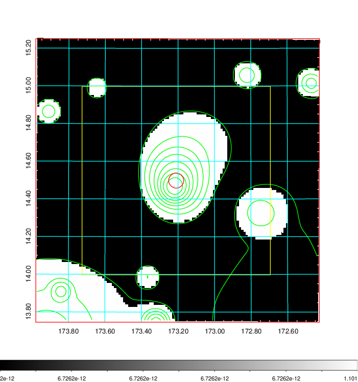  |

|[Exposure image](../image/414/414_mex.pdf)| [nH image](../image/414/414_nh.pdf)| [Planck image](../image/414/414_p.pdf)|
|-------------------|--------------------|-------------------|
|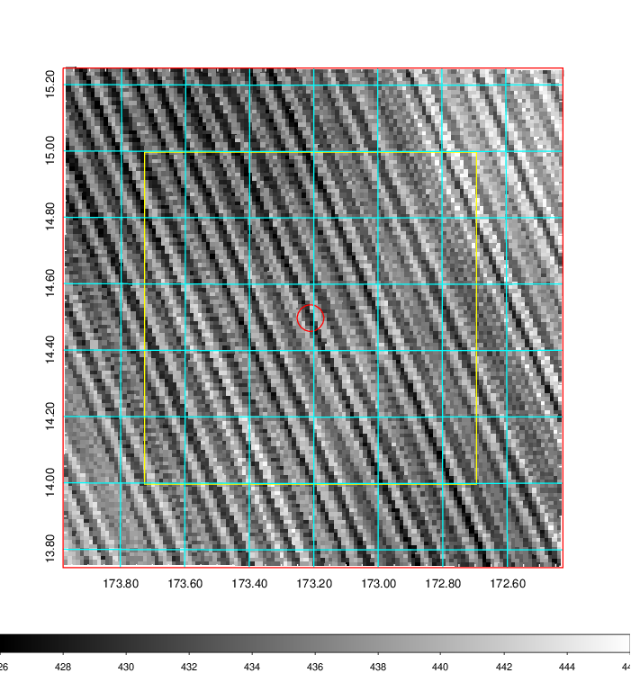   | 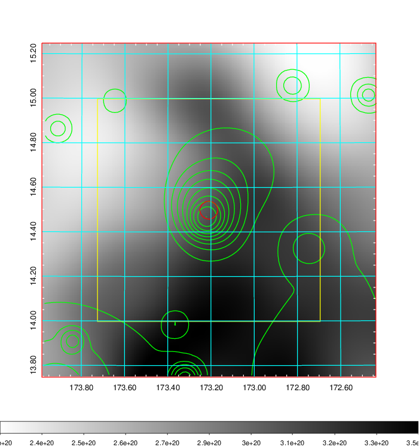    | 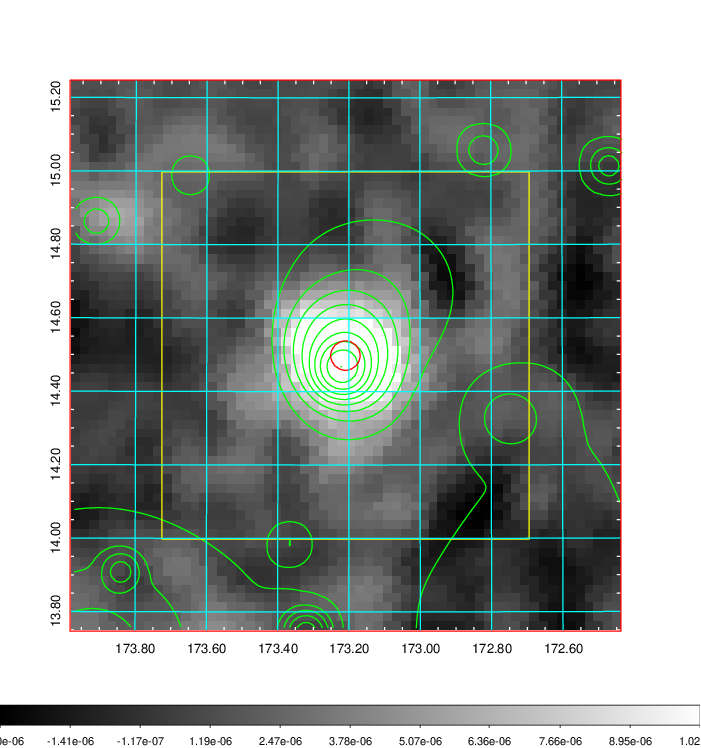 |

|[Redshift Histogram](../image/414/414_zg.pdf) | [DSS image(z1)](../image/414/414_dss_z1.pdf)      |  [DSS image(z2)](../image/414/414_dss_z2.pdf)    |
|-------------------|--------------------|-------------------|
|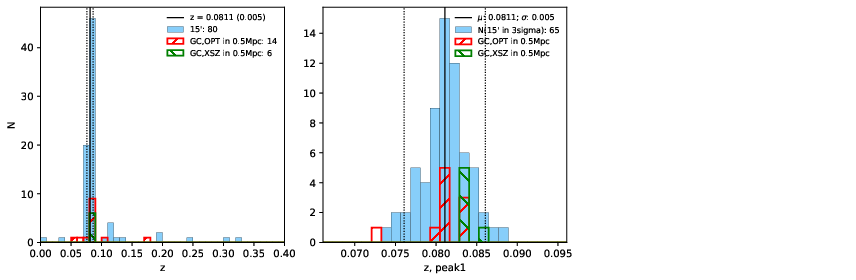 |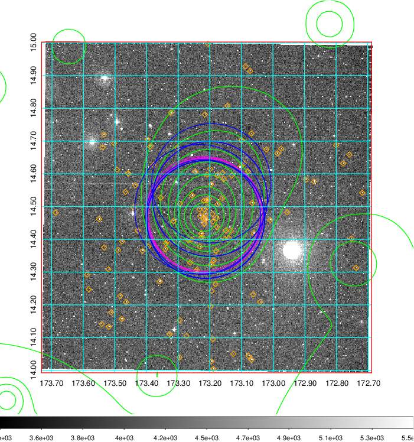  Blue circle for optical clusters;  Magenta circle for XSZ clusters;  all with r=1Mpc;  Only GC with Delta_z<0.01 are shown. | 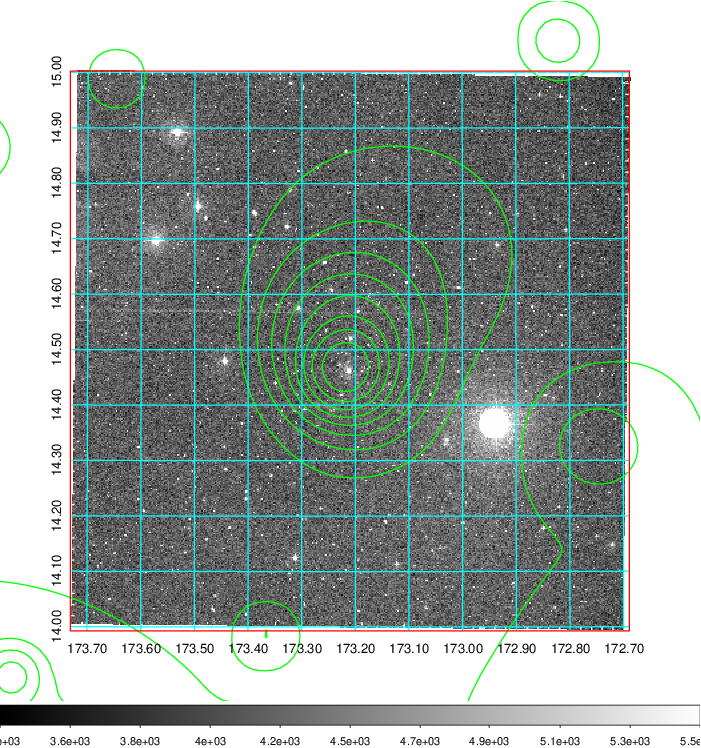 Blue circle for optical clusters;  Magenta circle for XSZ clusters;  all with r=1Mpc;  Only GC with Delta_z<0.01 are shown.  |

|[Previous-identified clusters](../image/414/414_gc.pdf) | [2MASS image](../image/414/414_2mass.pdf)      |[SDSS image](../image/414/414_sdss.pdf)   |
|-------------------|-------------------|-------------------|
|  Green, magenta, and blue circles  for optical, X-ray and SZ clusters  respectively, with redshift of clusters  labelled. The radius of circles  are 1Mpc.|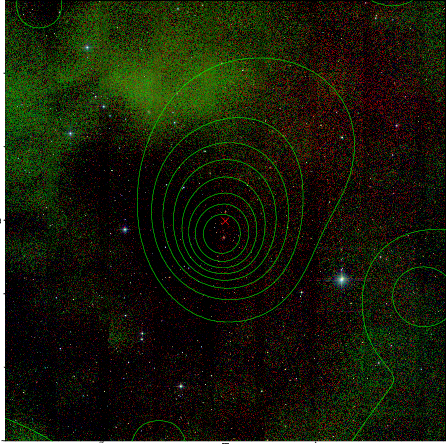  | 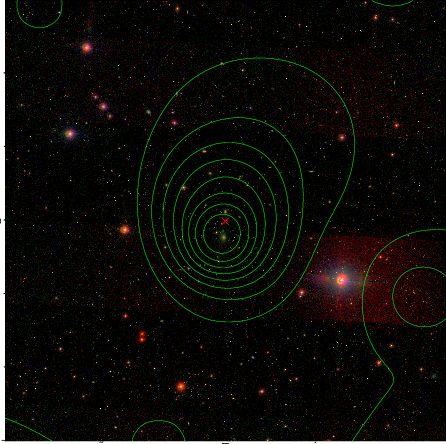  |

