

### 416

|Name|RAJ2000[deg]|DEJ2000[deg] |Ext[arcmin]| Ext,ml | z | z_src| C|GC(XSZ,Delta_z<0.01)| GC(OPT,Delta_z<0.01)|GC| R_sig[arcmin] | R500[arcmin] | R500[Mpc]| CRsig[c/s] | CR500[c/s] |L500[1E44 erg/s]|F500[1E-12 erg/s/cm^2]| M500[1E14 Msun]|Tx[keV]|Cnt_sig|Beta|Rc[arcmin]|Comment|Alias|
|---|---|---|---|---|---|------|---|--------|---------|----------|---|---|---|---|---|---|---|---|---|---|---|---|---|---|
|416| 173.573| 25.479| 7.41| 58.79| 0.0708(0.005)| z1, z_xsz| B| F20| N| F20, N, W| 13.188| 8.918| 0.723| 0.148(0.035)| 0.140(0.033)| 0.325(0.064)| 2.661(0.528)| 1.15(0.12)| 2.38(0.15)| 71.3| 0.872(-0.146+0.092)| 10.719(-1.749+1.423)| -| t373|

|[RASS image](../image/416/416_img.pdf)|[filtered image](../image/416/416_fil.pdf)|[Segment image](../image/416/416_seg.pdf)|
|-------------------|--------------------|-------------------|
| 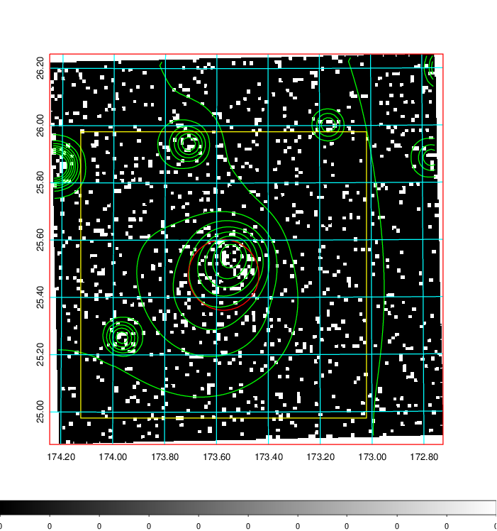  | 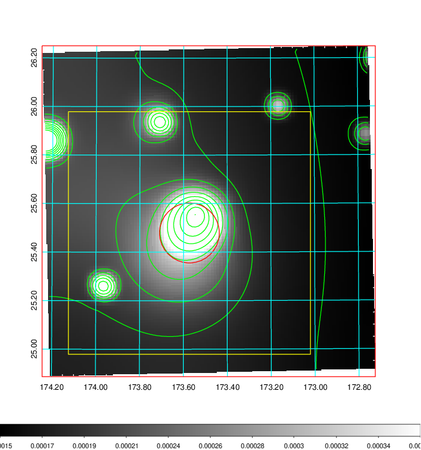   | 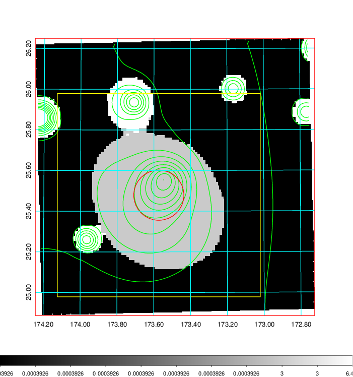  |

|[Exposure image](../image/416/416_mex.pdf)| [nH image](../image/416/416_nh.pdf)| [Planck image](../image/416/416_p.pdf)|
|-------------------|--------------------|-------------------|
|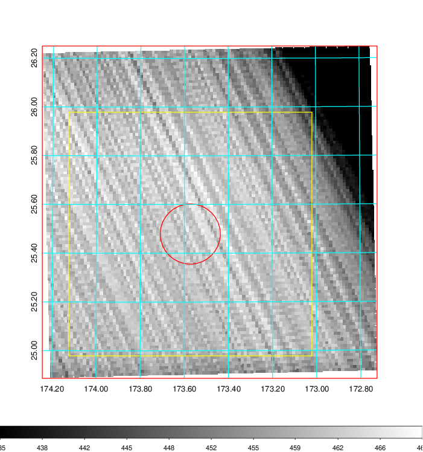   | 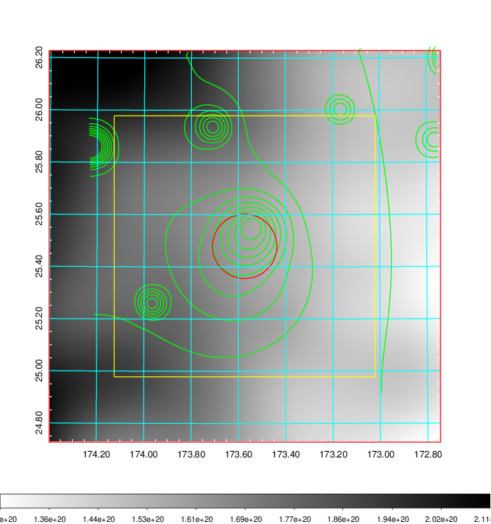    | 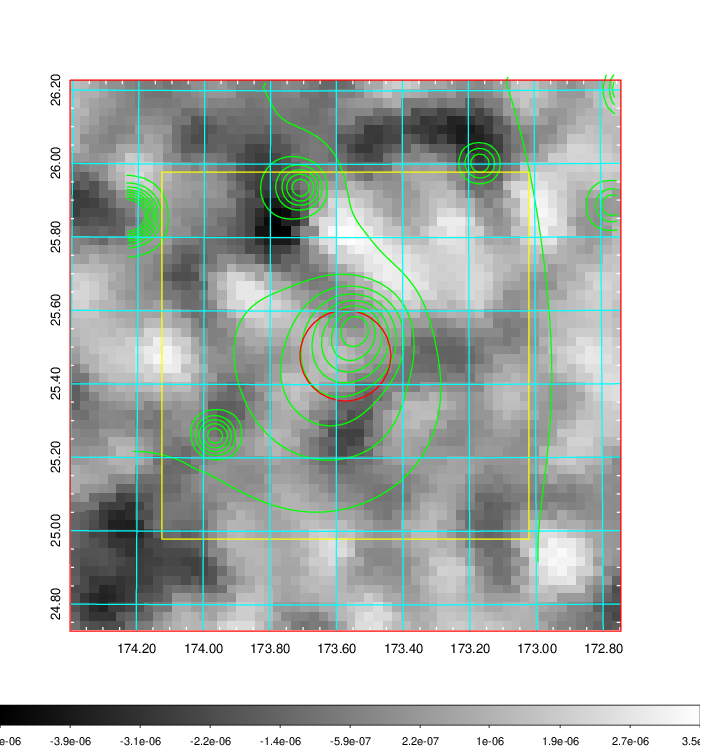 |

|[Redshift Histogram](../image/416/416_zg.pdf) | [DSS image(z1)](../image/416/416_dss_z1.pdf)      |  [DSS image(z2)](../image/416/416_dss_z2.pdf)    |
|-------------------|--------------------|-------------------|
|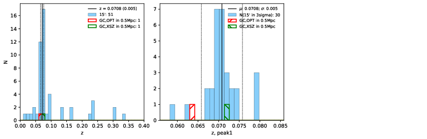 |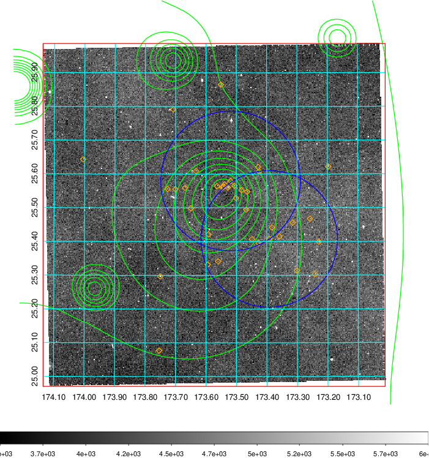  Blue circle for optical clusters;  Magenta circle for XSZ clusters;  all with r=1Mpc;  Only GC with Delta_z<0.01 are shown. | 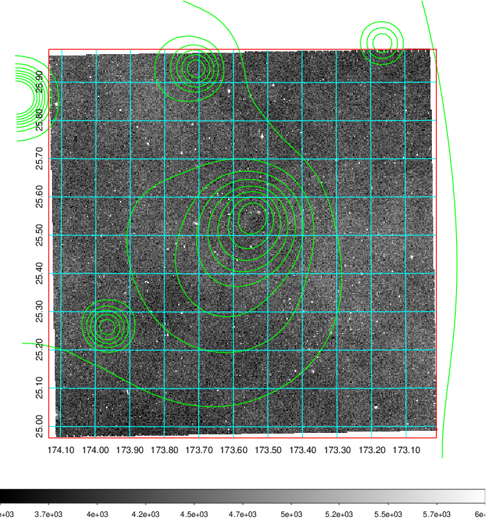 Blue circle for optical clusters;  Magenta circle for XSZ clusters;  all with r=1Mpc;  Only GC with Delta_z<0.01 are shown.  |

|[known Abell/XSZ clusters](../image/416/416_gc.pdf) | [2MASS image](../image/416/416_2mass.pdf)      |[SDSS image](../image/416/416_sdss.pdf)   |
|-------------------|-------------------|-------------------|
|  Magenta, blue and green circles  for optical, X-ray and SZ clusters  respectively, with redshift of clusters  labelled. The radius of circles  are 1Mpc.|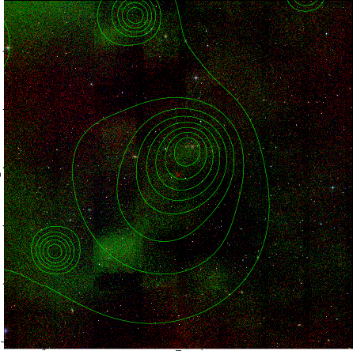  | 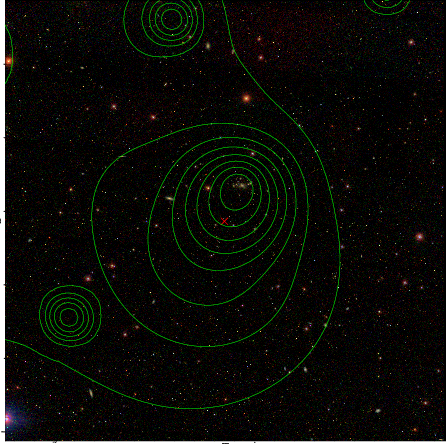  |

