

### 418

|Name|RAJ2000[deg]|DEJ2000[deg] |Ext[arcmin]| Ext,ml | z | z_src| C|GC(XSZ,Delta_z<0.01)| GC(OPT,Delta_z<0.01)|GC| R_sig[arcmin] | R500[arcmin] | R500[Mpc]| CRsig[c/s] | CR500[c/s] |L500[1E44 erg/s]|F500[1E-12 erg/s/cm^2]| M500[1E14 Msun]|Tx[keV]|Cnt_sig|Beta|Rc[arcmin]|Comment|Alias|
|---|---|---|---|---|---|------|---|--------|---------|----------|---|---|---|---|---|---|---|---|---|---|---|---|---|---|
|418| 173.838| -13.509| 2.54| 55.54| 0.0720(0.005)| z1, z_xsz| B| L03, MCXC| A| A, L03, MCXC, W| 15.625| 9.864| 0.812| 0.246(0.041)| 0.231(0.039)| 0.528(0.054)| 4.171(0.424)| 1.63(0.08)| 2.96(0.10)| 76.2| 0.875(-0.127+0.088)| 5.262(-0.936+0.678)| -| k307|

|[RASS image](../image/418/418_img.pdf)|[filtered image](../image/418/418_fil.pdf)|[Segment image](../image/418/418_seg.pdf)|
|-------------------|--------------------|-------------------|
| 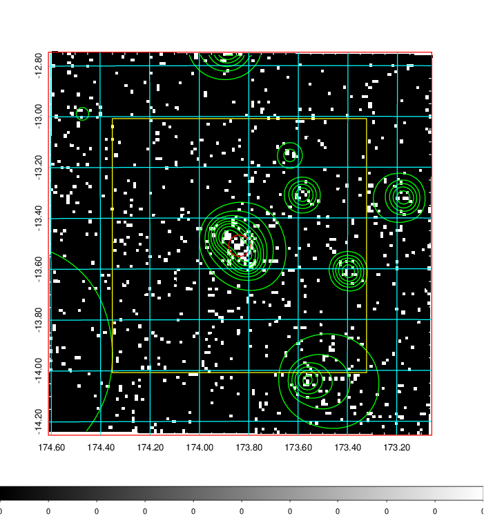  | 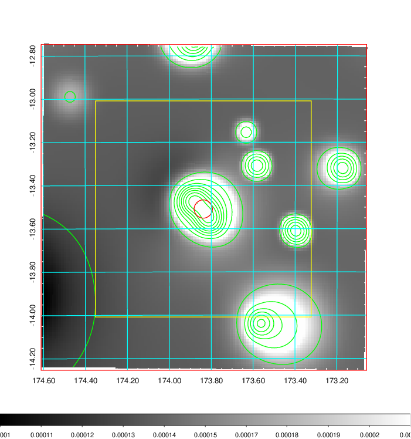   | 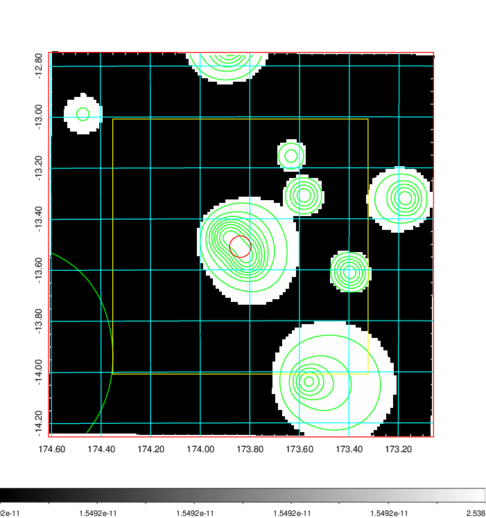  |

|[Exposure image](../image/418/418_mex.pdf)| [nH image](../image/418/418_nh.pdf)| [Planck image](../image/418/418_p.pdf)|
|-------------------|--------------------|-------------------|
|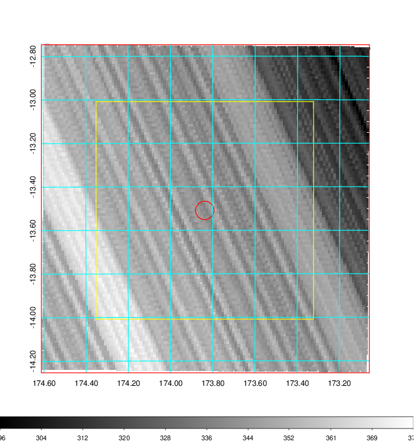   | 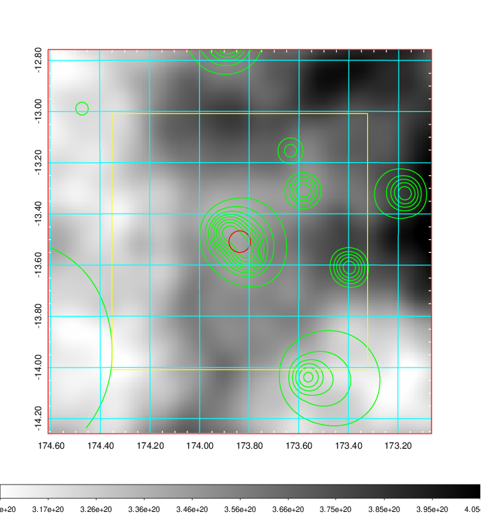    | 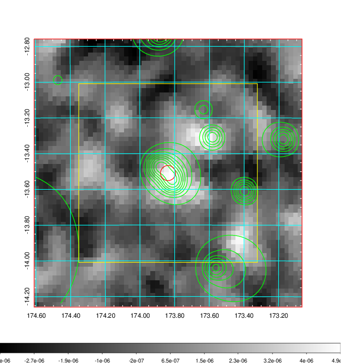 |

|[Redshift Histogram](../image/418/418_zg.pdf) | [DSS image(z1)](../image/418/418_dss_z1.pdf)      |  [DSS image(z2)](../image/418/418_dss_z2.pdf)    |
|-------------------|--------------------|-------------------|
|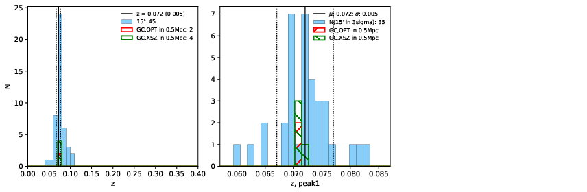 |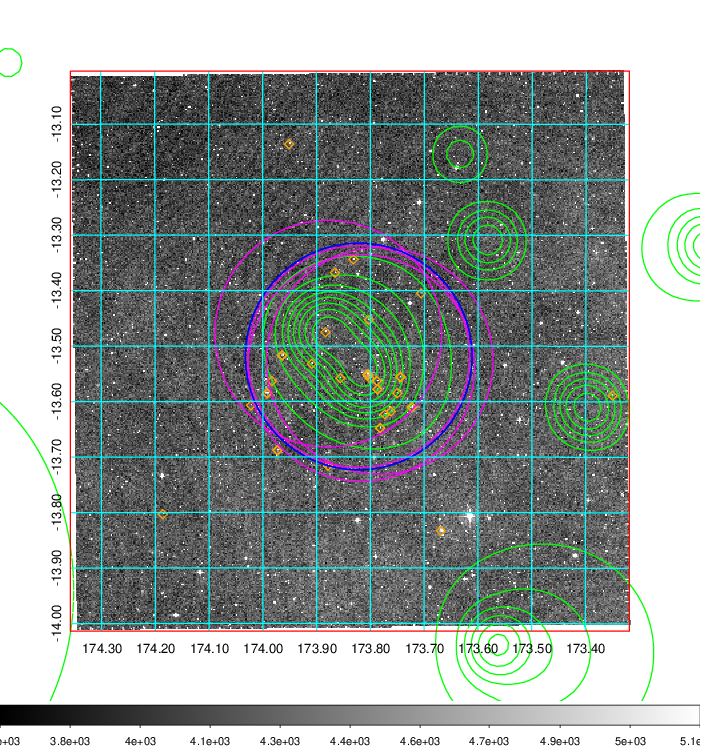  Blue circle for optical clusters;  Magenta circle for XSZ clusters;  all with r=1Mpc;  Only GC with Delta_z<0.01 are shown. | 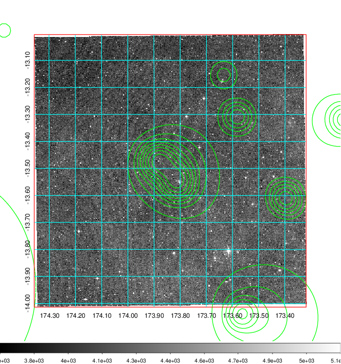 Blue circle for optical clusters;  Magenta circle for XSZ clusters;  all with r=1Mpc;  Only GC with Delta_z<0.01 are shown.  |

|[Previous-identified clusters](../image/418/418_gc.pdf) | [2MASS image](../image/418/418_2mass.pdf)      |
|-------------------|-------------------|
|  Green, magenta, and blue circles  for optical, X-ray and SZ clusters  respectively, with redshift of clusters  labelled. The radius of circles  are 1Mpc.|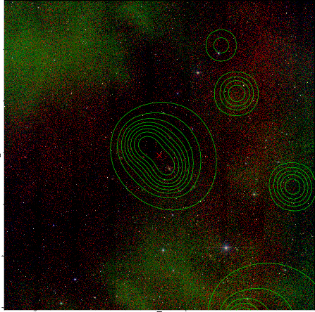  |

|[ATLAS image](../image/418/418_s.pdf)        |
|-------------------|
| 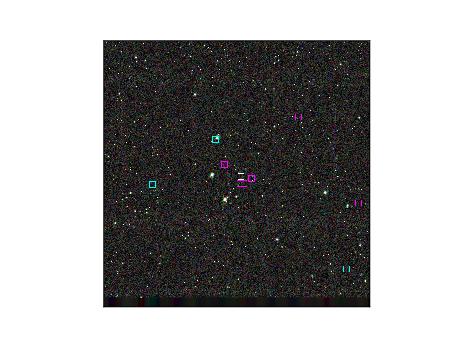  |
