

### 419

|Name|RAJ2000[deg]|DEJ2000[deg] |Ext[arcmin]| Ext,ml | z | z_src| C|GC(XSZ,Delta_z<0.01)| GC(OPT,Delta_z<0.01)|GC| R_sig[arcmin] | R500[arcmin] | R500[Mpc]| CRsig[c/s] | CR500[c/s] |L500[1E44 erg/s]|F500[1E-12 erg/s/cm^2]| M500[1E14 Msun]|Tx[keV]|Cnt_sig|Beta|Rc[arcmin]|Comment|Alias|
|---|---|---|---|---|---|------|---|--------|---------|----------|---|---|---|---|---|---|---|---|---|---|---|---|---|---|
|419| 173.901| 13.685| 5.57| 59.50| 0.0796(0.005)| z1, z_xsz| B| F20, Tar| N, W| C, F20, N, Tar, W| 13.675| 9.176| 0.828| 0.224(0.034)| 0.212(0.032)| 0.611(0.074)| 3.910(0.472)| 1.74(0.11)| 3.09(0.12)| 94.0| 0.803(-0.168+0.136)| 9.797(-2.301+1.743)| -| t284|

|[RASS image](../image/419/419_img.pdf)|[filtered image](../image/419/419_fil.pdf)|[Segment image](../image/419/419_seg.pdf)|
|-------------------|--------------------|-------------------|
| 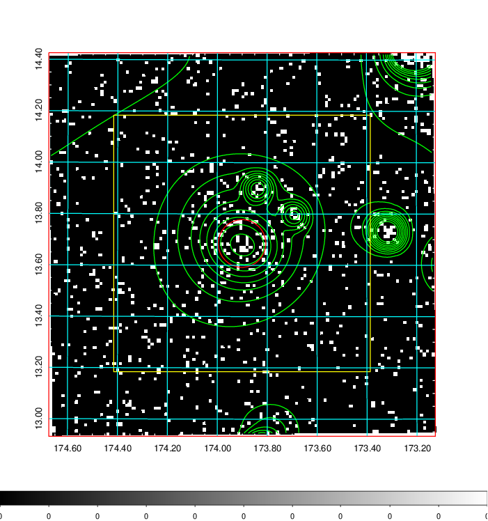  | 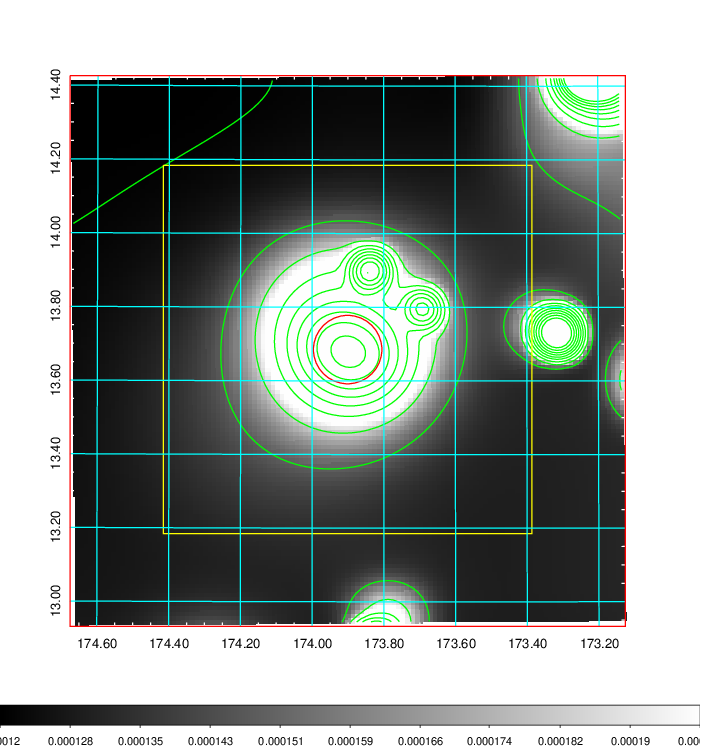   | 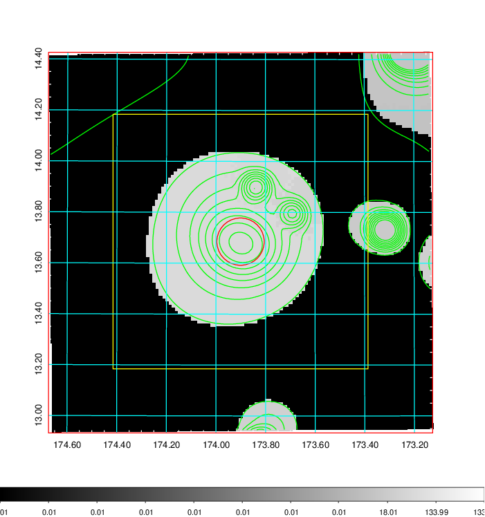  |

|[Exposure image](../image/419/419_mex.pdf)| [nH image](../image/419/419_nh.pdf)| [Planck image](../image/419/419_p.pdf)|
|-------------------|--------------------|-------------------|
|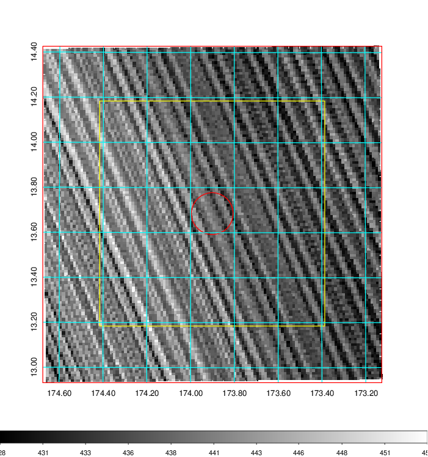   | 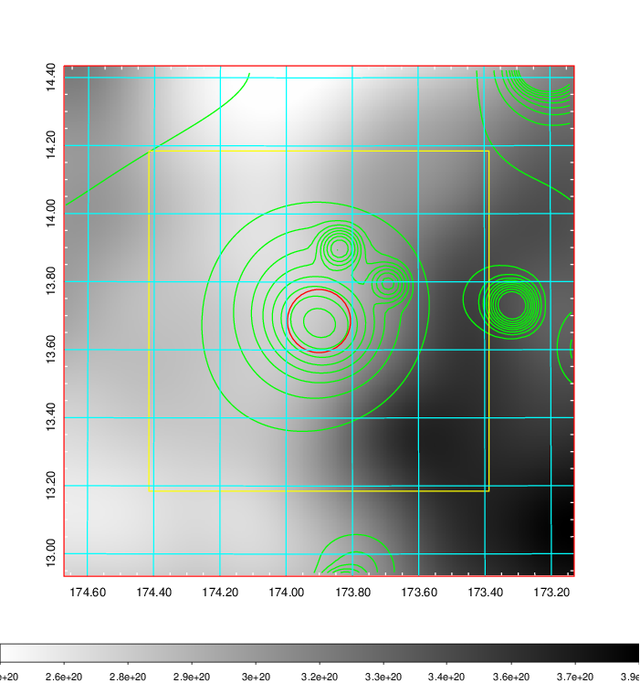    | 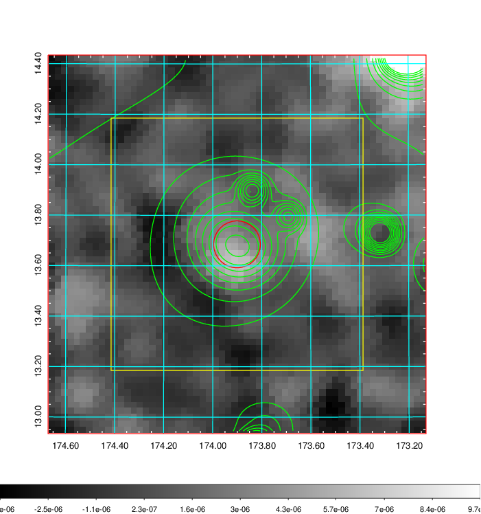 |

|[Redshift Histogram](../image/419/419_zg.pdf) | [DSS image(z1)](../image/419/419_dss_z1.pdf)      |  [DSS image(z2)](../image/419/419_dss_z2.pdf)    |
|-------------------|--------------------|-------------------|
|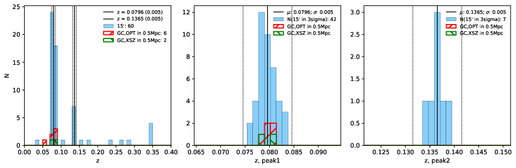 |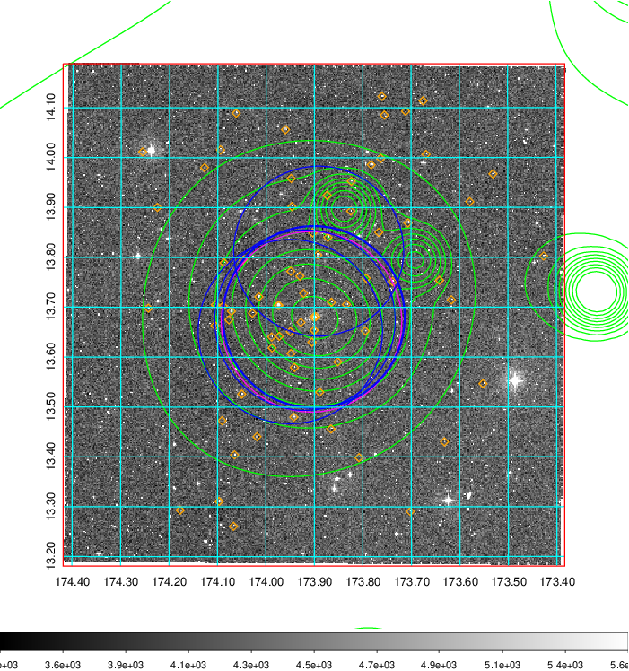  Blue circle for optical clusters;  Magenta circle for XSZ clusters;  all with r=1Mpc;  Only GC with Delta_z<0.01 are shown. | 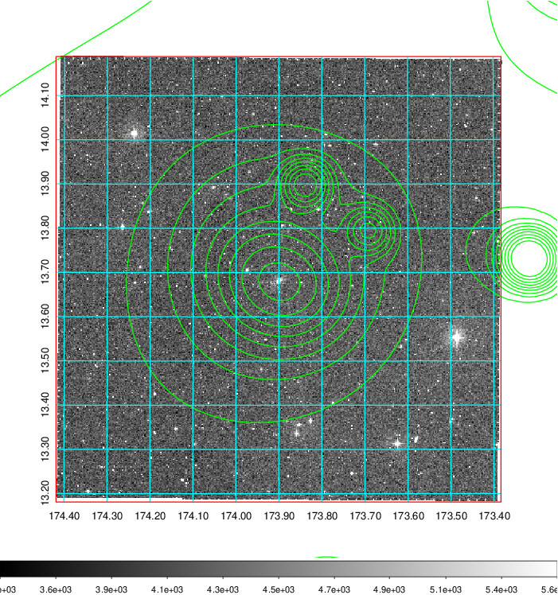 Blue circle for optical clusters;  Magenta circle for XSZ clusters;  all with r=1Mpc;  Only GC with Delta_z<0.01 are shown.  |

|[Previous-identified clusters](../image/419/419_gc.pdf) | [2MASS image](../image/419/419_2mass.pdf)      |[SDSS image](../image/419/419_sdss.pdf)   |
|-------------------|-------------------|-------------------|
|  Green, magenta, and blue circles  for optical, X-ray and SZ clusters  respectively, with redshift of clusters  labelled. The radius of circles  are 1Mpc.|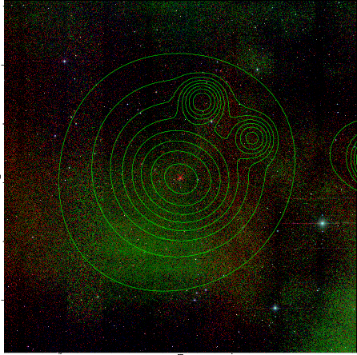  | 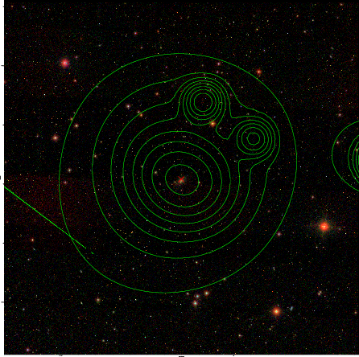  |

