

### 42

|Name|RAJ2000[deg]|DEJ2000[deg] |Ext[arcmin]| Ext,ml | z | z_src| C|GC(XSZ,Delta_z<0.01)| GC(OPT,Delta_z<0.01)|GC| R_sig[arcmin] | R500[arcmin] | R500[Mpc]| CRsig[c/s] | CR500[c/s] |L500[1E44 erg/s]|F500[1E-12 erg/s/cm^2]| M500[1E14 Msun]|Tx[keV]|Cnt_sig|Beta|Rc[arcmin]|Comment|Alias|
|---|---|---|---|---|---|------|---|--------|---------|----------|---|---|---|---|---|---|---|---|---|---|---|---|---|---|
|42| 13.928| -37.531| 5.58| 97.47| 0.0560(0.005)| z1, z_opt| S| -| A, W| A, MCXC, N, Tar, W, XCS| 15.812| 11.291| 0.736| 0.236(0.057)| 0.225(0.054)| 0.289(0.040)| 3.866(0.531)| 1.20(0.08)| 2.44(0.11)| 99.2| 0.948(-0.067+0.038)| 8.865(-0.771+0.610)| An XSZ cluster with $z$ = 0.163 and offset = 0.2 Mpc| k531|

|[RASS image](../image/42/42_img.pdf)|[filtered image](../image/42/42_fil.pdf)|[Segment image](../image/42/42_seg.pdf)|
|-------------------|--------------------|-------------------|
| 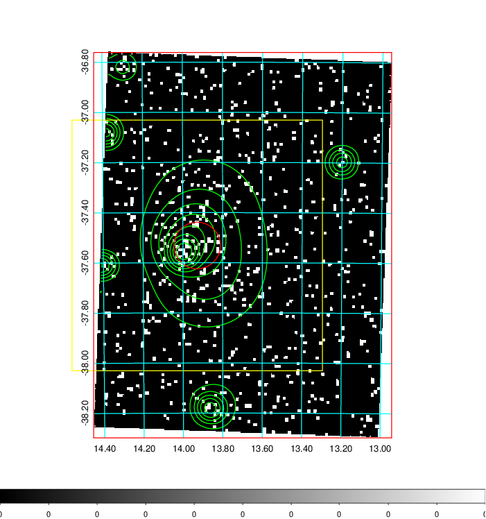  | 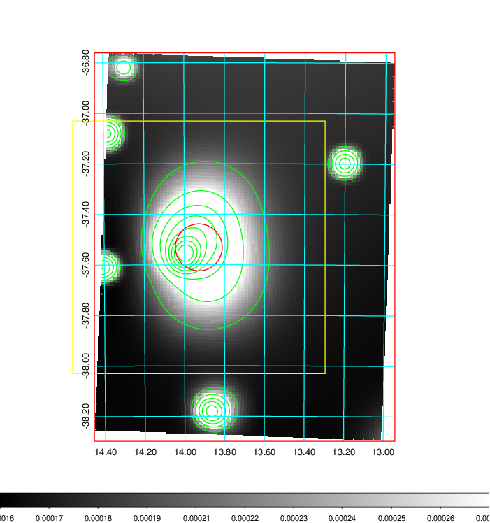   | 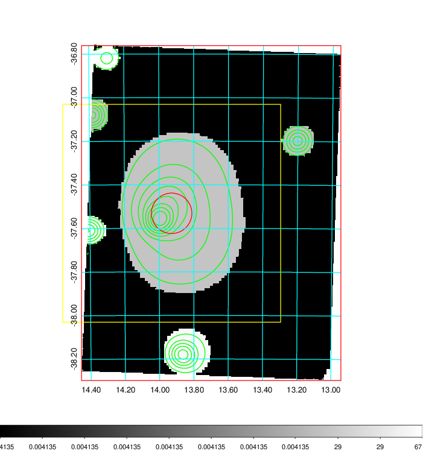  |

|[Exposure image](../image/42/42_mex.pdf)| [nH image](../image/42/42_nh.pdf)| [Planck image](../image/42/42_p.pdf)|
|-------------------|--------------------|-------------------|
|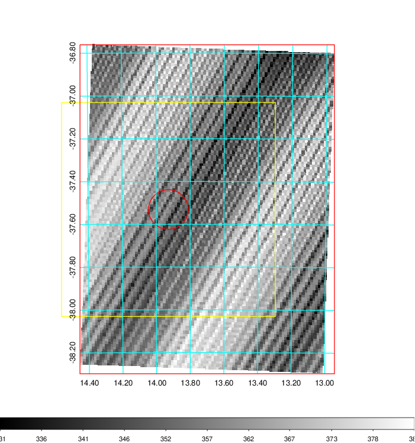   | 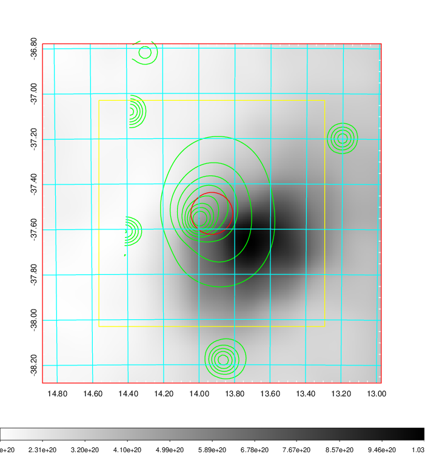    | 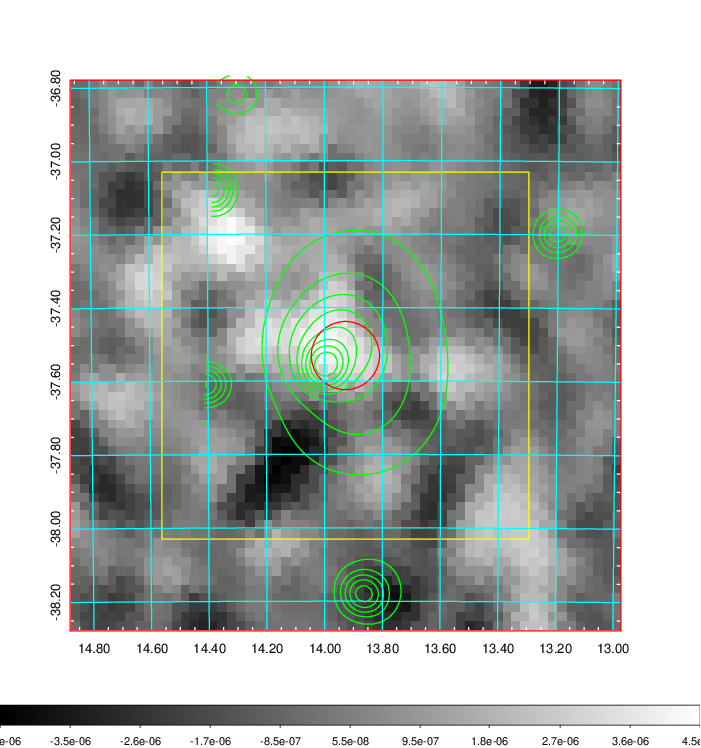 |

|[Redshift Histogram](../image/42/42_zg.pdf) | [DSS image(z1)](../image/42/42_dss_z1.pdf)      |  [DSS image(z2)](../image/42/42_dss_z2.pdf)    |
|-------------------|--------------------|-------------------|
|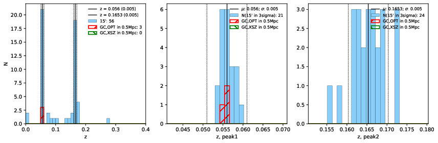 |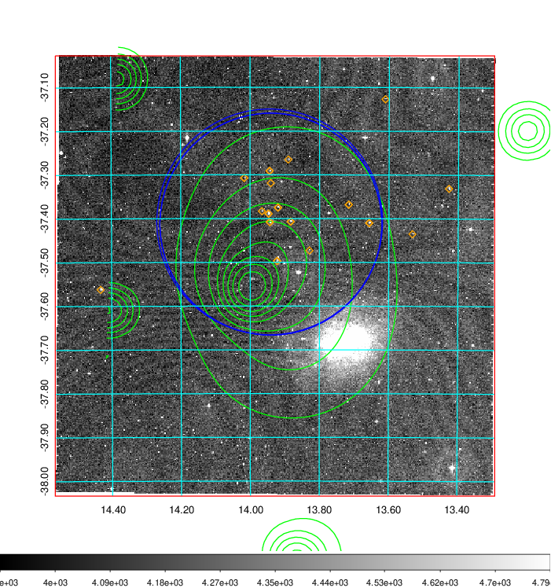  Blue circle for optical clusters;  Magenta circle for XSZ clusters;  all with r=1Mpc;  Only GC with Delta_z<0.01 are shown. | 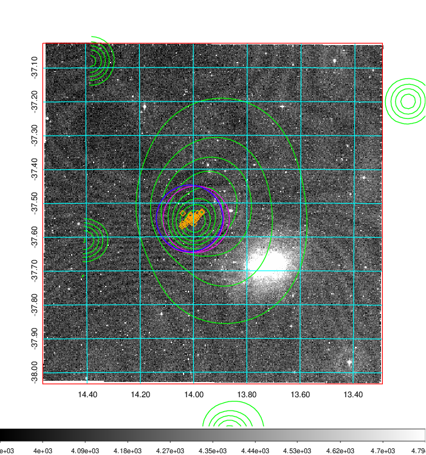 Blue circle for optical clusters;  Magenta circle for XSZ clusters;  all with r=1Mpc;  Only GC with Delta_z<0.01 are shown.  |

|[Previous-identified clusters](../image/42/42_gc.pdf) | [2MASS image](../image/42/42_2mass.pdf)      |
|-------------------|-------------------|
|  Green, magenta, and blue circles  for optical, X-ray and SZ clusters  respectively, with redshift of clusters  labelled. The radius of circles  are 1Mpc.|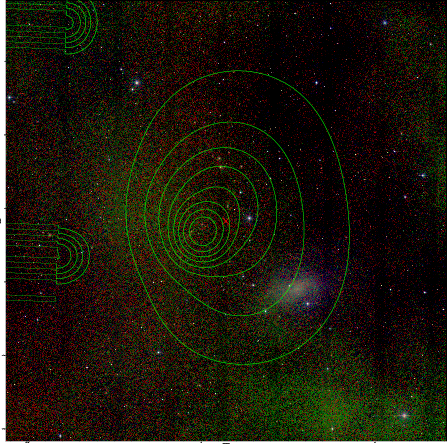  |

|[DES image](../image/42/42_des.pdf)   |[ATLAS image](../image/42/42_s.pdf)        |
|-------------------|-------------------|
| 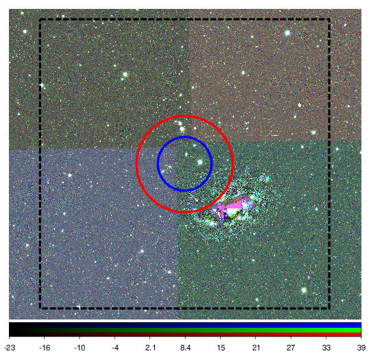  | 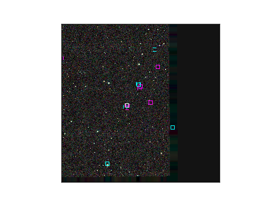  |
