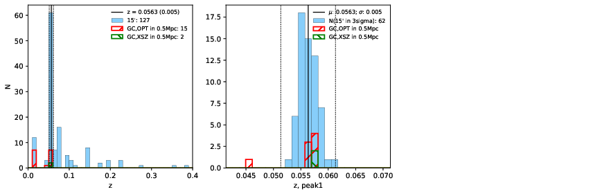

### 420

|Name|RAJ2000[deg]|DEJ2000[deg] |Ext[arcmin]| Ext,ml | z | z_src| C|GC(XSZ,Delta_z<0.01)| GC(OPT,Delta_z<0.01)|GC| R_sig[arcmin] | R500[arcmin] | R500[Mpc]| CRsig[c/s] | CR500[c/s] |L500[1E44 erg/s]|F500[1E-12 erg/s/cm^2]| M500[1E14 Msun]|Tx[keV]|Cnt_sig|Beta|Rc[arcmin]|Comment|Alias|
|---|---|---|---|---|---|------|---|--------|---------|----------|---|---|---|---|---|---|---|---|---|---|---|---|---|---|
|420| 174.058| 55.101| 10.93| 48.58| 0.0563(0.005)| z1, z_xsz| B| L03| N, W| A, C, L03, N, W| 10.750| 8.823| 0.578| 0.083(0.031)| 0.080(0.030)| 0.106(0.032)| 1.402(0.426)| 0.58(0.09)| 1.56(0.15)| 45.6| 0.845(-0.163+0.111)| 8.117(-1.670+1.203)| -| t468|

|[RASS image](../image/420/420_img.pdf)|[filtered image](../image/420/420_fil.pdf)|[Segment image](../image/420/420_seg.pdf)|
|-------------------|--------------------|-------------------|
|   |    |   |

|[Exposure image](../image/420/420_mex.pdf)| [nH image](../image/420/420_nh.pdf)| [Planck image](../image/420/420_p.pdf)|
|-------------------|--------------------|-------------------|
|   |     |  |

|[Redshift Histogram](../image/420/420_zg.pdf) | [DSS image(z1)](../image/420/420_dss_z1.pdf)      |  [DSS image(z2)](../image/420/420_dss_z2.pdf)    |
|-------------------|--------------------|-------------------|
| |  Blue circle for optical clusters;  Magenta circle for XSZ clusters;  all with r=1Mpc;  Only GC with Delta_z<0.01 are shown. |  Blue circle for optical clusters;  Magenta circle for XSZ clusters;  all with r=1Mpc;  Only GC with Delta_z<0.01 are shown.  |

|[Previous-identified clusters](../image/420/420_gc.pdf) | [2MASS image](../image/420/420_2mass.pdf)      |[SDSS image](../image/420/420_sdss.pdf)   |
|-------------------|-------------------|-------------------|
|  Green, magenta, and blue circles  for optical, X-ray and SZ clusters  respectively, with redshift of clusters  labelled. The radius of circles  are 1Mpc.|  |   |

