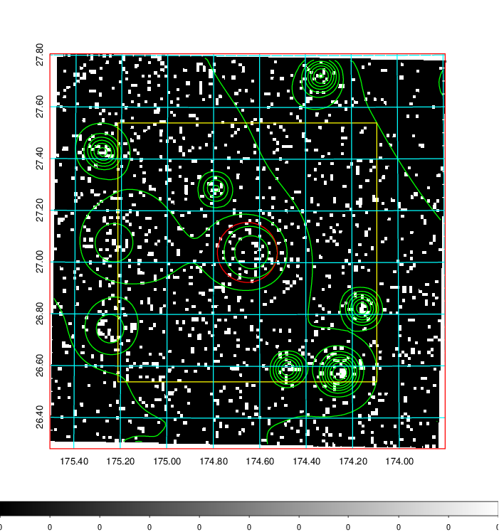
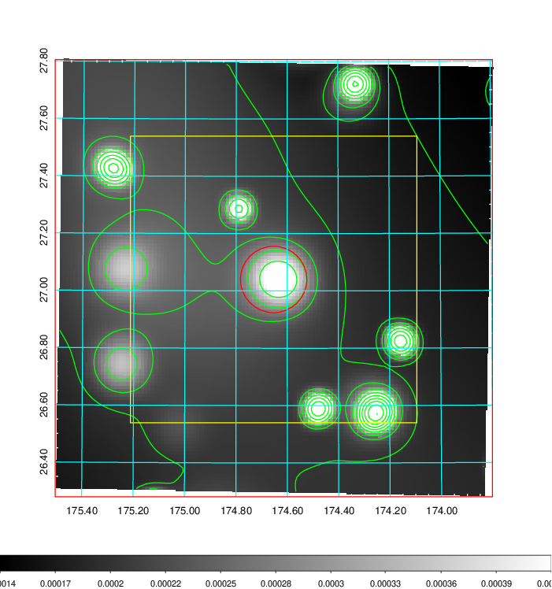
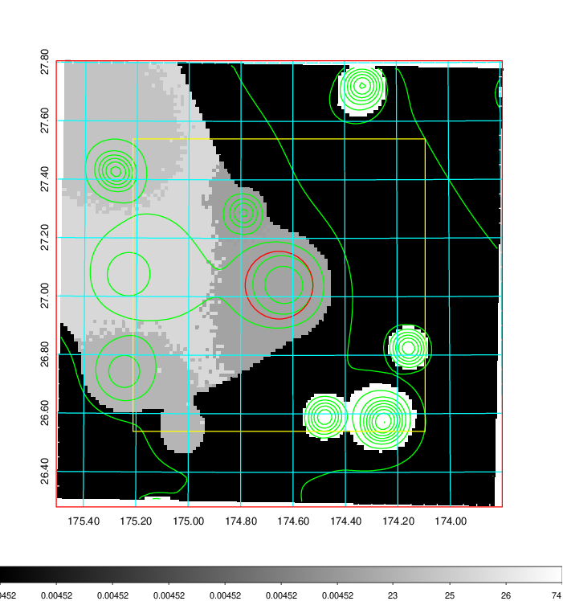
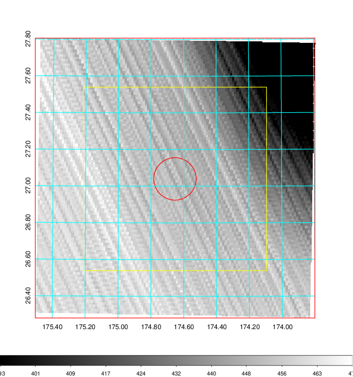
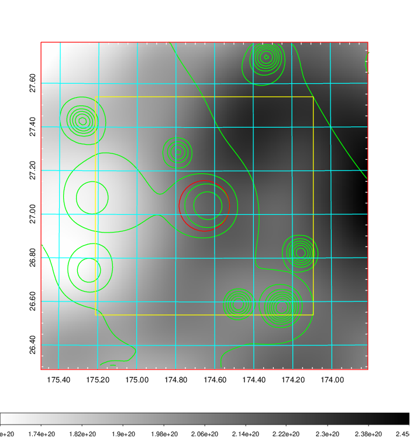
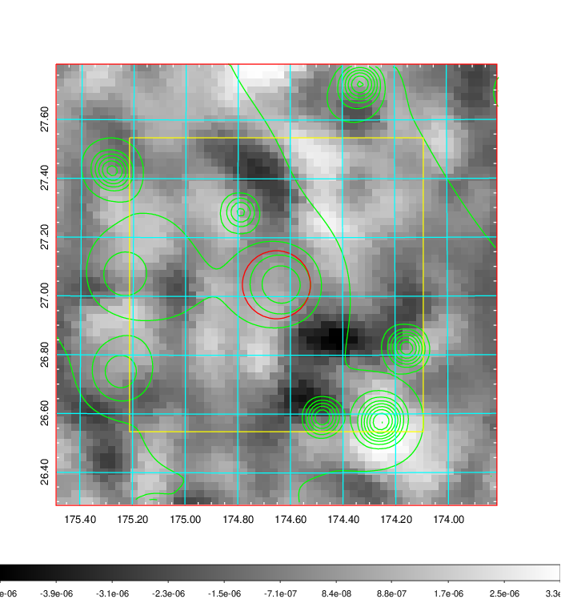
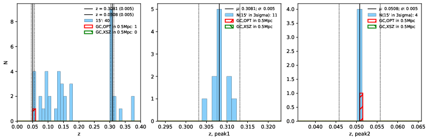
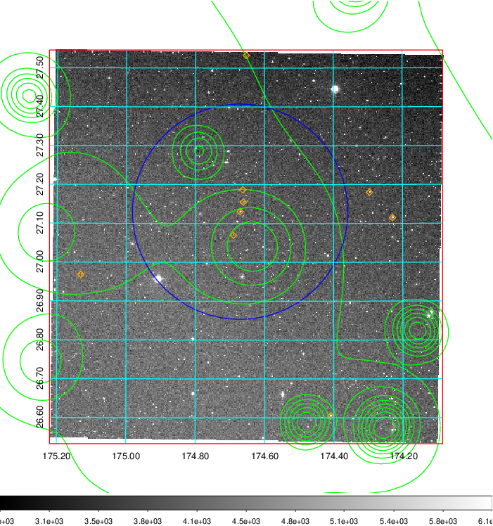
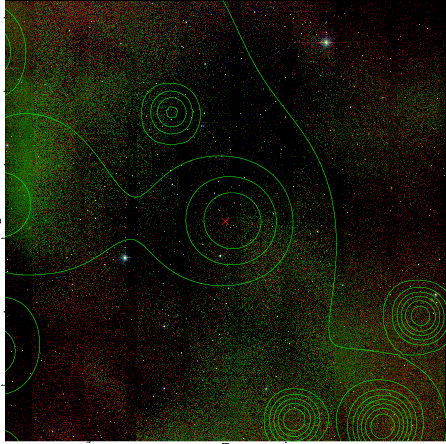
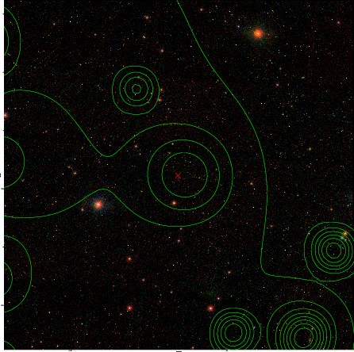

### 421

|Name|RAJ2000[deg]|DEJ2000[deg] |Ext[arcmin]| Ext,ml | z | z_src| C|GC(XSZ,Delta_z<0.01)| GC(OPT,Delta_z<0.01)|GC| R_sig[arcmin] | R500[arcmin] | R500[Mpc]| CRsig[c/s] | CR500[c/s] |L500[1E44 erg/s]|F500[1E-12 erg/s/cm^2]| M500[1E14 Msun]|Tx[keV]|Cnt_sig|Beta|Rc[arcmin]|Comment|Alias|
|---|---|---|---|---|---|------|---|--------|---------|----------|---|---|---|---|---|---|---|---|---|---|---|---|---|---|
|421| 174.653| 27.040| 6.95| 26.37| 0.3081(0.005)| z1,| G| -| -| C, N, W| 62.116| 6.309| 1.717| 0.752(0.123)| 0.654(0.107)| 40.814(25.698)| 13.304(8.377)| 19.78(5.38)| 14.96(2.64)| 639.4| 0.607(-0.071+0.070)| 42.718(-6.085+5.056)| -| t346|

|[RASS image](../image/421/421_img.pdf)|[filtered image](../image/421/421_fil.pdf)|[Segment image](../image/421/421_seg.pdf)|
|-------------------|--------------------|-------------------|
|   |    |   |

|[Exposure image](../image/421/421_mex.pdf)| [nH image](../image/421/421_nh.pdf)| [Planck image](../image/421/421_p.pdf)|
|-------------------|--------------------|-------------------|
|   |     |  |

|[Redshift Histogram](../image/421/421_zg.pdf) | [DSS image(z1)](../image/421/421_dss_z1.pdf)      |  [DSS image(z2)](../image/421/421_dss_z2.pdf)    |
|-------------------|--------------------|-------------------|
| |  Blue circle for optical clusters;  Magenta circle for XSZ clusters;  all with r=1Mpc;  Only GC with Delta_z<0.01 are shown. |  Blue circle for optical clusters;  Magenta circle for XSZ clusters;  all with r=1Mpc;  Only GC with Delta_z<0.01 are shown.  |

|[Previous-identified clusters](../image/421/421_gc.pdf) | [2MASS image](../image/421/421_2mass.pdf)      |[SDSS image](../image/421/421_sdss.pdf)   |
|-------------------|-------------------|-------------------|
|  Green, magenta, and blue circles  for optical, X-ray and SZ clusters  respectively, with redshift of clusters  labelled. The radius of circles  are 1Mpc.|  |   |

