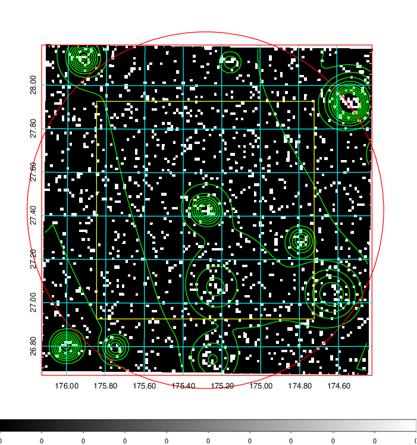
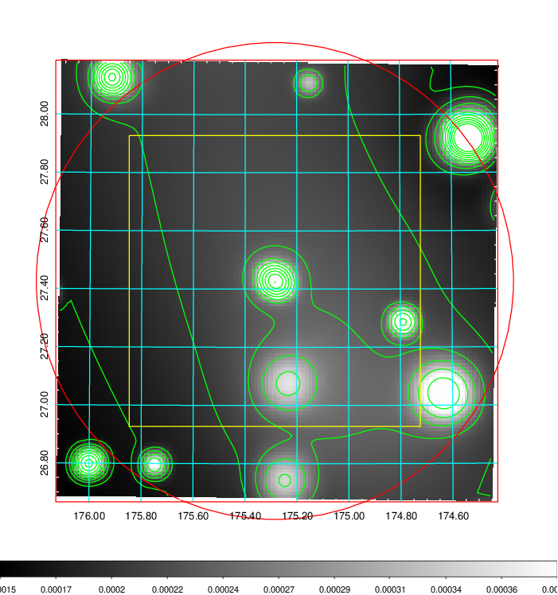
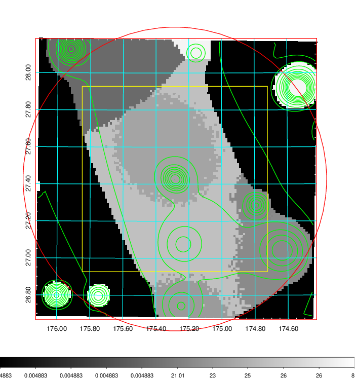
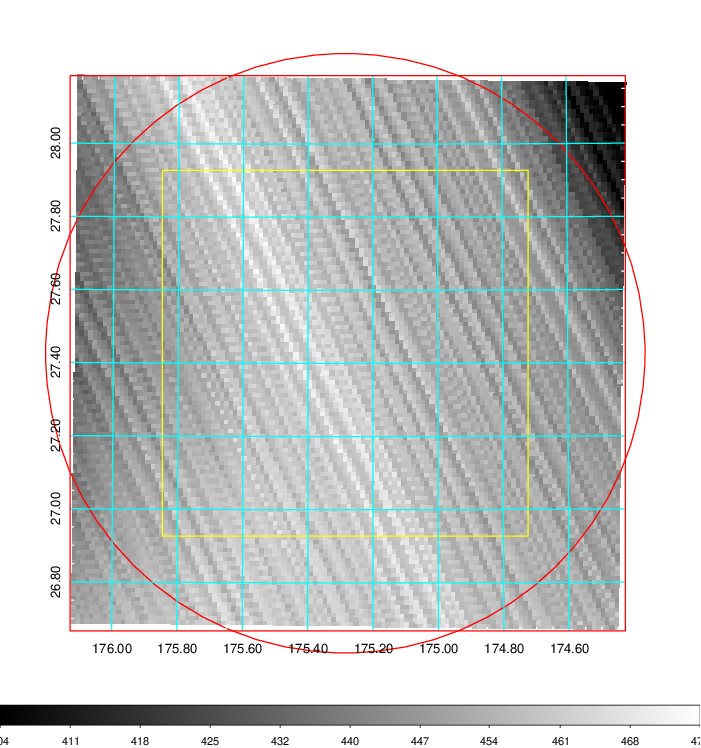
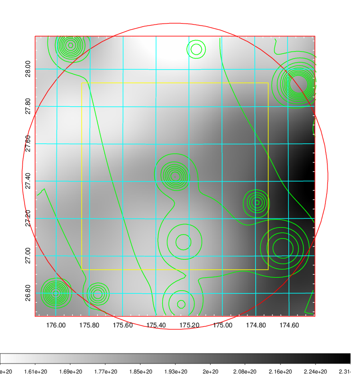
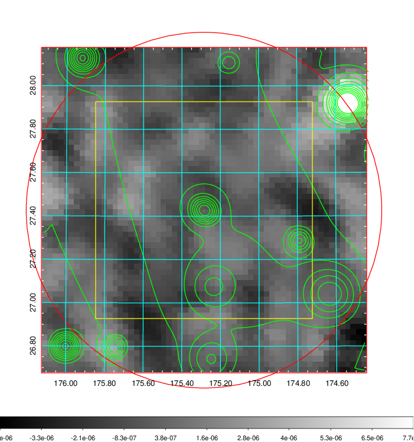
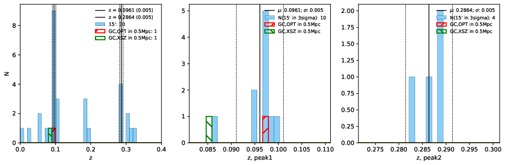
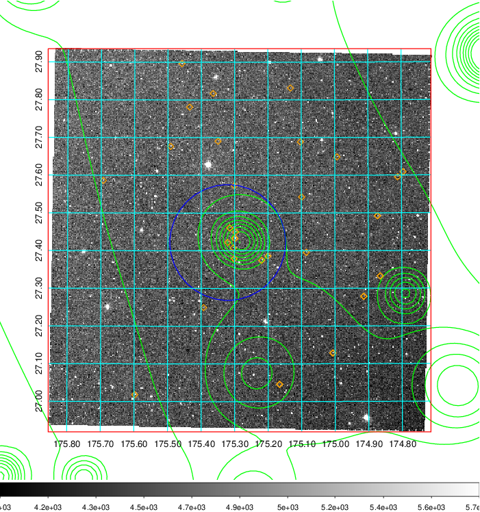
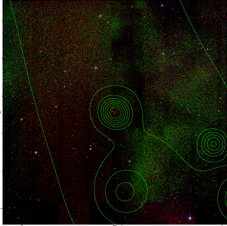

### 422

|Name|RAJ2000[deg]|DEJ2000[deg] |Ext[arcmin]| Ext,ml | z | z_src| C|GC(XSZ,Delta_z<0.01)| GC(OPT,Delta_z<0.01)|GC| R_sig[arcmin] | R500[arcmin] | R500[Mpc]| CRsig[c/s] | CR500[c/s] |L500[1E44 erg/s]|F500[1E-12 erg/s/cm^2]| M500[1E14 Msun]|Tx[keV]|Cnt_sig|Beta|Rc[arcmin]|Comment|Alias|
|---|---|---|---|---|---|------|---|--------|---------|----------|---|---|---|---|---|---|---|---|---|---|---|---|---|---|
|422| 175.285| 27.428| 49.19| 51.47| 0.0961(0.005)| z1, z_opt| S| -| N| C, F20, N, W| 32.106| 7.996| 0.854| 0.198(0.065)| 0.176(0.058)| 0.789(0.632)| 3.388(2.713)| 1.94(0.78)| 3.32(0.85)| 221.0| 0.508(-0.006+0.014)| 4.174(-0.371+0.297)| -| t695|

|[RASS image](../image/422/422_img.pdf)|[filtered image](../image/422/422_fil.pdf)|[Segment image](../image/422/422_seg.pdf)|
|-------------------|--------------------|-------------------|
|   |    |   |

|[Exposure image](../image/422/422_mex.pdf)| [nH image](../image/422/422_nh.pdf)| [Planck image](../image/422/422_p.pdf)|
|-------------------|--------------------|-------------------|
|   |     |  |

|[Redshift Histogram](../image/422/422_zg.pdf) | [DSS image(z1)](../image/422/422_dss_z1.pdf)      |  [DSS image(z2)](../image/422/422_dss_z2.pdf)    |
|-------------------|--------------------|-------------------|
| |  Blue circle for optical clusters;  Magenta circle for XSZ clusters;  all with r=1Mpc;  Only GC with Delta_z<0.01 are shown. |  Blue circle for optical clusters;  Magenta circle for XSZ clusters;  all with r=1Mpc;  Only GC with Delta_z<0.01 are shown.  |

|[known Abell/XSZ clusters](../image/422/422_gc.pdf) | [2MASS image](../image/422/422_2mass.pdf)      |
|-------------------|-------------------|
|  Magenta, blue and green circles  for optical, X-ray and SZ clusters  respectively, with redshift of clusters  labelled. The radius of circles  are 1Mpc.|  |

|[PS1 image](../image/422/422_ps1.pdf)            |
|-------------------|
|   |
